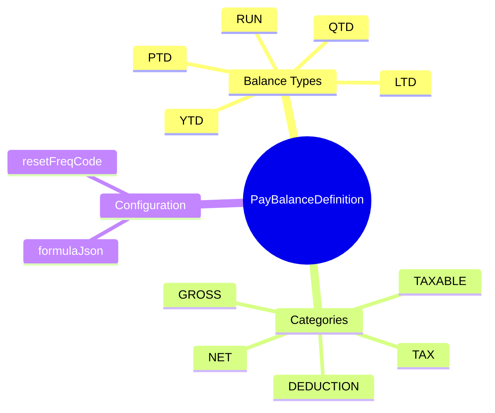
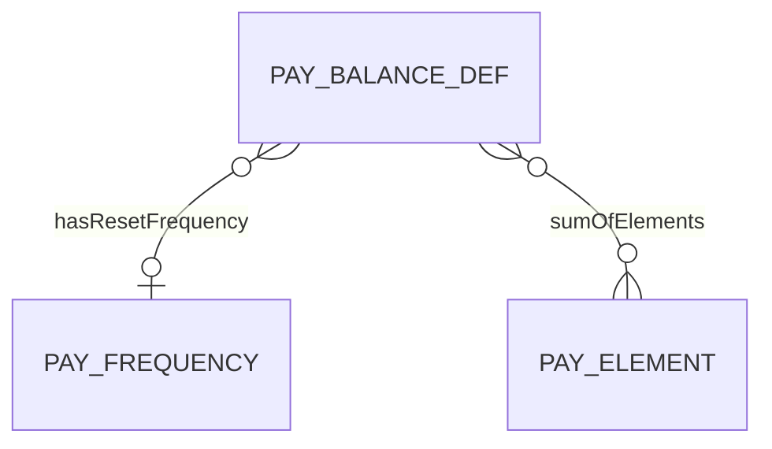
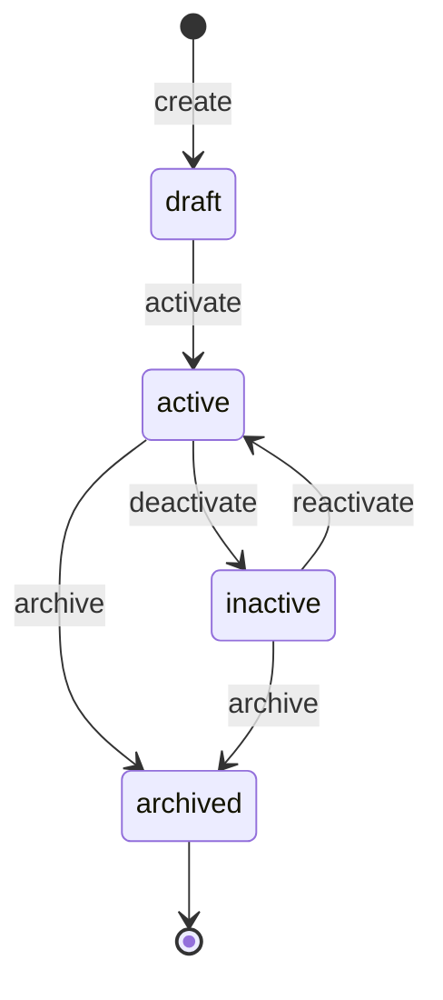

# PayBalanceDefinition

## Overview



**PayBalanceDefinition** (Định nghĩa Balance) định nghĩa các loại balance được track trong payroll: gross pay, net pay, YTD earnings, taxable income, etc. Balance là aggregation của các pay elements theo rules và time periods.

## Business Context

### Key Stakeholders
- **Payroll Administrators**: Configure balances và element mappings
- **Finance/Accounting**: Sử dụng balances cho reporting và reconciliation
- **Employees**: View balances trên payslip (YTD, PTD)
- **Compliance**: Sử dụng balances cho statutory reporting

### Business Processes
This entity is central to:
- **Payroll Calculation**: Track running totals during payroll processing
- **Payslip Generation**: Display current and cumulative amounts
- **Tax Reporting**: YTD balances cho tax forms
- **Financial Reporting**: Cost tracking và budgeting

### Business Value
Balances cung cấp aggregated view của payroll data theo time periods, essential cho reporting, compliance, và employee communication.

## Attributes Guide

### Identification
- **id**: UUID system-generated
- **code**: Business identifier (ví dụ: GROSS_PAY, NET_PAY, YTD_EARNINGS, TAXABLE_INCOME)

### Balance Classification
- **balanceType**: Time dimension của balance:
  - *RUN*: Per payroll run (reset mỗi run)
  - *PTD*: Period-to-date (reset mỗi pay period)
  - *QTD*: Quarter-to-date
  - *YTD*: Year-to-date (reset mỗi năm)
  - *LTD*: Lifetime-to-date (không reset)

- **balanceCategory**: Semantic category:
  - *GROSS*: Tổng thu nhập trước deductions
  - *NET*: Thu nhập sau deductions
  - *TAXABLE*: Thu nhập chịu thuế
  - *DEDUCTION*: Tổng khấu trừ
  - *TAX*: Tổng thuế
  - *EMPLOYER_COST*: Chi phí công ty
  - *CUSTOM*: Balances tùy chỉnh

### Calculation Configuration
- **formulaJson**: Optional JSON cho complex aggregation rules:
  ```json
  {
    "type": "SUM",
    "include": ["EARNING"],
    "exclude": ["NON_TAXABLE_ALLOWANCE"]
  }
  ```

- **resetFreqCode**: Frequency reset balance. Required cho non-RUN types. Link to [[PayFrequency]].

## Relationships Explained



### Reset Configuration
- **hasResetFrequency** → [[PayFrequency]]: Khi nào balance được reset về 0.
  - YTD balances: reset YEARLY
  - QTD balances: reset QUARTERLY
  - RUN balances: không cần (reset mỗi run)

### Element Aggregation
- **sumOfElements** → [[PayElement]]: Elements contribute vào balance này.
  - GROSS balance: sum of all EARNING elements
  - NET balance: GROSS - all DEDUCTION elements - TAX
  - YTD_EARNINGS: cumulative EARNING elements YTD

## Lifecycle & Workflows



### State Definitions

| State | Business Meaning | System Impact |
|-------|------------------|---------------|
| **draft** | Đang configure | Không calculation |
| **active** | Hoạt động | Tracked trong payroll runs |
| **inactive** | Tạm ngừng | Không update, preserve data |
| **archived** | Đã đóng | Read-only |

### Transition Workflows

#### Draft → Active (activate)
**Trigger**: Balance configuration hoàn tất
**Who**: Payroll Administrator
**Effect**: Balance được track trong payroll runs

## Actions & Operations

### create
**Who**: Payroll Administrator
**Required**: code, name, balanceType, balanceCategory, effectiveStartDate
**Optional**: resetFreqCode (required for non-RUN types)

### addElement
**Who**: Payroll Administrator
**When**: Define elements contribute vào balance
**Process**:
1. Select element
2. Define contribution rule (add/subtract, multiplier)
3. Add to sumOfElements

## Business Rules

### Data Integrity

#### Unique Code (uniqueCode)
**Rule**: Mã balance phải duy nhất.
**Reason**: Identifier cho calculations và reporting.

#### Reset Freq Required (resetFreqRequired)
**Rule**: Non-RUN balances phải có reset frequency.
**Reason**: System cần biết khi nào reset balance về 0.
**Example**: YTD balance cần YEARLY reset frequency.

### Business Logic

#### Valid Reset Freq (validResetFreq)
**Rule**: Reset frequency phải logical cho balance type.
**Examples**:
- YTD → YEARLY
- QTD → QUARTERLY
- PTD → match pay calendar frequency
**Violation**: Warning nếu mismatch.

## Examples

### Example 1: Gross Pay (RUN)
- **code**: GROSS_PAY
- **name**: Gross Pay - Current Run
- **balanceType**: RUN
- **balanceCategory**: GROSS
- **sumOfElements**: [BASIC_SALARY, OT_150, OT_200, ALLOWANCES, ...]
- **resetFreqCode**: null (RUN type auto-reset)

### Example 2: Net Pay (RUN)
- **code**: NET_PAY
- **name**: Net Pay - Current Run
- **balanceType**: RUN
- **balanceCategory**: NET
- **formulaJson**:
  ```json
  {
    "type": "FORMULA",
    "expression": "GROSS_PAY - TOTAL_DEDUCTIONS - TOTAL_TAX"
  }
  ```

### Example 3: YTD Gross Earnings
- **code**: YTD_GROSS
- **name**: Year-to-Date Gross Earnings
- **balanceType**: YTD
- **balanceCategory**: GROSS
- **resetFreqCode**: YEARLY
- **sumOfElements**: [All EARNING elements]
- **Usage**: Display on payslip, tax reporting

### Example 4: Taxable Income
- **code**: TAXABLE_INCOME
- **name**: Taxable Income - Current Run
- **balanceType**: RUN
- **balanceCategory**: TAXABLE
- **formulaJson**:
  ```json
  {
    "type": "FORMULA",
    "expression": "GROSS_PAY - PRE_TAX_DEDUCTIONS - PERSONAL_EXEMPTION"
  }
  ```
- **Usage**: Input for PIT calculation

### Example 5: Employer Total Cost
- **code**: ER_TOTAL_COST
- **name**: Employer Total Cost - Current Run
- **balanceType**: RUN
- **balanceCategory**: EMPLOYER_COST
- **formulaJson**:
  ```json
  {
    "type": "FORMULA",
    "expression": "GROSS_PAY + EMPLOYER_CONTRIBUTIONS"
  }
  ```
- **Usage**: Costing và budgeting

## Edge Cases & Exceptions

### Balance Reset Timing
**Situation**: YTD balance - khi nào chính xác reset?
**Handling**: 
- Reset vào first payroll run của năm mới
- Theo fiscal year nếu khác calendar year
- Config qua calendar settings

### Mid-Year Balance Definition
**Situation**: Tạo balance mới giữa năm.
**Handling**:
- YTD balance cần initialization từ historical data
- Hoặc start from 0 với note

### Element Changes Impact
**Situation**: Element được add/remove khỏi balance definition.
**Handling**:
- Future runs reflect changes
- Historical data không bị recalculate tự động
- Cần manual retro nếu cần correct historical

## Related Entities

| Entity | Relationship | Description |
|--------|--------------|-------------|
| [[PayFrequency]] | hasResetFrequency | Reset frequency |
| [[PayElement]] | sumOf (M:N) | Elements contributing to balance |
