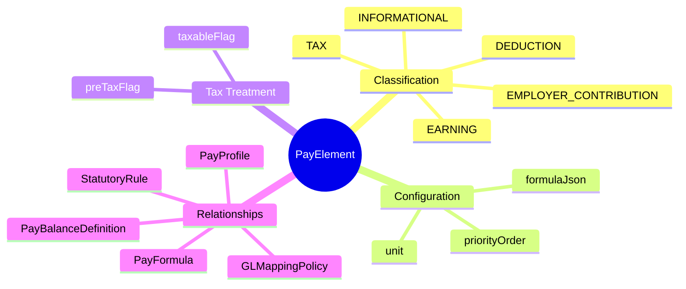
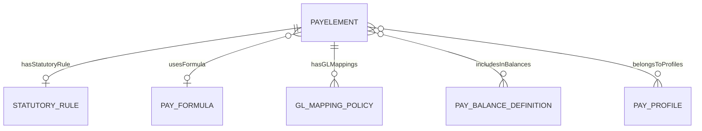
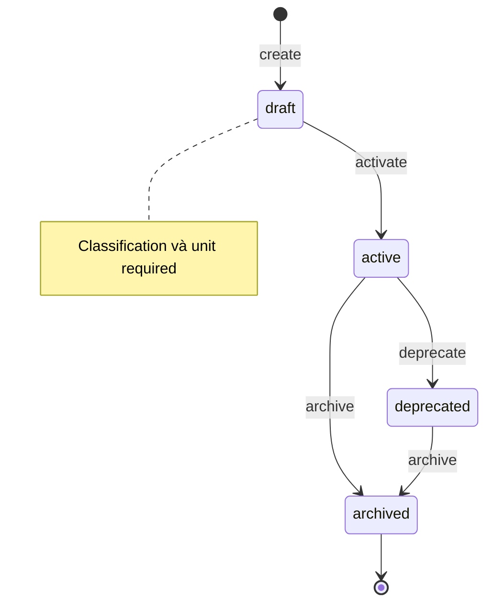
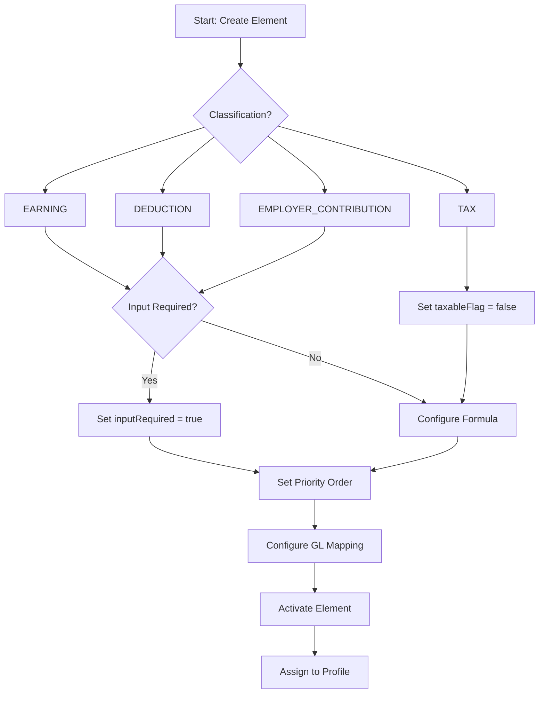

# PayElement

## Overview



**PayElement** (Thành phần lương) là ontology trung tâm của module Payroll, đại diện cho các loại earning (thu nhập), deduction (khấu trừ), tax (thuế), và employer contributions. Mỗi element định nghĩa một concept trả lương cụ thể và cách thức tính toán.

## Business Context

### Key Stakeholders
- **Payroll Directors**: Define elements theo statutory requirements và company policy
- **Payroll Administrators**: Configure elements, assign formulas, set up mappings
- **Finance/Accounting**: Sử dụng GL mappings cho cost allocation và reporting
- **HR/Compensation**: Request new elements cho compensation packages mới

### Business Processes
This entity is central to:
- **Payroll Calculation**: Elements là building blocks của payroll calculation
- **Balance Tracking**: Elements contribute vào các balances (gross, net, YTD)
- **Tax Compliance**: Tax elements đảm bảo statutory compliance
- **Financial Reporting**: GL mappings enable proper cost accounting

### Business Value
PayElement là foundation của payroll system, chuẩn hóa cách thức define và calculate các thành phần lương, đảm bảo consistency và compliance.

## Attributes Guide

### Identification
- **id**: UUID system-generated
- **code**: Business identifier (ví dụ: BASIC_SALARY, OT_150, SOCIAL_INS_EE). Convention: UPPER_SNAKE_CASE.

### Classification & Type
- **classification**: Phân loại chính của element:
  - *EARNING*: Thu nhập (lương, phụ cấp, thưởng)
  - *DEDUCTION*: Khấu trừ từ lương employee (BHXH, thuế, vay)
  - *TAX*: Thuế thu nhập cá nhân
  - *EMPLOYER_CONTRIBUTION*: Đóng góp của employer (BHXH phần công ty)
  - *INFORMATIONAL*: Chỉ để hiển thị, không ảnh hưởng calculation

- **unit**: Đơn vị tính:
  - *AMOUNT*: Số tiền cố định (VND, USD)
  - *HOURS*: Giờ công (cho OT, hourly)
  - *DAYS*: Ngày công
  - *PERCENTAGE*: Phần trăm (của base salary, gross)
  - *UNITS*: Đơn vị arbitrary khác

### Calculation Configuration
- **inputRequired**: True nếu element cần data từ bên ngoài (timesheet hours, manual entry). False nếu tự calculate từ formula.

- **formulaJson**: JSON object định nghĩa công thức:
  ```json
  {
    "type": "percentage",
    "base": "BASIC_SALARY",
    "rate": 0.05
  }
  ```
  Hoặc reference đến [[PayFormula]] cho complex formulas.

- **priorityOrder**: Thứ tự tính (1 = tính đầu tiên). Quan trọng cho dependencies (ví dụ: tính gross trước tax).

### Tax Treatment
- **taxableFlag**: Element này có bị tính vào taxable income không?
  - EARNING: thường = true
  - DEDUCTION: có thể true hoặc false tùy loại
  - TAX: = false (chính nó là tax)

- **preTaxFlag**: Element tính trước hay sau tax?
  - Pre-tax deductions (BHXH, 401k) reduce taxable income
  - Post-tax deductions (union dues, garnishment) không ảnh hưởng taxable

### Accounting
- **glAccountCode**: Default GL account. Có thể override qua [[GLMappingPolicy]] cho complex scenarios.

## Relationships Explained



### Statutory Compliance
- **hasStatutoryRule** → [[StatutoryRule]]: Liên kết đến statutory rule quy định cách tính. Ví dụ: element "PIT" link đến "Vietnam PIT Rules 2025".

### Calculation Logic
- **usesFormula** → [[PayFormula]]: Reference đến shared formula definition. Cho phép reuse formula giữa nhiều elements.

### Accounting Integration
- **hasGLMappings** → [[GLMappingPolicy]]: GL account mappings cho element. Có thể có nhiều mappings cho different segments (cost center, department).

### Balance Contribution
- **includesInBalances** → [[PayBalanceDefinition]]: Elements contribute vào balances. Ví dụ: BASIC_SALARY, OT_150 đều contribute vào GROSS balance.

### Profile Inclusion
- **belongsToProfiles** → [[PayProfile]]: Profiles chứa element này. Element có thể thuộc nhiều profiles.

## Lifecycle & Workflows



### State Definitions

| State | Business Meaning | System Impact |
|-------|------------------|---------------|
| **draft** | Đang configure | Không thể include trong payroll runs |
| **active** | Hoạt động bình thường | Có thể sử dụng trong calculations |
| **deprecated** | Không recommend sử dụng | Vẫn hoạt động, nhưng không cho assign mới |
| **archived** | Đã đóng | Read-only, historical only |

### Transition Workflows

#### Draft → Active (activate)
**Trigger**: Element configuration hoàn tất
**Who**: Payroll Administrator
**Prerequisites**: 
- Classification và unit được set
- Formula configured (nếu không phải input element)

#### Active → Deprecated (deprecate)
**Trigger**: Element sẽ được thay thế bởi element mới
**Who**: Payroll Director
**Effect**: Existing usages vẫn hoạt động, không cho add vào profiles mới

#### Any → Archived (archive)
**Prerequisites**: Không còn payroll runs đang sử dụng
**Effect**: Element read-only

## Actions & Operations

### Element Creation Flow



### create
**Who**: Payroll Administrator
**Required**: code, name, classification, unit, effectiveStartDate
**Example**:
```yaml
code: OT_200
name: "Overtime 200%"
classification: EARNING
unit: HOURS
inputRequired: true
taxableFlag: true
preTaxFlag: true
```

### setFormula
**Who**: Payroll Administrator
**When**: Define calculation logic
**Options**:
1. Inline formulaJson
2. Reference đến shared PayFormula

**Example formulaJson**:
```json
{
  "type": "formula",
  "expression": "hours * (basic_salary / 26 / 8) * 2.0",
  "inputs": ["hours", "basic_salary"]
}
```

### assignToProfile
**Who**: Payroll Administrator
**When**: Add element vào profile để apply cho pay groups
**Effect**: All pay groups using profile sẽ include element

## Business Rules

### Data Integrity

#### Unique Code (uniqueCode)
**Rule**: Mã element phải duy nhất trong hệ thống.
**Reason**: Code là identifier chính cho payroll calculation engine.

#### Valid Classification (validClassification)
**Rule**: Classification phải thuộc danh sách defined.
**Reason**: Calculation engine depends on classification.

### Business Logic

#### Tax Logic (taxLogic)
**Rule**: TAX classification elements phải có taxableFlag = false.
**Reason**: Tax element không bị tính thuế lại trên chính nó.

#### Earning Positive (earningPositive)
**Rule**: EARNING elements add to gross pay.
**Implementation**: Calculation engine treats EARNING as positive.

#### Deduction Negative (deductionNegative)
**Rule**: DEDUCTION elements reduce net pay.
**Implementation**: Calculation engine treats DEDUCTION as negative.

## Examples

### Example 1: Basic Salary (EARNING)
- **code**: BASIC_SALARY
- **name**: Lương cơ bản
- **classification**: EARNING
- **unit**: AMOUNT
- **inputRequired**: true (HR enters value)
- **taxableFlag**: true
- **preTaxFlag**: true
- **priorityOrder**: 1 (tính đầu tiên)

### Example 2: Overtime 150% (EARNING)
- **code**: OT_150
- **name**: Làm thêm giờ 150%
- **classification**: EARNING
- **unit**: HOURS
- **inputRequired**: true (from timesheet)
- **formulaJson**: 
  ```json
  {
    "expression": "hours * hourly_rate * 1.5",
    "inputs": ["hours"]
  }
  ```
- **taxableFlag**: true

### Example 3: Social Insurance Employee (DEDUCTION)
- **code**: BHXH_EE
- **name**: BHXH phần người lao động
- **classification**: DEDUCTION
- **unit**: PERCENTAGE
- **inputRequired**: false (calculated)
- **formulaJson**:
  ```json
  {
    "type": "percentage",
    "base": "GROSS_INSURABLE",
    "rate": 0.08
  }
  ```
- **taxableFlag**: false (pre-tax deduction)
- **preTaxFlag**: true

### Example 4: Personal Income Tax (TAX)
- **code**: PIT
- **name**: Thuế thu nhập cá nhân
- **classification**: TAX
- **unit**: AMOUNT
- **inputRequired**: false
- **hasStatutoryRule**: VN_PIT_RULE_2025
- **taxableFlag**: false

### Example 5: Employer Social Insurance (EMPLOYER_CONTRIBUTION)
- **code**: BHXH_ER
- **name**: BHXH phần công ty
- **classification**: EMPLOYER_CONTRIBUTION
- **unit**: PERCENTAGE
- **inputRequired**: false
- **formulaJson**:
  ```json
  {
    "type": "percentage",
    "base": "GROSS_INSURABLE",
    "rate": 0.175
  }
  ```
- **Note**: Không trừ vào lương employee, chỉ costing

## Edge Cases & Exceptions

### Element với Multiple Formulas
**Situation**: Cùng element nhưng formula khác nhau theo market.
**Handling**: Tạo market-specific elements (BHXH_EE_VN, CPF_EE_SG) hoặc dùng PayProfile để override formula per market.

### Retroactive Element Changes
**Situation**: Element rate thay đổi retroactively.
**Handling**: 
- Tạo SCD2 version mới với effectiveStartDate trong quá khứ
- Payroll retro process sẽ recalculate

### Element Deprecation with Active Usage
**Situation**: Cần deprecate element nhưng còn payroll runs đang chạy.
**Handling**: Wait until runs complete, hoặc deprecate và runs hiện tại vẫn dùng version active.

## Related Entities

| Entity | Relationship | Description |
|--------|--------------|-------------|
| [[StatutoryRule]] | has | Statutory rule áp dụng |
| [[PayFormula]] | uses | Shared formula definition |
| [[GLMappingPolicy]] | has many | GL account mappings |
| [[PayBalanceDefinition]] | contributes to | Balance definitions |
| [[PayProfile]] | belongs to | Profiles chứa element |
