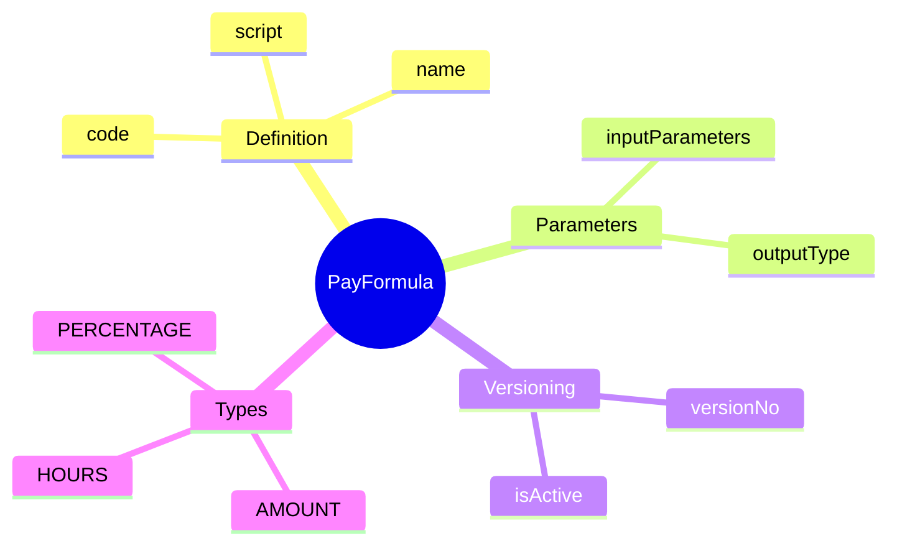
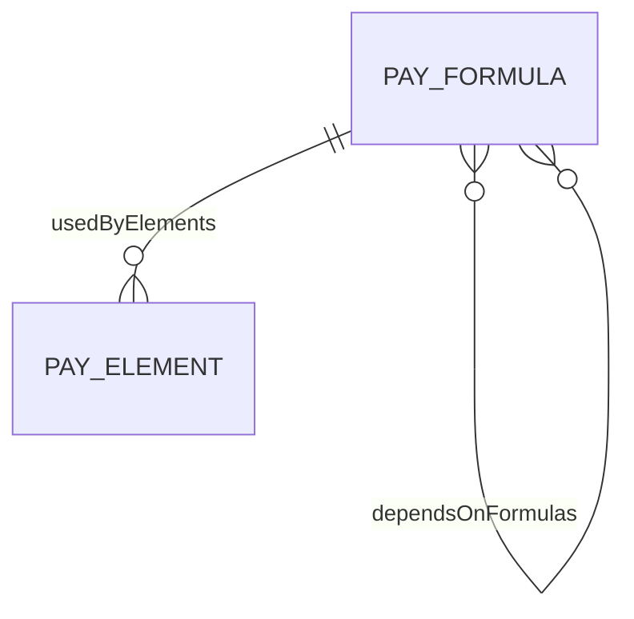
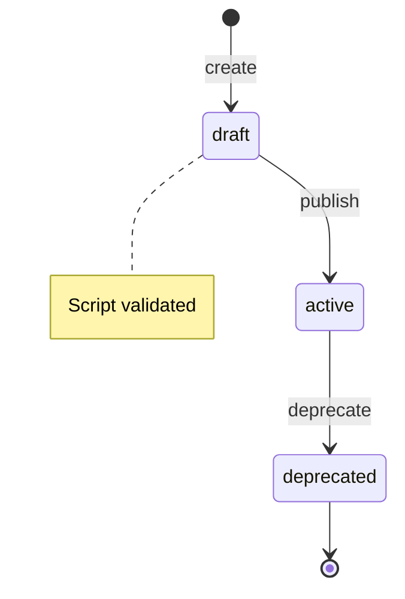

# PayFormula

## Overview



**PayFormula** (Công thức tính lương) là entity chứa các công thức tính toán dùng chung trong payroll. Formulas được viết bằng DSL (Domain Specific Language) hoặc expression language, có thể reuse giữa nhiều pay elements.

## Business Context

### Key Stakeholders
- **Payroll Technical Lead**: Define và maintain formulas
- **Payroll Administrators**: Assign formulas cho pay elements
- **Compliance Team**: Review formulas đảm bảo đúng statutory requirements
- **QA Team**: Test formulas với various scenarios

### Business Processes
This entity is central to:
- **Calculation Standardization**: Centralize calculation logic cho reuse
- **Formula Versioning**: Track changes và maintain history
- **Compliance Updates**: Quick update khi statutory rates thay đổi
- **Testing & Validation**: Validate formulas trước khi deploy

### Business Value
PayFormula tách biệt calculation logic khỏi pay element definitions, cho phép thay đổi calculations mà không modify element structure, và đảm bảo consistency giữa các elements dùng cùng logic.

## Attributes Guide

### Identification
- **id**: UUID system-generated
- **code**: Business identifier (ví dụ: OT_CALC_150, BHXH_RATE_VN, PIT_PROGRESSIVE)

### Formula Definition
- **name**: Tên mô tả (ví dụ: "Overtime Calculation 150%")
- **script**: Expression/script chứa logic tính toán
  ```
  // Simple percentage
  base_amount * rate
  
  // Conditional
  IF(hours > 8, (hours - 8) * hourly_rate * 1.5, 0)
  
  // Progressive tax
  PROGRESSIVE_TAX(taxable_income, [[0, 5000000, 0.05], [5000000, 10000000, 0.10], ...])
  ```

- **inputParameters**: Array các parameters cần thiết:
  ```json
  [
    {"name": "base_amount", "type": "AMOUNT", "required": true},
    {"name": "rate", "type": "PERCENTAGE", "required": true}
  ]
  ```

- **outputType**: Kiểu giá trị trả về (AMOUNT, PERCENTAGE, etc.)

### Version Control
- **versionNo**: Số version, increment khi có changes
- **isActive**: True cho version đang được sử dụng

## Relationships Explained



### Usage Tracking
- **usedByElements** → [[PayElement]]: Các pay elements sử dụng formula này. Quan trọng để track impact khi modify formula.

### Dependencies
- **dependsOnFormulas** → [[PayFormula]]: Formula dependencies. Ví dụ: PIT_CALC depends on TAXABLE_INCOME formula.

## Lifecycle & Workflows



### State Definitions

| State | Business Meaning | System Impact |
|-------|------------------|---------------|
| **draft** | Đang develop/test | Không thể assign cho elements |
| **active** | Production-ready | Có thể sử dụng trong calculations |
| **deprecated** | Đã thay thế bởi version mới | Vẫn hoạt động cho assignments cũ |

### Transition Workflows

#### Draft → Active (publish)
**Trigger**: Formula đã test và approved
**Who**: Payroll Technical Lead
**Prerequisites**:
- Script syntax validated
- Test cases passed
**Process**:
1. Run syntax validation
2. Execute test cases
3. Get approval
4. Set isActive = true

#### Active → Deprecated (deprecate)
**Trigger**: Có version mới hoặc formula không còn dùng
**Who**: Payroll Technical Lead
**Effect**: Existing element assignments vẫn work, không cho assign mới

## Actions & Operations

### create
**Who**: Payroll Technical Lead
**Required**: code, name, script, outputType

### validate
**Who**: Payroll Technical Lead
**When**: Trước khi publish
**Process**:
1. Parse script syntax
2. Check input parameters resolved
3. Check no circular dependencies
4. Return validation result

### test
**Who**: Payroll Technical Lead, QA
**When**: Verify formula correctness
**Input**: testInputs object với sample values
**Output**: Calculated result để verify

### createNewVersion
**Who**: Payroll Technical Lead
**When**: Cần modify formula đang active
**Process**:
1. Clone current formula
2. Increment versionNo
3. New version ở draft status
4. Make changes to new version
5. Publish new version
6. Deprecate old version

## Business Rules

### Data Integrity

#### Unique Code (uniqueCode)
**Rule**: Mã formula phải duy nhất.
**Reason**: Identifier cho references.

#### Valid Script (validScript)
**Rule**: Script phải parseable và không có syntax errors.
**Implementation**: Syntax validation trước khi save.

### Business Constraints

#### No Circular Dependency (noCircularDependency)
**Rule**: Formula A không thể depend on formula B nếu B đã depend on A.
**Reason**: Avoid infinite loops trong calculation.
**Implementation**: Dependency graph validation.

#### Version Control (versionControl)
**Rule**: Script changes phải tạo version mới.
**Reason**: Maintain audit trail và không break existing calculations.
**Implementation**: Update tạo new version thay vì modify in-place.

## Examples

### Example 1: Simple Percentage Formula
- **code**: PERCENTAGE_OF_BASE
- **name**: Percentage of Base Amount
- **script**: `base_amount * rate`
- **inputParameters**: 
  ```json
  [
    {"name": "base_amount", "type": "AMOUNT"},
    {"name": "rate", "type": "PERCENTAGE"}
  ]
  ```
- **outputType**: AMOUNT
- **Usage**: Allowances as percentage of salary

### Example 2: Overtime Calculation
- **code**: OT_CALC
- **name**: Overtime Hours Calculation
- **script**: 
  ```
  hours * (basic_salary / working_days_per_month / 8) * multiplier
  ```
- **inputParameters**:
  ```json
  [
    {"name": "hours", "type": "HOURS"},
    {"name": "basic_salary", "type": "AMOUNT"},
    {"name": "working_days_per_month", "type": "DAYS", "default": 26},
    {"name": "multiplier", "type": "PERCENTAGE"}
  ]
  ```
- **outputType**: AMOUNT

### Example 3: Vietnam Social Insurance
- **code**: BHXH_CALC_VN
- **name**: Vietnam Social Insurance Calculation
- **script**:
  ```
  MIN(gross_insurable, ceiling_amount) * rate
  ```
- **inputParameters**:
  ```json
  [
    {"name": "gross_insurable", "type": "AMOUNT"},
    {"name": "ceiling_amount", "type": "AMOUNT", "default": 36000000},
    {"name": "rate", "type": "PERCENTAGE"}
  ]
  ```
- **outputType**: AMOUNT
- **Note**: ceiling_amount update hàng năm theo statutory

### Example 4: Progressive Tax (Complex)
- **code**: PIT_PROGRESSIVE_VN
- **name**: Vietnam PIT Progressive Calculation
- **script**:
  ```
  PROGRESSIVE_TAX(
    taxable_income,
    [
      [0, 5000000, 0.05],
      [5000000, 10000000, 0.10],
      [10000000, 18000000, 0.15],
      [18000000, 32000000, 0.20],
      [32000000, 52000000, 0.25],
      [52000000, 80000000, 0.30],
      [80000000, null, 0.35]
    ]
  )
  ```
- **inputParameters**:
  ```json
  [{"name": "taxable_income", "type": "AMOUNT"}]
  ```
- **outputType**: AMOUNT
- **dependsOn**: TAXABLE_INCOME_CALC

## Edge Cases & Exceptions

### Formula Update Impact
**Situation**: Formula được update, cần assess impact lên elements đang sử dụng.
**Handling**: 
1. Query usedByElements
2. Review affected elements
3. Create new version
4. Test với sample data
5. Gradually migrate elements

### Statutory Rate Changes
**Situation**: Luật thay đổi rates (ví dụ: BHXH ceiling tăng).
**Handling**:
1. Create new formula version với updated values
2. Set effective date
3. Publish new version
4. Elements tự động sử dụng version mới từ effective date

### Complex Multi-step Calculations
**Situation**: Calculation cần nhiều steps intermediate.
**Handling**: 
- Tách thành multiple formulas
- Định nghĩa dependencies
- Calculation engine execute theo order

## Related Entities

| Entity | Relationship | Description |
|--------|--------------|-------------|
| [[PayElement]] | usedBy (1:N) | Elements sử dụng formula |
| [[PayFormula]] | dependsOn (M:N) | Formula dependencies |
