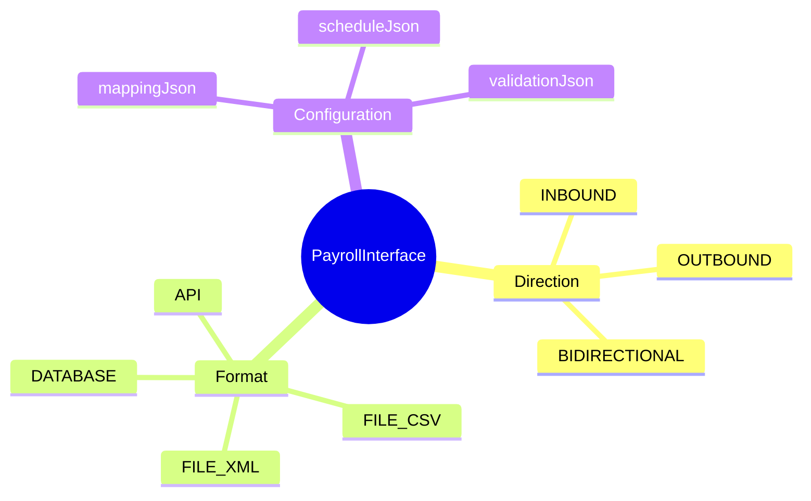
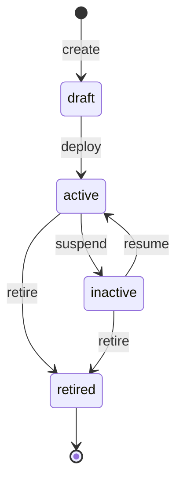

# PayrollInterface

## Overview



**PayrollInterface** (Giao diện Payroll) định nghĩa các interface tích hợp giữa Payroll module với các hệ thống khác, bao gồm cả internal modules và external systems.

## Business Context

### Key Stakeholders
- **Integration Team**: Design và develop interfaces
- **Payroll Administrators**: Monitor và manage interfaces
- **IT Operations**: Support interface infrastructure
- **External Vendors**: Integrate with payroll data

### Business Processes
- **Time Data Import**: Nhận dữ liệu từ Time & Attendance
- **HR Data Sync**: Đồng bộ employee data từ Core HR
- **GL Export**: Xuất journal entries sang Finance/ERP
- **Bank Integration**: Gửi payment files
- **Tax Authority Integration**: Submit statutory reports

### Business Value
PayrollInterface chuẩn hóa cách define và manage integrations, đảm bảo data consistency và traceability.

## Attributes Guide

### Interface Type
- **direction**:
  - *INBOUND*: Data vào Payroll (time data, HR changes)
  - *OUTBOUND*: Data ra khỏi Payroll (GL, payments, reports)
  - *BIDIRECTIONAL*: Two-way sync

- **format**:
  - *API*: REST/SOAP API calls
  - *FILE_CSV/XML/JSON*: Batch file transfers
  - *DATABASE*: Direct database connection

### Configuration
- **mappingJson**: Field mappings
  ```json
  {
    "mappings": [
      {"source": "emp_id", "target": "employee_code", "transform": "prefix('EMP')"},
      {"source": "work_hours", "target": "regular_hours", "transform": "none"},
      {"source": "ot_hours", "target": "overtime_hours", "transform": "none"}
    ],
    "defaults": {
      "element_code": "TIMESHEET_HOURS"
    }
  }
  ```

- **scheduleJson**: Batch schedules
  ```json
  {
    "type": "cron",
    "expression": "0 6 * * *",
    "timezone": "Asia/Ho_Chi_Minh",
    "retryPolicy": {"maxRetries": 3, "delayMinutes": 30}
  }
  ```

## Lifecycle & Workflows



### State Definitions

| State | Business Meaning | System Impact |
|-------|------------------|---------------|
| **draft** | Đang develop | Không processing |
| **active** | Đang hoạt động | Real data processing |
| **inactive** | Tạm ngừng | No processing, retains config |
| **retired** | Đã ngừng vĩnh viễn | Archive, không thể resume |

## Examples

### Example 1: Time & Attendance Import
- **code**: TA_IMPORT_DAILY
- **name**: T&A Daily Time Import
- **direction**: INBOUND
- **sourceSystem**: Time & Attendance
- **format**: API
- **scheduleJson**: Daily at 6 AM

### Example 2: GL Journal Export
- **code**: GL_EXPORT
- **name**: GL Journal Entry Export
- **direction**: OUTBOUND
- **targetSystem**: ERP/SAP
- **format**: FILE_XML
- **scheduleJson**: After payroll run completion

### Example 3: HR Master Sync
- **code**: HR_SYNC
- **name**: HR Master Data Synchronization
- **direction**: INBOUND
- **sourceSystem**: Core HR
- **format**: API
- **scheduleJson**: Real-time event-driven

### Example 4: Bank Payment File
- **code**: BANK_VCB
- **name**: Vietcombank Payment Interface
- **direction**: OUTBOUND
- **targetSystem**: Vietcombank
- **format**: FILE_CSV
- **description**: Uses BankTemplate VCB for formatting

## Edge Cases & Exceptions

### Interface Failure Handling
**Situation**: Interface fails during processing
**Handling**:
- Retry per retryPolicy
- Alert và log errors
- Queue for manual intervention if max retries exceeded

### Partial Data Processing
**Situation**: Some records fail validation
**Handling**:
- Process valid records
- Report failures for correction
- Allow re-processing of failed records

## Related Entities

| Entity | Relationship | Description |
|--------|--------------|-------------|
| [[BankTemplate]] | uses | For bank file formatting |
| (Various modules) | integrates with | Source/target systems |
