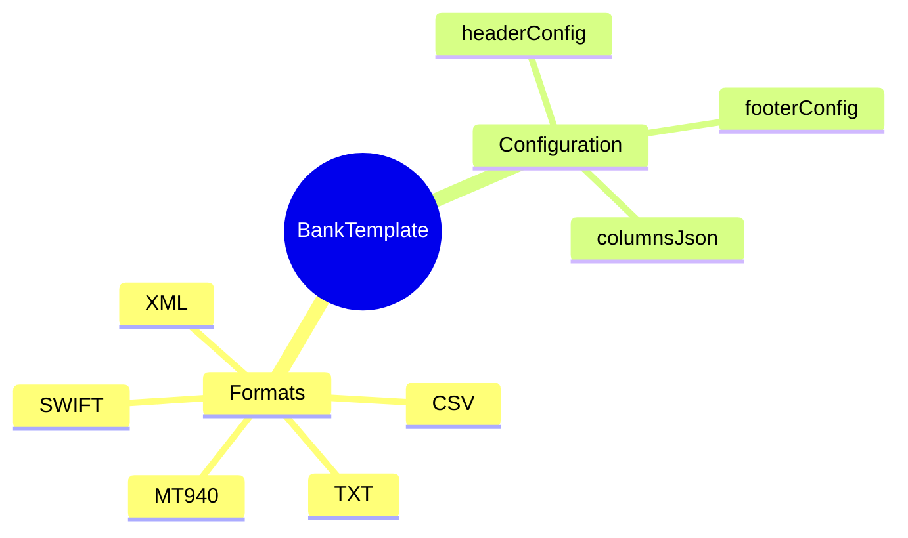

# BankTemplate

## Overview



**BankTemplate** (Mẫu file ngân hàng) định nghĩa format cho payment files gửi đến ngân hàng. Mỗi ngân hàng có thể có format khác nhau.

## Business Context

### Key Stakeholders
- **Treasury/Finance**: Define templates theo bank requirements
- **Payroll Administrators**: Generate payment files
- **Bank Operations**: Process payment files

### Business Processes
- **Payment File Generation**: Create files theo bank format
- **Bank Integration**: Submit files qua banking portal/API
- **Reconciliation**: Match payments với bank confirmations

## Attributes Guide

- **format**: File type
  - *CSV*: Comma-separated
  - *TXT*: Fixed-width text
  - *XML*: XML format
  - *MT940*: SWIFT bank statement
  - *SWIFT*: SWIFT payment messages

- **columnsJson**: Column definitions
  ```json
  {
    "columns": [
      {"name": "account_no", "position": 1, "width": 20, "type": "string"},
      {"name": "amount", "position": 2, "width": 15, "type": "decimal", "format": "0.00"},
      {"name": "currency", "position": 3, "width": 3, "type": "string"},
      {"name": "beneficiary", "position": 4, "width": 50, "type": "string"}
    ]
  }
  ```

## Examples

### Example 1: Vietcombank
- **code**: VCB
- **name**: Vietcombank Payment File
- **format**: CSV
- **delimiter**: ","

### Example 2: DBS Singapore
- **code**: DBS_SG
- **name**: DBS Singapore GIRO
- **format**: TXT

### Example 3: Citibank SWIFT
- **code**: CITI_SWIFT
- **name**: Citibank SWIFT MT103
- **format**: SWIFT
