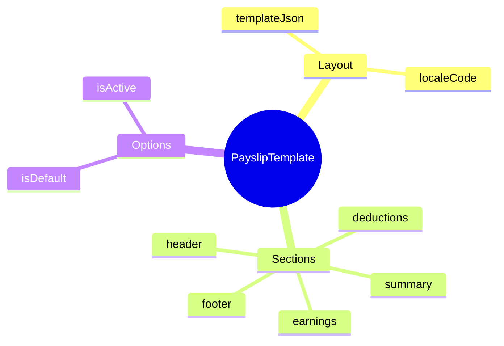

# PayslipTemplate

## Overview



**PayslipTemplate** (Mẫu phiếu lương) định nghĩa layout và format cho payslip documents. Hỗ trợ multiple templates cho different locales và employee groups.

## Business Context

### Key Stakeholders
- **Payroll Administrators**: Create và customize templates
- **Employees**: View payslips format
- **HR**: Review templates cho policy compliance
- **Legal**: Ensure required information displayed

### Business Processes
- **Payslip Generation**: Apply template cho payslip PDF/view
- **Multi-language**: Different templates per locale
- **Customization**: Templates cho different employee types

## Attributes Guide

- **localeCode**: Language/region (vi_VN, en_US, zh_SG)
- **templateJson**: Template definition
  ```json
  {
    "header": {
      "showLogo": true,
      "companyInfo": ["name", "address", "taxId"]
    },
    "sections": [
      {"name": "employee_info", "fields": ["code", "name", "department"]},
      {"name": "earnings", "showDetails": true},
      {"name": "deductions", "showDetails": true},
      {"name": "summary", "fields": ["gross", "deductions", "net"]}
    ],
    "footer": {
      "showSignature": true,
      "disclaimer": "Confidential"
    }
  }
  ```

## Examples

### Example 1: Vietnam Standard
- **code**: VN_STANDARD
- **name**: Vietnam Standard Payslip
- **localeCode**: vi_VN
- **isDefault**: true

### Example 2: English Version
- **code**: EN_STANDARD
- **name**: English Standard Payslip
- **localeCode**: en_US
- **isDefault**: false

### Example 3: Executive Confidential
- **code**: EXEC_CONFIDENTIAL
- **name**: Executive Confidential Payslip
- **localeCode**: en_US
- **description**: Template cho executives với additional privacy
