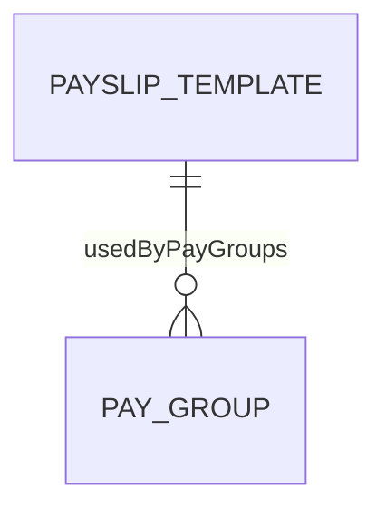
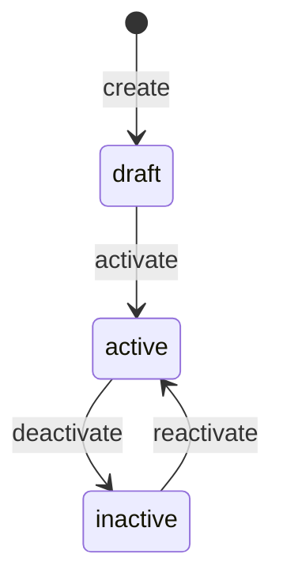

# PayslipTemplate

## Overview

**PayslipTemplate** (Mẫu phiếu lương) định nghĩa layout và format cho payslip documents. Hỗ trợ multiple templates cho different locales và employee groups.


## Business Context

### Key Stakeholders
- **Payroll Administrators**: Create và customize templates
- **Employees**: View payslips format
- **HR**: Review templates cho policy compliance
- **Legal**: Ensure required information displayed

### Payslip Sections

| Section | Description | Required Fields |
|---------|-------------|-----------------|
| **Header** | Company info, logo | Company name, address, tax ID |
| **Employee Info** | Employee details | Code, name, department |
| **Earnings** | Income breakdown | Element, amount, YTD |
| **Deductions** | Deduction breakdown | Element, amount |
| **Summary** | Totals | Gross, deductions, net |
| **Footer** | Signature, disclaimer | Date, signature line |

### Business Value
PayslipTemplate ensures consistent, professional payslip presentation, supports multi-language requirements, và meets legal disclosure requirements.

## Attributes Guide

### Core Identity
- **code**: Mã duy nhất. Format: VN_STANDARD, EN_STANDARD
- **name**: Tên hiển thị. VD: "Vietnam Standard Payslip"
- **localeCode**: Language/region (vi_VN, en_US, zh_SG)

### Template Definition (templateJson)
```json
{
  "header": {
    "showLogo": true,
    "logoPath": "/assets/logo.png",
    "companyInfo": ["name", "address", "taxId"]
  },
  "sections": [
    {
      "name": "employee_info",
      "fields": ["code", "name", "department", "position"]
    },
    {
      "name": "earnings",
      "showDetails": true,
      "showYTD": true
    },
    {
      "name": "deductions",
      "showDetails": true
    },
    {
      "name": "summary",
      "fields": ["gross", "totalDeductions", "net"]
    }
  ],
  "footer": {
    "showSignature": true,
    "disclaimer": "This is a confidential document"
  }
}
```

## Relationships Explained



### PayGroup
- **usedByPayGroups** → [[PayGroup]]: Pay groups using this template

## Lifecycle & Workflows



| State | Meaning |
|-------|---------|
| **draft** | Đang design |
| **active** | Có thể sử dụng |
| **inactive** | Tạm ngừng |

### Payslip Generation Flow


## Actions & Operations

### create
**Who**: Payroll Administrator  
**Required**: code, name, effectiveStartDate

### setDefault
**Who**: Payroll Administrator  
**Effect**: Only one default per locale

### preview
**Who**: Payroll Administrator  
**Input**: sampleData object  
**Output**: Rendered payslip preview

## Business Rules

#### Unique Code (uniqueCode)
**Rule**: Mã template phải duy nhất.

#### Single Default (singleDefault)
**Rule**: Chỉ có một template default per locale.

## Examples

### Example 1: Vietnam Standard
```yaml
code: VN_STANDARD
name: "Vietnam Standard Payslip"
localeCode: vi_VN
isDefault: true
templateJson:
  header:
    showLogo: true
    companyInfo: ["name", "address", "taxId"]
  sections:
    - name: employee_info
      fields: ["code", "name", "department"]
    - name: earnings
      showDetails: true
    - name: deductions
      showDetails: true
    - name: summary
      fields: ["gross", "deductions", "net"]
```

### Example 2: English Version
```yaml
code: EN_STANDARD
name: "English Standard Payslip"
localeCode: en_US
isDefault: false
```

### Example 3: Executive Confidential
```yaml
code: EXEC_CONFIDENTIAL
name: "Executive Confidential Payslip"
localeCode: en_US
description: "Template for executives with additional privacy"
templateJson:
  header:
    showLogo: true
  sections:
    - name: employee_info
      fields: ["code", "name"]  # Minimal info
    - name: summary
      fields: ["net"]  # Only net pay
```

## Related Entities

| Entity | Relationship | Description |
|--------|--------------|-------------|
| [[PayGroup]] | usedBy | Pay groups using template |
