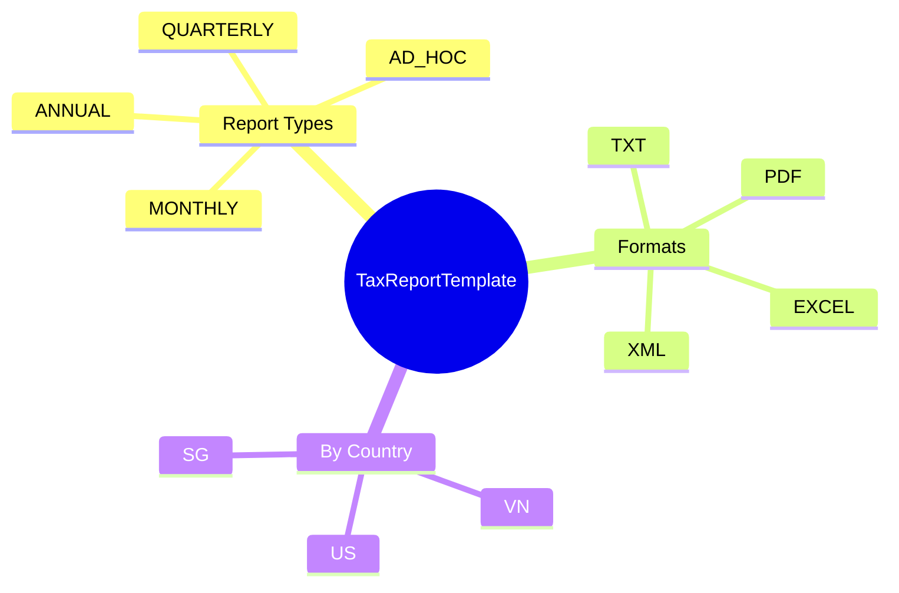

# TaxReportTemplate

## Overview

**TaxReportTemplate** (Mẫu báo cáo thuế) định nghĩa format cho các báo cáo thuế theo statutory requirements của từng quốc gia.

## Business Context

### Key Stakeholders
- **Compliance Team**: Define report formats theo tax authority requirements
- **Payroll Administrators**: Generate reports
- **Tax/Legal**: Review và submit reports
- **Tax Authorities**: Receive and process reports

### Business Processes
- **Monthly/Quarterly Filing**: Regular tax submissions
- **Annual Tax Forms**: Year-end employee tax documents
- **Withholding Reports**: Tax withheld reporting
- **Audit Reports**: Supporting documentation

## Attributes Guide

- **reportType**:
  - *MONTHLY*: Monthly statutory reports
  - *QUARTERLY*: Quarterly submissions
  - *ANNUAL*: Year-end forms (W-2, 1099, etc.)
  - *AD_HOC*: On-demand reports

- **format**: Output format matching tax authority requirements

## Examples

### Example 1: Vietnam Monthly PIT Declaration
- **code**: 05QTT_TNCN
- **name**: Tờ khai PIT tháng (05/QTT-TNCN)
- **countryCode**: VN
- **reportType**: MONTHLY
- **format**: PDF

### Example 2: Vietnam Annual Tax Finalization
- **code**: 02KK_TNCN
- **name**: Quyết toán thuế TNCN năm
- **countryCode**: VN
- **reportType**: ANNUAL
- **format**: XML

### Example 3: Singapore IR8A
- **code**: IR8A
- **name**: Singapore IR8A Annual Return
- **countryCode**: SG
- **reportType**: ANNUAL
- **format**: TXT

### Example 4: US W-2
- **code**: W2
- **name**: US W-2 Wage and Tax Statement
- **countryCode**: US
- **reportType**: ANNUAL
- **format**: PDF
