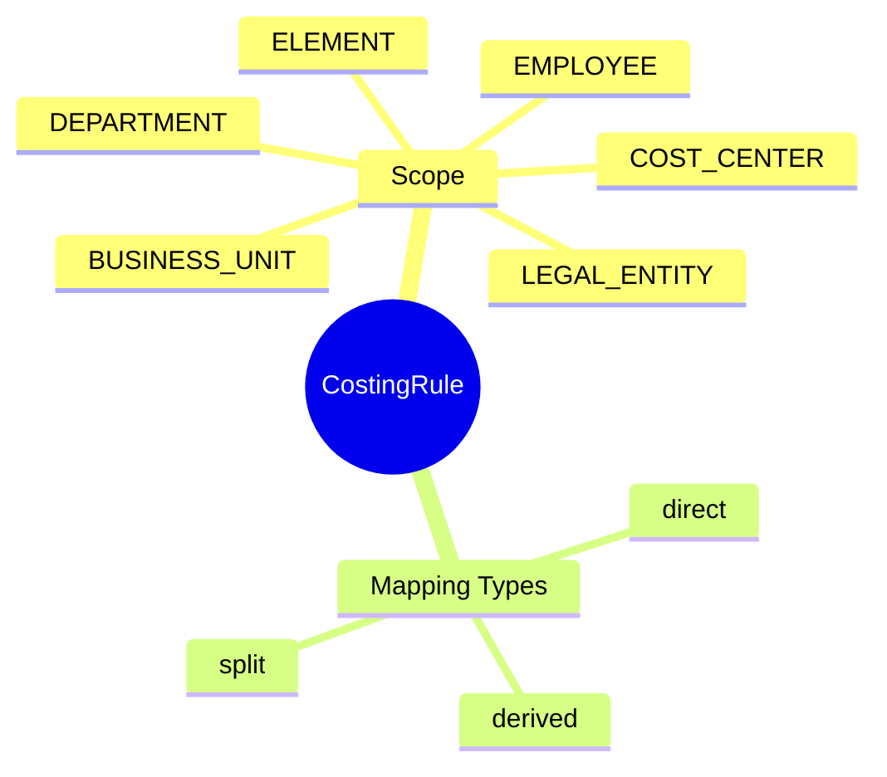
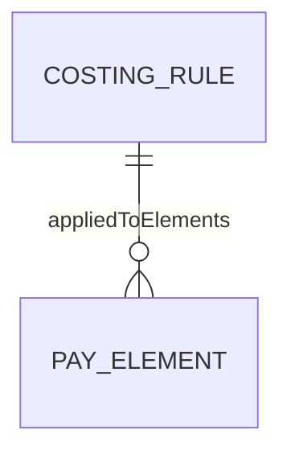

# CostingRule

## Overview



**CostingRule** (Quy tắc phân bổ chi phí) định nghĩa cách allocate payroll costs vào các cost centers, departments, projects, và GL accounts. Essential cho financial reporting và budgeting.

## Business Context

### Key Stakeholders
- **Finance/Accounting**: Define costing rules theo chart of accounts
- **Payroll Administrators**: Configure và maintain rules
- **Cost Center Managers**: Review allocated costs
- **Budget Owners**: Monitor labor costs against budget

### Business Processes
- **Cost Allocation**: Distribute payroll costs to proper segments
- **GL Posting**: Generate accounting entries
- **Project Costing**: Allocate costs to projects
- **Budget Tracking**: Labor cost vs budget analysis

### Business Value
Accurate cost allocation enables proper financial reporting, budget control, và project profitability analysis.

## Attributes Guide

### Scope
- **levelScope**: Level at which rule applies:
  - *LEGAL_ENTITY*: All employees in LE use same rule
  - *BUSINESS_UNIT*: BU-specific allocation
  - *DEPARTMENT*: Department-level
  - *COST_CENTER*: Cost center override
  - *EMPLOYEE*: Individual employee exceptions
  - *ELEMENT*: Element-specific costing

### Allocation Logic
- **mappingJson**: Defines allocation rules
  
  **Simple mapping**:
  ```json
  {
    "type": "direct",
    "costCenter": "CC-12345",
    "glAccount": "60100"
  }
  ```
  
  **Split allocation**:
  ```json
  {
    "type": "split",
    "allocations": [
      {"costCenter": "CC-001", "percentage": 60},
      {"costCenter": "CC-002", "percentage": 40}
    ]
  }
  ```
  
  **Derived from employee**:
  ```json
  {
    "type": "derived",
    "costCenterFrom": "employee.department.costCenter",
    "projectFrom": "employee.primaryAssignment.project"
  }
  ```

## Relationships Explained



### Element Application
- **appliedToElements** → [[PayElement]]: Elements using this costing rule.
  - Different elements may have different costing (salary to one account, benefits to another)

## Examples

### Example 1: Default Department Costing
- **code**: COST_BY_DEPT
- **name**: Cost to Employee Department
- **levelScope**: LEGAL_ENTITY
- **mappingJson**:
  ```json
  {
    "type": "derived",
    "costCenterFrom": "employee.department.costCenter",
    "glAccount": "61000"
  }
  ```

### Example 2: Project Split Allocation
- **code**: COST_PROJECT_SPLIT
- **name**: Multi-Project Cost Split
- **levelScope**: EMPLOYEE
- **mappingJson**:
  ```json
  {
    "type": "split",
    "splitSource": "employee.projectAllocations",
    "glAccount": "61000"
  }
  ```
- **Note**: Uses employee's project allocation percentages

### Example 3: Element-Specific Costing
- **code**: COST_BHXH_ER
- **name**: Employer BHXH Cost Account
- **levelScope**: ELEMENT
- **mappingJson**:
  ```json
  {
    "type": "direct",
    "glAccount": "62100",
    "costCenterFrom": "employee.department.costCenter"
  }
  ```
- **appliedTo**: BHXH_ER element

## Related Entities

| Entity | Relationship | Description |
|--------|--------------|-------------|
| [[PayElement]] | appliedTo (1:N) | Elements using this rule |
