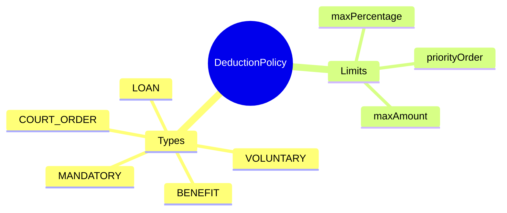
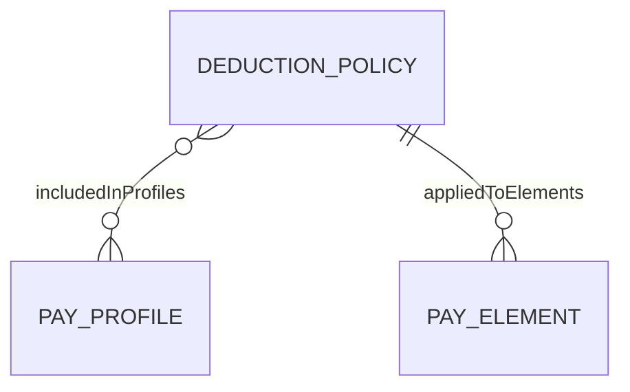

# DeductionPolicy

## Overview



**DeductionPolicy** (Chính sách khấu trừ) định nghĩa các quy tắc và giới hạn cho việc khấu trừ lương, bao gồm thứ tự ưu tiên, giới hạn tối đa, và các business rules cụ thể.

## Business Context

### Key Stakeholders
- **Payroll Directors**: Define policies theo company và legal requirements
- **Payroll Administrators**: Configure và assign policies
- **HR/Benefits**: Policies cho benefit deductions
- **Legal/Compliance**: Ensure garnishment policies comply with law

### Business Processes
- **Deduction Ordering**: Xác định thứ tự khấu trừ
- **Limit Enforcement**: Đảm bảo không vượt quá legal limits
- **Garnishment Processing**: Handle court-ordered deductions
- **Loan Repayment**: Employee loan deductions

### Business Value
Deduction policies đảm bảo compliant và consistent deduction processing, protect employee minimum wage rights, và proper prioritization of competing deductions.

## Attributes Guide

### Classification
- **deductionType**: 
  - *VOLUNTARY*: Employee elects (401k, charity)
  - *MANDATORY*: Required by policy (union dues, parking)
  - *COURT_ORDER*: Garnishments, child support
  - *BENEFIT*: Benefit plan contributions
  - *LOAN*: Employee loan repayment
  - *OTHER*: Other deductions

### Ordering & Limits
- **priorityOrder**: Lower = higher priority. Statutory deductions typically have lowest numbers.
- **maxPercentage**: Max % of disposable earnings (important for garnishments)
- **maxAmount**: Max absolute amount per pay period

### Calculation Logic
- **deductionJson**: Complex rules
  ```json
  {
    "type": "progressive",
    "tiers": [
      {"upTo": 1000000, "rate": 0},
      {"upTo": 5000000, "rate": 0.10},
      {"above": 5000000, "rate": 0.15}
    ]
  }
  ```

## Relationships Explained



### Profile Inclusion
- **includedInProfiles** → [[PayProfile]]: Policies included in payroll profiles

### Element Application
- **appliedToElements** → [[PayElement]]: Deduction elements using this policy for limits/rules

## Examples

### Example 1: Court-Ordered Garnishment
- **code**: GARNISHMENT_COURT
- **name**: Court-Ordered Wage Garnishment
- **deductionType**: COURT_ORDER
- **priorityOrder**: 1 (highest priority)
- **maxPercentage**: 25 (25% of disposable earnings)
- **Note**: Legal limit per federal/state law

### Example 2: Voluntary 401k
- **code**: 401K_VOLUNTARY
- **name**: 401(k) Voluntary Contribution
- **deductionType**: VOLUNTARY
- **priorityOrder**: 50
- **maxPercentage**: 100 (IRS annual limit applies separately)

### Example 3: Employee Loan Repayment
- **code**: LOAN_REPAYMENT
- **name**: Employee Loan Repayment
- **deductionType**: LOAN
- **priorityOrder**: 80
- **maxPercentage**: 15 (company policy limit)

## Related Entities

| Entity | Relationship | Description |
|--------|--------------|-------------|
| [[PayProfile]] | includedIn (M:N) | Profiles using policy |
| [[PayElement]] | appliedTo (1:N) | Deduction elements |
