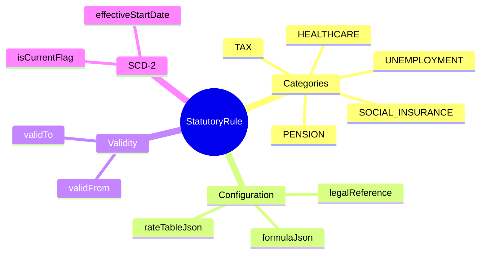
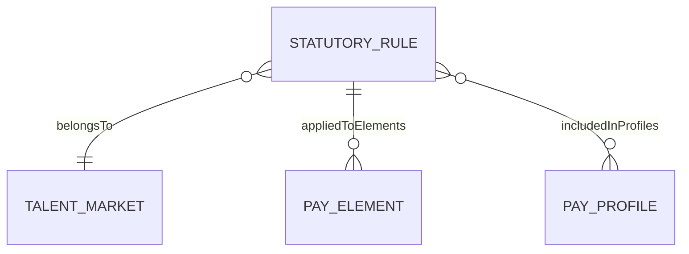
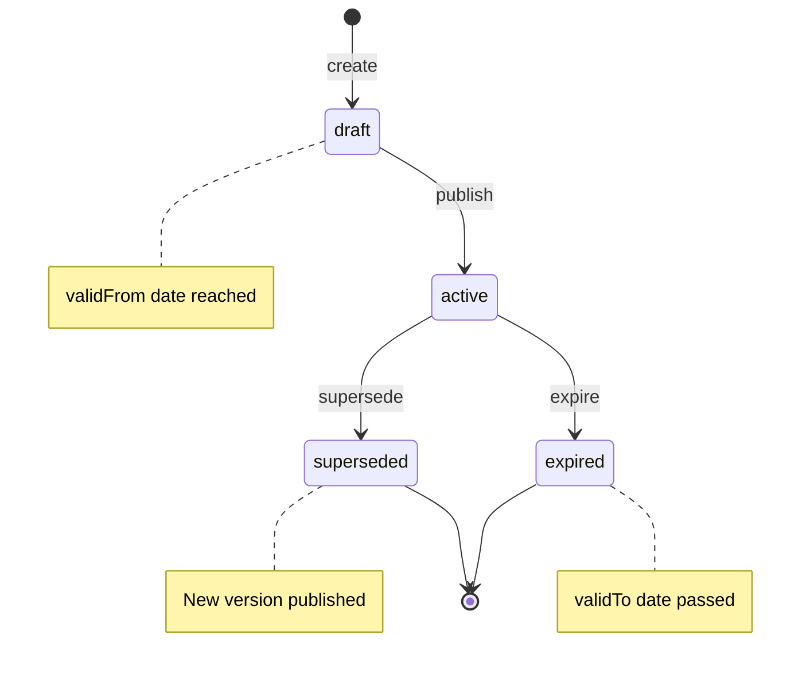

# StatutoryRule

## Overview



**StatutoryRule** (Quy định pháp lý) định nghĩa các rules payroll theo quy định pháp luật của từng quốc gia/thị trường. Bao gồm tax rules, social insurance, pension, healthcare, và các statutory deductions khác.

## Business Context

### Key Stakeholders
- **Compliance Team**: Define và maintain rules theo legal requirements
- **Payroll Directors**: Approve rule changes
- **Payroll Administrators**: Assign rules cho elements và profiles
- **Legal/Tax Advisors**: Provide input cho rule definitions

### Business Processes
This entity is central to:
- **Tax Compliance**: Ensure correct tax calculation theo regulations
- **Social Insurance**: Proper contribution calculations
- **Legal Updates**: Quick response khi laws thay đổi
- **Multi-country Operations**: Market-specific rules

### Business Value
StatutoryRule đảm bảo payroll compliance với legal requirements, reduce risk of penalties, và chuẩn hóa cách implement statutory calculations.

## Attributes Guide

### Identification
- **id**: UUID system-generated
- **code**: Business identifier (ví dụ: VN_PIT_2025, SG_CPF_2025, VN_BHXH_EE)

### Classification
- **ruleCategory**: Loại statutory rule:
  - *TAX*: Personal income tax
  - *SOCIAL_INSURANCE*: BHXH (Vietnam), CPF (Singapore)
  - *PENSION*: Pension contributions
  - *HEALTHCARE*: Health insurance contributions
  - *UNEMPLOYMENT*: Unemployment insurance
  - *UNION*: Union dues (if statutory)
  - *OTHER*: Other statutory requirements

### Rule Definition
- **formulaJson**: Calculation logic:
  ```json
  {
    "type": "progressive",
    "rateTable": "rateTableJson",
    "input": "taxable_income",
    "exemptions": ["personal_exemption", "dependent_exemption"]
  }
  ```

- **rateTableJson**: Statutory rates:
  ```json
  {
    "type": "progressive",
    "brackets": [
      {"from": 0, "to": 5000000, "rate": 0.05},
      {"from": 5000000, "to": 10000000, "rate": 0.10},
      ...
    ]
  }
  ```
  Hoặc flat rate:
  ```json
  {
    "type": "flat",
    "employeeRate": 0.08,
    "employerRate": 0.175,
    "ceiling": 36000000
  }
  ```

### Legal Validity
- **validFrom/validTo**: Thời hạn hiệu lực pháp lý của rule
- **legalReference**: Tham chiếu văn bản (ví dụ: "Thông tư 59/2025/TT-BTC")

### Version Control
- **effectiveStartDate/EndDate**: SCD2 versioning cho internal changes
- **isCurrentFlag**: Current internal version

## Relationships Explained



### Market Scope
- **belongsToMarket** → [[TalentMarket]]: Statutory rules specific to market.
  - Vietnam rules: VN_* prefix
  - Singapore rules: SG_* prefix
  - Each market has own set of rules

### Element Application
- **appliedToElements** → [[PayElement]]: Elements sử dụng rule này.
  - PIT rule → PIT element
  - BHXH rule → BHXH_EE, BHXH_ER elements

### Profile Inclusion
- **includedInProfiles** → [[PayProfile]]: Profiles chứa rule.
  - VN-STANDARD profile includes all VN statutory rules

## Lifecycle & Workflows



### State Definitions

| State | Business Meaning | System Impact |
|-------|------------------|---------------|
| **draft** | Đang define, chưa publish | Không calculation |
| **active** | Đang áp dụng | Used in payroll calculations |
| **superseded** | Đã thay thế bởi version mới | Historical, không dùng cho runs mới |
| **expired** | Hết hiệu lực pháp lý | Read-only |

### Transition Workflows

#### Draft → Active (publish)
**Trigger**: validFrom date đến và rule được approved
**Who**: Compliance Team + Payroll Director
**Prerequisites**: 
- Rule fully configured
- Approved by legal/compliance
- validFrom reached

#### Active → Superseded (supersede)
**Trigger**: New version published (legal update)
**Who**: Compliance Team
**Process**:
1. Create new version với new rates/logic
2. Set new version validFrom
3. Publish new version
4. Old version automatically superseded

#### Active → Expired (expire)
**Trigger**: validTo date passed
**Who**: System (automatic)
**Effect**: Rule không còn được sử dụng

## Actions & Operations

### create
**Who**: Compliance Team
**Required**: code, name, ruleCategory, marketId, validFrom, effectiveStartDate

### createNewVersion
**Who**: Compliance Team
**When**: Legal update requires new rates or logic
**Process**:
1. Clone current rule
2. Update formulaJson/rateTableJson
3. Set new validFrom
4. Update legalReference
5. Publish

### Example: Vietnam PIT Rate Update
```yaml
# Current version
code: VN_PIT_2025
validFrom: 2025-01-01
rateTableJson:
  brackets:
    - from: 0, to: 5000000, rate: 0.05
    ...

# New version (hypothetical 2026 update)
code: VN_PIT_2026
validFrom: 2026-01-01
legalReference: "Thông tư XX/2025"
rateTableJson:
  brackets:
    - from: 0, to: 6000000, rate: 0.05  # Updated bracket
    ...
```

## Business Rules

### Data Integrity

#### Unique Code (uniqueCode)
**Rule**: Mã rule phải duy nhất.
**Reason**: Identifier cho references.

#### Market Required (marketRequired)
**Rule**: Rule phải thuộc một market.
**Reason**: Statutory rules are country-specific.

#### Valid Date Range (validDateRange)
**Rule**: validTo phải sau validFrom.
**Reason**: Logical date range.

## Examples

### Example 1: Vietnam PIT Progressive Tax
- **code**: VN_PIT_2025
- **name**: Vietnam Personal Income Tax 2025
- **ruleCategory**: TAX
- **market**: Vietnam
- **validFrom**: 2025-01-01
- **rateTableJson**:
  ```json
  {
    "type": "progressive",
    "brackets": [
      {"from": 0, "to": 5000000, "rate": 0.05},
      {"from": 5000000, "to": 10000000, "rate": 0.10},
      {"from": 10000000, "to": 18000000, "rate": 0.15},
      {"from": 18000000, "to": 32000000, "rate": 0.20},
      {"from": 32000000, "to": 52000000, "rate": 0.25},
      {"from": 52000000, "to": 80000000, "rate": 0.30},
      {"from": 80000000, "to": null, "rate": 0.35}
    ],
    "personalExemption": 11000000,
    "dependentExemption": 4400000
  }
  ```
- **legalReference**: Luật Thuế TNCN, Nghị định 126/2020

### Example 2: Vietnam Social Insurance (Employee)
- **code**: VN_BHXH_EE_2025
- **name**: Vietnam BHXH Employee Contribution 2025
- **ruleCategory**: SOCIAL_INSURANCE
- **market**: Vietnam
- **validFrom**: 2025-01-01
- **rateTableJson**:
  ```json
  {
    "type": "flat",
    "rate": 0.08,
    "ceiling": 36000000,
    "contributionBase": "GROSS_INSURABLE"
  }
  ```
- **legalReference**: Luật BHXH 2014

### Example 3: Singapore CPF
- **code**: SG_CPF_2025
- **name**: Singapore CPF Contributions 2025
- **ruleCategory**: PENSION
- **market**: Singapore
- **validFrom**: 2025-01-01
- **rateTableJson**:
  ```json
  {
    "type": "age_tiered",
    "tiers": [
      {"ageFrom": 0, "ageTo": 55, "employeeRate": 0.20, "employerRate": 0.17},
      {"ageFrom": 55, "ageTo": 60, "employeeRate": 0.15, "employerRate": 0.15},
      {"ageFrom": 60, "ageTo": 65, "employeeRate": 0.095, "employerRate": 0.11},
      {"ageFrom": 65, "ageTo": null, "employeeRate": 0.05, "employerRate": 0.075}
    ],
    "ceiling": 6800
  }
  ```

## Edge Cases & Exceptions

### Mid-Year Rate Changes
**Situation**: Government changes rates giữa năm.
**Handling**:
1. Create new rule version với validFrom = effective date
2. Payroll runs before that date use old rates
3. Runs from that date use new rates
4. May need retro calculation

### Retroactive Legal Changes
**Situation**: Law changes retroactively.
**Handling**:
1. Create new rule version với validFrom in past
2. Mark affected payroll periods
3. Run retro calculation
4. Generate corrective payments

### Multiple Applicable Rules
**Situation**: Employee qualifies for multiple rules (ví dụ: expat với tax treaty).
**Handling**: Element configuration hoặc employee exception handling. Priority rules may apply.

## Related Entities

| Entity | Relationship | Description |
|--------|--------------|-------------|
| [[TalentMarket]] | belongsTo | Market rule applies to |
| [[PayElement]] | appliedTo (1:N) | Elements using this rule |
| [[PayProfile]] | includedIn (M:N) | Profiles containing rule |
