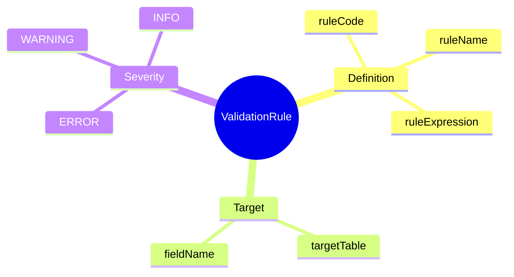

# ValidationRule

## Overview



**ValidationRule** (Quy tắc kiểm tra) định nghĩa các rules để validate payroll data trước và trong quá trình processing. Helps catch data errors early và ensure data integrity.

## Business Context

### Key Stakeholders
- **Payroll Administrators**: Define validation rules
- **Data Quality Team**: Monitor validation failures
- **Payroll Processors**: Fix validation errors

### Business Processes
- **Pre-Processing Validation**: Check data before payroll run
- **Input Validation**: Validate manual entries và imports
- **Calculation Validation**: Verify calculated values are reasonable
- **Post-Processing Checks**: Final validation before payment

### Business Value
Validation rules prevent payroll errors, reduce manual review effort, và ensure data quality compliance.

## Attributes Guide

### Rule Definition
- **targetTable**: Entity/table rule applies to (pay_run.employee, pay_run.input_value, etc.)
- **fieldName**: Specific field (null = cross-field or row-level validation)
- **ruleExpression**: Validation logic
  ```sql
  -- Field validation
  gross_amount >= 0
  
  -- Cross-field validation  
  net_amount <= gross_amount
  
  -- Lookup validation
  element_id EXISTS IN pay_element WHERE is_active = true
  ```

### Error Handling
- **errorMessage**: User-friendly message
- **severity**: 
  - *ERROR*: Block processing
  - *WARNING*: Allow with acknowledgment
  - *INFO*: Log only

## Examples

### Example 1: Positive Gross
- **ruleCode**: VAL_POSITIVE_GROSS
- **ruleName**: Gross Amount Must Be Positive
- **targetTable**: pay_run.employee
- **fieldName**: gross_amount
- **ruleExpression**: `gross_amount >= 0`
- **errorMessage**: Gross amount cannot be negative
- **severity**: ERROR

### Example 2: Net Not Exceed Gross
- **ruleCode**: VAL_NET_GROSS
- **ruleName**: Net Cannot Exceed Gross
- **targetTable**: pay_run.employee
- **ruleExpression**: `net_amount <= gross_amount`
- **errorMessage**: Net pay cannot be greater than gross pay
- **severity**: ERROR

### Example 3: Element Active Check
- **ruleCode**: VAL_ELEMENT_ACTIVE
- **ruleName**: Element Must Be Active
- **targetTable**: pay_run.input_value
- **fieldName**: element_id
- **ruleExpression**: `EXISTS(pay_element WHERE id = element_id AND is_active = true)`
- **errorMessage**: Cannot use inactive pay element
- **severity**: ERROR

## Related Entities

This entity is standalone, applied to various payroll tables during processing.
