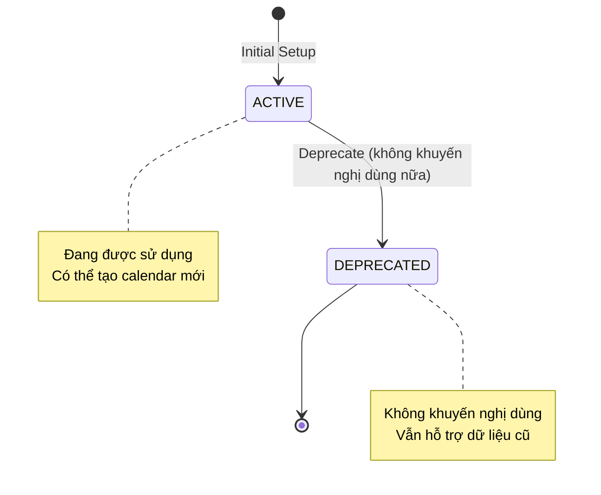
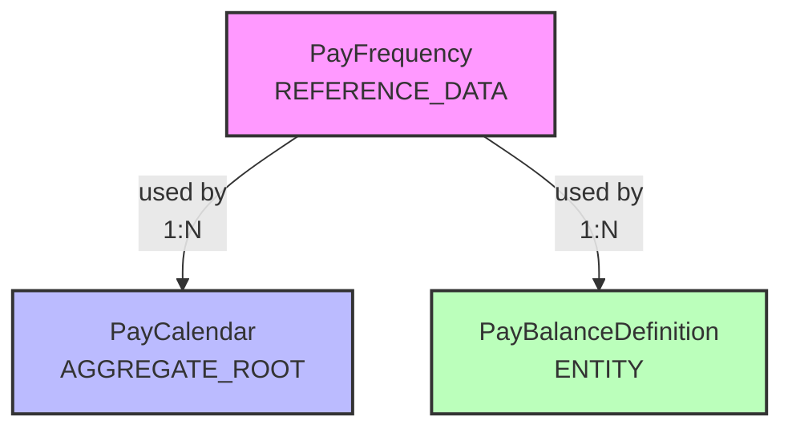

---
# ============================================================================
# ENTITY ONTOLOGY v4.0
# ============================================================================
# Format: Markdown + YAML Frontmatter
# File: R-pay-frequency.onto.md

$schema: "ontology/entity/v4"
$id: "xtalent:payroll:structure:pay-frequency"

# ----------------------------------------------------------------------------
# ENTITY IDENTITY
# ----------------------------------------------------------------------------
entity: PayFrequency
classification: REFERENCE_DATA
module: PAYROLL
submodule: structure

definition: "Định nghĩa chu kỳ trả lương (tần suất thanh toán lương)"
purpose: "Cung cấp danh sách chuẩn các tần suất trả lương được hỗ trợ trong hệ thống, phục vụ cấu hình pay calendar và balance reset"

# ----------------------------------------------------------------------------
# 1. ATTRIBUTES
# ----------------------------------------------------------------------------
attributes:
  # Primary key
  code:
    type: string
    required: true
    unique: true
    max_length: 20
    description: "Mã tần suất trả lương"
    example: "MONTHLY"
    pattern: "^[A-Z_]+$"
    
  # Core attributes
  name:
    type: string
    required: true
    max_length: 50
    description: "Tên mô tả tần suất"
    example: "Monthly - Hàng tháng"
    
  period_days:
    type: integer
    required: true
    description: "Số ngày trong một chu kỳ trả lương"
    min_value: 1
    max_value: 365
    example: 30
    
  # Metadata
  description:
    type: string
    required: false
    max_length: 255
    description: "Mô tả chi tiết về tần suất này"
    
  display_order:
    type: integer
    required: false
    default: 99
    description: "Thứ tự hiển thị trong dropdown"
    
  is_active:
    type: boolean
    required: true
    default: true
    description: "Trạng thái sử dụng"

# ----------------------------------------------------------------------------
# 2. RELATIONSHIPS
# ----------------------------------------------------------------------------
relationships:
  used_in_calendars:
    target: "[[PayCalendar]]"
    target_ref: "xtalent:payroll:structure:pay-calendar"
    cardinality: "1:N"
    description: "Pay calendars sử dụng tần suất này"
    
  used_in_balance_definitions:
    target: "[[PayBalanceDefinition]]"
    target_ref: "xtalent:payroll:elements:pay-balance-definition"
    cardinality: "1:N"
    description: "Balance definitions sử dụng làm reset frequency"

# ----------------------------------------------------------------------------
# 3. LIFECYCLE
# ----------------------------------------------------------------------------
lifecycle:
  state_attribute: is_active
  valid_states:
    - state: ACTIVE
      description: "Đang được sử dụng trong hệ thống"
      initial: true
    - state: DEPRECATED
      description: "Không còn khuyến nghị sử dụng, nhưng vẫn hỗ trợ dữ liệu cũ"
      terminal: true

# ----------------------------------------------------------------------------
# 4. ACTIONS
# ----------------------------------------------------------------------------
actions:
  - name: Deprecate
    description: "Đánh dấu tần suất không còn được khuyến nghị sử dụng"
    applicable_when: "is_active = true"
    requires: []
    mutations:
      - attribute: is_active
        value: false

# ----------------------------------------------------------------------------
# 5. POLICIES
# ----------------------------------------------------------------------------
policies:
  # Data constraints
  constraints:
    - id: POL-FREQ-001
      rule: "code IS NOT NULL AND code != ''"
      message: "Mã tần suất là bắt buộc"
      severity: ERROR
      
    - id: POL-FREQ-002
      rule: "period_days > 0 AND period_days <= 365"
      message: "Số ngày chu kỳ phải từ 1 đến 365"
      severity: ERROR
      
    - id: POL-FREQ-003
      rule: "code = UPPER(code)"
      message: "Mã tần suất phải viết hoa"
      severity: WARNING
      
  # Access control
  access_control:
    classification: PUBLIC
    visibility_rules:
      - attribute: "*"
        view: [ALL_USERS]
        edit: [SYSTEM_ADMIN, PAYROLL_DIRECTOR]
    notes: "Reference data, chỉ admin có quyền chỉnh sửa"
        
  # Eligibility
  eligibility:
    - id: ELIG-FREQ-001
      name: "Usable in Calendar"
      expression: "is_active = true"
      description: "Chỉ tần suất ACTIVE mới được dùng để tạo calendar mới"

# ----------------------------------------------------------------------------
# IMPLEMENTATION HINTS (Optional - not core ontology)
# ----------------------------------------------------------------------------
_hints:
  indexes:
    - columns: [code]
      unique: true
    - columns: [is_active, display_order]
  common_values:
    - code: WEEKLY
      name: "Weekly - Hàng tuần"
      period_days: 7
    - code: BIWEEKLY
      name: "Biweekly - 2 tuần một lần"
      period_days: 14
    - code: SEMIMONTHLY
      name: "Semi-monthly - 2 lần/tháng"
      period_days: 15
    - code: MONTHLY
      name: "Monthly - Hàng tháng"
      period_days: 30
    - code: QUARTERLY
      name: "Quarterly - Hàng quý"
      period_days: 90
  notes: "Đây là reference data tĩnh, hiếm khi thay đổi. Không sử dụng SCD2."
---

# PayFrequency

## Mô tả

**PayFrequency** (Tần suất trả lương) là entity kiểu REFERENCE_DATA, định nghĩa các chu kỳ trả lương chuẩn được hỗ trợ trong hệ thống Payroll.

### Vai trò trong hệ thống

- **Pay Calendar Configuration**: Là thành phần bắt buộc khi tạo pay calendar, xác định chu kỳ trả lương
- **Balance Reset**: Định nghĩa tần suất reset cho các loại balance (QTD, YTD)
- **Standardization**: Đảm bảo tính nhất quán trong cách tổ chức chu kỳ trả lương

### Đặc điểm

- **Static Reference Data**: Dữ liệu cố định, hiếm khi thay đổi
- **No SCD2**: Không cần theo dõi lịch sử thay đổi
- **Predefined Values**: Thường được seed sẵn khi khởi tạo hệ thống

## Lifecycle Visualization



### State Transitions

| Current State | Action | Next State | Effect |
|---------------|--------|------------|--------|
| ACTIVE | Deprecate | DEPRECATED | `is_active = false`, không cho phép tạo calendar mới |
| DEPRECATED | - | - | Terminal state, không thể reactivate |

## Relationship Diagram



### Relationship Details

1. **PayFrequency → PayCalendar (1:N)**
   - Một tần suất có thể được sử dụng bởi nhiều pay calendar
   - Ví dụ: MONTHLY được dùng cho Vietnam calendar, Singapore calendar, etc.
   - Ràng buộc: Chỉ ACTIVE frequency mới được dùng để tạo calendar mới

2. **PayFrequency → PayBalanceDefinition (1:N)**
   - Balance types (QTD, YTD, LTD) cần định nghĩa tần suất reset
   - Ví dụ: YTD_GROSS reset theo YEARLY (365 ngày)
   - Ràng buộc: Balance với type = RUN không cần reset frequency

## Common Values & Examples

### Standard Frequencies

```yaml
# Weekly - Phổ biến ở US, Australia
WEEKLY:
  name: "Weekly - Hàng tuần"
  period_days: 7
  use_case: "Hourly workers, casual employees"
  
# Biweekly - Rất phổ biến ở US
BIWEEKLY:
  name: "Biweekly - 2 tuần một lần"
  period_days: 14
  use_case: "Most common in US (26 pay periods/year)"
  
# Semi-monthly - Phổ biến ở US
SEMIMONTHLY:
  name: "Semi-monthly - 2 lần/tháng"
  period_days: 15
  use_case: "15th and last day of month (24 pay periods/year)"
  
# Monthly - Phổ biến ở Asia, Europe
MONTHLY:
  name: "Monthly - Hàng tháng"
  period_days: 30
  use_case: "Most common in Vietnam, Singapore (12 pay periods/year)"
  
# Quarterly - Ít gặp, chủ yếu cho executives
QUARTERLY:
  name: "Quarterly - Hàng quý"
  period_days: 90
  use_case: "Executive bonuses, milestone payments"
```

### Calculation Examples

**Ví dụ 1: MONTHLY Calendar**
```
Frequency: MONTHLY (period_days = 30)
Start Date: 2025-01-01
Pay Periods generated:
- Period 1: 2025-01-01 to 2025-01-31 (pay date: 2025-02-05)
- Period 2: 2025-02-01 to 2025-02-28 (pay date: 2025-03-05)
- Period 3: 2025-03-01 to 2025-03-31 (pay date: 2025-04-05)
...
```

**Ví dụ 2: BIWEEKLY Calendar**
```
Frequency: BIWEEKLY (period_days = 14)
Start Date: 2025-01-06 (Monday)
Pay Periods generated:
- Period 1: 2025-01-06 to 2025-01-19 (pay date: 2025-01-24)
- Period 2: 2025-01-20 to 2025-02-02 (pay date: 2025-02-07)
...
Total: 26 pay periods in a year
```

## Policies Explained

### Constraints

1. **POL-FREQ-001: Code Required**
   ```sql
   code IS NOT NULL AND code != ''
   ```
   - Mã là identifier, không thể null hoặc rỗng
   - Luôn enforce ở database level (NOT NULL constraint)

2. **POL-FREQ-002: Valid Period Range**
   ```sql
   period_days BETWEEN 1 AND 365
   ```
   - Chu kỳ tối thiểu 1 ngày (daily pay - rất hiếm)
   - Chu kỳ tối đa 365 ngày (yearly - ví dụ annual bonus)
   - Ngoài range này là invalid business case

3. **POL-FREQ-003: Uppercase Code**
   ```sql
   code = UPPER(code)
   ```
   - Convention: Tất cả codes đều UPPERCASE
   - Đảm bảo consistency khi search/filter
   - Severity: WARNING (không chặn save, nhưng nên fix)

### Access Control

**Classification**: PUBLIC
- Tất cả users đều có thể **xem** pay frequencies
- Chỉ SYSTEM_ADMIN và PAYROLL_DIRECTOR có quyền **chỉnh sửa**
- Rationale: Reference data cần stability, tránh thay đổi tùy tiện

### Eligibility Rules

**ELIG-FREQ-001: Usable in Calendar**
```javascript
is_active === true
```
- Chỉ tần suất ACTIVE mới được chọn khi tạo pay calendar mới
- Deprecated frequencies vẫn hoạt động cho calendars hiện tại
- Ngăn việc sử dụng tần suất đã lỗi thời cho setup mới

## Integration Points

### Upstream Dependencies
*None* - PayFrequency là leaf entity, không phụ thuộc vào entity nào

### Downstream Consumers

1. **PayCalendar**
   ```yaml
   Relationship: PayCalendar.frequency_code → PayFrequency.code
   Usage: Xác định chu kỳ generate pay periods
   Constraint: Must be ACTIVE when creating new calendar
   ```

2. **PayBalanceDefinition**
   ```yaml
   Relationship: PayBalanceDefinition.reset_freq_code → PayFrequency.code
   Usage: Định nghĩa khi nào reset balance về 0
   Example: YTD balance reset YEARLY, QTD reset QUARTERLY
   Note: RUN type balance không có reset frequency
   ```

## Business Rules Summary

| Rule ID | Description | Enforcement |
|---------|-------------|-------------|
| BR-FREQ-001 | Code must be unique across all frequencies | DB Unique Index |
| BR-FREQ-002 | Cannot delete frequency if used by active calendars | FK Constraint |
| BR-FREQ-003 | Deprecated frequencies still support existing data | Application Logic |
| BR-FREQ-004 | New calendars can only use ACTIVE frequencies | Application Logic |
| BR-FREQ-005 | period_days must accurately reflect cycle length | Data Validation |

## For AI Agents

Khi generate code hoặc documents từ entity này:

### 1. Code Generation
```python
# When creating dropdown/select for pay frequency
frequencies = PayFrequency.query.filter_by(is_active=True).order_by(display_order)

# Validation when creating calendar
def validate_calendar_frequency(freq_code):
    freq = PayFrequency.query.get(freq_code)
    if not freq:
        raise ValueError(f"Invalid frequency code: {freq_code}")
    if not freq.is_active:
        raise ValueError(f"Cannot use deprecated frequency: {freq_code}")
```

### 2. API Design
```yaml
GET /api/payroll/frequencies
  Response: List of all frequencies (include deprecated for historical data)
  
GET /api/payroll/frequencies?active=true
  Response: Only ACTIVE frequencies (for new calendar creation)
  
POST /api/payroll/calendars
  Body: { frequency_code: "MONTHLY", ... }
  Validation: frequency.is_active must be true
```

### 3. Test Data Generation
```python
# Seed data for testing
seed_frequencies = [
    {"code": "WEEKLY", "period_days": 7, "is_active": True},
    {"code": "BIWEEKLY", "period_days": 14, "is_active": True},
    {"code": "MONTHLY", "period_days": 30, "is_active": True},
    {"code": "OLD_CUSTOM", "period_days": 20, "is_active": False}  # deprecated
]
```

### 4. Validation Logic
```javascript
// Frontend validation
const isValidFrequency = (freq) => {
  return freq.code && 
         freq.period_days >= 1 && 
         freq.period_days <= 365 &&
         freq.code === freq.code.toUpperCase();
};
```

## Migration & Seeding

### Initial Setup
Khi khởi tạo database lần đầu, seed các tần suất chuẩn:

```sql
-- Standard pay frequencies (seed data)
INSERT INTO pay_master.pay_frequency (code, name, period_days, is_active, display_order) VALUES
('WEEKLY',       'Weekly - Hàng tuần',            7,   true, 1),
('BIWEEKLY',     'Biweekly - 2 tuần/lần',        14,   true, 2),
('SEMIMONTHLY',  'Semi-monthly - 2 lần/tháng',   15,   true, 3),
('MONTHLY',      'Monthly - Hàng tháng',         30,   true, 4),
('QUARTERLY',    'Quarterly - Hàng quý',         90,   true, 5),
('YEARLY',       'Yearly - Hàng năm',           365,   true, 6);
```

### Adding Custom Frequency
```sql
-- Example: Adding a custom 10-day frequency (unusual but valid)
INSERT INTO pay_master.pay_frequency (code, name, period_days, is_active, display_order)
VALUES ('DECADAL', '10-Day Cycle - 10 ngày/lần', 10, true, 99);
```

### Deprecating Frequency
```sql
-- Mark as deprecated (không xóa để preserve historical data)
UPDATE pay_master.pay_frequency
SET is_active = false, description = 'Deprecated as of 2025-12-26'
WHERE code = 'OLD_CUSTOM';
```

## Related Documents

### Ontology Layer
- **PayCalendar**: [`A-pay-calendar.onto.md`](../structure/A-pay-calendar.onto.md) - Sử dụng PayFrequency
- **PayBalanceDefinition**: [`E-pay-balance-definition.onto.md`](../elements/E-pay-balance-definition.onto.md) - Reset frequency

### Concept Layer
- Payroll Structure Guide: `../../01-concept/structure/payroll-structure-guide.md`
- Pay Calendar Concepts: `../../01-concept/structure/pay-calendar-guide.md`

### Specification Layer
- Business Rules: `../../02-spec/02-BR/BR-structure.md`
- Data Specification: `../../02-spec/03-data-specification.md`

### Design Layer
- Database Schema: `../../03-design/5.Payroll.v3.dbml` (Table: `pay_master.pay_frequency`)

---

**Version**: 1.0  
**Last Updated**: 2025-12-26  
**Status**: Active  
**Owner**: Payroll Domain Team
