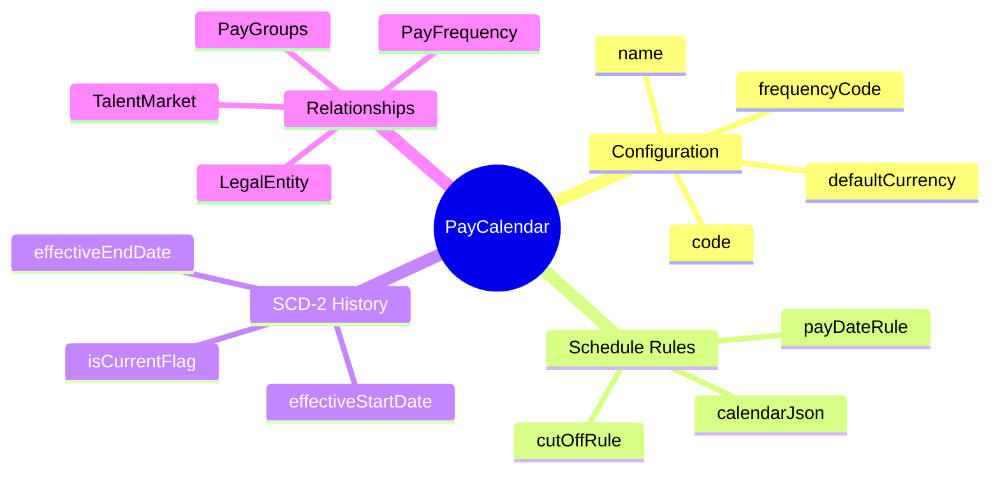
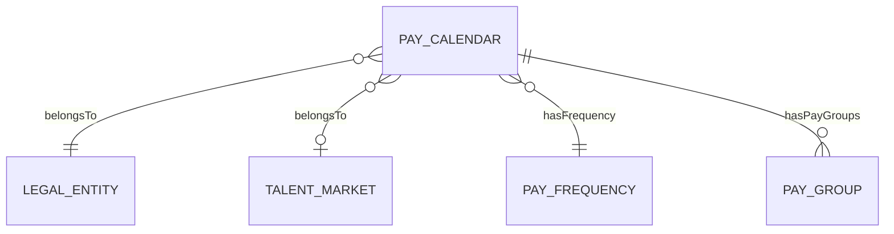
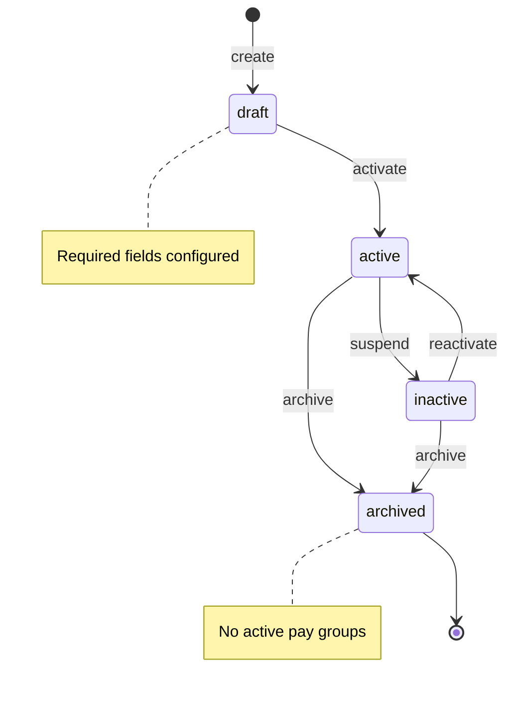

# PayCalendar

## Overview



**PayCalendar** (Lịch trả lương) định nghĩa một lịch trình trả lương hoàn chỉnh cho một legal entity và market cụ thể. Đây là aggregate root quản lý các pay periods, cut-off dates, và pay dates theo tần suất đã định.

## Business Context

### Key Stakeholders
- **Payroll Administrators**: Tạo và cấu hình calendars cho từng legal entity/market
- **Payroll Managers**: Review và approve calendar setup
- **HR Operations**: Sử dụng calendar để xác định thời hạn nhập liệu
- **Finance**: Dựa vào calendar để planning cash flow

### Business Processes
This entity is central to:
- **Payroll Run Scheduling**: Xác định khi nào chạy payroll và thời hạn cut-off
- **Period Management**: Generate và quản lý các pay periods
- **Payment Timing**: Xác định ngày trả lương cho employees
- **Multi-country Operations**: Hỗ trợ các calendar khác nhau theo quốc gia

### Business Value
PayCalendar đảm bảo việc trả lương diễn ra đúng thời hạn, tuân thủ quy định lao động từng quốc gia, và cung cấp predictability cho cả employees và finance team.

## Attributes Guide

### Identification
- **id**: UUID system-generated, dùng cho internal references
- **code**: Business identifier duy nhất (ví dụ: VN-MONTHLY-2025, SG-BIWEEKLY-HQ). Không đổi sau khi tạo.

### Configuration
- **name**: Tên hiển thị thân thiện (ví dụ: "Vietnam Monthly Payroll 2025")
- **frequencyCode**: Liên kết đến PayFrequency, xác định chu kỳ (MONTHLY, BIWEEKLY, etc.)
- **calendarJson**: JSON object chứa rules phức tạp:
  ```json
  {
    "cutOffRule": "15th of each month",
    "payDateRule": "5th of next month",
    "adjustHolidays": true,
    "holidayCalendar": "VN_PUBLIC_HOLIDAYS"
  }
  ```
- **defaultCurrency**: Tiền tệ mặc định (VND, SGD, USD) cho reporting

### SCD-2 History Tracking
- **effectiveStartDate**: Ngày version này bắt đầu có hiệu lực
- **effectiveEndDate**: Ngày kết thúc (null = đang active)
- **isCurrentFlag**: True cho version hiện tại

Khi update calendar configuration, hệ thống tạo version mới với effectiveStartDate = ngày thay đổi, version cũ được close với effectiveEndDate.

## Relationships Explained



### Organizational Context
- **belongsToLegalEntity** → [[LegalEntity]]: Mỗi calendar thuộc về một legal entity (công ty con, chi nhánh). Một legal entity có thể có nhiều calendars cho các nhóm nhân viên khác nhau.

- **belongsToMarket** → [[TalentMarket]]: Xác định market/region áp dụng. Quan trọng cho compliance với local labor laws và statutory deadlines.

### Configuration
- **hasFrequency** → [[PayFrequency]]: Liên kết đến tần suất trả lương. Khi tạo calendar, frequency phải active. Sau khi frequency bị deprecated, calendar vẫn hoạt động nhưng cần migrate sang frequency mới.

### Downstream Usage
- **hasPayGroups** → [[PayGroup]]: Các pay groups sử dụng calendar này. Một calendar có thể phục vụ nhiều pay groups (ví dụ: cùng calendar cho cả HO và Factory).

## Lifecycle & Workflows



### State Definitions

| State | Business Meaning | System Impact |
|-------|------------------|---------------|
| **draft** | Đang cấu hình, chưa sử dụng | Không thể assign pay groups |
| **active** | Đang hoạt động, có thể sử dụng | Pay groups có thể reference |
| **inactive** | Tạm ngưng, không nhận thêm | Giữ nguyên data, không assign mới |
| **archived** | Đã kết thúc, chỉ cho historical | Read-only, không thể reactivate |

### Transition Workflows

#### Draft → Active (activate)
**Trigger**: Calendar đã cấu hình đầy đủ, sẵn sàng sử dụng
**Who**: Payroll Administrator
**Prerequisites**:
- Frequency được chọn và active
- Legal entity assigned
- Ít nhất một pay period được generate
**Process**:
1. Validate required fields
2. Generate periods nếu chưa có
3. Set status = active
4. Calendar có thể được assign cho pay groups

#### Active → Inactive (suspend)
**Trigger**: Cần tạm ngưng calendar (restructure, compliance issue)
**Who**: Payroll Manager
**Process**:
1. Set status = inactive
2. Existing pay groups vẫn hoạt động
3. Không cho phép assign thêm pay groups mới

#### Any → Archived (archive)
**Trigger**: Calendar không còn sử dụng
**Who**: Payroll Director
**Prerequisites**: Không còn pay groups active đang sử dụng
**Process**:
1. Verify no active pay groups
2. Set status = archived
3. Calendar chuyển sang read-only

## Actions & Operations

### create
**Who**: Payroll Administrator
**When**: Cần thiết lập calendar cho legal entity/market mới
**Required**: code, name, frequencyCode, legalEntityId, effectiveStartDate

**Downstream effects**:
- Calendar ở trạng thái draft
- Cần configure thêm trước khi activate

### generatePeriods
**Who**: Payroll Administrator
**When**: Tạo danh sách pay periods cho năm tài chính
**Input**: fiscalYear (ví dụ: 2025)

**Process**:
1. Dựa vào frequency.periodDays, tính toán periods
2. Apply calendarJson rules cho cut-off và pay dates
3. Adjust cho holidays nếu configured
4. Generate PayPeriod records

**Example Output** (MONTHLY calendar):
| Period | Start | End | Cut-off | Pay Date |
|--------|-------|-----|---------|----------|
| 2025-01 | Jan 1 | Jan 31 | Jan 15 | Feb 5 |
| 2025-02 | Feb 1 | Feb 28 | Feb 15 | Mar 5 |
| ... | ... | ... | ... | ... |

### update
**Who**: Payroll Administrator
**When**: Cần thay đổi configuration
**Note**: Tạo SCD2 version mới, version cũ được close

## Business Rules

### Data Integrity

#### Unique Code (uniqueCode)
**Rule**: Mã calendar phải duy nhất trong toàn hệ thống.
**Reason**: Code là identifier chính cho integrations và reporting.
**Violation**: System chặn tạo với error.

#### Valid Frequency (validFrequency)
**Rule**: Frequency code phải tồn tại và ở trạng thái active.
**Reason**: Đảm bảo calendar sử dụng frequency hợp lệ.
**Violation**: System chặn với error "Invalid or inactive frequency".

#### Effective Date Order (effectiveDateOrder)
**Rule**: Ngày kết thúc phải sau ngày bắt đầu (nếu có).
**Reason**: Logic integrity cho SCD2 versioning.
**Violation**: System chặn với error.

### Business Constraints

#### Archive Guard (archiveGuard)
**Rule**: Không thể archive calendar nếu còn pay groups đang active.
**Reason**: Đảm bảo không orphan pay groups.
**Handling**: Phải migrate pay groups sang calendar khác trước khi archive.

## Examples

### Example 1: Vietnam Monthly Calendar
- **code**: VN-MONTHLY-2025
- **name**: Vietnam Monthly Payroll 2025
- **frequencyCode**: MONTHLY
- **legalEntity**: VNG Corporation
- **market**: Vietnam
- **calendarJson**:
  ```json
  {
    "cutOffRule": "15th of each month",
    "payDateRule": "5th of next month",
    "adjustHolidays": true
  }
  ```
- **defaultCurrency**: VND
- **status**: active

### Example 2: Singapore Biweekly Calendar
- **code**: SG-BIWEEKLY-2025
- **name**: Singapore Biweekly Payroll 2025
- **frequencyCode**: BIWEEKLY
- **legalEntity**: VNG Singapore Pte Ltd
- **market**: Singapore
- **calendarJson**:
  ```json
  {
    "payDayOfWeek": "Friday",
    "cutOffDaysBeforePay": 3
  }
  ```
- **defaultCurrency**: SGD
- **status**: active

## Edge Cases & Exceptions

### Mid-Year Calendar Change
**Situation**: Cần thay đổi calendar rules giữa năm.
**Handling**: 
- Tạo SCD2 version mới với effectiveStartDate = ngày thay đổi
- Periods từ ngày đó trở đi follow rules mới
- Periods đã processed giữ nguyên

### Year-End Transition
**Situation**: Chuẩn bị calendar cho năm mới.
**Handling**:
- Có thể generate periods cho năm mới trước (Q4)
- Hoặc tạo calendar mới với code bao gồm năm (VN-MONTHLY-2026)

### Multiple Calendars per Entity
**Situation**: Legal entity cần nhiều calendars (ví dụ: HO và Factory khác ngày pay).
**Handling**: Cho phép. Mỗi pay group chọn calendar phù hợp.

## Related Entities

| Entity | Relationship | Description |
|--------|--------------|-------------|
| [[PayFrequency]] | hasFrequency | Tần suất trả lương |
| [[PayGroup]] | has many | Pay groups sử dụng calendar |
| [[LegalEntity]] | belongsTo | Legal entity sở hữu |
| [[TalentMarket]] | belongsTo | Market áp dụng |
