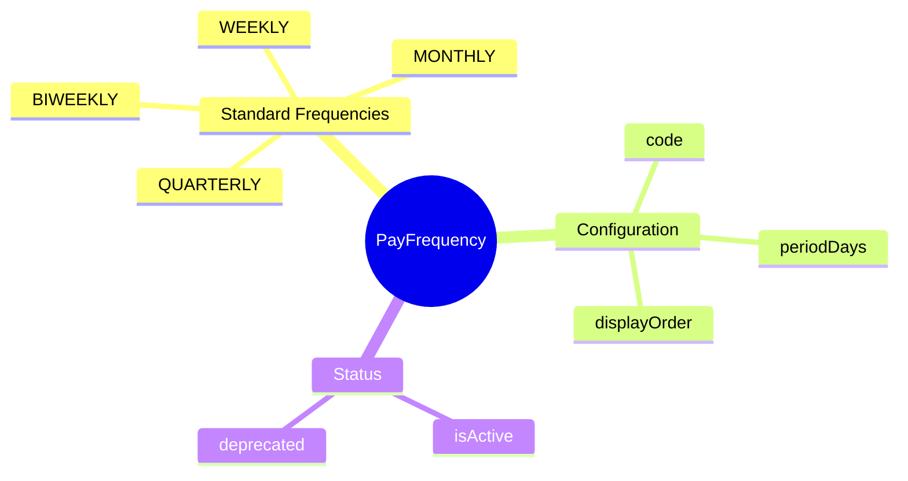
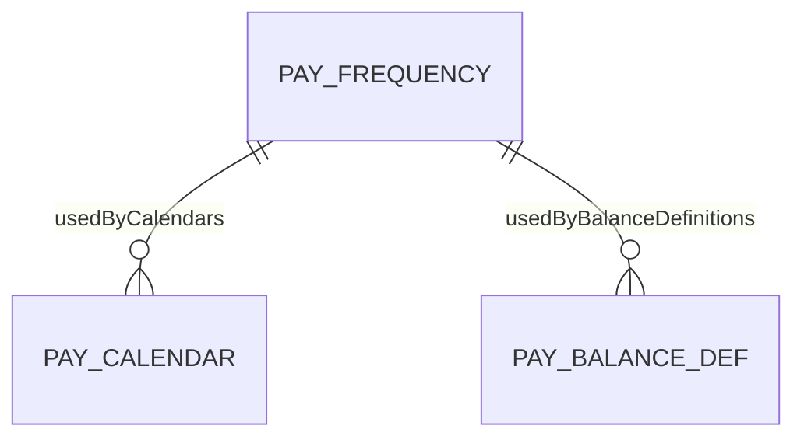
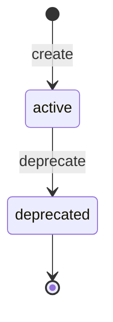

# PayFrequency

## Overview

**PayFrequency** (Tần suất trả lương) là reference data định nghĩa các chu kỳ trả lương chuẩn được hỗ trợ trong hệ thống Payroll. Đây là thành phần nền tảng để xây dựng Pay Calendar và xác định tần suất reset balance.

## Business Context

### Key Stakeholders
- **System Administrators**: Quản lý danh sách tần suất, thêm mới hoặc deprecate khi cần
- **Payroll Administrators**: Chọn tần suất khi tạo pay calendar cho từng market/legal entity
- **End Users**: Gián tiếp sử dụng thông qua pay calendar được áp dụng

### Business Processes
This entity is central to:
- **Pay Calendar Configuration**: Là thành phần bắt buộc khi tạo pay calendar
- **Balance Reset Scheduling**: Định nghĩa thời điểm reset các loại balance (QTD, YTD)
- **Payroll Standardization**: Đảm bảo tính nhất quán trong tổ chức chu kỳ trả lương

### Business Value
PayFrequency chuẩn hóa cách thức tổ chức chu kỳ trả lương, hỗ trợ tuân thủ quy định lao động của từng quốc gia và giảm thiểu lỗi cấu hình.

## Attributes Guide

### Identification
- **code**: Mã định danh duy nhất cho tần suất (ví dụ: MONTHLY, BIWEEKLY). Định dạng viết hoa, không đổi sau khi tạo. Dùng cho integrations và data imports.

### Core Information
- **name**: Tên hiển thị thân thiện (ví dụ: "Monthly - Hàng tháng"). Hiển thị trong dropdown và reports.
- **periodDays**: Số ngày trong chu kỳ. Quyết định cách generate pay periods:
  - WEEKLY = 7 ngày
  - BIWEEKLY = 14 ngày
  - MONTHLY = 30 ngày (calendar month)
  - QUARTERLY = 90 ngày

### Configuration
- **displayOrder**: Thứ tự sắp xếp trong dropdown. Tần suất phổ biến nên có order thấp để dễ chọn.
- **isActive**: Xác định tần suất có khả dụng để tạo calendar mới không. Deprecated frequencies vẫn hoạt động cho calendars đã tồn tại.

## Relationships Explained

### Usage Tracking
- **usedByCalendars** → [[PayCalendar]]: Một tần suất có thể được sử dụng bởi nhiều pay calendars. Ví dụ: MONTHLY được dùng cho Vietnam Calendar, Singapore Calendar, Japan Calendar. Khi deprecate frequency, calendars hiện tại vẫn hoạt động, nhưng không thể tạo calendar mới với frequency đó.

- **usedByBalanceDefinitions** → [[PayBalanceDefinition]]: Balance types (QTD, YTD, LTD) cần định nghĩa tần suất reset. Ví dụ: YTD_GROSS reset theo YEARLY. Lưu ý: RUN type balance không cần reset frequency.

## Lifecycle & Workflows

### State Definitions

| State | Business Meaning | System Impact |
|-------|------------------|---------------|
| **active** | Đang được sử dụng trong hệ thống | Có thể chọn khi tạo pay calendar mới |
| **deprecated** | Không còn khuyến nghị sử dụng | Ẩn khỏi dropdown tạo mới, vẫn hỗ trợ dữ liệu cũ |

### Transition Workflows

#### Active → Deprecated (deprecate)
**Trigger**: Tần suất không còn phù hợp với quy định hoặc chính sách công ty
**Who**: System Administrator
**Process**:
1. Xác nhận không có yêu cầu tạo calendar mới với frequency này
2. Trigger `deprecate` action
3. isActive chuyển thành false
4. Frequency ẩn khỏi dropdown nhưng vẫn hoạt động cho calendars cũ

**Note**: Không có transition ngược lại (deprecated → active) để đảm bảo consistency.

## Actions & Operations

### create
**Who**: System Administrator
**When**: Cần thêm tần suất trả lương mới
**Required information**: code, name, periodDays
**Process**:
1. Validate code unique và uppercase
2. Validate periodDays trong range 1-365
3. Create record với isActive = true

### update
**Who**: System Administrator
**When**: Cập nhật thông tin hiển thị
**Restrictions**: Không thể đổi code sau khi tạo
**Affects**: name, description, displayOrder

### deprecate
**Who**: System Administrator
**When**: Tần suất không còn được khuyến nghị
**Process**:
1. Set isActive = false
2. Các calendar hiện tại vẫn hoạt động
3. Không thể tạo calendar mới với frequency này

## Business Rules

### Data Integrity

#### Unique Code (uniqueCode)
**Rule**: Mỗi tần suất phải có mã duy nhất trong toàn hệ thống.
**Reason**: Code được dùng cho integrations, imports, và là identifier chính.
**Violation**: System chặn tạo/update với error "Code already exists".

#### Valid Period Range (validPeriodDays)
**Rule**: Số ngày chu kỳ phải từ 1 đến 365.
**Reason**: Chu kỳ < 1 không có nghĩa, > 365 vượt quá năm tài chính.
**Violation**: System chặn với error "Period days must be between 1 and 365".

#### Uppercase Code (uppercaseCode)
**Rule**: Mã tần suất phải viết hoa hoàn toàn.
**Reason**: Đảm bảo consistency khi search, filter, và compare.
**Violation**: Warning, system có thể tự động convert.

### Security

#### Edit Access (editAccess)
**Rule**: Chỉ System Admin và Payroll Director có quyền chỉnh sửa.
**Reason**: Reference data cần stability, tránh thay đổi tùy tiện ảnh hưởng đến nhiều calendars.
**Implementation**: Role-based access control.

## Examples

### Example 1: Monthly (Phổ biến ở Việt Nam)
- **code**: MONTHLY
- **name**: Monthly - Hàng tháng
- **periodDays**: 30
- **displayOrder**: 1
- **isActive**: true
- **Scenario**: Tần suất phổ biến nhất tại Việt Nam, trả lương vào ngày cố định mỗi tháng (thường là mùng 5 hoặc mùng 10).

### Example 2: Biweekly (Phổ biến ở Mỹ)
- **code**: BIWEEKLY
- **name**: Biweekly - 2 tuần một lần
- **periodDays**: 14
- **displayOrder**: 2
- **isActive**: true
- **Scenario**: Tần suất phổ biến nhất tại Mỹ (26 pay periods/year), trả lương mỗi 2 tuần vào thứ Sáu.

### Example 3: Deprecated Frequency
- **code**: DECADAL
- **name**: 10-Day Cycle
- **periodDays**: 10
- **displayOrder**: 99
- **isActive**: false
- **Scenario**: Tần suất cũ không còn được sử dụng. Không hiển thị trong dropdown nhưng vẫn còn lịch sử data.

## Edge Cases & Exceptions

### Custom Frequencies
**Situation**: Công ty cần tần suất đặc biệt không có sẵn.
**Handling**: System Admin tạo frequency mới với periodDays phù hợp. Cần verify logic với country-specific labor laws.

### Calendar Month vs Fixed Days
**Situation**: MONTHLY có periodDays = 30 nhưng tháng thực tế có 28, 29, 30, hoặc 31 ngày.
**Handling**: PayCalendar sử dụng logic calendar month thực tế, periodDays chỉ là giá trị tham khảo. Pay dates được adjust theo calendar.

## Related Entities

| Entity | Relationship | Description |
|--------|--------------|-------------|
| [[PayCalendar]] | usedBy (1:N) | Calendars sử dụng tần suất này |
| [[PayBalanceDefinition]] | usedBy (1:N) | Balance definitions với reset frequency |
