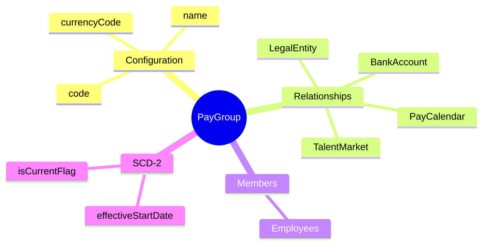
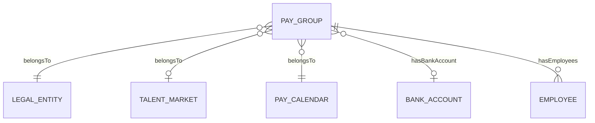
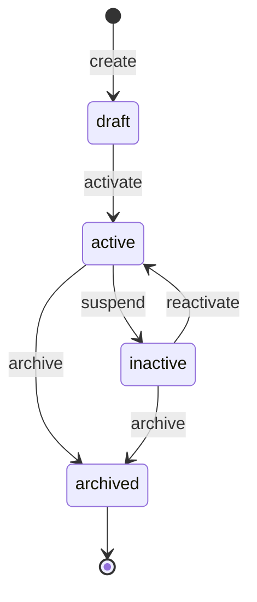

# PayGroup

## Overview

**PayGroup** (Nhóm trả lương) nhóm các nhân viên có cùng đặc điểm payroll: cùng calendar, cùng currency, cùng bank account trả lương. Đây là đơn vị cơ bản để thực hiện payroll runs và quản lý payment processing.

## Business Context

### Key Stakeholders
- **Payroll Administrators**: Tạo và quản lý pay groups, assign employees
- **Payroll Processors**: Chạy payroll theo pay group
- **Finance**: Monitor payments theo pay group
- **HR**: Gán nhân viên vào pay group khi onboarding

### Business Processes
This entity is central to:
- **Payroll Processing**: Payroll runs được thực hiện theo pay group
- **Employee Assignment**: Nhân viên được gán vào pay group khi hire/transfer
- **Payment Batching**: Payment files được generate theo pay group và bank account
- **Multi-currency Operations**: Hỗ trợ trả lương theo nhiều loại tiền

### Business Value
PayGroup tối ưu hóa payroll processing bằng cách nhóm employees có cùng đặc điểm, giúp streamline payments và đơn giản hóa reconciliation.

## Attributes Guide

### Identification
- **id**: UUID system-generated
- **code**: Business identifier (ví dụ: VN-HQ-OFFICE, SG-FACTORY). Thường combine market + location + employee type.

### Configuration
- **name**: Tên hiển thị (ví dụ: "Vietnam Head Office Staff")
- **currencyCode**: Tiền tệ trả lương (VND, USD, SGD). Phải consistent với calendar và employees trong group.

### SCD-2 History
- **effectiveStartDate/EndDate**: Versioning cho configuration changes
- **isCurrentFlag**: Active version indicator

## Relationships Explained

### Organizational Context
- **belongsToLegalEntity** → [[LegalEntity]]: Mỗi pay group thuộc một legal entity. Quan trọng cho legal compliance và financial reporting.

- **belongsToMarket** → [[TalentMarket]]: Market xác định statutory rules áp dụng (tax rates, social insurance, etc.)

### Payroll Configuration
- **belongsToCalendar** → [[PayCalendar]]: Xác định pay schedule (khi nào cut-off, khi nào pay). Tất cả employees trong group follow cùng schedule.

- **hasBankAccount** → [[BankAccount]]: Default bank account cho việc tạo payment files. Có thể override ở employee level.

### Employee Assignment
- **hasEmployees** → [[Employee]]: Nhân viên thuộc pay group này. Một employee chỉ thuộc một pay group tại một thời điểm.

## Lifecycle & Workflows

### State Definitions

| State | Business Meaning | System Impact |
|-------|------------------|---------------|
| **draft** | Đang setup, chưa sử dụng | Không thể assign employees |
| **active** | Hoạt động, có thể process payroll | Có thể assign/run payroll |
| **inactive** | Tạm ngưng | Giữ employees nhưng không run mới |
| **archived** | Đã đóng | Read-only, historical |

### Transition Workflows

#### Draft → Active (activate)
**Trigger**: Pay group sẵn sàng sử dụng
**Who**: Payroll Administrator
**Prerequisites**:
- Calendar được assign và active
- Bank account configured (optional)

#### Active → Archived (archive)
**Trigger**: Pay group không còn sử dụng
**Who**: Payroll Manager
**Prerequisites**: Không còn employees assigned
**Process**:
1. Verify no employees
2. Set status = archived
3. Pay group trở thành read-only

## Actions & Operations

### create
**Who**: Payroll Administrator
**Required**: code, name, legalEntityId, calendarId, currencyCode, effectiveStartDate

### assignEmployee
**Who**: HR Administrator, Payroll Admin
**When**: Onboarding hoặc transfer
**Process**:
1. Verify employee chưa thuộc pay group khác (trong cùng period)
2. Create assignment record
3. Employee sẽ được include trong payroll runs của group này

### removeEmployee
**Who**: HR Administrator, Payroll Admin
**When**: Termination, transfer sang group khác
**Note**: Nên assign vào group mới trước khi remove khỏi group cũ (nếu transfer)

## Business Rules

### Data Integrity

#### Unique Code (uniqueCode)
**Rule**: Mã pay group phải duy nhất.
**Reason**: Identifier cho payroll runs và reporting.

#### Valid Calendar (validCalendar)
**Rule**: Calendar được reference phải ở trạng thái active.
**Reason**: Đảm bảo pay schedule hợp lệ.

### Business Constraints

#### Currency Match (currencyMatch)
**Rule**: Currency của pay group nên match với calendar.defaultCurrency.
**Reason**: Consistency trong processing và reporting.
**Note**: Warning only, có thể override cho special cases.

#### Archive Guard (archiveGuard)
**Rule**: Không thể archive nếu còn employees assigned.
**Reason**: Tránh orphan employees.
**Handling**: Transfer employees trước khi archive.

## Examples

### Example 1: Vietnam Head Office
- **code**: VN-HQ-STAFF
- **name**: Vietnam Head Office Staff
- **legalEntity**: VNG Corporation
- **market**: Vietnam
- **calendar**: VN-MONTHLY-2025
- **currencyCode**: VND
- **bankAccount**: Vietcombank Main Account
- **employees**: ~500

### Example 2: Singapore Contractors
- **code**: SG-CONTRACTORS
- **name**: Singapore Contractors
- **legalEntity**: VNG Singapore Pte Ltd
- **market**: Singapore
- **calendar**: SG-BIWEEKLY-2025
- **currencyCode**: SGD
- **bankAccount**: DBS Singapore
- **employees**: ~20

## Edge Cases & Exceptions

### Employee Transfer Between Groups
**Situation**: Nhân viên chuyển từ VN-HQ-STAFF sang VN-FACTORY.
**Handling**:
1. Hoàn thành payroll current period với group cũ
2. Effective từ period tiếp theo, assign vào group mới
3. Giữ history ở cả hai groups

### Multiple Pay Groups per Entity
**Situation**: Một legal entity có nhiều pay groups (Office, Factory, Expats).
**Handling**: Bình thường. Mỗi group có calendar riêng hoặc share calendar.

### Currency Mismatch
**Situation**: Employee international cần pay bằng currency khác với group.
**Handling**: Xử lý ở employee level, không phải group level. Hoặc tạo dedicated pay group cho expats.

## Related Entities

| Entity | Relationship | Description |
|--------|--------------|-------------|
| [[PayCalendar]] | belongsTo | Lịch trả lương áp dụng |
| [[LegalEntity]] | belongsTo | Legal entity sở hữu |
| [[TalentMarket]] | belongsTo | Market áp dụng |
| [[BankAccount]] | has | Bank account mặc định |
| [[Employee]] | has many | Nhân viên trong group |
