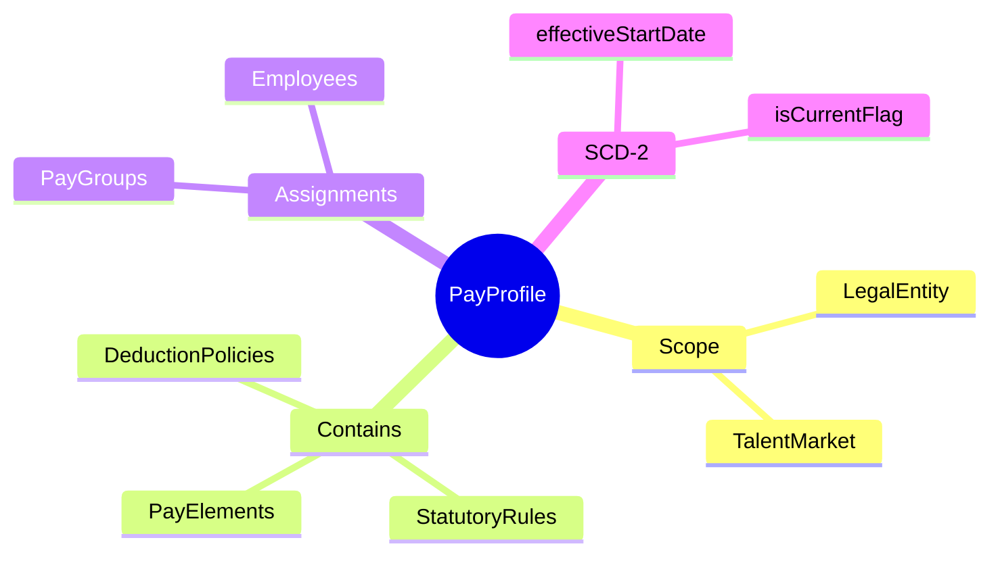
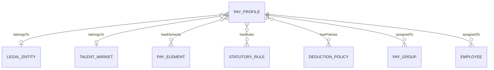
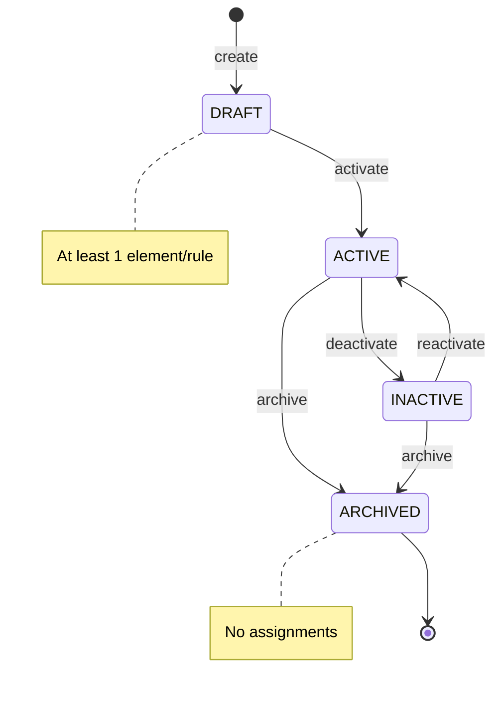

# PayProfile

## Overview

**PayProfile** (Profile Payroll) là một bundle/package chứa các policies, rules, và elements payroll. Profile cho phép gắn một tập hợp cấu hình payroll đã định nghĩa sẵn cho pay groups hoặc employees cụ thể, thay vì phải configure từng thành phần riêng lẻ.

## Business Context

### Key Stakeholders
- **Payroll Directors**: Define và approve profiles cho từng market/employee type
- **Payroll Administrators**: Assign profiles cho pay groups hoặc employees
- **Compliance Team**: Review profiles đảm bảo statutory compliance
- **HR Business Partners**: Request profile changes cho employee groups

### Business Processes
This entity is central to:
- **Policy Bundling**: Nhóm các rules, elements, policies thành một package
- **Dynamic Configuration**: Cho phép thay đổi payroll configuration mà không modify từng pay element
- **Multi-market Operations**: Tạo profiles khác nhau cho từng market với statutory rules riêng
- **Employee Type Management**: Profiles khác nhau cho full-time, contractors, executives

### Business Value
PayProfile đơn giản hóa việc quản lý payroll configuration, đảm bảo consistency, và cho phép quick deployment của policy changes cho multiple pay groups cùng lúc.

## Attributes Guide

### Identification
- **id**: UUID system-generated
- **code**: Business identifier (ví dụ: VN-STANDARD, SG-EXECUTIVE, US-CONTRACTOR)

### Configuration
- **name**: Tên mô tả (ví dụ: "Vietnam Standard Payroll Profile")
- **description**: Chi tiết về profile, khi nào sử dụng, applicable employee types
- **statusCode**: Trạng thái lifecycle (DRAFT → ACTIVE → INACTIVE/ARCHIVED)
- **metadata**: JSON object cho additional configuration không fit vào fixed fields

### SCD-2 History
- **effectiveStartDate/EndDate**: Version management
- **isCurrentFlag**: Active version indicator

## Relationships Explained

### Scope Definition
- **belongsToLegalEntity** → [[LegalEntity]]: Profile applicable cho legal entity cụ thể. Null = profile có thể dùng globally.

- **belongsToMarket** → [[TalentMarket]]: Market xác định statutory rules mặc định. Vietnam profile khác Singapore profile.

### Configuration Content
- **hasElements** → [[PayElement]]: Pay elements (earnings, deductions) được include. Ví dụ: profile có thể include "Basic Salary", "OT Allowance", "Social Insurance" elements.

- **hasRules** → [[StatutoryRule]]: Statutory rules áp dụng. Ví dụ: Vietnam Tax Rules, Vietnam Social Insurance Rules.

- **hasPolicies** → [[DeductionPolicy]]: Deduction policies. Ví dụ: Loan Deduction Policy, Union Fee Policy.

### Assignment
- **assignedToPayGroups** → [[PayGroup]]: Pay groups sử dụng profile này. All employees trong group inherit profile.

- **assignedToEmployees** → [[Employee]]: Direct assignment cho employees cụ thể (override pay group default).

## Lifecycle & Workflows

### State Definitions

| State | Business Meaning | System Impact |
|-------|------------------|---------------|
| **DRAFT** | Đang configure, chưa sử dụng | Không thể assign |
| **ACTIVE** | Hoạt động, có thể assign | Có thể assign cho pay groups/employees |
| **INACTIVE** | Tạm ngưng | Giữ assignments nhưng không cho assign mới |
| **ARCHIVED** | Đã đóng | Read-only, historical |

### Transition Workflows

#### Draft → Active (activate)
**Trigger**: Profile configuration hoàn tất
**Who**: Payroll Director
**Prerequisites**: Ít nhất 1 element hoặc rule được add
**Process**:
1. Validate có content
2. Set statusCode = ACTIVE
3. Profile có thể assign

#### Active → Inactive (deactivate)
**Trigger**: Cần freeze profile tạm thời
**Who**: Payroll Director
**Effect**: Existing assignments vẫn hoạt động, không cho assign mới

#### Any → Archived (archive)
**Prerequisites**: Không còn pay groups hoặc employees đang dùng
**Effect**: Profile chuyển read-only

## Actions & Operations

### create
**Who**: Payroll Director
**Required**: code, name, effectiveStartDate

### addElement / removeElement
**Who**: Payroll Administrator
**When**: Configure elements cho profile
**Note**: Thay đổi apply cho tất cả pay groups/employees đang dùng profile

### addRule / addPolicy
**Who**: Payroll Administrator
**When**: Configure statutory rules hoặc deduction policies

### cloneProfile
**Who**: Payroll Director
**When**: Cần tạo variant của profile (ví dụ: tạo VN-EXECUTIVE từ VN-STANDARD)
**Process**:
1. Copy all elements, rules, policies
2. Assign new code và name
3. New profile ở DRAFT status

## Business Rules

### Data Integrity

#### Unique Code (uniqueCode)
**Rule**: Mã profile phải duy nhất.
**Reason**: Identifier cho assignment và reporting.

#### Active Requirement (activeRequirement)
**Rule**: Profile active phải có content (ít nhất 1 element hoặc rule).
**Reason**: Tránh assign empty profile.

### Business Constraints

#### Archive Guard (archiveGuard)
**Rule**: Không thể archive nếu còn assignments.
**Reason**: Tránh orphan pay groups/employees.
**Handling**: Migrate assignments trước khi archive.

## Examples

### Example 1: Vietnam Standard Profile
- **code**: VN-STANDARD
- **name**: Vietnam Standard Payroll Profile
- **legalEntity**: VNG Corporation
- **market**: Vietnam
- **status**: ACTIVE
- **elements**: Basic Salary, OT Allowance, Transportation Allowance, Social Insurance, PIT
- **rules**: VN Tax Rules 2025, VN Social Insurance Rules
- **assignedTo**: VN-HQ-STAFF, VN-FACTORY pay groups

### Example 2: Singapore Executive Profile
- **code**: SG-EXECUTIVE
- **name**: Singapore Executive Compensation Profile
- **legalEntity**: VNG Singapore Pte Ltd
- **market**: Singapore
- **status**: ACTIVE
- **elements**: Base Salary, Performance Bonus, Stock Options, CPF
- **rules**: SG Tax Rules, CPF Rules
- **assignedTo**: Selected executive employees directly

### Example 3: Global Contractor Profile
- **code**: GLOBAL-CONTRACTOR
- **name**: Global Contractor Profile
- **legalEntity**: null (global)
- **market**: null (all markets)
- **status**: ACTIVE
- **elements**: Contract Payment, Withholding Tax
- **rules**: Basic withholding rules per market
- **assignedTo**: All contractor pay groups

## Edge Cases & Exceptions

### Profile Override at Employee Level
**Situation**: Một employee cần profile khác với pay group default.
**Handling**: Assign profile trực tiếp cho employee. Employee-level assignment takes precedence over pay group default.

### Profile Changes Mid-Period
**Situation**: Profile được update khi payroll period đang chạy.
**Handling**: 
- SCD2 version mới được tạo
- Payroll runs in progress dùng version cũ
- Runs mới dùng version mới

### Multiple Profile Inheritance
**Situation**: Employee có cả group-level và employee-level profile?
**Handling**: Employee-level profile override hoàn toàn, không merge.

### Empty Profile Activation
**Situation**: Cố gắng activate profile không có elements/rules.
**Handling**: System block với error "Profile must have at least one element or rule".

## Related Entities

| Entity | Relationship | Description |
|--------|--------------|-------------|
| [[PayElement]] | has many (M:N) | Pay elements trong profile |
| [[StatutoryRule]] | has many (M:N) | Statutory rules áp dụng |
| [[DeductionPolicy]] | has many (M:N) | Deduction policies |
| [[PayGroup]] | assigned to (1:N) | Pay groups sử dụng profile |
| [[Employee]] | assigned to (1:N) | Employees với direct assignment |
| [[LegalEntity]] | belongsTo | Legal entity scope |
| [[TalentMarket]] | belongsTo | Market scope |
