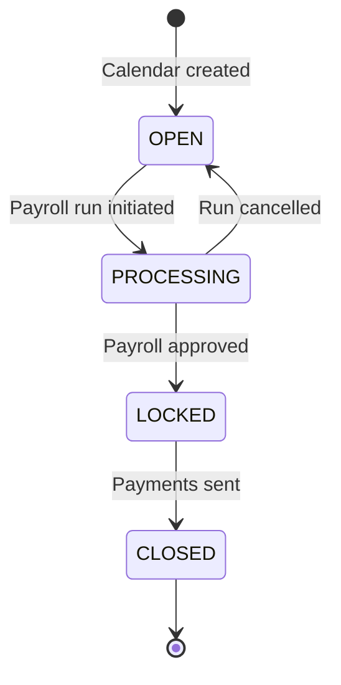
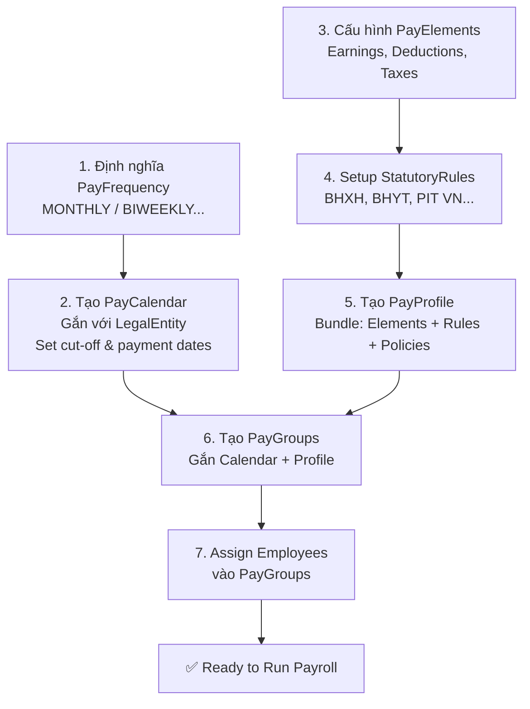

# Payroll Structure — Cấu trúc Lịch & Nhóm Lương

**Phiên bản**: 1.0 · **Cập nhật**: 2026-03-06  
**Đối tượng**: HR Admin, Payroll Admin  
**Thời gian đọc**: ~20 phút

---

## Tổng quan

Trước khi tính lương, doanh nghiệp cần thiết lập **khung cấu trúc** xác định: khi nào trả lương (PayFrequency + PayCalendar), ai được xử lý cùng nhau (PayGroup), và áp dụng chính sách gì (PayProfile).

Bốn entities này tạo thành **Structure Layer** của PR module — tầng nền không thay đổi thường xuyên nhưng ảnh hưởng đến toàn bộ engine tính lương.

```
PayFrequency → PayCalendar → PayGroup → [Employee Assignment]
                                         ↑
                                    PayProfile (policies, elements, rules)
```

---

## 1. PayFrequency — Tần suất Trả lương

**PayFrequency** là reference data định nghĩa chu kỳ trả lương chuẩn. Đây là tham số cơ bản nhất ảnh hưởng đến cách hệ thống tạo PayCalendar và tính pro-rata.

### Các frequency được hỗ trợ

| Code | Tên | Kỳ trả lương | Phổ biến tại |
|------|-----|-------------|--------------|
| `MONTHLY` | Hàng tháng | 1 lần/tháng | VN, SG, EU |
| `BIWEEKLY` | 2 tuần/lần | 26 kỳ/năm | US, Canada |
| `SEMIMONTHLY` | Nửa tháng | 24 kỳ/năm (1 & 15) | US, Philippines |
| `WEEKLY` | Hàng tuần | 52 kỳ/năm | UK, Australia |
| `DAILY` | Hàng ngày | Per working day | Hourly workers |

### Ứng dụng thực tế

```
Doanh nghiệp VN thông thường: MONTHLY
→ Trả lương tháng, cut-off ngày 25, payment ngày 1 tháng sau

Doanh nghiệp có văn phòng US: BIWEEKLY
→ 26 kỳ/năm, mỗi kỳ 2 tuần, Friday payment

Công nhân nhà máy theo ca: WEEKLY
→ Trả hàng tuần theo giờ công thực tế
```

### Ảnh hưởng đến Pro-rata Calculation

PayFrequency xác định `standardWorkDays` dùng trong công thức pro-rata:

```
# Pro-rata formula tự động dùng frequency config
element PRORATED_SALARY =
  proRata(BASE_SALARY, ACTUAL_WORK_DAYS, STANDARD_WORK_DAYS)

# STANDARD_WORK_DAYS được lookup từ PayFrequency:
# MONTHLY → 22 ngày (working days)
# BIWEEKLY → 10 ngày
# WEEKLY → 5 ngày
```

---

## 2. PayCalendar — Lịch Trả lương

**PayCalendar** là AGGREGATE_ROOT quan trọng nhất trong Structure Layer. Nó định nghĩa chính xác timeline của từng kỳ lương: khi nào cut-off, khi nào payment date, khi nào lock.

### Cấu trúc PayCalendar

```
PayCalendar {
  calendarCode: String          // VN-MONTHLY-2025
  calendarName: String          // Vietnam Monthly 2025
  legalEntity: LegalEntity      // Gắn với pháp nhân cụ thể
  talentMarket: TalentMarket    // Country context (VN, SG...)
  frequency: PayFrequency       // MONTHLY, BIWEEKLY...
  
  periods: [PayPeriod] {
    periodCode: String          // 2025-01, 2025-02...
    startDate: Date             // 2025-01-01
    endDate: Date               // 2025-01-31
    cutoffDate: Date            // 2025-01-25 (cuối ngày nhập liệu T&A)
    paymentDate: Date           // 2025-02-01 (ngày tiền vào tài khoản)
    status: Enum                // OPEN | PROCESSING | LOCKED | CLOSED
  }
}
```

### PayPeriod Lifecycle



| Status | Ý nghĩa | Hành động cho phép |
|--------|---------|-------------------|
| **OPEN** | Kỳ đang mở, nhận dữ liệu | Import T&A, chạy Dry Run, Simulation |
| **PROCESSING** | Đang trong quá trình chạy | Xem trạng thái, cancel run |
| **LOCKED** | Đã duyệt, chờ thanh toán | Xem kết quả, xuất bank file, tạo GL entries |
| **CLOSED** | Đã hoàn tất | Chỉ xem — không sửa, không retroactive mới |

### Multi-Calendar Setup

Một doanh nghiệp có thể có nhiều PayCalendar song song:

```
VNG Corporation
├── VN-MONTHLY-2025 (Legal Entity: VNG, Frequency: MONTHLY)
│   ├── 2025-01: Open (cut-off 25/1, payment 1/2)
│   ├── 2025-02: Locked
│   └── ...
├── SG-MONTHLY-2025 (Legal Entity: VNG Singapore, MONTHLY)
│   └── SGD amounts, SG statutory rules
└── US-BIWEEKLY-2025 (Legal Entity: VNG US Inc, BIWEEKLY)
    └── USD amounts, US federal + state tax rules
```

> **Thiết kế quan trọng**: PayCalendar gắn với LegalEntity — đảm bảo mỗi pháp nhân có lịch lương độc lập, áp dụng đúng currency và statutory rules của thị trường đó.

---

## 3. PayGroup — Nhóm Nhân viên

**PayGroup** là ENTITY nhóm các employee có cùng đặc điểm payroll xử lý — cùng lịch lương, cùng currency, thường cùng profile.

### Tiêu chí phân nhóm

PayGroup thường được tạo theo một hoặc kết hợp các tiêu chí sau:

| Tiêu chí | Ví dụ |
|---------|-------|
| Legal Entity | VNG-HQ, VNG-Singapore |
| Contract type | PERMANENT, FIXED-TERM, PROBATION |
| Employee category | STAFF, EXECUTIVE, PART-TIME |
| Location/Department | HN-HQ, HCM-OFFICE |
| Pay frequency | Nếu công ty có cả monthly và weekly |

### Ví dụ PayGroup cho doanh nghiệp VN

```
VNG Corporation — PayGroups:

VN-STAFF-MONTHLY
  ├── Calendar: VN-MONTHLY-2025
  ├── Profile: VN-STANDARD-STAFF
  ├── Members: ~2,000 nhân viên chính thức
  └── Currency: VND

VN-EXECUTIVE-MONTHLY  
  ├── Calendar: VN-MONTHLY-2025
  ├── Profile: VN-EXECUTIVE (có thêm cổ phiếu, lương gross cao)
  ├── Members: ~50 C-level & Directors
  └── Currency: VND

VN-FREELANCE-MONTHLY
  ├── Calendar: VN-MONTHLY-2025
  ├── Profile: VN-FREELANCE (thuế khoán 10%, không BHXH)
  ├── Members: ~200 cộng tác viên
  └── Currency: VND

SG-STAFF-MONTHLY
  ├── Calendar: SG-MONTHLY-2025
  ├── Profile: SG-STANDARD
  └── Currency: SGD
```

### Employee Assignment

Mỗi employee được assign vào **một** PayGroup tại một thời điểm. Khi chuyển phòng ban, thay đổi hợp đồng, hoặc chuyển entity → PayGroup assignment được update, effective date tracking đảm bảo đúng kỳ lương áp dụng.

```
Employee: Nguyen Van A
- 2024-01 to 2024-12: PayGroup = VN-STAFF-MONTHLY (nhân viên thử việc → chính thức)
- 2025-01 onwards: PayGroup = VN-EXECUTIVE-MONTHLY (thăng cấp Director)
```

---

## 4. PayProfile — Bundle Chính sách Lương

**PayProfile** là AGGREGATE_ROOT quan trọng nhất từ góc độ cấu hình. Đây là "bộ luật" áp dụng cho một nhóm nhân viên — gom tất cả pay elements, statutory rules, deduction policies vào một gói.

### Cấu trúc PayProfile

```
PayProfile {
  profileCode: String           // VN-STANDARD-STAFF
  profileName: String           // Vietnam Standard Staff Profile  
  legalEntity: LegalEntity      // Áp dụng cho pháp nhân nào
  talentMarket: TalentMarket    // VN, SG, US...
  
  payElements: [PayElement]     // Danh sách elements áp dụng
  statutoryRules: [StatutoryRule]  // BHXH, BHYT, BHTN, PIT...
  deductionPolicies: [DeductionPolicy]  // Loan, garnishment rules
  validationRules: [ValidationRule]     // Pre-run data checks
  costingRules: [CostingRule]           // Cost center allocation
}
```

### PayProfile Hierarchy

PayProfile hỗ trợ kế thừa — một profile "con" có thể extend profile cha và override một số element:

```
VN-BASE-PROFILE (template)
├── Elements: BASE_SALARY, OVERTIME, ATTENDANCE_DAYS
├── Statutory: BHXH, BHYT, BHTN, PIT_VN
│
├── VN-STANDARD-STAFF (extends VN-BASE)
│   ├── + LUNCH_ALLOWANCE, PHONE_ALLOWANCE
│   └── + MEAL_ALLOWANCE (cấu hình theo nhà máy)
│
├── VN-EXECUTIVE (extends VN-BASE)
│   ├── + EXECUTIVE_ALLOWANCE, CAR_ALLOWANCE
│   └── + REPRESENTATIVE_ALLOWANCE (không chịu thuế theo NĐ)
│
└── VN-FREELANCE (standalone — không extends)
    ├── Elements: BASE_FEE, WITHHOLDING_TAX_10PCT
    └── Statutory: (none — CTV không đóng BHXH)
```

### Thay đổi PayProfile

Khi chính sách thay đổi (ví dụ: thêm phụ cấp mới), thay vì update từng nhân viên riêng lẻ:

1. Admin thêm element mới vào PayProfile
2. Tất cả nhân viên trong PayGroup sử dụng profile đó tự động nhận element mới
3. Effective date control: áp dụng từ kỳ lương nào

---

## 5. Toàn bộ Configuration Flow



### Checklist trước khi chạy payroll lần đầu

- [ ] Tất cả LegalEntity đã có PayCalendar với đủ PayPeriods cho năm
- [ ] Mỗi PayGroup có PayProfile phù hợp (đúng statutory rules theo country)
- [ ] Tất cả employee active đã được assign vào đúng PayGroup
- [ ] PayElements trong Profile đã có formula được approve
- [ ] CutoffDate của kỳ hiện tại chưa qua (T&A data còn update được)

---

## 6. Multi-Company, Multi-Country Setup

### Trường hợp tập đoàn nhiều pháp nhân

```
Tập đoàn ABC (holding)
│
├── ABC Vietnam (VND, VN Labor Law)
│   ├── Calendar: VN-MONTHLY-2025 (payment: mùng 1 hàng tháng)
│   ├── PayGroups: VN-STAFF, VN-MANAGER, VN-PROBATION, VN-FREELANCE
│   └── Statutory: BHXH 8%, BHYT 1.5%, BHTN 1%, PIT 7-bracket
│
├── ABC Singapore (SGD, Singapore MOM regulations)
│   ├── Calendar: SG-MONTHLY-2025 (payment: ngày 25 hàng tháng)
│   ├── PayGroups: SG-LOCAL, SG-EP (Employment Pass)
│   └── Statutory: CPF (Central Provident Fund) rules
│
└── ABC USA (USD, Federal + State tax)
    ├── Calendar: US-BIWEEKLY-2025 (payment: Friday)
    ├── PayGroups: US-EXEMPT (salaried), US-NONEXEMPT (hourly)
    └── Statutory: Federal income tax, FICA (Social Security + Medicare)
```

---

## 7. Quan hệ với các Module khác

| Module | Tương tác |
|--------|----------|
| **CO (Core HR)** | LegalEntity, TalentMarket lấy từ CO — Payroll không tự quản lý org structure |
| **CO Employee** | Employee record dùng để assign vào PayGroup — payroll dùng employment data |
| **FIN (Finance)** | BankAccount của PayGroup/Employee dùng cho payment instruction |
| **TA (Time & Absence)** | Attendance data import trước cutoffDate để tính pro-rata và overtime |

---

*← [01 Executive Summary](./01-executive-summary.md) · [03 Pay Elements & Formula →](./03-pay-elements-formula.md)*
