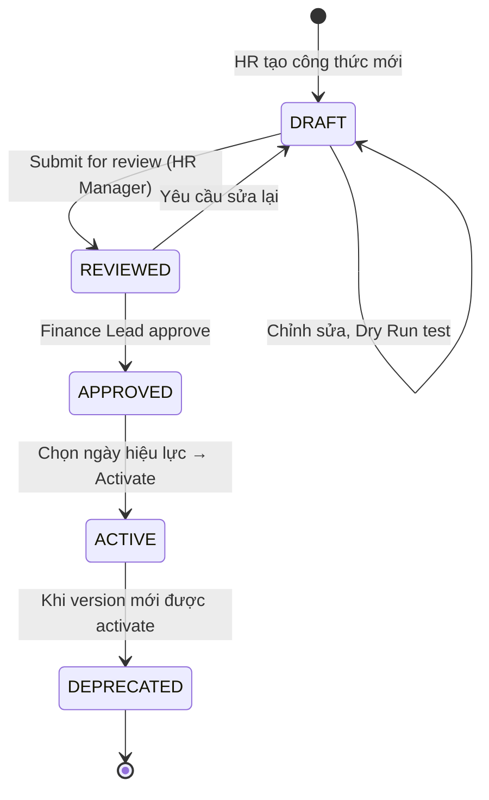

# Pay Elements & Formula Engine — Trái tim của Payroll

**Phiên bản**: 1.0 · **Cập nhật**: 2026-03-06  
**Đối tượng**: HR Admin, Payroll Admin, Finance  
**Thời gian đọc**: ~25 phút

---

## Tổng quan

**PayElement** là đơn vị nguyên tử của payroll — mỗi khoản thu nhập, khấu trừ, hay thuế đều là một PayElement. **PayFormula** là "bộ não" tính toán giá trị cho từng element. Hai khái niệm này tạo thành Elements Layer, là nơi toàn bộ logic nghiệp vụ của payroll được định nghĩa.

```
PayElement (WHAT to calculate)
    └── PayFormula (HOW to calculate)
            └── Uses: PayBalanceDefinition (WHERE to accumulate results)
```

---

## 1. PayElement — Thành phần Lương

### 1.1 Taxonomy (5 loại)

| Type | Ý nghĩa | Ảnh hưởng | Ví dụ |
|------|---------|-----------|-------|
| **EARNING** | Thu nhập — cộng vào gross | (+) Gross Salary | BASE_SALARY, OVERTIME, LUNCH_ALLOWANCE |
| **DEDUCTION** | Khấu trừ — trừ khỏi net | (−) Net Salary | BHXH_EMPLOYEE, LOAN_REPAYMENT, ADVANCE |
| **TAX** | Thuế thu nhập — loại deduction đặc biệt | (−) Net Salary | PIT_TAX |
| **EMPLOYER_CONTRIBUTION** | Đóng góp của công ty — không ảnh hưởng net nhân viên | Thêm vào cost | BHXH_EMPLOYER, BHYT_EMPLOYER |
| **INFORMATIONAL** | Thông tin — không tính tiền | Hiển thị trên payslip | ACTUAL_WORK_DAYS, YTD_GROSS |

### 1.2 Cấu trúc PayElement

```
PayElement {
  code: String              // BASE_SALARY, BHXH_EMPLOYEE, PIT_TAX...
  name: String              // Lương cơ bản, BHXH nhân viên đóng...
  type: Enum                // EARNING | DEDUCTION | TAX | EMPLOYER_CONTRIBUTION | INFORMATIONAL
  
  formula: PayFormula?      // Công thức tính toán (null nếu nhập manual)
  statutoryRule: StatutoryRule?  // Liên kết quy định pháp lý nếu có
  
  // Ràng buộc giá trị
  ceiling: Decimal?         // Trần (không được vượt quá)
  floor: Decimal?           // Sàn (không được nhỏ hơn)
  
  // Phạm vi áp dụng
  countryCode: String       // VN | SG | US | * (global)
  effectiveDate: Date       // Ngày bắt đầu áp dụng
  expiryDate: Date?         // Ngày hết hiệu lực (null = vô thời hạn)
  
  // Payslip display
  showOnPayslip: Boolean    // Hiển thị trên payslip không?
  displayOrder: Integer     // Thứ tự hiển thị
}
```

### 1.3 Dependency giữa các Elements

Các PayElement phụ thuộc vào nhau theo đồ thị dependency. Hệ thống tự động resolve thứ tự tính toán (topological sort):

```
Dependency chain điển hình cho Payroll VN:

ATTENDANCE_DAYS (INFORMATIONAL)
  └─→ PRORATED_SALARY (EARNING)
        └─→ GROSS_SALARY (aggregate EARNING)
              ├─→ BHXH_BASE (INFORMATIONAL — dùng tính BHXH)
              │     ├─→ BHXH_EMPLOYEE (DEDUCTION, 8%)
              │     ├─→ BHYT_EMPLOYEE (DEDUCTION, 1.5%)
              │     └─→ BHTN_EMPLOYEE (DEDUCTION, 1%)
              └─→ TAXABLE_INCOME (INFORMATIONAL)
                    └─→ PIT_TAX (TAX, lũy tiến 7 bậc)
                          └─→ NET_SALARY (INFORMATIONAL — final result)
```

> **Tính năng quan trọng**: Hệ thống **tự động phát hiện circular dependency** và báo lỗi rõ ràng trước khi formula được activate. Không bao giờ xảy ra vòng lặp tính toán vô hạn.

---

## 2. PayFormula — Công thức Tính toán

### 2.1 Formula Lifecycle

Mỗi công thức trải qua 5 trạng thái bắt buộc — không thể bỏ qua bất kỳ bước nào:



| State | Ai có thể thực hiện | Hành động |
|-------|-------------------|-----------|
| **DRAFT** | HR Admin, Payroll Admin | Tạo, chỉnh sửa, dry-run test |
| **REVIEWED** | HR Manager | Review nội dung, có thể reject về DRAFT |
| **APPROVED** | Finance Lead | Final approval, set activation date |
| **ACTIVE** | System | Đang dùng trong production payroll |
| **DEPRECATED** | System | Version cũ, bị thay thế bởi version mới |

> **Nguyên tắc bất biến**: Formula đang ACTIVE **không thể sửa trực tiếp**. Mọi thay đổi phải tạo version mới, đi qua toàn bộ approval workflow. Đây là yêu cầu audit và compliance.

### 2.2 Formula Versioning

Mỗi formula element có thể có nhiều version, mỗi version có effectiveDate riêng:

```
Element: BHXH_EMPLOYEE

Version 1.0 (effectiveDate: 2023-01-01, status: DEPRECATED)
  formula: min(GROSS_SALARY, 29800000) * 0.08
  -- Trần 29.8tr theo Nghị định cũ

Version 2.0 (effectiveDate: 2024-07-01, status: ACTIVE)
  formula: min(GROSS_SALARY, BHXH_CEILING) * BHXH_EMPLOYEE_RATE
  -- Dùng tham số động, tự update khi lương cơ sở thay đổi
```

Khi chạy payroll, hệ thống **tự động chọn đúng version** theo ngày của kỳ lương — không cần admin chỉ định thủ công.

---

## 3. Business DSL Layer — HR Tự Viết Công thức

### 3.1 Vấn đề cần giải quyết

Mỗi khi Nghị định mới ban hành, nếu logic tính lương nằm trong code → cần IT release, mất 1-2 sprint. HR phụ thuộc hoàn toàn vào kỹ thuật.

xTalent giải quyết bằng **Business DSL Layer**: một ngôn ngữ công thức đặc biệt, đọc được như ngôn ngữ tự nhiên / Excel formula, cho phép HR/Finance tự định nghĩa và cập nhật công thức.

### 3.2 DSL Syntax — Ví dụ thực tế

```
# ── Công thức đơn giản ──────────────────────────────────────────
element BHXH_EMPLOYEE =
  min(GROSS_SALARY, BHXH_CEILING) * BHXH_EMPLOYEE_RATE

# ── Điều kiện phân nhánh ────────────────────────────────────────
element BHXH_BASE =
  when employeeType == "PROBATION" then 0
  when contractType == "FREELANCE" then 0
  else min(GROSS_SALARY, BHXH_CEILING)

# ── Hàm built-in: thuế lũy tiến ────────────────────────────────
element PIT_TAX =
  progressiveTax(TAXABLE_INCOME, TAX_BRACKET_VN_2024)

# ── Pro-rata theo ngày làm việc ─────────────────────────────────
element PRORATED_BASE_SALARY =
  proRata(BASE_SALARY, ACTUAL_WORK_DAYS, STANDARD_WORK_DAYS)

# ── Phụ cấp theo điều kiện phức tạp ────────────────────────────
element REGION_ALLOWANCE =
  when department == "SALES" && talentMarket == "HN" then BASE_SALARY * 0.15
  when department == "SALES" && talentMarket == "HCM" then BASE_SALARY * 0.12
  when seniority >= 5 then BASE_SALARY * 0.10
  else BASE_SALARY * 0.05

# ── Tổng hợp nhiều elements ─────────────────────────────────────
element GROSS_SALARY =
  sumElements(["BASE_SALARY", "OVERTIME", "LUNCH_ALLOWANCE", 
               "PHONE_ALLOWANCE", "REGION_ALLOWANCE"])

# ── Tính thu nhập chịu thuế ─────────────────────────────────────
element TAXABLE_INCOME =
  GROSS_SALARY
  - BHXH_EMPLOYEE
  - BHYT_EMPLOYEE  
  - BHTN_EMPLOYEE
  - PERSONAL_DEDUCTION    # 11,000,000 VND
  - DEPENDENT_DEDUCTION   # 4,400,000 × số người phụ thuộc
  - ifNull(OTHER_DEDUCTION, 0)
```

### 3.3 Thư viện Hàm Built-in

| Hàm | Mô tả | Ví dụ |
|-----|-------|-------|
| `min(a, b)` | Giá trị nhỏ hơn | `min(GROSS, BHXH_CEILING)` |
| `max(a, b)` | Giá trị lớn hơn | `max(OT_PAY, 0)` |
| `round(value, digits)` | Làm tròn số | `round(PIT_TAX, 0)` |
| `progressiveTax(income, brackets)` | Thuế lũy tiến theo bảng | `progressiveTax(TAXABLE, VN_BRACKETS)` |
| `proRata(salary, actual, standard)` | Tính theo ngày làm việc | `proRata(BASE, 18, 22)` |
| `lookup(table, key)` | Tra bảng quy định | `lookup(BHXH_CEILING_TABLE, period)` |
| `sumElements([codes])` | Tổng nhiều elements | `sumElements(["BASE", "OT", "ALLOW"])` |
| `ifNull(value, default)` | Xử lý null | `ifNull(BONUS, 0)` |
| `countMonths(from, to)` | Đếm số tháng | `countMonths(hireDate, today)` |
| `tierValue(value, tiers)` | Tra bảng tier | `tierValue(SALES_TARGET, COMMISSION_TIERS)` |

### 3.4 Quy tắc bảo mật DSL

DSL có các ràng buộc chặt chẽ để ngăn injection và side effects:

| Được phép | Không được phép |
|-----------|----------------|
| Phép toán: `+ - * / %` | Truy cập file system, network |
| So sánh: `== != > < >= <=` | Vòng lặp `for`, `while` |
| Logic: `&& \|\| !` | Khai báo biến ngoài element |
| Điều kiện: `when/then/else` | Import Java class |
| Hàm built-in đã whitelist | Reflection, Runtime.exec() |
| Tham chiếu element khác | Method call trên object tùy ý |

---

## 4. Formula Studio UI — Giao diện soạn thảo

HR/Finance users không trực tiếp code — họ sử dụng **Formula Studio**, một web UI được thiết kế dành riêng cho payroll formula:

```
┌─────────────────────────────────────────────────────────┐
│  Formula Studio — BHXH_EMPLOYEE                          │
│  Status: DRAFT  |  Version: 3.0  |  Country: VN          │
├──────────────────────────┬──────────────────────────────┤
│  Formula Editor          │  Preview Panel               │
│                          │                              │
│  element BHXH_EMPLOYEE = │  Input (test data):          │
│    when employeeType ==  │  GROSS_SALARY: 30,000,000    │
│    "PROBATION" then 0    │  employeeType: "ACTIVE"      │
│    else min(GROSS_SALARY,│                              │
│    BHXH_CEILING) * [...]│  Result:                     │
│                          │  BHXH_EMPLOYEE: 3,744,000    │
│  [Auto-complete popup]   │                              │
│  > BHXH_CEILING          │  Intermediate values:        │
│    BHXH_EMPLOYEE_RATE    │  BHXH_BASE: 46,800,000 (cap)│
│    BHXH_EMPLOYER         │  actual: 46,800,000          │
│                          │  rate: 0.08                  │
├──────────────────────────┴──────────────────────────────┤
│  ⚠️ Validation: Formula OK  |  Dependencies: 2 resolved  │
│  [Save Draft]  [Run Dry Run]  [Submit for Review]        │
└─────────────────────────────────────────────────────────┘
```

**Tính năng Formula Studio**:
- **Syntax highlighting**: Tô màu DSL syntax, highlight lỗi real-time
- **Auto-complete**: Gợi ý tên element, built-in functions khi gõ
- **Validation inline**: Hiển thị lỗi ngay khi gõ — không cần save mới biết
- **Preview panel**: Nhập test data → thấy kết quả ngay, kèm intermediate values
- **Formula diff**: Xem so sánh thay đổi giữa 2 version trước khi submit review

---

## 5. PayBalanceDefinition — Tracking Cộng dồn

**PayBalanceDefinition** định nghĩa các cột tích lũy theo thời gian — cần thiết cho báo cáo thuế năm (annual tax settlement) và kiểm tra trần/sàn BHXH.

### Các Balance thường dùng

| Balance Code | Ý nghĩa | Reset | Dùng cho |
|-------------|---------|-------|---------|
| `YTD_GROSS` | Tổng gross lương từ đầu năm | Đầu năm | Annual tax settlement |
| `YTD_PIT` | Tổng thuế TNCN đã khấu trừ | Đầu năm | Quyết toán thuế |
| `YTD_BHXH` | Tổng BHXH nhân viên đã đóng | Đầu năm | Báo cáo BHXH |
| `MTD_GROSS` | Gross tháng hiện tại | Đầu tháng | Kiểm tra mid-month adjustments |
| `QTD_SALES` | Doanh số quý (cho commission) | Đầu quý | Commission calculation |
| `LTD_LOAN` | Dư nợ vay còn lại | Khi trả hết | Loan deduction tracking |

### Cách balance được dùng trong formula

```
# Kiểm tra xem đã đạt trần BHXH năm chưa
element BHXH_EMPLOYEE =
  when YTD_BHXH >= BHXH_ANNUAL_CEILING then 0
  else min(GROSS_SALARY, MONTHLY_BHXH_CEILING) * 0.08

# Tính thuế bổ sung khi quyết toán cuối năm
element ANNUAL_TAX_SETTLEMENT =
  progressiveTax(YTD_GROSS - YTD_DEDUCTIONS, VN_ANNUAL_BRACKETS)
  - YTD_PIT  # Trừ đi thuế đã khấu trừ hàng tháng
```

---

## 6. Validation Rules

**ValidationRule** chạy trước khi production payroll run để đảm bảo data integrity:

```
Pre-run Validation examples:

VR-001: "Tất cả active employees phải có PayGroup assignment"
  → Fail nếu employee.payGroup == null && employee.status == ACTIVE

VR-002: "Attendance data phải complete trước cut-off"
  → Fail nếu có ngày làm việc chưa có T&A record

VR-003: "BASE_SALARY phải > 0 cho tất cả EARNING employees"
  → Fail nếu BASE_SALARY element = 0 cho non-probation employees

VR-004: "Số ngày làm việc không được vượt quá calendar working days"
  → Fail nếu ACTUAL_WORK_DAYS > STANDARD_WORK_DAYS

VR-005: "Bank account phải được verified trước khi payment"
  → Warn nếu employee.bankAccount.verified == false
```

Validation có thể là **ERROR** (block payroll run) hoặc **WARNING** (cảnh báo nhưng cho phép tiếp tục với xác nhận).

---

## Tóm tắt

| Khái niệm | Vai trò | Số lượng điển hình |
|---------|---------|------------------|
| **PayElement** | Định nghĩa WHAT tính | 20-50 elements/profile |
| **PayFormula** | Định nghĩa HOW tính | 1 formula/element (versioned) |
| **Business DSL** | Ngôn ngữ HR dùng để viết formula | 1 DSL compiler (shared) |
| **PayBalanceDefinition** | Tracking tích lũy YTD/MTD/QTD | 5-15 balances |
| **ValidationRule** | Gates trước khi chạy production | 10-30 rules |

---

*← [02 Payroll Structure](./02-payroll-structure.md) · [04 Statutory Rules & Compliance →](./04-statutory-rules-compliance.md)*
