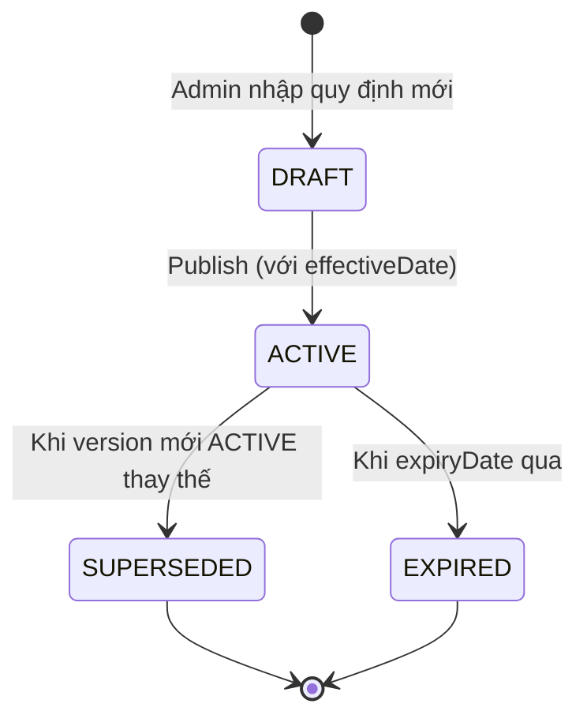

# Statutory Rules & Compliance — Quy định Pháp lý

**Phiên bản**: 1.0 · **Cập nhật**: 2026-03-06  
**Đối tượng**: HR Admin, Finance, Compliance Officer  
**Thời gian đọc**: ~20 phút

---

## Tổng quan

**Statutory Rules** là tầng tuân thủ pháp lý của PR module — nơi các quy định của Nhà nước (thuế, bảo hiểm, lao động) được mã hóa thành cấu hình có thể tự cập nhật khi pháp luật thay đổi, mà không cần sửa code.

xTalent đi kèm bộ Statutory Rules hoàn chỉnh cho Việt Nam, có thể mở rộng cho các quốc gia khác theo cùng kiến trúc.

---

## 1. StatutoryRule — Quy định Bắt buộc

**StatutoryRule** là AGGREGATE_ROOT định nghĩa một quy định pháp lý cụ thể: thuế suất, trần/sàn, công thức tính theo luật — có hiệu lực từ ngày nào, cho thị trường nào.

### Cấu trúc StatutoryRule

```
StatutoryRule {
  ruleCode: String           // VN_BHXH_2024, VN_PIT_2025...
  ruleName: String           // BHXH Nhân viên 2024, PIT Vietnam 2025
  category: Enum             // TAX | SOCIAL_INSURANCE | HEALTHCARE | UNEMPLOYMENT | LABOR
  
  talentMarket: TalentMarket // Thị trường áp dụng: VN, SG, US
  
  // Tham số quy định
  rate: Decimal?             // Tỷ lệ (0.08 = 8%)
  ceiling: Decimal?          // Trần tính toán
  floor: Decimal?            // Sàn tính toán
  parameters: Map<String, Any>  // Tham số phức tạp (tax brackets, tier tables...)
  
  effectiveDate: Date        // Ngày có hiệu lực (theo Nghị định)
  expiryDate: Date?          // Ngày hết hiệu lực (null = vô thời hạn)
  status: Enum               // DRAFT | ACTIVE | SUPERSEDED | EXPIRED
  
  legalReference: String     // Số Nghị định, Thông tư tham chiếu
}
```

### Lifecycle StatutoryRule



> **Nguyên tắc**: Khi Nghị định mới ban hành, admin tạo StatutoryRule mới với effectiveDate là ngày hiệu lực của Nghị định. Hệ thống tự động áp dụng đúng version rule theo ngày của kỳ lương — không cần tắt rule cũ thủ công.

---

## 2. Vietnam Statutory Rules — Bộ Quy định VN

### 2.1 BHXH — Bảo hiểm Xã hội

**Bảo hiểm Xã hội** là khoản đóng góp bắt buộc theo Luật BHXH 2014 và các Nghị định hướng dẫn.

| Tham số | Nhân viên đóng | Công ty đóng | Ghi chú |
|---------|:--------------:|:------------:|---------|
| **Tỷ lệ BHXH** | 8% | 17.5% | Hưu trí, tử tuất, ốm đau, thai sản, TNLĐ |
| **Tỷ lệ BHYT** | 1.5% | 3% | Bảo hiểm y tế |
| **Tỷ lệ BHTN** | 1% | 1% | Bảo hiểm thất nghiệp |
| **Tỷ lệ TNLĐ** | 0% | 0.5% | Tai nạn lao động, bệnh nghề nghiệp |
| **Tổng** | **10.5%** | **22%** | |

**Trần đóng BHXH/BHYT/BHTN** (từ 7/2024):
- Lương cơ sở: **2,340,000 VND/tháng** (theo Nghị định 73/2024/NĐ-CP)
- Trần BHXH = 20 × lương cơ sở = **46,800,000 VND/tháng**
- Thu nhập vượt trần → chỉ đóng trên phần bằng trần

```
# Công thức BHXH trong DSL:
element BHXH_EMPLOYEE =
  when employeeType == "PROBATION" then 0
  when contractType == "FREELANCE" then 0
  else min(GROSS_SALARY, BHXH_CEILING) * lookup(BHXH_RATE_TABLE, "employee")

# BHXH_CEILING được lấy từ StatutoryRule VN_BHXH_CEILING
# Tự động cập nhật khi lương cơ sở thay đổi theo Nghị định mới
```

**Trường hợp đặc biệt theo loại hợp đồng**:

| Loại hợp đồng | BHXH | BHYT | BHTN |
|--------------|:----:|:----:|:----:|
| Không xác định thời hạn | ✅ | ✅ | ✅ |
| Xác định thời hạn (12-36 tháng) | ✅ | ✅ | ✅ |
| Thử việc (≤ 2 tháng) | ❌ | ❌ | ❌ |
| Hợp đồng dưới 1 tháng | ❌ | ❌ | ❌ |
| Cộng tác viên / Freelancer | ❌ | ❌ | ❌ |

### 2.2 PIT — Thuế Thu nhập Cá nhân

**Personal Income Tax** tính theo biểu thuế lũy tiến 7 bậc (Luật Thuế TNCN 2007, sửa đổi 2012, 2024):

| Bậc | Thu nhập tính thuế/tháng | Thuế suất |
|:---:|:------------------------:|:---------:|
| 1 | Đến 5,000,000 VND | **5%** |
| 2 | 5,000,001 – 10,000,000 | **10%** |
| 3 | 10,000,001 – 18,000,000 | **15%** |
| 4 | 18,000,001 – 32,000,000 | **20%** |
| 5 | 32,000,001 – 52,000,000 | **25%** |
| 6 | 52,000,001 – 80,000,000 | **30%** |
| 7 | Trên 80,000,000 | **35%** |

**Thu nhập tính thuế = Thu nhập chịu thuế − Giảm trừ:**

| Giảm trừ | Mức áp dụng (2024) | Cơ sở pháp lý |
|---------|-------------------|--------------|
| Giảm trừ gia cảnh bản thân | **11,000,000 VND/tháng** | Nghị quyết 954/2020/UBTVQH14 |
| Giảm trừ người phụ thuộc | **4,400,000 VND/người/tháng** | Nghị quyết 954/2020/UBTVQH14 |
| BHXH + BHYT + BHTN nhân viên đóng | Toàn bộ (10.5% × gross) | Luật Thuế TNCN |
| Chi phí nghề nghiệp (one-time) | Theo quy định ngành | Thông tư hướng dẫn |

```
# Công thức PIT 7 bậc đầy đủ trong DSL:
element TAXABLE_INCOME =
  GROSS_SALARY
  - BHXH_EMPLOYEE
  - BHYT_EMPLOYEE
  - BHTN_EMPLOYEE
  - PERSONAL_DEDUCTION
  - (DEPENDENT_COUNT * DEPENDENT_DEDUCTION_RATE)
  - ifNull(OTHER_DEDUCTION, 0)

element PIT_TAX =
  when TAXABLE_INCOME <= 0 then 0
  else progressiveTax(TAXABLE_INCOME, VN_PIT_BRACKETS_2024)
```

### 2.3 Quarter-end & Year-end Settlement

**Quyết toán thuế cuối năm (Annual Settlement)**:
- Hệ thống tổng hợp YTD_GROSS và YTD_PIT_WITHHELD
- Tính lại thuế theo biểu thuế năm (×12 = annual brackets)
- Tính khoản thuế còn thiếu hoặc hoàn thuế
- Tự động thêm vào kỳ lương tháng 12 hoặc tháng 1 năm sau

---

## 3. DeductionPolicy — Chính sách Khấu trừ

**DeductionPolicy** quản lý các khoản khấu trừ không bắt buộc theo pháp lý nhưng có quy tắc riêng.

### Các loại deduction

| Loại | Ví dụ | Đặc điểm |
|------|-------|----------|
| **Loan Deduction** | Vay mua nhà, vay tiêu dùng | Monthly installment, early payoff |
| **Advance Deduction** | Tạm ứng lương | One-time hoặc installment |
| **Garnishment** | Khấu trừ theo lệnh tòa án | Priority cao nhất, không thể bỏ qua |
| **Voluntary Deduction** | Đóng góp quỹ nội bộ, đồng phục | Opt-in, có thể dừng bất kỳ lúc nào |
| **Union Dues** | Công đoàn phí | Cố định hoặc % gross |

### Priority & Limits

DeductionPolicy định nghĩa thứ tự ưu tiên và giới hạn khấu trừ:

```
DeductionPolicy {
  policyCode: String
  deductionOrder: Integer    // Priority: 1 = cao nhất, xử lý trước
  
  max_pct_gross: Decimal?    // Tối đa bao nhiêu % gross (vd: không được khấu trừ > 50% gross)
  max_amount: Decimal?       // Tối đa bao nhiêu VND/kỳ
  
  carry_forward: Boolean     // Nếu kỳ này không đủ để khấu trừ → carry sang kỳ sau?
  stop_when_negative: Boolean // Dừng khấu trừ nếu net salary xuống 0?
}
```

**Thứ tự ưu tiên khấu trừ (theo pháp luật VN)**:
1. Thuế PIT (bắt buộc)
2. BHXH, BHYT, BHTN (bắt buộc)
3. Garnishment (lệnh tòa án)
4. Loan repayment (theo hợp đồng vay nội bộ)
5. Advance recovery
6. Voluntary deductions

---

## 4. Xử lý theo Loại Nhân viên

### 4.1 Ma trận Compliance theo Employee Type

| Loại | Contract | BHXH/BHYT/BHTN | PIT | Ghi chú |
|------|---------|:---------------:|:---:|---------|
| Nhân viên chính thức (HDLĐ không XĐ thời hạn) | Unlimited | ✅ Full 10.5% | ✅ Lũy tiến | Tiêu chuẩn |
| NV có thời hạn (12-36 tháng) | Fixed-term | ✅ Full 10.5% | ✅ Lũy tiến | Giống chính thức |
| Thử việc (≤ 60 ngày) | Probation | ❌ Không đóng | ✅ Lũy tiến | Lương ≥ 85% chính thức |
| CTV / Freelancer | Service contract | ❌ | ✅ Khoán 10% | Gross < 2tr: miễn |
| Người nước ngoài (expat) | Unlimited / Fixed | ✅ Theo treaty | ✅ Theo treaty | Tax residency check |

### 4.2 Expat Tax Treatment

Người nước ngoài có thêm logic:

```
Expat PIT rules:
- Tax resident (> 183 ngày/năm tại VN): chịu thuế toàn cầu theo biểu VN
- Non-resident (≤ 183 ngày): thuế khoán 20% trên thu nhập phát sinh tại VN
- Tax treaty: nếu có hiệp định thuế VN-quốc gia X → áp dụng mức ưu đãi treaty
```

---

## 5. Effective Date Management — Quản lý Ngày Hiệu lực

### Tự động áp dụng Nghị định mới

Khi Nhà nước ban hành Nghị định mới (thay đổi lương cơ sở, thuế suất...):

```
Ví dụ: Lương cơ sở tăng từ 1/7/2024 (Nghị định 73/2024/NĐ-CP)

Trước 1/7/2024:
  BHXH_CEILING = 20 × 1,800,000 = 36,000,000 VND

Từ 1/7/2024:
  BHXH_CEILING = 20 × 2,340,000 = 46,800,000 VND

Cách xử lý trong xTalent:
1. Admin tạo StatutoryRule mới: VN_BHXH_CEILING_2024
   → ceiling: 46,800,000
   → effectiveDate: 2024-07-01
   → legalReference: "Nghị định 73/2024/NĐ-CP"

2. Hệ thống TỰ ĐỘNG:
   → Kỳ lương tháng 6/2024: dùng trần 36,000,000 (rule cũ)
   → Kỳ lương tháng 7/2024+: dùng trần 46,800,000 (rule mới)
   Không cần admin thao tác thêm gì.
```

### Pro-rated period khi Nghị định có hiệu lực giữa kỳ

Nếu Nghị định có hiệu lực ngày 15 (giữa tháng), hệ thống tính split:

```
Kỳ tháng 7 (1/7 - 31/7), Nghị định hiệu lực 15/7:

Phần 1: 1/7 - 14/7 (14 ngày)
  → Dùng rule cũ: trần 36,000,000
  → BHXH_EMPLOYEE = min(gross, 36M) × 8% × proRata(14, 31)

Phần 2: 15/7 - 31/7 (17 ngày)
  → Dùng rule mới: trần 46,800,000
  → BHXH_EMPLOYEE_part2 = min(gross, 46.8M) × 8% × proRata(17, 31)

Tổng BHXH = part1 + part2
```

---

## 6. CostingRule — Phân bổ Chi phí

**CostingRule** cho phép phân bổ chi phí payroll sang bộ phận/cost center/dự án theo tỷ lệ:

```
CostingRule: Nhân viên A — 70% Marketing, 30% R&D Project X

→ BHXH cost phân bổ:
  Marketing: BHXH_EMPLOYER × 70%
  R&D Project X: BHXH_EMPLOYER × 30%

→ BASE_SALARY cost phân bổ:
  Marketing: BASE_SALARY × 70%
  R&D Project X: BASE_SALARY × 30%
```

Dùng cho budgeting, project accounting, department cost reporting.

---

## 7. Validation Rules Compliance

Các ValidationRule đặc biệt cho compliance:

| Rule | Mô tả | Severity |
|------|-------|----------|
| `VR-BHXH-001` | Salary vượt trần BHXH phải có ceiling cap | ERROR |
| `VR-PIT-001` | TAXABLE_INCOME < 0 → PIT = 0, không được âm | ERROR |
| `VR-MIN-WAGE` | Net salary không được thấp hơn lương tối thiểu vùng | ERROR |
| `VR-PROBATION` | Nhân viên thử việc không đóng BHXH | WARNING |
| `VR-EXPAT-001` | Expat cần xác nhận tax residency status | WARNING |
| `VR-DEPENDENT` | Số người phụ thuộc phải có hồ sơ đăng ký | WARNING |

---

## 8. Báo cáo Compliance

Các báo cáo tuân thủ được generate tự động sau mỗi production run:

| Báo cáo | Nộp cho | Kỳ | Format |
|---------|---------|-----|--------|
| **Bảng kê BHXH** | Cơ quan BHXH | Hàng tháng | VssID standard |
| **Khai thuế TNCN (TK-TNCN)** | Cục Thuế | Quý | XML theo TT8/2013 |
| **Quyết toán thuế năm** | Cục Thuế | Năm | XML theo biểu mẫu |
| **Báo cáo lao động** | Sở LĐTBXH | Năm | Excel theo biểu mẫu |

---

*← [03 Pay Elements & Formula](./03-pay-elements-formula.md) · [05 Payroll Execution Lifecycle →](./05-payroll-execution-lifecycle.md)*
