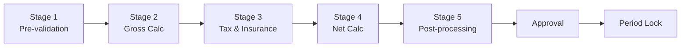

# Payroll Execution Lifecycle — Quy trình Chạy Lương

**Phiên bản**: 1.0 · **Cập nhật**: 2026-03-06  
**Đối tượng**: Payroll Admin, Finance, HR Manager  
**Thời gian đọc**: ~20 phút

---

## Tổng quan

Chạy lương trong xTalent là một **lifecycle có kiểm soát** với ba chế độ thực thi, approval workflow đa cấp, và cơ chế retroactive đảm bảo mọi điều chỉnh đều được trace đầy đủ.

```
Dry Run ─────────────► Test & Validate (không lưu kết quả)
Simulation ──────────► Impact Analysis (lưu tạm, có thể xóa)
Production Run ──────► Official Payroll (immutable, approval workflow)
```

---

## 1. Dry Run Mode — Test An toàn

Dry Run kiểm tra công thức và cấu hình **không tạo bất kỳ side effect** — không ghi vào database payroll chính thức.

**Use cases**:
- Test công thức mới vừa tạo
- Phát hiện lỗi: circular dependency, reference missing, syntax error
- Preview kết quả cho employee mẫu trước khi chạy cả nhóm
- Formula Studio preview real-time trong khi soạn thảo

**Output Dry Run** (kèm intermediate values):
```
DryRunResult {
  employeeId: "EMP-001"
  period: 2025-03
  
  elementResults: [{
    code: "BHXH_EMPLOYEE"
    value: 3,744,000
    formula: "min(GROSS_SALARY, BHXH_CEILING) * 0.08"
    inputs: { GROSS_SALARY: 46,800,000, BHXH_CEILING: 46,800,000 }
    executionOrder: 4
  }]
  
  ruleLog: ["Rule 'Calc GROSS' fired", "Rule 'Cap BHXH' fired", ...]
  errors: []
  warnings: ["Bank account chưa verified"]
  totalExecutionTimeMs: 87
}
```

**SLA**: 1 nhân viên < 100ms · 100 nhân viên < 5 giây

---

## 2. Simulation Mode — Impact Analysis

Simulation chạy tính lương trên **dữ liệu lịch sử** với công thức mới — trả lời câu hỏi: *"Nếu áp dụng chính sách mới, lương tháng 12/2024 của 1,000 người sẽ thay đổi thế nào?"*

**Nguyên tắc quan trọng**:
- Dùng historical data (employee, attendance, benefits của kỳ đó) — bất biến
- Không modify dữ liệu gốc
- Không tạo payment instructions hay GL entries

**Output: Side-by-side Impact Report**:

| Employee | NET cũ | NET mới | Delta |
|---------|--------|---------|-------|
| EMP-001 | 25,600,000 | 24,889,600 | -710,400 |
| EMP-002 | 18,200,000 | 18,200,000 | 0 (thu nhập < trần cũ) |
| ... | ... | ... | ... |
| **Summary** | | | |
| Affected employees | | | 987/1,248 |
| Total delta NET | | | -702,144,000 |
| Total delta BHXH Employer | | | +1,403,520,000 |

**SLA**: 1,000 nhân viên < 2 phút

---

## 3. Production Run — Chạy Lương Chính thức

### 5 Stages



**Stage 1 — Pre-validation**: Kiểm tra data integrity trước khi bắt đầu tính
- ERROR nếu: nhân viên chưa có PayGroup, T&A data thiếu, formula có lỗi
- WARNING nếu: bank account chưa verified, số ngày công bất thường

**Stage 2 — Gross Calculation**: Tính tất cả EARNING elements theo dependency order
```
ATTENDANCE_DAYS → PRORATED_BASE → OVERTIME → ALLOWANCES → GROSS_SALARY
```

**Stage 3 — Tax & Insurance**: Tính DEDUCTION và TAX
```
BHXH_BASE → BHXH/BHYT/BHTN_EMPLOYEE → TAXABLE_INCOME → PIT_TAX
```

**Stage 4 — Net Calculation**:
```
NET_SALARY = GROSS − BHXH_EMP − BHYT_EMP − BHTN_EMP − PIT − LOAN − GARNISHMENTS − OTHER
```

**Stage 5 — Post-processing**:
- Rounding (VND → đơn vị 1,000)
- Floor check (NET ≥ lương tối thiểu vùng?)
- Retroactive delta cộng/trừ
- Balance updates (YTD, MTD)
- Draft payslip & bank file generation

### Approval Workflow

```
Payroll Admin → Review variance + exception report → Submit
  ↓
HR Manager → Review summary (tổng quỹ lương, số người) → Approve
  ↓
Finance (CFO) → Budget reconciliation (actual vs plan) → Final Approve
  ↓
Period LOCKED → Bank file released → GL entries posted
```

### Variance & Exception Detection

| Chỉ số | Ngưỡng | Action |
|--------|--------|--------|
| Gross thay đổi > 20% vs kỳ trước | ⛔ ERROR | Bắt buộc giải thích |
| NET_SALARY âm | ⛔ ERROR | Block approve |
| PIT = 0 cho lương cao | ⚠️ WARNING | Kiểm tra công thức |
| BHXH = 0 cho nhân viên chính thức | ⛔ ERROR | Fix trước approve |

---

## 4. Retroactive Adjustment — Tính lại Hồi tố

### Khi nào cần Retroactive?

- Nâng lương hồi tố (approved muộn, hiệu lực từ tháng trước)
- Phát hiện tính sai kỳ trước
- Thay đổi hợp đồng có hiệu lực hồi tố
- Chính sách mới áp dụng ngược

### Cơ chế Delta (Forward Difference)

```
Nguyên tắc: KHÔNG overwrite kết quả cũ → tính delta và carry sang kỳ mới

Ví dụ: Tháng 2 phát hiện BHXH tháng 1 tính sai:

  Recalculate tháng 1 với đúng lương:
    BHXH_correct = 3,744,000
    BHXH_actual  = 2,384,000
    delta        = +1,360,000 phải thu thêm

  Kỳ tháng 2 — thêm retroactive element:
    BHXH_RETRO_JAN = +1,360,000 (deduction thêm)
    NET_FEB = NET_baseline − 1,360,000
    
  Payslip tháng 2 hiển thị rõ: "BHXH điều chỉnh HT tháng 1: -1,360,000"
```

**Cascade tự động**: Thay đổi BASE_SALARY → hệ thống tự cascade: GROSS → BHXH → TAXABLE → PIT → NET — không cần tính tay từng element.

**Kiểm soát**:
- Độ sâu hồi tố tối đa: cấu hình được (mặc định 24 kỳ)
- Approval bắt buộc trước khi apply
- Immutable: tạo adjustment record mới, không sửa kỳ cũ

---

## 5. Period Locking & Immutability

| Action | OPEN | PROCESSING | LOCKED | CLOSED |
|--------|:----:|:----------:|:------:|:------:|
| Nhập T&A, Dry Run | ✅ | ❌ | ❌ | ❌ |
| Production Run | ✅ | ❌ | ❌ | ❌ |
| Approve payroll | ❌ | ✅ | ❌ | ❌ |
| Xuất bank file | ❌ | ❌ | ✅ | ✅ |
| Xem kết quả | ✅ | ✅ | ✅ | ✅ |

Sau khi LOCKED: Kết quả lưu với **SHA-256 hash** — không thể sửa, xóa, hay override. Mọi điều chỉnh phải qua retroactive adjustment record.

---

## 6. Performance SLAs

| Scenario | Target |
|---------|--------|
| Dry Run — 1 nhân viên | < 100ms |
| Dry Run — 100 nhân viên | < 5 giây |
| Simulation — 1,000 nhân viên | < 2 phút |
| Production Run — 5,000 nhân viên | < 3 phút |
| Production Run — 10,000 nhân viên | < 5 phút |

*Đạt được nhờ: Drools parallel partition, pre-compiled MVEL formulas, in-process execution*

---

*← [04 Statutory Rules](./04-statutory-rules-compliance.md) · [06 Formula Engine Architecture →](./06-formula-engine-architecture.md)*
