# Payroll Module - Conceptual Guide

> **Module**: Payroll (PR)  
> **Version**: 1.0  
> **Last Updated**: 2026-01-05

---

## Mục lục

1. [Pay Structure](#1-pay-structure)
2. [Pay Elements](#2-pay-elements)
3. [Rules & Policies](#3-rules--policies)
4. [Accounting Integration](#4-accounting-integration)
5. [Reporting Templates](#5-reporting-templates)
6. [System Integration](#6-system-integration)
7. [Calculation Concepts](#7-calculation-concepts)
8. [Best Practices](#8-best-practices)

---

## 1. Pay Structure

### 1.1 Tổng quan

Pay Structure định nghĩa cách tổ chức payroll cho doanh nghiệp, bao gồm:

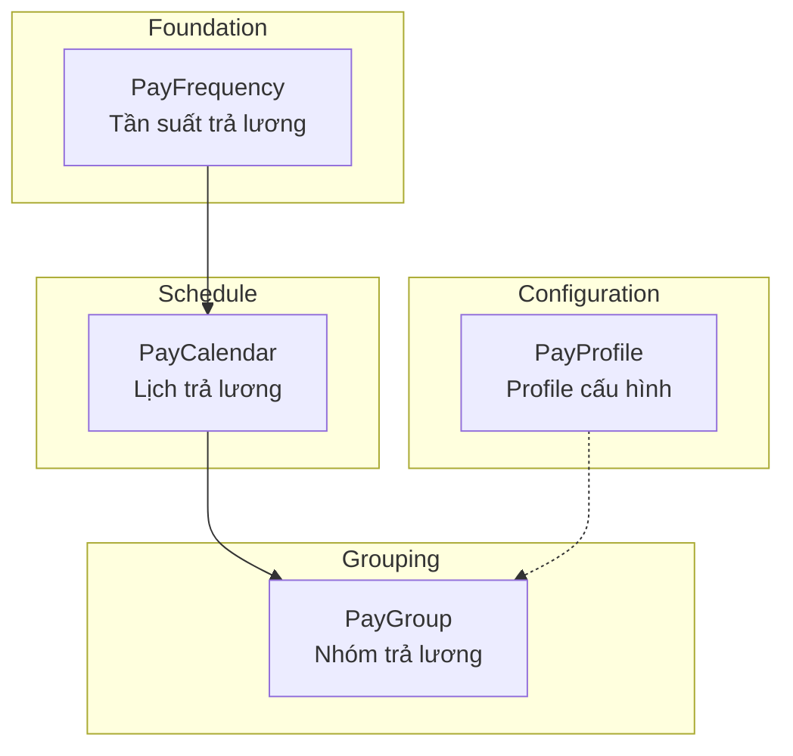

### 1.2 PayFrequency

**Định nghĩa**: Reference data định nghĩa các chu kỳ trả lương chuẩn.

| Frequency | Period Days | Phổ biến tại |
|-----------|-------------|--------------|
| WEEKLY | 7 | US, UK |
| BIWEEKLY | 14 | US, Canada |
| SEMI_MONTHLY | 15 | US |
| MONTHLY | 30 | Vietnam, EU, APAC |
| QUARTERLY | 90 | Bonus cycles |

**Lifecycle:**
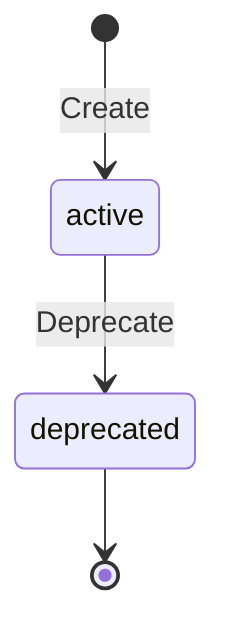

### 1.3 PayCalendar

**Định nghĩa**: Lịch trả lương cụ thể cho một Legal Entity, định nghĩa:
- Pay periods
- Cut-off dates
- Pay dates

**Key Attributes:**

| Attribute | Mô tả | Ví dụ |
|-----------|-------|-------|
| code | Unique identifier | VN-MONTHLY-2025 |
| frequencyCode | FK to PayFrequency | MONTHLY |
| calendarJson | Rules cho dates | Cut-off: 15th, Pay: 5th |
| defaultCurrency | ISO 4217 | VND |

**Relationships:**

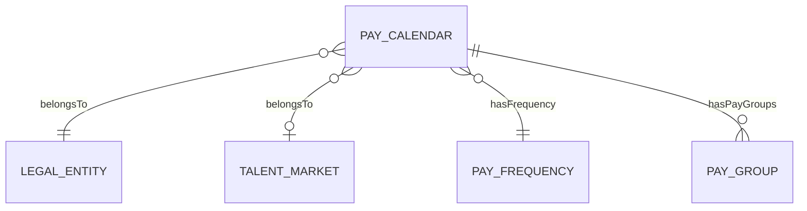

**Calendar Configuration Example:**

```json
{
  "cutOffRule": "15th of each month",
  "payDateRule": "5th of next month",
  "adjustHolidays": true,
  "holidayCalendar": "VN_PUBLIC_HOLIDAYS"
}
```

### 1.4 PayGroup

**Định nghĩa**: Nhóm employees có cùng đặc điểm payroll (calendar, currency, bank account).

**Key Use Cases:**
1. **Batch Processing**: Payroll runs theo từng pay group
2. **Payment Batching**: Bank files theo pay group
3. **Multi-currency**: Groups cho different currencies

**Lifecycle:**
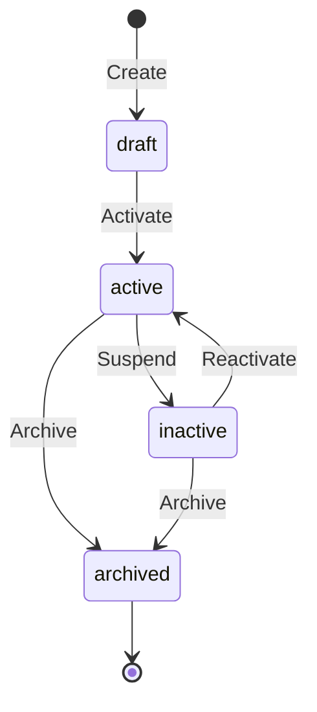

### 1.5 PayProfile

**Định nghĩa**: Bundle/package chứa các configurations cho payroll:

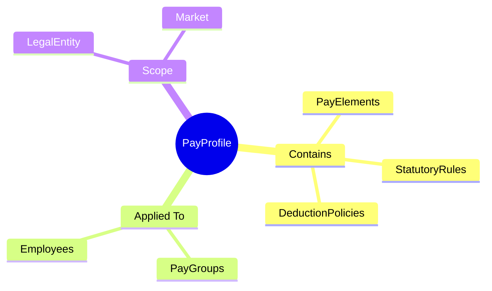

**Profile Inheritance:**

```
Company Level Profile
    └── Market Level Profile (VN)
        └── Entity Level Profile (VNG Corp)
            └── Group Level Override
                └── Employee Level Override
```

---

## 2. Pay Elements

### 2.1 Tổng quan

PayElement là building block cơ bản của payroll, đại diện cho các thành phần:

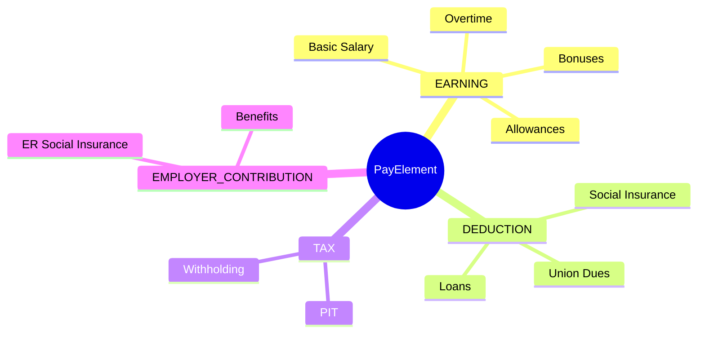

### 2.2 Element Classifications

| Classification | Impact on Gross | Impact on Net | Ví dụ |
|----------------|-----------------|---------------|-------|
| **EARNING** | + (tăng) | - | Basic, OT, Bonus |
| **DEDUCTION** | - | - (giảm) | BHXH EE, Loan |
| **TAX** | - | - (giảm) | PIT |
| **EMPLOYER_CONTRIBUTION** | - | - | BHXH ER |
| **INFORMATIONAL** | - | - | Working Days |

### 2.3 Element Configuration

**Key Attributes:**

| Attribute | Mô tả | Ví dụ |
|-----------|-------|-------|
| code | Unique ID | BASIC_SALARY |
| classification | Type | EARNING |
| unit | Đơn vị | AMOUNT, HOURS, PERCENTAGE |
| inputRequired | Cần input? | true/false |
| taxableFlag | Chịu thuế? | true/false |
| preTaxFlag | Tính trước thuế? | true/false |
| priorityOrder | Thứ tự tính | 1-999 |

**Calculation Priority:**


### 2.4 PayFormula

**Định nghĩa**: Shared calculation logic cho pay elements.

**Formula Types:**

| Type | Mô tả | Ví dụ |
|------|-------|-------|
| Percentage | % of base | `base * 0.08` |
| Progressive | Tax brackets | PIT calculation |
| Conditional | If-then logic | OT multipliers |
| Lookup | Table reference | Statutory rates |

**Complex Formula Example (PIT):**

```
PROGRESSIVE_TAX(
  taxable_income,
  [
    [0, 5000000, 0.05],
    [5000000, 10000000, 0.10],
    [10000000, 18000000, 0.15],
    [18000000, 32000000, 0.20],
    [32000000, 52000000, 0.25],
    [52000000, 80000000, 0.30],
    [80000000, null, 0.35]
  ]
)
```

### 2.5 PayBalanceDefinition

**Định nghĩa**: Aggregation của elements theo time periods.

**Balance Types:**

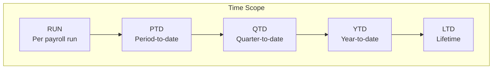

**Balance Categories:**

| Category | Mô tả | Formula Example |
|----------|-------|-----------------|
| GROSS | Tổng thu nhập | SUM(EARNING elements) |
| NET | Thu nhập sau trừ | GROSS - DEDUCTIONS - TAX |
| TAXABLE | Thu nhập chịu thuế | GROSS - Pre-tax deductions - Exemptions |
| EMPLOYER_COST | Chi phí công ty | GROSS + ER contributions |

---

## 3. Rules & Policies

### 3.1 StatutoryRule

**Định nghĩa**: Quy định pháp lý cho tax, social insurance theo từng quốc gia.

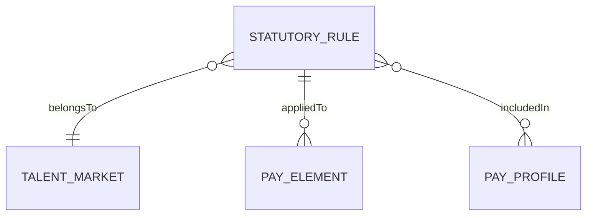

**Rule Categories:**

| Category | Vietnam | Singapore |
|----------|---------|-----------|
| TAX | VN_PIT | SG_IR | 
| SOCIAL_INSURANCE | VN_BHXH | - |
| PENSION | - | SG_CPF |
| HEALTHCARE | VN_BHYT | SG_CPF_MA |
| UNEMPLOYMENT | VN_BHTN | - |

**Vietnam Statutory Rules Detail:**

| Rule Code | Type | EE Rate | ER Rate | Ceiling |
|-----------|------|---------|---------|---------|
| VN_BHXH | Social | 8% | 17.5% | 36M |
| VN_BHYT | Health | 1.5% | 3% | 36M |
| VN_BHTN | Unemployment | 1% | 1% | 36M |
| VN_PIT | Tax | Progressive | - | - |

### 3.2 DeductionPolicy

**Định nghĩa**: Quy tắc và giới hạn cho deductions.

**Policy Configuration:**

| Attribute | Mô tả | Ví dụ |
|-----------|-------|-------|
| deductionType | Loại | VOLUNTARY, MANDATORY, COURT_ORDER |
| priorityOrder | Thứ tự | 1 = highest |
| maxPercentage | Max % of net | 25 for garnishment |
| maxAmount | Max absolute | 5,000,000 VND |

**Priority Order Guidelines:**

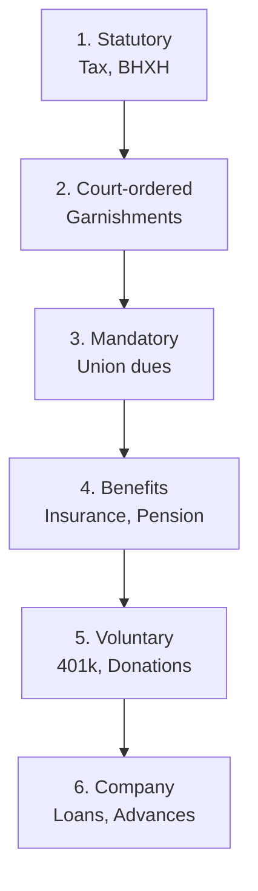

### 3.3 ValidationRule

**Định nghĩa**: Rules để validate payroll data.

**Rule Types:**

| Type | Mô tả | Ví dụ |
|------|-------|-------|
| Field | Single field | `gross_amount >= 0` |
| Cross-field | Multiple fields | `net <= gross` |
| Lookup | Reference check | `element_id EXISTS` |

**Severity Levels:**

| Level | Behavior | Use Case |
|-------|----------|----------|
| ERROR | Block processing | Critical validations |
| WARNING | Allow with approval | Edge cases |
| INFO | Log only | Informational |

### 3.4 CostingRule

**Định nghĩa**: Phân bổ chi phí payroll vào cost centers, GL accounts.

**Allocation Types:**

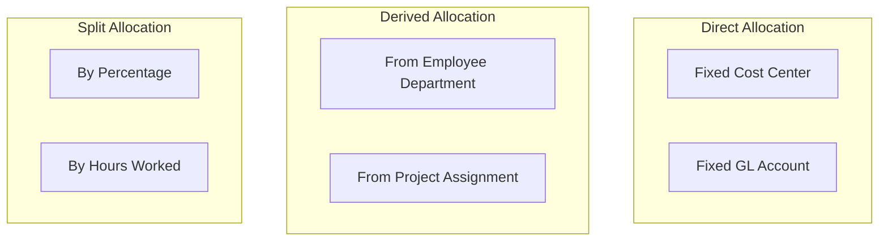

---

## 4. Accounting Integration

### 4.1 GLMappingPolicy

**Định nghĩa**: Mapping pay elements → GL accounts.

**Mapping Structure:**

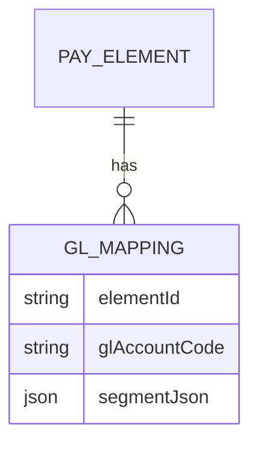

**Sample Mappings:**

| Element | GL Account | Description |
|---------|------------|-------------|
| BASIC_SALARY | 61000 | Salary Expense |
| OT_150 | 61100 | Overtime Expense |
| BHXH_ER | 62100 | Employer SI Expense |
| PIT | 33100 | Tax Payable |

### 4.2 PayAdjustReason

**Định nghĩa**: Reference data cho lý do điều chỉnh lương.

| Code | Type | Requires Approval |
|------|------|-------------------|
| BACK_PAY | INCREASE | Yes |
| OVERPAY_RECOVER | DECREASE | Yes |
| DATA_ERROR | CORRECTION | Yes |
| REVERSAL | REVERSAL | Yes |

---

## 5. Reporting Templates

### 5.1 PayslipTemplate

**Định nghĩa**: Layout cho phiếu lương.

**Sections:**

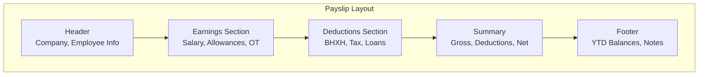

### 5.2 BankTemplate

**Định nghĩa**: Format cho payment files gửi ngân hàng.

**Supported Formats:**

| Format | Banks | Use Case |
|--------|-------|----------|
| CSV | VCB, TCB, ACB | Local transfers |
| TXT | DBS, HSBC | Fixed-width |
| XML | Citibank | International |
| SWIFT | All | Cross-border |

### 5.3 TaxReportTemplate

**Định nghĩa**: Mẫu báo cáo thuế theo quy định.

**Vietnam Reports:**

| Code | Name | Frequency |
|------|------|-----------|
| 05QTT_TNCN | Tờ khai PIT tháng | Monthly |
| 02KK_TNCN | Quyết toán PIT năm | Annual |

---

## 6. System Integration

### 6.1 PayrollInterface

**Định nghĩa**: Định nghĩa các interface tích hợp.

**Integration Patterns:**

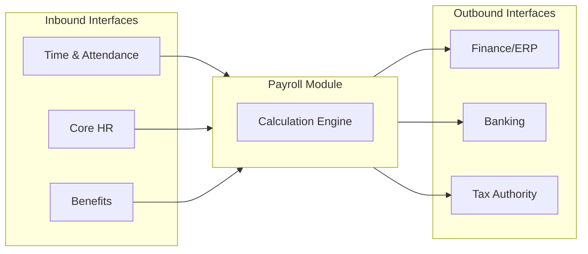

**Interface Types:**

| Direction | Format | Example |
|-----------|--------|---------|
| INBOUND | API | TA daily sync |
| INBOUND | FILE_CSV | HR batch import |
| OUTBOUND | API | GL real-time post |
| OUTBOUND | FILE_XML | Bank payment file |

---

## 7. Calculation Concepts

### 7.1 Payroll Calculation Flow

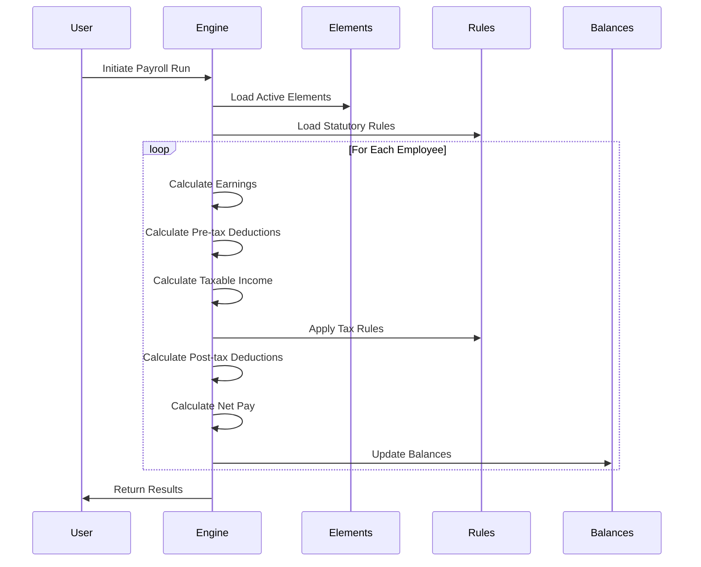

### 7.2 Balance Calculation

**GROSS Calculation:**
```
GROSS = SUM(all EARNING elements)
      = Basic + OT + Allowances + Bonus + ...
```

**TAXABLE INCOME:**
```
TAXABLE = GROSS 
        - Pre-tax Deductions (BHXH, BHYT, BHTN)
        - Personal Exemption (11,000,000)
        - Dependent Exemptions (4,400,000 × n)
```

**NET PAY:**
```
NET = GROSS 
    - All Deductions
    - Tax
    = GROSS - BHXH_EE - BHYT_EE - BHTN_EE - PIT - Other Deductions
```

### 7.3 SCD-2 Versioning

Các entities có SCD-2 (Slowly Changing Dimension Type 2) để track history:

| Field | Purpose |
|-------|---------|
| effectiveStartDate | Version start |
| effectiveEndDate | Version end (null = current) |
| isCurrentFlag | Quick filter for current |

**Version Scenario:**

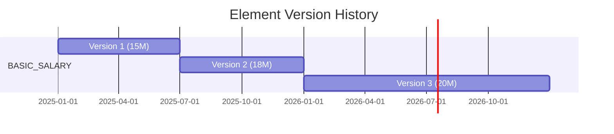

---

## 8. Best Practices

### 8.1 Configuration Guidelines

1. **Element Naming**: Use clear, standardized codes
   - `BASIC_SALARY`, `OT_150`, `BHXH_EE`
   
2. **Profile Strategy**: Create profiles by:
   - Market (VN, SG, US)
   - Employee type (FT, Contract, Executive)
   - Location (HQ, Branch, Factory)

3. **Calendar Setup**:
   - One calendar per combination of LE + Frequency
   - Generate periods at least 1 year ahead

### 8.2 Compliance Checklist

- [ ] Statutory rules updated cho năm hiện tại
- [ ] Tax brackets và exemptions chính xác
- [ ] Contribution ceilings updated
- [ ] Reporting templates aligned with regulations

### 8.3 Testing Requirements

| Test Type | Scope |
|-----------|-------|
| Unit | Each formula, rule |
| Integration | Element combinations |
| Regression | After rule changes |
| Compliance | vs Manual calculation |

---

## Appendix

### A. Related Documents

- [Concept Overview](./PR-concept-overview.md)
- [Ontology Index](../00-ontology/_index.onto.md)
- [Glossary](../00-ontology/_glossary.onto.md)
- [Domain Research](../00-ontology/_research/payroll-analysis.md)

### B. Entity Quick Reference

| Entity | Classification | Primary Purpose |
|--------|---------------|-----------------|
| PayFrequency | REFERENCE_DATA | Define pay cycles |
| PayCalendar | AGGREGATE_ROOT | Schedule management |
| PayGroup | ENTITY | Employee grouping |
| PayProfile | AGGREGATE_ROOT | Configuration bundle |
| PayElement | AGGREGATE_ROOT | Pay component |
| PayFormula | ENTITY | Calculation logic |
| PayBalanceDefinition | ENTITY | Balance tracking |
| StatutoryRule | AGGREGATE_ROOT | Legal compliance |
| DeductionPolicy | ENTITY | Deduction limits |
| ValidationRule | ENTITY | Data quality |
| CostingRule | ENTITY | Cost allocation |
| GLMappingPolicy | ENTITY | Accounting mapping |
| PayAdjustReason | REFERENCE_DATA | Adjustment tracking |
| PayslipTemplate | ENTITY | Payslip format |
| BankTemplate | REFERENCE_DATA | Payment file format |
| TaxReportTemplate | ENTITY | Tax report format |
| PayrollInterface | AGGREGATE_ROOT | Integration definition |
