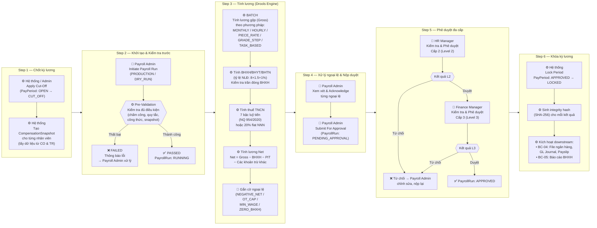
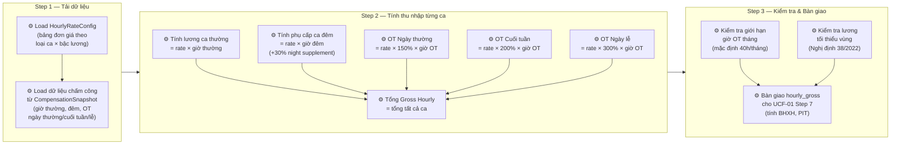
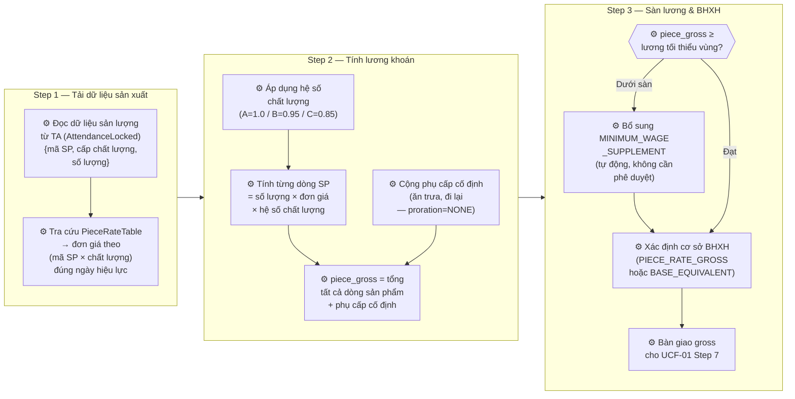
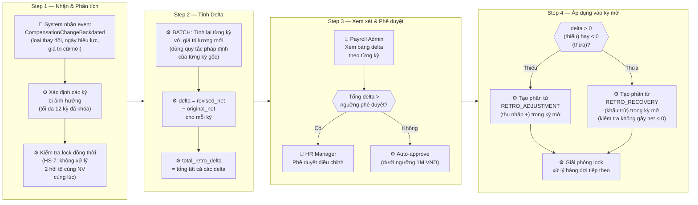
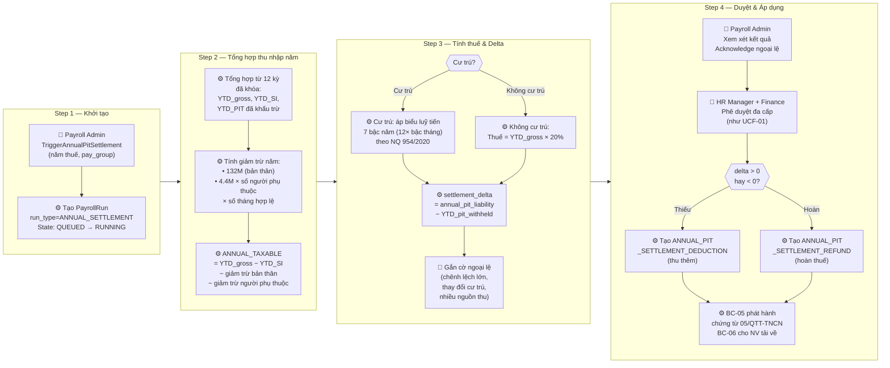
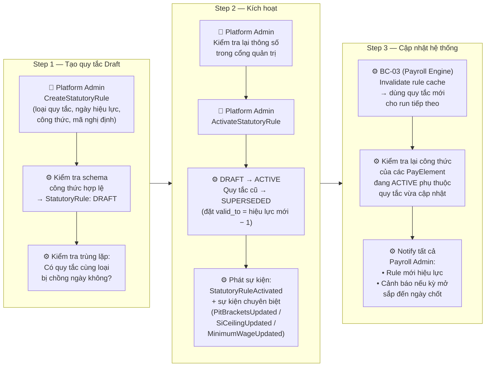
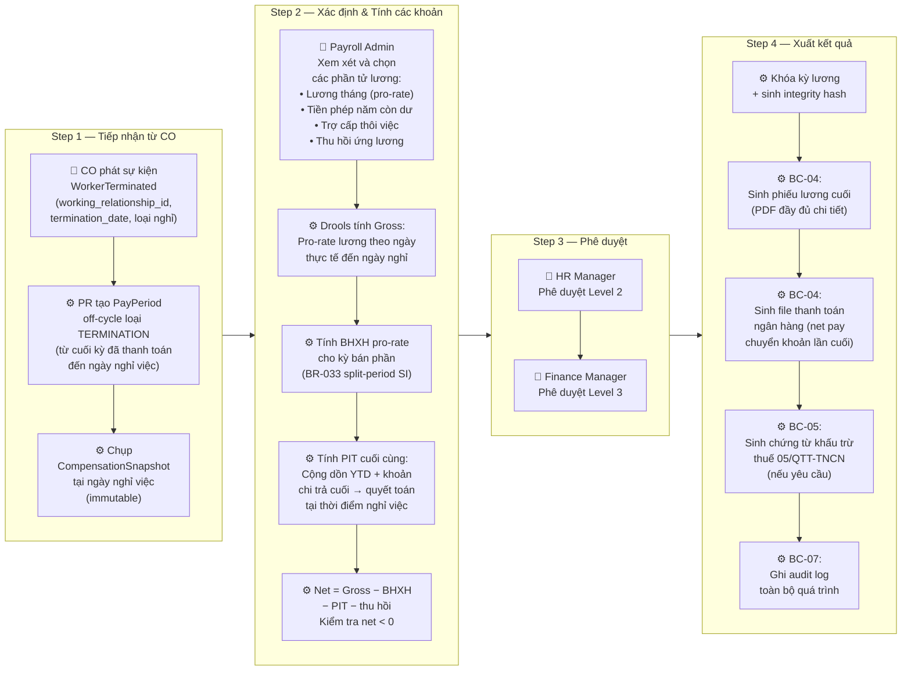
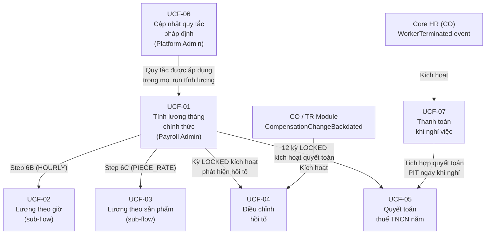

# Tổng Quan Quy Trình Nghiệp Vụ — Module Payroll (PR)

**Module**: Payroll (PR)
**Phiên bản**: 1.0
**Ngày**: 2026-04-01

> Tài liệu này tổng hợp toàn bộ các quy trình (workflow) thuộc module Payroll, được đọc từ các file `*.flow.md` của từng bounded context. Mỗi quy trình được trình bày bằng tiếng Việt với sơ đồ Mermaid thể hiện cấu trúc các bước theo phong cách A4B Workflow Designer: **các Step là các group LR (horizontal), bên trong mỗi Step là các task chạy từ trên xuống (TD)**.

---

## Tổng Quan Các Bounded Context Có Quy Trình

| Bounded Context | Quy Trình | Bounded Context Code |
|---|---|---|
| Payroll Execution | UCF-01 Tính lương tháng chính thức | BC-03 |
| Payroll Execution | UCF-02 Tính lương theo giờ | BC-03 |
| Payroll Execution | UCF-03 Tính lương theo sản phẩm | BC-03 |
| Payroll Execution | UCF-04 Điều chỉnh lương hồi tố | BC-03 |
| Payroll Execution | UCF-05 Quyết toán thuế TNCN năm | BC-03 |
| Statutory Rules | UCF-06 Cập nhật quy tắc pháp định | BC-02 |
| Payment Output | UCF-07 Thanh toán cuối cùng khi nghỉ việc | BC-04 |

---

## UCF-01: Tính Lương Tháng Chính Thức (Monthly Payroll Execution)

### Ý nghĩa & Mục đích

Đây là quy trình **cốt lõi và quan trọng nhất** của module Payroll. Quy trình này chạy theo chu kỳ hàng tháng, tự động kết hợp dữ liệu chấm công từ module TA, dữ liệu lương từ module TR, và các quy tắc pháp định (BHXH, BHYT, BHTN, PIT) để tính ra **lương thực nhận cho từng nhân viên**.

**Mục đích:**
- Đảm bảo tính lương chính xác, đúng quy định pháp luật Việt Nam
- Cung cấp cơ chế kiểm soát rủi ro thông qua ba lớp duyệt (Payroll Admin → HR Manager → Finance Manager)
- Tạo ra dữ liệu kết quả bất biến (immutable) sau khi khóa kỳ lương

**Tác nhân:** Scheduler / Payroll Admin → Hệ thống (Drools) → HR Manager → Finance Manager

**Kích hoạt:** Đến ngày chốt kỳ (cut-off date) hoặc Payroll Admin thủ công kích hoạt

> **💡 Lưu ý thiết kế:** Kết quả lương (PayrollResult) sau khi kỳ bị khóa là **bất biến tuyệt đối** — không được sửa trực tiếp. Mọi điều chỉnh phải đi qua quy trình Hồi tố (UCF-04).

---

## UCF-02: Tính Lương Theo Giờ (Hourly Worker Pay)

### Ý nghĩa & Mục đích

Đây là **quy trình con** chạy bên trong Bước 6 của UCF-01 (Step 6B), dành riêng cho nhân viên có hình thức trả lương theo giờ (`pay_method = HOURLY`). Quy trình này xử lý đặc thù của lao động hưởng lương giờ: phân loại ca làm việc, tính phụ cấp ca đêm, nhân hệ số làm thêm giờ (OT).

**Mục đích:**
- Tính đúng thu nhập theo từng loại ca làm việc (thường, đêm, OT ngày thường, OT cuối tuần, OT ngày lễ)
- Áp dụng đúng hệ số OT theo quy định Bộ Luật Lao động (150% / 200% / 300%)
- Kiểm tra vi phạm lương tối thiểu vùng và giới hạn giờ OT tháng

**Tác nhân:** Hệ thống (Drools Engine)

**Kích hoạt:** Khi PayrollRun đến bước tính lương gộp (Step 6 UCF-01) cho nhân viên HOURLY

---

## UCF-03: Tính Lương Theo Sản Phẩm (Piece-Rate Pay)

### Ý nghĩa & Mục đích

Quy trình con chạy trong Bước 6C của UCF-01, dành cho nhân viên hưởng lương khoán sản phẩm (`pay_method = PIECE_RATE`). Điển hình trong môi trường sản xuất, gia công, may mặc. Điểm đặc biệt là thu nhập phụ thuộc hoàn toàn vào số lượng sản phẩm và chất lượng.

**Mục đích:**
- Tính thu nhập dựa trên bảng đơn giá sản phẩm × số lượng × hệ số chất lượng
- Tự động bù lương tối thiểu vùng nếu sản lượng quá thấp
- Xác định cơ sở đóng BHXH cho lao động khoán (PIECE_RATE_GROSS hoặc BASE_EQUIVALENT)

**Tác nhân:** Hệ thống (Drools Engine)

**Kích hoạt:** Khi PayrollRun đến Step 6 của UCF-01 cho nhân viên PIECE_RATE

---

## UCF-04: Điều Chỉnh Lương Hồi Tố (Retroactive Salary Adjustment)

### Ý nghĩa & Mục đích

Khi HR điều chỉnh lương ngược về quá khứ (ví dụ: tăng lương từ 3 tháng trước mới nhận được phê duyệt), hệ thống phải tính lại các kỳ lương đã khóa để xác định **số tiền còn thiếu hoặc còn thừa**, sau đó bù vào kỳ lương hiện tại.

**Mục đích:**
- Đảm bảo nhân viên nhận đúng số tiền theo thay đổi lương hồi tố, dù đã qua nhiều kỳ lương
- Bảo vệ tính toàn vẹn: **KHÔNG sửa kết quả lương đã khóa**, chỉ tạo bút toán điều chỉnh trong kỳ mở
- Kiểm soát rủi ro thông qua giới hạn hồi tố 12 kỳ và ngưỡng phê duyệt

**Tác nhân:** HR Manager (khởi tạo tại CO/TR) → Hệ thống → Payroll Admin → HR Manager (duyệt)

**Kích hoạt:** Sự kiện `CompensationChangeBackdated` từ module CO/TR

> **💡 Nguyên tắc bất biến:** Kết quả lương các kỳ đã khóa **không được sửa**. Hồi tố chỉ ghi bổ sung vào kỳ hiện tại như một phần tử lương riêng.

---

## UCF-05: Quyết Toán Thuế TNCN Năm (Annual PIT Settlement)

### Ý nghĩa & Mục đích

Cuối năm thuế (hoặc khi nhân viên nghỉ việc), hệ thống phải đối chiếu **tổng thuế TNCN đã khấu trừ hàng tháng** với **số thuế thực tế phải nộp theo biểu luỹ tiến cả năm**. Nếu khấu trừ nhiều hơn → hoàn thuế; ít hơn → thu thêm.

**Mục đích:**
- Thực hiện nghĩa vụ quyết toán thuế theo Luật Thuế TNCN Việt Nam (hạn nộp: 31/3 năm sau)
- Xử lý đúng các trường hợp phức tạp: thay đổi cư trú giữa năm, nhân viên có nhiều nguồn thu nhập
- Tạo chứng từ khấu trừ thuế (Form 05/QTT-TNCN) cho từng nhân viên

**Tác nhân:** Payroll Admin → Hệ thống → HR Manager → Finance Manager

**Kích hoạt:** Payroll Admin ra lệnh `TriggerAnnualPitSettlement` cho năm thuế; hoặc tự động khi nhân viên nghỉ việc (từ UCF-07)

> **⚠️ Rủi ro quan trọng:** Trường hợp nhân viên nước ngoài đạt ngưỡng cư trú 183 ngày trong năm là edge case phức tạp nhất — toàn bộ thu nhập cả năm cần tính lại theo biểu luỹ tiến (thay vì 20% flat). Cần đối chiếu hồ sơ nhập cảnh từ module CO.

---

## UCF-06: Cập Nhật Quy Tắc Pháp Định (Statutory Rule Update)

### Ý nghĩa & Mục đích

Khi Chính phủ ban hành nghị định mới thay đổi các thông số pháp định (mức lương cơ sở, tỷ lệ BHXH, biểu thuế TNCN, lương tối thiểu vùng), Platform Admin phải nhập và kích hoạt quy tắc mới trong hệ thống **trước khi kỳ lương tiếp theo chạy**.

**Mục đích:**
- Đảm bảo mọi tính toán lương luôn sử dụng đúng thông số pháp định hiện hành
- Kiểm soát lịch sử phiên bản quy tắc — không được xóa, chỉ được supersede
- Tự động thông báo các Payroll Admin khi có quy tắc mới ảnh hưởng đến kỳ lương đang mở

**Tác nhân:** Platform Admin

**Kích hoạt:** Khi Chính phủ ban hành Nghị định / Thông tư mới (ví dụ: NĐ 73/2024, NQ 954/2020)

> **⚠️ Rủi ro vận hành:** Nghị định thường có hiệu lực sớm sau khi ban hành. Platform Admin phải theo dõi Cổng thông tin điện tử Chính phủ và nhập kịp thời trước ngày chốt kỳ lương. Nếu kích hoạt quy tắc khi đang có run đang chạy, run hiện tại dùng cache cũ; chỉ run tiếp theo mới dùng quy tắc mới.

---

## UCF-07: Thanh Toán Cuối Cùng Khi Nghỉ Việc (Termination Final Pay)

### Ý nghĩa & Mục đích

Khi nhân viên nghỉ việc, hệ thống phải tính và thanh toán toàn bộ các khoản còn lại: **lương tháng chưa thanh toán, tiền phép năm còn dư, trợ cấp thôi việc** (nếu có), đồng thời thực hiện quyết toán thuế TNCN cho các tháng trong năm ngay tại thời điểm nghỉ việc.

**Mục đích:**
- Thực hiện đúng nghĩa vụ thanh toán khi chấm dứt hợp đồng lao động (Bộ Luật Lao động)
- Tạo hồ sơ cuối cùng đầy đủ: phiếu lương, file ngân hàng, chứng từ khấu trừ thuế
- Xử lý thu hồi các khoản vay/ứng lương còn tồn đọng trước khi chi trả

**Tác nhân:** Hệ thống (CO) → Payroll Admin → HR Manager → Finance Manager

**Kích hoạt:** Sự kiện `WorkerTerminated` từ module Core HR (CO)

---

## Ma Trận Quan Hệ Giữa Các Quy Trình

---

## Chú Thích Loại Task Trong Sơ Đồ

| Ký hiệu | Loại Task | Mô tả |
|---|---|---|
| 👤 | USER_TASK (ApprovalUserTaskTemplate) | Người dùng thực hiện: duyệt, xem xét, nộp |
| ⚙️ | SERVICE_TASK / BATCH_PROCESSING_TASK | Hệ thống tự động xử lý |
| 📨 | EVENT_LISTENER | Lắng nghe sự kiện từ module khác |
| 🚩 | SERVICE_TASK (exception flagging) | Hệ thống gắn cờ ngoại lệ |
| ◇ (hình thoi) | Decision / Gateway | Điểm rẽ nhánh điều kiện |

---

*Tài liệu này được tổng hợp từ các file flow trong bounded contexts: `payroll-execution/flows/`, `statutory-rules/flows/`, `payment-output/flows/`. Để xem chi tiết đầy đủ, tham khảo từng file `ucf-XX-*.flow.md` trong thư mục tương ứng.*
