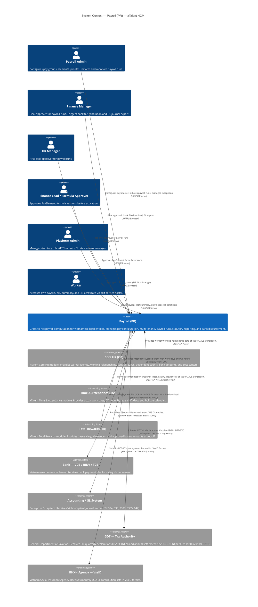

# Context Map — C4 Level 1: System Context

**Artifact**: context-map-l1.md
**Module**: Payroll (PR)
**Solution**: xTalent HCM
**Step**: 4 — Solution Architecture
**Date**: 2026-03-31
**Version**: 1.0

---

## 1. Purpose

This C4 Level 1 diagram shows the Payroll (PR) system in the context of its human actors and external systems. It establishes integration boundaries, data flow directions, and communication protocols for all external connections.

---

## 2. C4 Level 1 — System Context Diagram

---

## 3. Actor Summary

| Actor | Role | Interaction |
|-------|------|-------------|
| Payroll Admin | Internal — Payroll team | Configures pay master data; initiates/monitors payroll runs; acknowledges exceptions; generates statutory reports |
| Finance Manager | Internal — Finance team | Final approver (Level 3); triggers bank file generation; triggers GL journal export |
| HR Manager | Internal — HR team | First-level approver (Level 2) for payroll runs |
| Finance Lead / Formula Approver | Internal — Finance team | Approves PayElement formula versions before activation |
| Platform Admin | Internal — IT/Platform | Manages statutory rules for decree changes (PIT brackets, SI rates, minimum wage) |
| Worker | Internal — All employees | Self-service: views payslip, YTD summary, downloads PIT withholding certificate |

---

## 4. External System Integration Summary

| External System | Direction | Pattern | Protocol | Data / Events |
|-----------------|-----------|---------|----------|---------------|
| Core HR (CO) | Upstream | ACL (Anti-Corruption Layer) | REST API pull at cut-off | worker identity, working_relationship, contract_type, dependent_count, bank_account, cost_center, nationality |
| Time & Attendance (TA) | Upstream | OHS (Open Host Service) | Domain Event subscription | `AttendanceLocked` event: actual_work_days, OT hours by type, shift data; `HolidayCalendarUpdated` for cache invalidation |
| Total Rewards (TR) | Upstream | ACL (Anti-Corruption Layer) | REST API pull at cut-off | compensation snapshot: base_salary, allowances_json, approved bonuses — amounts only, no formulas |
| Bank — VCB/BIDV/TCB | Downstream | OHS | SFTP / File Download | Bank payment file in bank-specific format (VcbAdapter, BidvAdapter, TcbAdapter). V2 API push deferred. |
| Accounting / GL System | Downstream | OHS | Domain Event / Message Broker | `GlJournalGenerated` event with VAS journal lines (TK 334, TK 338, TK 3383, TK 3335, TK 642) |
| GDT (Tax Authority) | Downstream | Conformist | File Upload (XML) | PIT 05/KK-TNCN quarterly; 05/QTT-TNCN annual. Non-negotiable Circular 08/2013/TT-BTC format. |
| BHXH Agency (VssID) | Downstream | Conformist | File Upload | D02-LT monthly contribution list. Non-negotiable VssID format. |

---

## 5. Integration Pattern Notes

### ACL (Anti-Corruption Layer)
Used for CO and TR because these modules use different domain language. The ACL translates CO "worker/assignment" vocabulary into PR "working_relationship/compensation_snapshot" vocabulary. PR never exposes CO or TR internal types to its own domain model. `calculation_rule_def` from TR is explicitly blocked from entering PR (ADR enforcement).

### OHS (Open Host Service)
TA publishes a well-defined `AttendanceLocked` event schema that PR subscribes to. PR maps TA data to internal payroll variables without owning the TA domain model. Similarly PR acts as OHS producer toward Bank (payment files) and Accounting (GL events).

### Conformist
GDT and BHXH impose non-negotiable regulatory file formats (XML per Circular 08/2013/TT-BTC and VssID D02-LT). PR must conform to these schemas without negotiation.

---

*This document is the L1 input for context-map-l2.md (container decomposition).*
