# Context Map — C4 Level 2: Container Diagram

**Artifact**: context-map-l2.md
**Module**: Payroll (PR)
**Solution**: xTalent HCM
**Step**: 4 — Solution Architecture
**Date**: 2026-03-31
**Version**: 1.0

---

## 1. Purpose

This C4 Level 2 diagram decomposes the Payroll (PR) system into its internal bounded context containers, shared infrastructure, and the communication patterns between them. Each bounded context is a deployable unit owning its own database schema.

---

## 2. DDD Relationship Types

| Relationship | From → To | Type | Rationale |
|-------------|-----------|------|-----------|
| BC-01 → BC-02 | Pay Master → Statutory Rules | Customer/Supplier | BC-01 binds `statutory_rule_id` to PayProfile (rule_bindings). BC-01 is customer; BC-02 publishes a stable rule contract. |
| BC-02 → BC-03 | Statutory Rules → Payroll Execution | Published Language (read) | BC-03 reads StatutoryRule records via query at run time using `statutory_rule_effective_date`. BC-03 conforms to BC-02's published schema. |
| BC-01 → BC-03 | Pay Master → Payroll Execution | Customer/Supplier | BC-03 consumes PayGroup, PayProfile, PayElement, PayCalendar configuration. BC-01 is upstream supplier. |
| BC-03 → BC-04 | Payroll Execution → Payment Output | Customer/Supplier | BC-04 consumes finalized PayrollResult + PayPeriod (read-only) to generate bank files, GL entries, payslips. |
| BC-03 → BC-05 | Payroll Execution → Statutory Reporting | Customer/Supplier | BC-05 reads PayrollResult data to generate BHXH and PIT reports. |
| BC-03 → BC-06 | Payroll Execution → Worker Self-Service | Customer/Supplier | BC-06 serves worker-facing views derived from PayrollResult and PayslipDocument. |
| BC-04 → BC-06 | Payment Output → Worker Self-Service | Customer/Supplier | BC-06 references PayslipDocument generated by BC-04. |
| BC-05 → BC-06 | Statutory Reporting → Worker Self-Service | Customer/Supplier | BC-06 links PitCertificate from BC-05 for worker download. |
| All BCs → BC-07 | All → Audit Trail | Published Language (write) | All BCs publish domain events to BC-07 (insert-only). BC-07 defines the AuditLog schema; all BCs conform to it. |

---

## 3. C4 Level 2 — Container Diagram

```mermaid
C4Container
  title Container Diagram — Payroll (PR) — xTalent HCM

  Person(payroll_admin, "Payroll Admin")
  Person(finance_manager, "Finance Manager")
  Person(hr_manager, "HR Manager")
  Person(worker, "Worker")
  Person(platform_admin, "Platform Admin")

  System_Ext(core_hr, "Core HR (CO)", "ACL upstream")
  System_Ext(time_attendance, "Time & Attendance (TA)", "OHS upstream")
  System_Ext(total_rewards, "Total Rewards (TR)", "ACL upstream")
  System_Ext(bank, "Bank VCB/BIDV/TCB", "OHS downstream")
  System_Ext(accounting, "Accounting / GL", "OHS downstream")
  System_Ext(gdt, "GDT Tax Authority", "Conformist downstream")
  System_Ext(bhxh, "BHXH Agency", "Conformist downstream")

  Container_Boundary(pr, "Payroll System (PR)") {

    Container(api_gateway, "API Gateway", "Kong / AWS API Gateway", "Routes external HTTP requests to internal BC APIs. Enforces auth (JWT/OAuth2). Rate limiting. legal_entity_id header injection.")

    Container(bc01, "BC-01: Pay Master API", "Spring Boot / Java 21", "Manages PayGroup, PayCalendar, PayElement (with formula lifecycle), PayProfile (with polymorphic pay methods), WorkerPayGroupAssignment.")
    ContainerDb(db01, "pay_master DB schema", "PostgreSQL 16", "Tables: pay_group, pay_calendar, pay_element, pay_element_formula_version, pay_profile, pay_profile_element_binding, pay_profile_rule_binding, worker_pay_group_assignment, hourly_rate_config, piece_rate_table, piece_rate_table_entry, pay_scale_table, pay_scale_table_entry. RLS by legal_entity_id.")

    Container(bc02, "BC-02: Statutory Rules API", "Spring Boot / Java 21", "Manages versioned statutory rules: PIT brackets, SI rates, OT multipliers, minimum wage. Effective-date pattern.")
    ContainerDb(db02, "statutory_rules DB schema", "PostgreSQL 16", "Tables: statutory_rule, si_eligibility_matrix, pit_bracket, minimum_wage_config. RLS by legal_entity_id (global rules: legal_entity_id = NULL).")

    Container(bc03, "BC-03: Payroll Execution Engine", "Spring Boot + Drools 8 / Java 21", "Gross-to-net computation. PayPeriod state machine. PayrollRun lifecycle. CompensationSnapshot creation at cut-off. Batch partitioning via KieSessions.")
    ContainerDb(db03, "payroll_execution DB schema", "PostgreSQL 16", "Tables: pay_period, payroll_run, payroll_run_approval, payroll_result (immutable), calc_log_entry, payroll_exception, compensation_snapshot (immutable), retroactive_adjustment. RLS by legal_entity_id.")

    Container(bc04, "BC-04: Payment Output Service", "Spring Boot / Java 21", "Generates bank payment files (VcbAdapter, BidvAdapter, TcbAdapter), GL journal entries (VAS TK codes), payslip PDFs.")
    ContainerDb(db04, "payment_output DB schema", "PostgreSQL 16", "Tables: bank_payment_file, bank_payment_item, gl_journal, gl_journal_line, payslip_document. RLS by legal_entity_id.")

    Container(bc05, "BC-05: Statutory Reporting Service", "Spring Boot / Java 21", "Generates BHXH D02-LT (VssID), PIT 05/KK-TNCN (XML), PIT 05/QTT-TNCN annual settlement certificates.")
    ContainerDb(db05, "statutory_reporting DB schema", "PostgreSQL 16", "Tables: bhxh_report, bhxh_report_item, pit_declaration, pit_declaration_item, pit_certificate. RLS by legal_entity_id.")

    Container(bc06, "BC-06: Worker Self-Service API", "Spring Boot / Java 21", "Worker portal: payslip view sessions, YTD summaries, PIT certificate request workflow. Read-only access to finalized payroll data.")
    ContainerDb(db06, "worker_self_service DB schema", "PostgreSQL 16", "Tables: payslip_view_session, ytd_summary, pit_certificate_request. RLS by working_relationship_id.")

    Container(bc07, "BC-07: Audit Trail Service", "Spring Boot / Java 21", "Receives insert-only audit events from all BCs. SHA-256 integrity hash verification (nightly job). 7-year retention.")
    ContainerDb(db07, "audit_trail DB schema", "PostgreSQL 16 (append-only)", "Tables: audit_log (INSERT ONLY — no UPDATE/DELETE), integrity_hash_record. Partitioned by month.")

    Container(message_broker, "Message Broker", "Apache Kafka (or DB-backed Outbox — AQ-S2)", "Event bus for async inter-BC communication and external integration events. Topics per BC + integration topics.")

    Container(acl_co, "CO ACL Adapter", "Spring Boot Component (within BC-03)", "Translates CO worker/working_relationship data into PR CompensationSnapshot domain type. Called at cut-off. Ensures CO entity types never enter PR domain.")

    Container(acl_tr, "TR ACL Adapter", "Spring Boot Component (within BC-03)", "Translates TR compensation data (base_salary, allowances) into PR CompensationSnapshot. Ensures TR calculation_rule_def never enters PR domain.")

  }

  Rel(payroll_admin, api_gateway, "HTTPS", "REST / JSON")
  Rel(finance_manager, api_gateway, "HTTPS", "REST / JSON")
  Rel(hr_manager, api_gateway, "HTTPS", "REST / JSON")
  Rel(worker, api_gateway, "HTTPS", "REST / JSON")
  Rel(platform_admin, api_gateway, "HTTPS", "REST / JSON")

  Rel(api_gateway, bc01, "Routes /pay-master/**", "REST / internal HTTP")
  Rel(api_gateway, bc02, "Routes /statutory-rules/**", "REST / internal HTTP")
  Rel(api_gateway, bc03, "Routes /payroll/**", "REST / internal HTTP")
  Rel(api_gateway, bc04, "Routes /payment-output/**", "REST / internal HTTP")
  Rel(api_gateway, bc05, "Routes /statutory-reporting/**", "REST / internal HTTP")
  Rel(api_gateway, bc06, "Routes /self-service/**", "REST / internal HTTP")

  Rel(bc03, acl_co, "Calls at cut-off", "Internal method call")
  Rel(acl_co, core_hr, "Fetches worker data", "REST API")
  Rel(bc03, acl_tr, "Calls at cut-off", "Internal method call")
  Rel(acl_tr, total_rewards, "Fetches compensation snapshot", "REST API")
  Rel(time_attendance, message_broker, "Publishes AttendanceLocked, HolidayCalendarUpdated", "Kafka topic: ta.attendance")
  Rel(message_broker, bc03, "Delivers AttendanceLocked event", "Kafka consumer group")

  Rel(bc01, db01, "Reads / Writes", "JDBC / PostgreSQL")
  Rel(bc02, db02, "Reads / Writes", "JDBC / PostgreSQL")
  Rel(bc03, db03, "Reads / Writes", "JDBC / PostgreSQL")
  Rel(bc03, db01, "Reads pay config (PayProfile, PayElement, PayGroup)", "JDBC read-only / query")
  Rel(bc03, db02, "Reads statutory rules by effective_date", "JDBC read-only / query")
  Rel(bc04, db04, "Reads / Writes", "JDBC / PostgreSQL")
  Rel(bc04, db03, "Reads PayrollResult (read-only)", "JDBC read-only / query")
  Rel(bc05, db05, "Reads / Writes", "JDBC / PostgreSQL")
  Rel(bc05, db03, "Reads PayrollResult (read-only)", "JDBC read-only / query")
  Rel(bc06, db06, "Reads / Writes", "JDBC / PostgreSQL")
  Rel(bc06, db04, "Reads PayslipDocument metadata", "JDBC read-only / query")
  Rel(bc06, db03, "Reads YTD data from PayrollResult", "JDBC read-only / query")
  Rel(bc06, db05, "Reads PitCertificate for download", "JDBC read-only / query")
  Rel(bc07, db07, "Inserts audit records", "JDBC / PostgreSQL")

  Rel(bc01, message_broker, "Publishes PayGroupCreated, PayElementActivated, etc.", "Kafka topic: pr.pay-master")
  Rel(bc02, message_broker, "Publishes StatutoryRuleActivated, PitBracketsUpdated, etc.", "Kafka topic: pr.statutory-rules")
  Rel(bc03, message_broker, "Publishes CutOffReached, PayrollRunApproved, PayPeriodLocked, etc.", "Kafka topic: pr.payroll-execution")
  Rel(bc04, message_broker, "Publishes BankPaymentFileGenerated, GlJournalGenerated", "Kafka topic: pr.payment-output")
  Rel(bc05, message_broker, "Publishes BhxhReportGenerated, PitDeclarationGenerated", "Kafka topic: pr.statutory-reporting")
  Rel(message_broker, bc07, "All PR topics consumed for audit", "Kafka consumer group: audit-trail")
  Rel(message_broker, accounting, "Delivers GlJournalGenerated event", "Kafka topic: pr.payment-output")

  Rel(bc04, bank, "Bank payment file (VCB/BIDV/TCB format)", "SFTP / File Download")
  Rel(bc05, gdt, "PIT XML 05/KK-TNCN quarterly, 05/QTT-TNCN annual", "HTTPS File Upload")
  Rel(bc05, bhxh, "BHXH D02-LT monthly VssID", "HTTPS File Upload")
```

---

## 4. Container Responsibilities

| Container | Technology | Key Responsibilities |
|-----------|-----------|---------------------|
| API Gateway | Kong / AWS API GW | Auth (JWT/OAuth2), routing, rate limiting, `legal_entity_id` header injection from JWT claims |
| BC-01 Pay Master API | Spring Boot + Java 21 | PayGroup CRUD, PayElement formula lifecycle, PayProfile polymorphism, WorkerPayGroupAssignment |
| BC-02 Statutory Rules API | Spring Boot + Java 21 | StatutoryRule versioning, effective-date lookups, SI eligibility matrix, PIT bracket management |
| BC-03 Payroll Execution Engine | Spring Boot + Drools 8 | Gross-to-net calculation, PayPeriod/PayrollRun state machines, cut-off snapshot orchestration, batch partitioning |
| BC-04 Payment Output Service | Spring Boot + Java 21 | Bank file generation (VCB/BIDV/TCB adapters), GL journal generation (VAS TK codes), payslip PDF generation |
| BC-05 Statutory Reporting Service | Spring Boot + Java 21 | BHXH D02-LT generation, PIT quarterly/annual XML generation, PIT certificate generation |
| BC-06 Worker Self-Service API | Spring Boot + Java 21 | Payslip view session tracking, YTD summary computation, PIT certificate request workflow |
| BC-07 Audit Trail Service | Spring Boot + Java 21 | Insert-only audit log ingestion, SHA-256 integrity hash verification job (nightly), 7-year retention management |
| Message Broker | Apache Kafka | Async event delivery between BCs; external integration events (TA, Accounting) |
| CO ACL Adapter | Component in BC-03 | Translate CO domain → PR `CompensationSnapshot` domain type. Language isolation boundary. |
| TR ACL Adapter | Component in BC-03 | Translate TR compensation data → PR `CompensationSnapshot`. Block `calculation_rule_def` from entering PR. |

---

## 5. Data Ownership and Cross-Schema Access Rules

| BC | Owns | Read-Only Access To |
|----|------|---------------------|
| BC-01 Pay Master | pay_master schema | — |
| BC-02 Statutory Rules | statutory_rules schema | — |
| BC-03 Payroll Execution | payroll_execution schema | pay_master (PayProfile, PayElement, PayGroup), statutory_rules (StatutoryRule at effective_date) |
| BC-04 Payment Output | payment_output schema | payroll_execution (PayrollResult, PayPeriod) |
| BC-05 Statutory Reporting | statutory_reporting schema | payroll_execution (PayrollResult aggregated by period) |
| BC-06 Worker Self-Service | worker_self_service schema | payroll_execution (PayrollResult for YTD), payment_output (PayslipDocument), statutory_reporting (PitCertificate) |
| BC-07 Audit Trail | audit_trail schema | — (insert-only) |

Cross-schema reads are performed via dedicated read-only JDBC connections. Write operations are strictly confined to the owning BC's schema.

---

## 6. Hot Spot Decisions

### HS-5: Drools 8 Performance (P0)
BC-03 must implement KieSession partitioning: one partition per legal_entity_id, worker batch size of 50. This allows parallel execution. POC required before production deployment — gate on < 30s for 1,000 workers.

### HS-6: 183-Day PIT Residency Retro (P0)
Retroactive adjustments of type `RESIDENCY_CHANGE` are processed via a dedicated async queue isolated from the regular payroll run queue. The `retroactive_adjustment` table stores the delta; the next open period picks up the `RETRO_ADJUSTMENT` pay element automatically.

### HS-1: TA Data Completeness (P0)
PR defines completeness threshold at 95%. If `AttendanceLocked` events received / total workers in pay group < 0.95 at cut-off time + 2 hours, PayrollRun is blocked and a `PreValidationFailed` event is fired. Payroll Admin receives alert with list of missing workers.

---

*This document is the L2 input for db.dbml (database schema design).*
