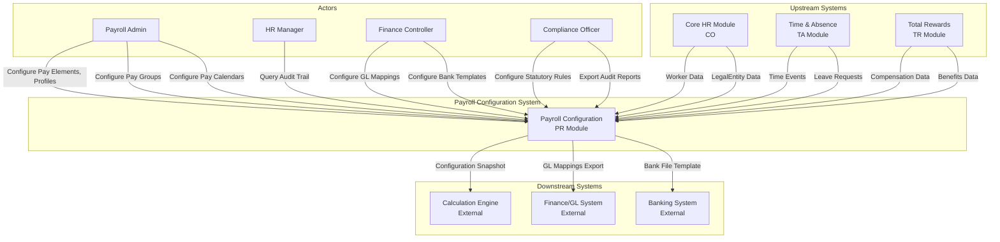

# Context Map - C4 Level 1: System Context

> **Module**: Payroll (PR)
> **Phase**: Solution Architecture (Step 4)
> **Date**: 2026-03-31
> **Version**: 1.0

---

## Overview

This document presents the C4 Level 1 (System Context) diagram for the Payroll Configuration module within the xTalent HCM solution. The system context shows the Payroll system as a whole, its external actors, and the systems it interacts with.

---

## System Context Diagram

---

## System Description

### Payroll Configuration System

| Attribute | Description |
|-----------|-------------|
| **Purpose** | Manages payroll configuration data (pay elements, profiles, statutory rules, calendars, pay groups) for payroll calculation engine |
| **Scope** | Configuration only - NOT runtime calculation engine |
| **Primary Users** | Payroll Admin, HR Manager, Finance Controller, Compliance Officer |
| **Technology** | REST API, Database persistence, Event-driven integration |

---

## Actors

### Primary Actors

| Actor | Role | Key Activities |
|-------|------|----------------|
| Payroll Admin | Primary configuration user | Create/update pay elements, profiles, formulas, calendars, pay groups |
| HR Manager | Management oversight | Review configurations, query audit trail, approve changes |
| Finance Controller | Finance integration owner | Configure GL mappings, bank templates, export finance data |
| Compliance Officer | Statutory compliance owner | Configure statutory rules (BHXH, BHYT, BHTN, PIT), validate compliance, export audit reports |

### Secondary Actors

| Actor | Role | Trigger Type |
|-------|------|--------------|
| System | Automated processes | Scheduled jobs, validation triggers |
| Calculation Engine | Downstream consumer | API request for configuration snapshot |
| Finance System | Downstream consumer | File export for GL posting |
| Banking System | Downstream consumer | File export for payment processing |

---

## External Systems

### Upstream Systems (Data Sources)

| System | Module Code | Data Provided | Integration Type |
|--------|-------------|---------------|------------------|
| Core HR | CO | Worker, LegalEntity, EmploymentAssignment | REST API (sync) |
| Time & Absence | TA | TimeEvent, LeaveRequest, Overtime | Batch sync |
| Total Rewards | TR | Compensation, Benefit, Allowance | REST API (sync) |

### Downstream Systems (Data Consumers)

| System | Type | Data Consumed | Integration Type |
|--------|------|---------------|------------------|
| Calculation Engine | Internal xTalent | Configuration snapshot for payroll run | REST API (on-demand) |
| Finance/GL System | External ERP | GL account mappings, posting data | File export (CSV/XML) |
| Banking System | External Banking | Payment file template, employee bank data | File export (CSV/FIXED) |

---

## System Boundary

### In-Boundary Capabilities

| Capability | Description |
|------------|-------------|
| Pay Element Management | Create, update, version, query pay elements (SCD-2) |
| Pay Profile Management | Create, update, assign elements/rules, version profiles (SCD-2) |
| Pay Formula Management | Create, validate, preview calculation formulas |
| Statutory Rule Management | Create, update, configure PIT brackets, version rules (SCD-2) |
| Pay Calendar Management | Create, generate periods, adjust periods |
| Pay Group Management | Create, assign employees, manage groups |
| GL Mapping Management | Create, configure GL account mappings |
| Bank Template Management | Create, configure field mappings for bank files |
| Configuration Validation | Validate consistency, detect conflicts |
| Audit Trail | Log all configuration changes, query, export |

### Out-of-Boundary (External Dependencies)

| Dependency | Source | Purpose |
|------------|--------|---------|
| Worker/Employee Data | Core HR (CO) | Employee assignment reference |
| LegalEntity Data | Core HR (CO) | Configuration scope |
| PayFrequency Reference | Core HR (CO) | Calendar frequency definition |
| Time/Attendance Data | Time & Absence (TA) | Hours-based calculation inputs |
| Compensation Data | Total Rewards (TR) | Salary mapping to pay elements |
| Payroll Calculation | Calculation Engine | NOT part of PR module |
| Actual GL Posting | Finance System | NOT part of PR module |

---

## Integration Contracts Summary

### Inbound Integration

| Integration Point | Source | Data | Frequency |
|-------------------|--------|------|-----------|
| Worker Reference | CO | Worker ID, Name, Status | Real-time (API) |
| LegalEntity Reference | CO | Entity ID, Name, Country | Real-time (API) |
| PayFrequency Reference | CO | Frequency Code, Name | Real-time (API) |
| Time Events | TA | Hours, Overtime, Leave | Batch (daily) |
| Compensation | TR | Salary, Allowances | Real-time (API) |

### Outbound Integration

| Integration Point | Target | Data | Trigger |
|-------------------|--------|------|---------|
| Configuration Snapshot | CalcEngine | Full configuration JSON | On-demand (API) |
| GL Mapping Export | Finance | GL account mappings | Scheduled/On-demand |
| Bank File Template | Banking | Payment file format | Scheduled/On-demand |

---

## Key Architecture Decisions

| Decision | Choice | Rationale |
|----------|--------|-----------|
| Configuration-Only Scope | Separate from Calculation Engine | Clear boundary, allows independent development |
| ID References for External Data | No duplication of CO/TA/TR data | Single source of truth, referential integrity |
| Event-Driven Integration | Domain events for all changes | Enables audit trail, downstream notifications |
| SCD-2 Versioning | PayElement, PayProfile, StatutoryRule | Regulatory requirement for historical tracking |

---

**Document Version**: 1.0
**Created**: 2026-03-31
**Author**: Solution Architect Agent