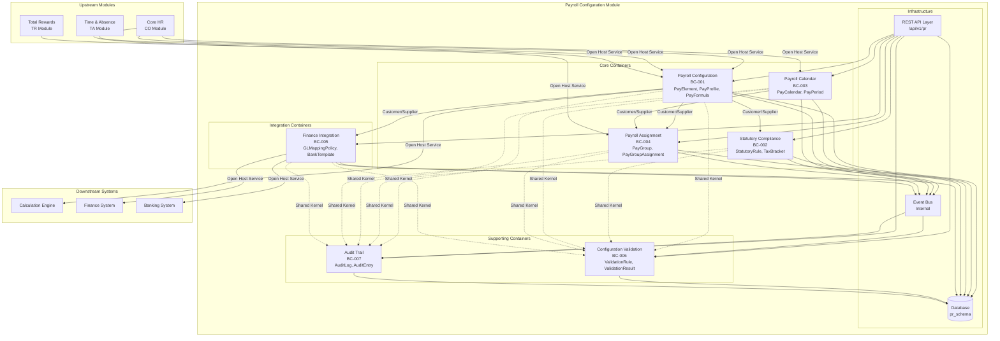

# Context Map - C4 Level 2: Container Diagram

> **Module**: Payroll (PR)
> **Phase**: Solution Architecture (Step 4)
> **Date**: 2026-03-31
> **Version**: 1.0

---

## Overview

This document presents the C4 Level 2 (Container) diagram for the Payroll Configuration module. Containers represent deployable units (bounded contexts as containers) with DDD relationship types between them.

---

## Container Diagram



---

## Container Definitions

### BC-001: Payroll Configuration

| Attribute | Description |
|-----------|-------------|
| **Name** | Payroll Configuration |
| **Code** | `payroll-configuration` |
| **Type** | Domain Container (Core) |
| **Responsibility** | Core configuration domain - manages pay elements, pay profiles, and calculation formulas |
| **Aggregates** | PayElement (SCD-2), PayProfile (SCD-2), PayFormula |
| **Technology** | Domain service, REST endpoints, Event publisher |
| **API Prefix** | `/api/v1/pr/pay-elements`, `/api/v1/pr/pay-profiles`, `/api/v1/pr/formulas` |

**Features**:
- PayElement CRUD with SCD-2 versioning
- PayProfile CRUD with element/rule assignment
- PayFormula CRUD with validation
- Configuration snapshot export

---

### BC-002: Statutory Compliance

| Attribute | Description |
|-----------|-------------|
| **Name** | Statutory Compliance |
| **Code** | `statutory-compliance` |
| **Type** | Domain Container (Core) |
| **Responsibility** | Vietnam statutory rules management - BHXH, BHYT, BHTN, PIT |
| **Aggregates** | StatutoryRule (SCD-2), TaxBracket (VO) |
| **Technology** | Domain service, REST endpoints, Event publisher |
| **API Prefix** | `/api/v1/pr/statutory-rules` |

**Features**:
- StatutoryRule CRUD with SCD-2 versioning
- PIT bracket configuration
- Exemption amount management
- Effective date query

---

### BC-003: Payroll Calendar

| Attribute | Description |
|-----------|-------------|
| **Name** | Payroll Calendar |
| **Code** | `payroll-calendar` |
| **Type** | Domain Container (Core) |
| **Responsibility** | Time-based payroll scheduling - pay periods, cut-off dates, pay dates |
| **Aggregates** | PayCalendar, PayPeriod |
| **Technology** | Domain service, REST endpoints, Period generator |
| **API Prefix** | `/api/v1/pr/pay-calendars` |

**Features**:
- PayCalendar CRUD
- PayPeriod auto-generation
- Period adjustment
- Period status management

---

### BC-004: Payroll Assignment

| Attribute | Description |
|-----------|-------------|
| **Name** | Payroll Assignment |
| **Code** | `payroll-assignment` |
| **Type** | Domain Container (Core) |
| **Responsibility** | Employee-to-payroll mapping - assigns workers to pay groups |
| **Aggregates** | PayGroup, PayGroupAssignment |
| **Technology** | Domain service, REST endpoints, Worker reference |
| **API Prefix** | `/api/v1/pr/pay-groups` |

**Features**:
- PayGroup CRUD
- Employee assignment management
- Assignment history tracking
- Single assignment validation

---

### BC-005: Finance Integration

| Attribute | Description |
|-----------|-------------|
| **Name** | Finance Integration |
| **Code** | `finance-integration` |
| **Type** | Domain Container (Integration) |
| **Responsibility** | External finance and banking system integration |
| **Aggregates** | GLMappingPolicy, BankTemplate |
| **Technology** | Domain service, REST endpoints, File export |
| **API Prefix** | `/api/v1/pr/gl-mappings`, `/api/v1/pr/bank-templates` |

**Features**:
- GLMappingPolicy CRUD
- GL account mapping configuration
- BankTemplate CRUD
- Field mapping configuration
- File export generation

---

### BC-006: Configuration Validation

| Attribute | Description |
|-----------|-------------|
| **Name** | Configuration Validation |
| **Code** | `configuration-validation` |
| **Type** | Supporting Container (Service) |
| **Responsibility** | Cross-aggregate validation - validates configuration consistency |
| **Aggregates** | ValidationRule (service-oriented) |
| **Technology** | Domain service, Validation engine, REST endpoints |
| **API Prefix** | `/api/v1/pr/validations` |

**Features**:
- Configuration validation on save
- Conflict detection
- Circular reference detection
- Version overlap detection

---

### BC-007: Audit Trail

| Attribute | Description |
|-----------|-------------|
| **Name** | Audit Trail |
| **Code** | `audit-trail` |
| **Type** | Supporting Container (Service) |
| **Responsibility** | Configuration change audit - logs all changes for compliance |
| **Aggregates** | AuditLog, AuditEntry (append-only) |
| **Technology** | Event consumer, Audit storage, REST endpoints |
| **API Prefix** | `/api/v1/pr/audit` |

**Features**:
- Audit entry creation (event-driven)
- Audit query by date/entity/user
- Audit report generation
- Audit export (CSV, PDF, JSON)

---

## DDD Relationship Types

### Relationship Matrix

| From BC | To BC | Relationship Type | Pattern | Description |
|---------|-------|-------------------|---------|-------------|
| Payroll Configuration | Statutory Compliance | Upstream-Downstream | Customer/Supplier | PC consumes statutory rules for profile assignment |
| Payroll Configuration | Payroll Assignment | Upstream-Downstream | Customer/Supplier | PC provides profiles for PayGroup assignment |
| Payroll Calendar | Payroll Assignment | Upstream-Downstream | Customer/Supplier | CAL provides calendars for PayGroup assignment |
| Payroll Configuration | Finance Integration | Upstream-Downstream | Customer/Supplier | PC provides elements for GL mapping |
| All BCs | Configuration Validation | Downstream | Shared Kernel | All BCs use validation service |
| All BCs | Audit Trail | Downstream | Shared Kernel | All BCs publish audit events |
| Core HR (CO) | Payroll Configuration | External | Open Host Service | CO provides Worker, LegalEntity data |
| Core HR (CO) | Payroll Calendar | External | Open Host Service | CO provides LegalEntity, PayFrequency |
| Core HR (CO) | Payroll Assignment | External | Open Host Service | CO provides Worker data |
| Time & Absence (TA) | Payroll Configuration | External | Open Host Service | TA provides TimeEvent data |
| Total Rewards (TR) | Payroll Configuration | External | Open Host Service | TR provides Compensation data |
| Payroll Configuration | Calculation Engine | External | Open Host Service | PC exports configuration snapshot |

---

### Relationship Details

#### Customer/Supplier (Internal)

```
Payroll Configuration (Upstream/Supplier)
    │
    ├──> Statutory Compliance (Downstream/Customer)
    │    └── PayProfile references StatutoryRule via ID
    │
    ├──> Payroll Assignment (Downstream/Customer)
    │    └── PayGroup references PayProfile via ID
    │
    └──> Finance Integration (Downstream/Customer)
         └── GLMappingPolicy references PayElement via ID

Payroll Calendar (Upstream/Supplier)
    │
    └──> Payroll Assignment (Downstream/Customer)
         └── PayGroup references PayCalendar via ID
```

#### Shared Kernel (Cross-Cutting)

```
All Domain BCs ──> Configuration Validation
    │
    ├── Validation requests on create/update
    └── Conflict detection results

All Domain BCs ──> Audit Trail
    │
    ├── Event publishing on all changes
    └── Audit entry creation
```

#### Open Host Service (External)

```
Core HR (CO) ──> Payroll Module
    │
    ├── LegalEntity reference (API)
    ├── Worker reference (API)
    └── PayFrequency reference (API)

Time & Absence (TA) ──> Payroll Module
    │
    └── TimeEvent sync (Batch)

Total Rewards (TR) ──> Payroll Module
    │
    └── Compensation reference (API)
```

---

## Container Communication

### Synchronous Communication (REST API)

| Source | Target | Protocol | Purpose |
|--------|--------|----------|---------|
| UI Layer | All BCs | REST/JSON | User operations |
| Calculation Engine | Payroll Configuration | REST/JSON | Configuration snapshot request |
| Core HR | Payroll Assignment | REST/JSON | Worker data sync |
| Total Rewards | Payroll Configuration | REST/JSON | Compensation mapping |

### Asynchronous Communication (Events)

| Source | Event | Target | Purpose |
|--------|-------|--------|---------|
| All BCs | Domain Events | Audit Trail | Audit logging |
| Payroll Configuration | PayElementCreated/Updated | Validation | Trigger validation |
| Payroll Configuration | PayProfileCreated | Downstream | Profile assignment ready |
| Statutory Compliance | StatutoryRuleUpdated | Payroll Configuration | Rule change notification |

---

## Deployment Considerations

### Container Packaging

| Container | Deployment Unit | Scaling Strategy |
|-----------|-----------------|------------------|
| Payroll Configuration | Domain service | Horizontal (per tenant) |
| Statutory Compliance | Domain service | Horizontal (per tenant) |
| Payroll Calendar | Domain service | Horizontal (per tenant) |
| Payroll Assignment | Domain service | Horizontal (per tenant) |
| Finance Integration | Domain service | Horizontal (per tenant) |
| Configuration Validation | Shared service | Shared across tenants |
| Audit Trail | Shared service | Shared across tenants |

### Database Schema Strategy

| Strategy | Description |
|----------|-------------|
| Schema-per-module | `pr_*` schema namespace for all PR tables |
| Foreign Keys | Internal FKs within PR module; External IDs without FK constraints |
| SCD-2 Tables | Separate indexes for version queries |

---

## Quality Attributes

| Attribute | Implementation |
|-----------|----------------|
| **Maintainability** | Clear BC boundaries, ID references, event-driven |
| **Testability** | Each BC independently testable |
| **Scalability** | Horizontal scaling per BC |
| **Auditability** | All changes logged in Audit Trail |
| **Extensibility** | New BCs can be added without modifying existing |
| **Integration** | Open Host Service for external modules |

---

**Document Version**: 1.0
**Created**: 2026-03-31
**Author**: Solution Architect Agent