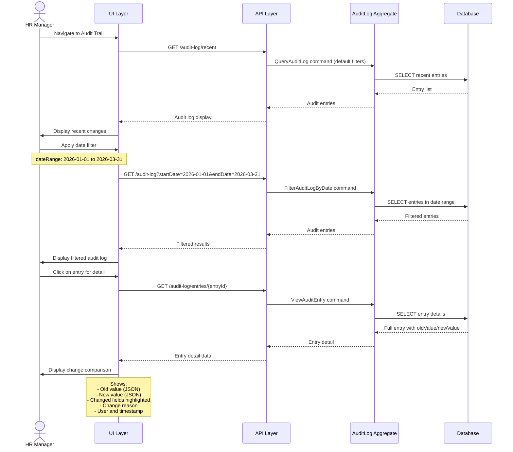
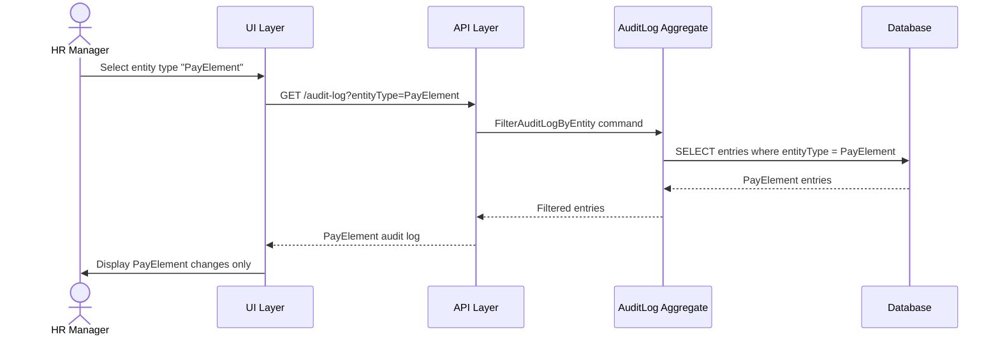
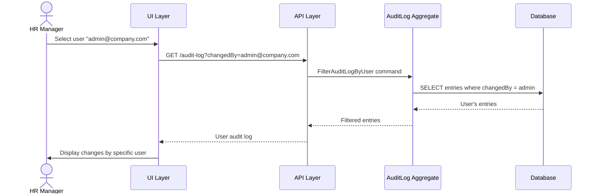
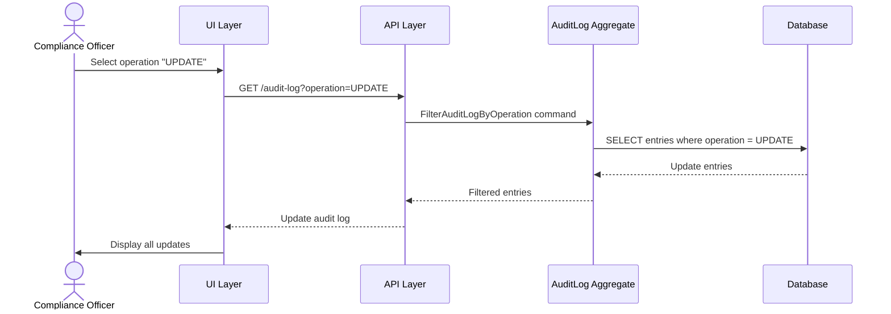
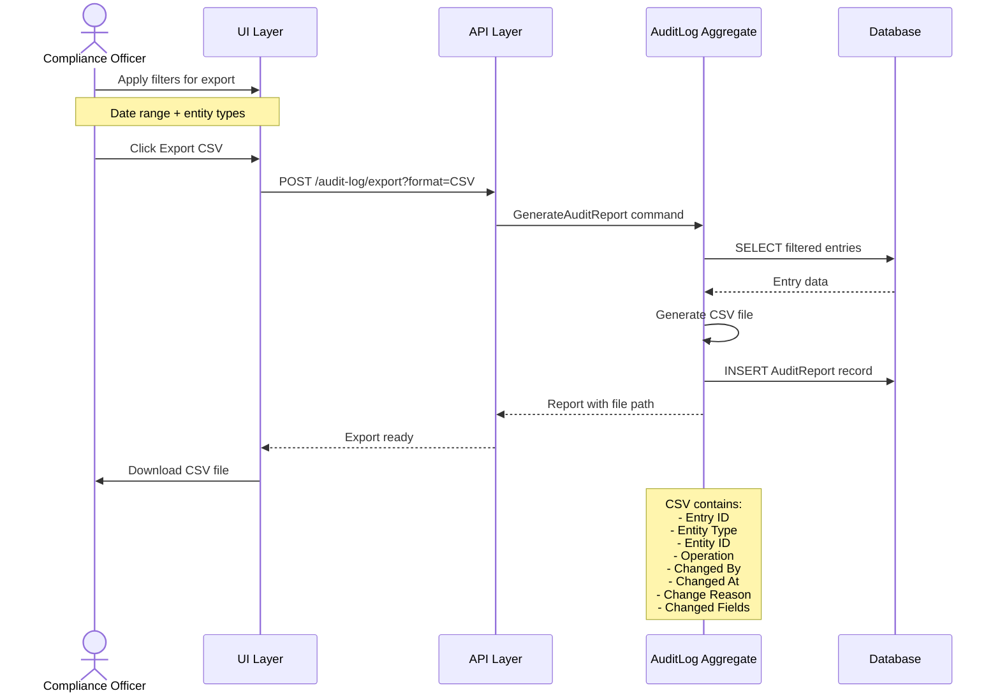
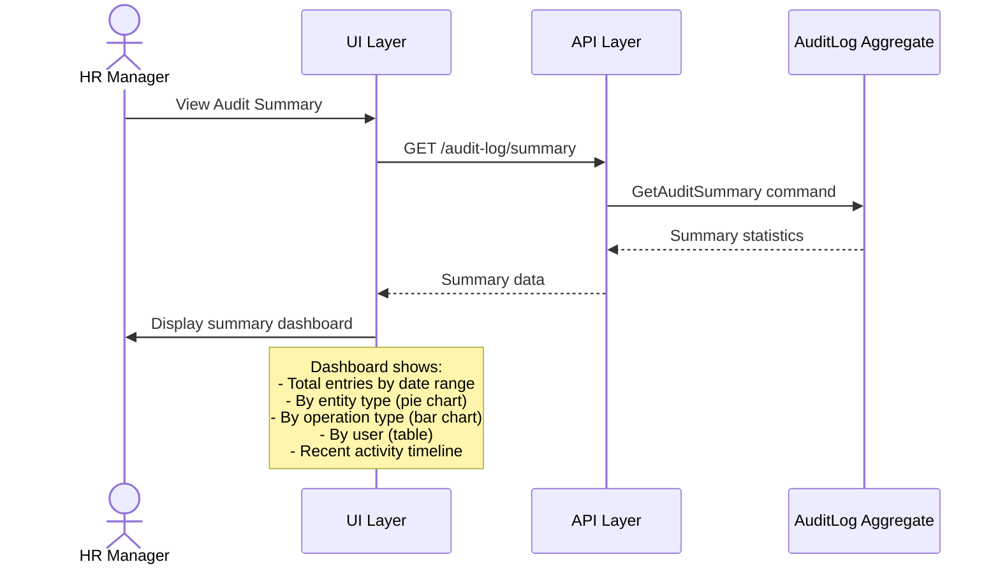

# Use Case Flow - Query Audit Trail

> **Use Case**: UC-AT-001 Query Audit Trail
> **Bounded Context**: Audit Trail (BC-007)
> **Module**: Payroll (PR)
> **Priority**: P0
> **Story Points**: 5

---

## Overview

This flow documents the process of querying the audit trail for configuration changes with various filters.

---

## Actors

| Actor | Role |
|-------|------|
| HR Manager | Primary actor - queries audit trail |
| Compliance Officer | Secondary actor - exports audit reports |
| AuditLog Aggregate | Manages audit queries |

---

## Preconditions

1. HR Manager is logged in with audit query permission
2. Audit entries exist for configuration changes

---

## Postconditions

1. Audit entries returned matching filter criteria
2. Each entry shows entity, operation, user, timestamp
3. Detail view available showing before/after values
4. Export option available

---

## Happy Path



---

## Filter Variations

### Filter by Entity Type



### Filter by User



### Filter by Operation Type



---

## Export Flow



---

## API Contract

### Query Request

```http
GET /api/v1/audit-log?startDate=2026-01-01&endDate=2026-03-31&entityType=PayElement&page=1&size=50
```

### Query Response

```http
HTTP/1.1 200 OK
Content-Type: application/json

{
  "total": 15,
  "page": 1,
  "size": 50,
  "entries": [
    {
      "entryId": "audit-001",
      "entityType": "PayElement",
      "entityId": "SALARY_BASIC",
      "entityName": "Basic Salary",
      "operation": "CREATE",
      "changedBy": "admin@company.com",
      "changedByName": "Nguyen Van Admin",
      "changedAt": "2026-03-31T10:30:00Z",
      "changeReason": "Initial setup",
      "changedFields": ["all"]
    },
    {
      "entryId": "audit-002",
      "entityType": "PayElement",
      "entityId": "BHXH_EE",
      "entityName": "Social Insurance Employee",
      "operation": "VERSION_CREATE",
      "changedBy": "admin@company.com",
      "changedAt": "2026-06-30T14:00:00Z",
      "changeReason": "Government rate increase",
      "changedFields": ["rate", "effectiveStartDate"]
    }
  ]
}
```

### Entry Detail Request

```http
GET /api/v1/audit-log/entries/audit-002
```

### Entry Detail Response

```http
HTTP/1.1 200 OK
Content-Type: application/json

{
  "entryId": "audit-002",
  "entityType": "PayElement",
  "entityId": "BHXH_EE",
  "operation": "VERSION_CREATE",
  "changedBy": "admin@company.com",
  "changedAt": "2026-06-30T14:00:00Z",
  "oldValue": {
    "rate": 0.08,
    "effectiveEndDate": null,
    "isCurrentFlag": true
  },
  "newValue": {
    "rate": 0.085,
    "effectiveStartDate": "2026-07-01",
    "effectiveEndDate": null,
    "isCurrentFlag": true
  },
  "changedFields": ["rate", "effectiveStartDate"],
  "changeReason": "Government rate increase per Decree 2026",
  "versionId": "BHXH_EE_V2",
  "sessionId": "session-456",
  "ipAddress": "192.168.1.100"
}
```

---

## Audit Entry Display

| Column | Description |
|--------|-------------|
| Entry ID | Unique identifier |
| Entity Type | PayElement, PayProfile, etc. |
| Entity ID | Code of entity changed |
| Entity Name | Human-readable name |
| Operation | CREATE, UPDATE, DELETE, ASSIGN |
| Changed By | User email |
| Changed At | Timestamp |
| Change Reason | Reason for change |
| Changed Fields | List of modified fields |

---

## Summary Statistics



---

**Document Version**: 1.0
**Created**: 2026-03-31
**Author**: Domain Architect Agent