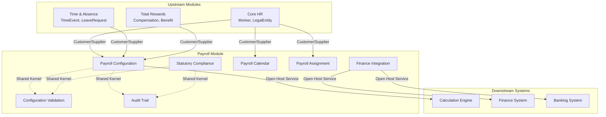

# Bounded Contexts - Payroll Module (PR)

> **Module**: Payroll (PR)
> **Phase**: Domain Architecture (Step 3)
> **Date**: 2026-03-31
> **Version**: 1.0

---

## Overview

This document defines the bounded contexts for the Payroll configuration module, following Domain-Driven Design (DDD) methodology. Each bounded context represents a cohesive domain model with clear boundaries, responsibilities, and integration points.

---

## Context Map

---

## Bounded Context Definitions

### BC-001: Payroll Configuration

| Attribute | Description |
|-----------|-------------|
| **Name** | Payroll Configuration |
| **Code** | `payroll-configuration` |
| **Responsibility** | Core configuration domain - manages pay elements, pay profiles, and calculation formulas |
| **Primary Actor** | Payroll Admin |

**Aggregates Owned**:
| Aggregate | SCD-2 | Description |
|-----------|-------|-------------|
| PayElement | Yes | Fundamental payroll component (earning, deduction, tax) |
| PayProfile | Yes | Configuration bundle for employee groups |
| PayFormula | No | Calculation formula definition |

**Entities**:
- PayElement (Aggregate Root)
- PayElementAssignment (Entity within PayProfile)
- PayFormula (Aggregate Root)

**Key Commands**:
- CreatePayElement, UpdatePayElement, DeletePayElement
- CreatePayProfile, UpdatePayProfile, AssignPayElement
- CreateFormula, ValidateFormula, PreviewFormula

**Key Events**:
- PayElementCreated, PayElementUpdated, PayElementVersionCreated
- PayProfileCreated, PayProfileUpdated, PayElementAssigned
- FormulaCreated, FormulaValidated

**Business Rules**:
- BR-PE-001: Unique element code per legal entity
- BR-PE-003: Soft delete only
- BR-PE-004: In-use protection
- BR-PE-005: Version continuity for SCD-2
- BR-PP-001: Unique profile code per legal entity
- BR-PP-002: Element priority (1-99)
- BR-PP-003: No duplicate elements in profile
- BR-PP-004: Only active elements assignable

**Integration Points**:
| Direction | System | Data |
|-----------|--------|------|
| Inbound | Core HR (CO) | LegalEntity reference |
| Inbound | Total Rewards (TR) | Compensation mapping |
| Outbound | Calculation Engine | Configuration snapshot |

---

### BC-002: Statutory Compliance

| Attribute | Description |
|-----------|-------------|
| **Name** | Statutory Compliance |
| **Code** | `statutory-compliance` |
| **Responsibility** | Vietnam statutory rules management - social insurance, health insurance, unemployment insurance, and personal income tax |
| **Primary Actors** | Payroll Admin, Compliance Officer |

**Aggregates Owned**:
| Aggregate | SCD-2 | Description |
|-----------|-------|-------------|
| StatutoryRule | Yes | Government-mandated contribution or tax rule |

**Entities**:
- StatutoryRule (Aggregate Root)
- TaxBracket (Value Object within StatutoryRule)

**Key Commands**:
- CreateStatutoryRule, UpdateStatutoryRule, DeleteStatutoryRule
- ConfigurePITBrackets, SetPITExemptions
- QueryStatutoryRuleVersions, QueryStatutoryRuleByDate

**Key Events**:
- StatutoryRuleCreated, StatutoryRuleUpdated, StatutoryRuleVersionCreated
- PITBracketConfigured

**Business Rules**:
- BR-SR-001: Rate validation (0-1 range)
- BR-SR-002: Ceiling required for social insurance
- BR-SR-003: PIT brackets must cover full income range
- BR-SR-004: Version non-overlap
- BR-SR-005: Government rates warning

**Vietnam Statutory Reference**:
| Type | Employee Rate | Employer Rate | Ceiling |
|------|---------------|---------------|---------|
| BHXH | 8% | 17.5% | 36,000,000 VND |
| BHYT | 1.5% | 3% | 36,000,000 VND |
| BHTN | 1% | 1% | 36,000,000 VND |
| PIT | Progressive | - | 7 brackets |

**Integration Points**:
| Direction | System | Data |
|-----------|--------|------|
| Outbound | Payroll Configuration | Statutory rule reference |
| Outbound | Calculation Engine | Statutory rule snapshot |

---

### BC-003: Payroll Calendar

| Attribute | Description |
|-----------|-------------|
| **Name** | Payroll Calendar |
| **Code** | `payroll-calendar` |
| **Responsibility** | Time-based payroll scheduling - defines pay periods, cut-off dates, and pay dates |
| **Primary Actor** | Payroll Admin |

**Aggregates Owned**:
| Aggregate | SCD-2 | Description |
|-----------|-------|-------------|
| PayCalendar | No | Pay period definition for legal entity |

**Entities**:
- PayCalendar (Aggregate Root)
- PayPeriod (Entity within PayCalendar)

**Key Commands**:
- CreatePayCalendar, UpdatePayCalendar
- GeneratePayPeriods, AdjustPayPeriod
- QueryPayCalendar

**Key Events**:
- PayCalendarCreated, PayCalendarUpdated
- PayPeriodGenerated, PayPeriodAdjusted

**Business Rules**:
- BR-PC-001: Period dates sequential without gaps
- BR-PC-002: Cut-off date before pay date
- BR-PC-003: Period count matches frequency (12 monthly, 52 weekly)

**Integration Points**:
| Direction | System | Data |
|-----------|--------|------|
| Inbound | Core HR (CO) | LegalEntity, PayFrequency reference |
| Outbound | Payroll Assignment | Calendar reference |

---

### BC-004: Payroll Assignment

| Attribute | Description |
|-----------|-------------|
| **Name** | Payroll Assignment |
| **Code** | `payroll-assignment` |
| **Responsibility** | Employee-to-payroll mapping - assigns employees to pay groups with profile and calendar |
| **Primary Actor** | Payroll Admin |

**Aggregates Owned**:
| Aggregate | SCD-2 | Description |
|-----------|-------|-------------|
| PayGroup | No | Employee assignment to payroll configuration |

**Entities**:
- PayGroup (Aggregate Root)
- PayGroupAssignment (Entity within PayGroup)

**Key Commands**:
- CreatePayGroup, UpdatePayGroup, DeletePayGroup
- AssignEmployeeToGroup, RemoveEmployeeFromGroup
- QueryPayGroup

**Key Events**:
- PayGroupCreated, PayGroupUpdated, PayGroupDeleted
- EmployeeAssignedToGroup, EmployeeRemovedFromGroup

**Business Rules**:
- BR-PG-001: Single employee assignment (one pay group at a time)
- BR-PG-002: Active profile required for assignment
- BR-PG-003: Active calendar required for assignment

**Integration Points**:
| Direction | System | Data |
|-----------|--------|------|
| Inbound | Core HR (CO) | Worker reference (employeeId) |
| Inbound | Payroll Configuration | PayProfile reference |
| Inbound | Payroll Calendar | PayCalendar reference |
| Outbound | Calculation Engine | Employee-payroll mapping |

---

### BC-005: Finance Integration

| Attribute | Description |
|-----------|-------------|
| **Name** | Finance Integration |
| **Code** | `finance-integration` |
| **Responsibility** | External finance and banking system integration - GL mappings and bank file templates |
| **Primary Actors** | Finance Controller, Payroll Admin |

**Aggregates Owned**:
| Aggregate | SCD-2 | Description |
|-----------|-------|-------------|
| GLMappingPolicy | No | GL account allocation for pay elements |
| BankTemplate | No | Bank file format configuration |

**Entities**:
- GLMappingPolicy (Aggregate Root)
- GLMapping (Entity within GLMappingPolicy)
- BankTemplate (Aggregate Root)
- FieldMapping (Entity within BankTemplate)

**Key Commands**:
- CreateGLMapping, UpdateGLMapping, DeleteGLMapping
- ExportGLMappings
- CreateBankTemplate, UpdateBankTemplate, ConfigureFieldMapping
- PreviewBankTemplate

**Key Events**:
- GLMappingCreated, GLMappingUpdated
- BankTemplateCreated, BankTemplateUpdated

**Business Rules**:
- GL mapping percentages must total 100% for splits
- GL account codes must be valid format
- Field mappings must be unique per template

**Integration Points**:
| Direction | System | Data |
|-----------|--------|------|
| Inbound | Payroll Configuration | PayElement reference |
| Outbound | Finance System | GL mapping export |
| Outbound | Banking System | Bank template export |

---

### BC-006: Configuration Validation

| Attribute | Description |
|-----------|-------------|
| **Name** | Configuration Validation |
| **Code** | `configuration-validation` |
| **Responsibility** | Cross-aggregate validation service - validates configuration consistency and detects conflicts |
| **Primary Actors** | Payroll Admin, System |

**Aggregates Owned**:
| Aggregate | SCD-2 | Description |
|-----------|-------|-------------|
| ValidationRule | No | Validation rule definition (service-oriented) |

**Key Commands**:
- ValidateConfiguration
- DetectConflicts
- ResolveConflict

**Key Events**:
- ConfigurationValidated, ConfigurationValidationFailed
- ConflictDetected, ConflictResolved
- CircularReferenceDetected, VersionConflictDetected

**Validation Types**:
| Type | Description | Scope |
|------|-------------|-------|
| Field Validation | Single field constraints | Single entity |
| Cross-field Validation | Multiple field consistency | Single entity |
| Entity Validation | Entity completeness | Single entity |
| Cross-entity Validation | Reference validity | Multiple entities |
| Business Rule Validation | Domain-specific rules | Multiple entities |
| Conflict Detection | Overlapping/duplicate detection | Multiple entities |

**Integration Points**:
| Direction | Bounded Context | Purpose |
|-----------|-----------------|---------|
| Inbound | All BCs | Validation requests |
| Outbound | All BCs | Validation results |

---

### BC-007: Audit Trail

| Attribute | Description |
|-----------|-------------|
| **Name** | Audit Trail |
| **Code** | `audit-trail` |
| **Responsibility** | Configuration change audit - logs all configuration changes for compliance and investigation |
| **Primary Actors** | HR Manager, Compliance Officer |

**Aggregates Owned**:
| Aggregate | SCD-2 | Description |
|-----------|-------|-------------|
| AuditLog | No | Change audit trail (append-only) |

**Entities**:
- AuditLog (Aggregate Root)
- AuditEntry (Entity within AuditLog - immutable)

**Key Commands**:
- QueryAuditLog
- FilterAuditLogByDate, FilterAuditLogByEntity, FilterAuditLogByUser
- ExportAuditLog

**Key Events**:
- AuditLogCreated, AuditLogQueried, AuditReportExported

**Audit Entry Attributes**:
| Attribute | Type | Description |
|-----------|------|-------------|
| entityType | String | PayElement, PayProfile, StatutoryRule, etc. |
| entityId | String | Entity identifier |
| operation | Enum | CREATE, UPDATE, DELETE |
| changedBy | String | User who made change |
| changedAt | Timestamp | When change occurred |
| oldValue | JSON | Previous state (for UPDATE) |
| newValue | JSON | New state |
| changeReason | String | Reason for change |
| versionId | String | Link to SCD-2 version (if applicable) |

**Integration Points**:
| Direction | Bounded Context | Purpose |
|-----------|-----------------|---------|
| Inbound | All BCs | Audit entry creation |
| Outbound | External Auditor | Audit export |

---

## Context Relationships

### Relationship Matrix

| From | To | Relationship | Pattern | Data |
|------|-----|--------------|---------|------|
| Payroll Configuration | Statutory Compliance | Upstream-Downstream | Customer/Supplier | StatutoryRuleAssignment |
| Payroll Configuration | Payroll Calendar | Independent | Separate Ways | - |
| Payroll Configuration | Payroll Assignment | Upstream-Downstream | Customer/Supplier | PayProfile reference |
| Payroll Calendar | Payroll Assignment | Upstream-Downstream | Customer/Supplier | PayCalendar reference |
| Payroll Configuration | Finance Integration | Upstream-Downstream | Customer/Supplier | PayElement reference |
| All BCs | Configuration Validation | Downstream | Shared Kernel | Validation requests |
| All BCs | Audit Trail | Downstream | Shared Kernel | Audit entries |
| Core HR (CO) | Payroll Configuration | Upstream | Open Host Service | LegalEntity, Worker |
| Core HR (CO) | Payroll Calendar | Upstream | Open Host Service | LegalEntity |
| Core HR (CO) | Payroll Assignment | Upstream | Open Host Service | Worker |
| Time & Absence (TA) | Payroll Configuration | Upstream | Open Host Service | TimeEvent |
| Total Rewards (TR) | Payroll Configuration | Upstream | Open Host Service | Compensation |
| Payroll Configuration | Calculation Engine | Downstream | Open Host Service | Configuration snapshot |

---

## Context Boundaries

### In-Boundary Responsibilities

| Bounded Context | Owns | Does Not Own |
|-----------------|------|--------------|
| Payroll Configuration | PayElement, PayProfile, PayFormula lifecycle, validation, versioning | Worker data, Legal entity data, Time data, Compensation data |
| Statutory Compliance | StatutoryRule lifecycle, bracket configuration, versioning | Pay element calculations, Employee-specific deductions |
| Payroll Calendar | PayCalendar, PayPeriod lifecycle, period generation | Employee assignments, Payroll processing |
| Payroll Assignment | PayGroup, PayGroupAssignment lifecycle | Profile content, Calendar periods |
| Finance Integration | GLMappingPolicy, BankTemplate lifecycle | Payroll calculation, Actual GL posting |
| Configuration Validation | Validation rules, conflict detection | Entity CRUD operations |
| Audit Trail | Audit entry storage, query, export | Entity content modification |

### Cross-Boundary Communication

| Communication Type | Pattern | Example |
|--------------------|---------|---------|
| Reference by ID | ID reference, not object navigation | PayProfile.statutoryRuleAssignments[].statutoryRuleId |
| Validation Request | Service invocation | ValidationRule.validate(configuration) |
| Audit Logging | Event publishing | All BCs publish audit events to Audit Trail |
| Integration Snapshot | Data export | Payroll Configuration exports snapshot to CalcEngine |

---

## Entity Ownership

### Module-Owned Entities

| Entity | Owning BC | SCD-2 | Primary Key |
|--------|-----------|-------|-------------|
| PayElement | Payroll Configuration | Yes | elementCode |
| PayProfile | Payroll Configuration | Yes | profileCode |
| PayFormula | Payroll Configuration | No | formulaId |
| PayElementAssignment | Payroll Configuration | No | id (composite) |
| StatutoryRule | Statutory Compliance | Yes | ruleCode |
| TaxBracket | Statutory Compliance | No | bracketId (within rule) |
| PayCalendar | Payroll Calendar | No | calendarCode |
| PayPeriod | Payroll Calendar | No | periodId (within calendar) |
| PayGroup | Payroll Assignment | No | groupCode |
| PayGroupAssignment | Payroll Assignment | No | id (composite) |
| GLMappingPolicy | Finance Integration | No | policyCode |
| GLMapping | Finance Integration | No | mappingId (within policy) |
| BankTemplate | Finance Integration | No | templateCode |
| FieldMapping | Finance Integration | No | mappingId (within template) |
| ValidationRule | Configuration Validation | No | ruleCode |
| AuditLog | Audit Trail | No | logId |
| AuditEntry | Audit Trail | No | entryId |

### Referenced Entities (External Modules)

| Entity | Source Module | Reference Type | Reference Field |
|--------|---------------|----------------|-----------------|
| Worker | Core HR (CO) | ID reference | employeeId |
| LegalEntity | Core HR (CO) | ID reference | legalEntityId |
| EmploymentAssignment | Core HR (CO) | ID reference | assignmentId |
| TimeEvent | Time & Absence (TA) | ID reference | timeEventId |
| LeaveRequest | Time & Absence (TA) | ID reference | leaveRequestId |
| Compensation | Total Rewards (TR) | ID reference | compensationId |
| Benefit | Total Rewards (TR) | ID reference | benefitId |
| PayFrequency | Reference Data | ID reference | payFrequencyId |

---

## Anti-Patterns Avoided

| Anti-Pattern | Description | How Avoided |
|--------------|-------------|-------------|
| God Context | Single context handling all responsibilities | 7 focused contexts with clear boundaries |
| Anemic Domain | Entities without behavior | Each aggregate has commands, events, validation |
| Context Overlap | Multiple contexts managing same entity | Clear entity ownership matrix |
| CRUD-Only | Only CRUD without domain logic | Business rules, validation, versioning logic |
| Distributed Monolith | Tight coupling between contexts | ID references, event-driven integration |

---

## SCD-2 Versioning Strategy

### Entities with SCD-2

| Entity | Versioning Trigger | Version Columns |
|--------|-------------------|-----------------|
| PayElement | Update to rate, classification, formula | effectiveStartDate, effectiveEndDate, isCurrentFlag, versionReason |
| PayProfile | Update to elements, rules, frequency | effectiveStartDate, effectiveEndDate, isCurrentFlag, versionReason |
| StatutoryRule | Update to rate, ceiling, brackets | effectiveStartDate, effectiveEndDate, isCurrentFlag, versionReason |

### SCD-2 Business Rules

| Rule ID | Description |
|---------|-------------|
| BR-VM-001 | SCD-2 pattern for designated entities |
| BR-VM-002 | Single current version (isCurrentFlag = true) |
| BR-VM-003 | Change reason required for all version changes |
| BR-VM-004 | Audit trail for all changes |
| BR-VM-005 | Version continuity (no gaps in effective dates) |

---

## Recommendations for Implementation

### Context Implementation Priority

| Priority | Bounded Context | Rationale |
|----------|-----------------|-----------|
| P0 | Payroll Configuration | Core domain, most complexity |
| P0 | Statutory Compliance | Compliance requirement, versioning |
| P0 | Audit Trail | Mandatory for compliance |
| P0 | Payroll Calendar | Required for processing |
| P1 | Payroll Assignment | Depends on Configuration and Calendar |
| P1 | Configuration Validation | Cross-aggregate service |
| P1 | Finance Integration | Integration layer |

### Technical Recommendations

1. **Separate Database Tables**: Each bounded context should have its own schema/table group
2. **API Segregation**: Expose separate API endpoints per bounded context
3. **Event Publishing**: Use event-driven architecture for cross-context communication
4. **Validation Service**: Implement as domain service, not within aggregates
5. **Audit Integration**: Use middleware or event handlers for automatic audit logging
6. **Integration Layer**: Create separate integration service for external module communication

---

**Document Version**: 1.0
**Created**: 2026-03-31
**Author**: Domain Architect Agent