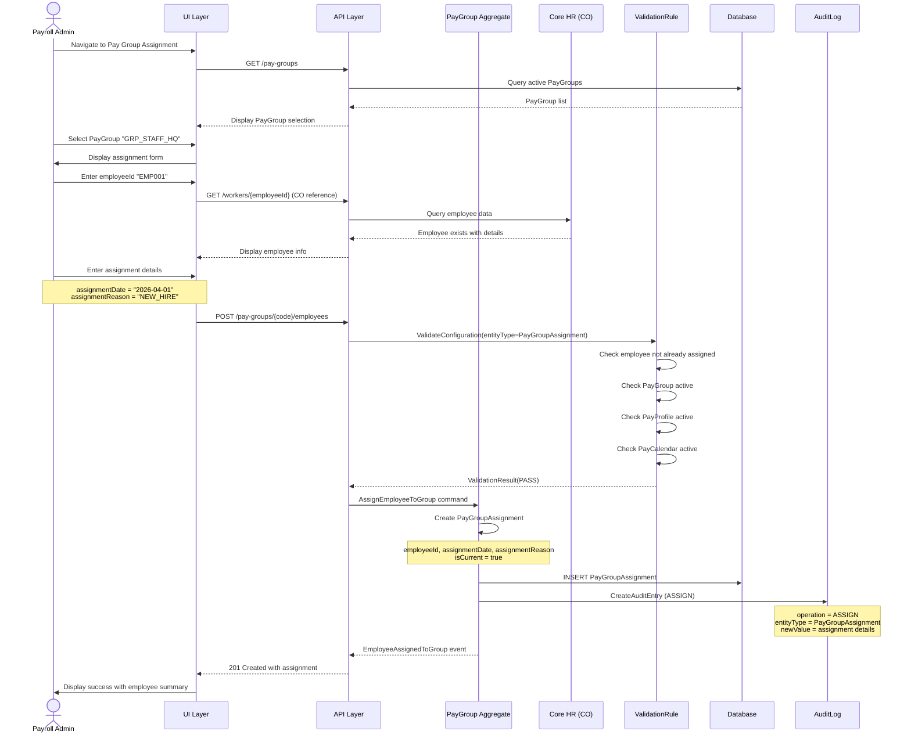
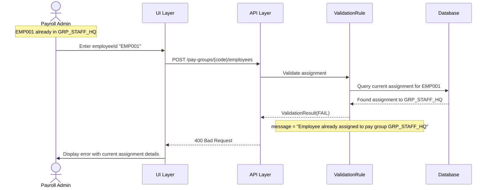
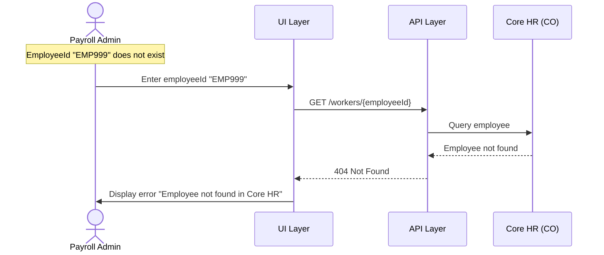
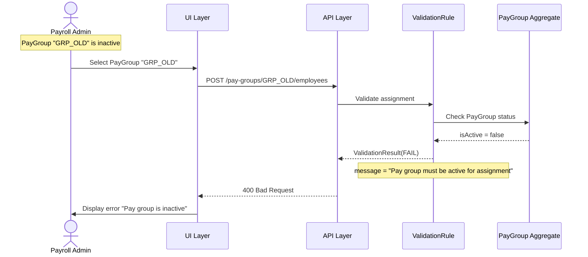
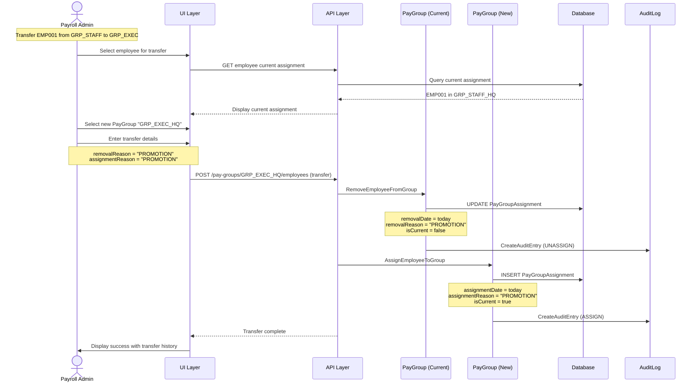
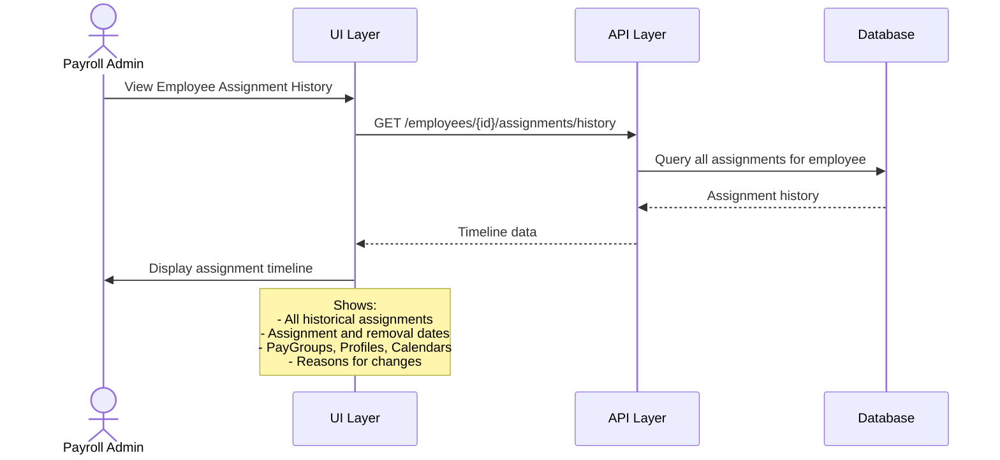

# Use Case Flow - Assign Employee to Pay Group

> **Use Case**: UC-PG-001 Assign Employee to Pay Group
> **Bounded Context**: Payroll Assignment (BC-004)
> **Module**: Payroll (PR)
> **Priority**: P0
> **Story Points**: 5

---

## Overview

This flow documents the process of assigning an employee to a pay group, linking them to a pay profile and pay calendar.

---

## Actors

| Actor | Role |
|-------|------|
| Payroll Admin | Primary actor - initiates assignment |
| Core HR (CO) | External - provides employee data |
| ValidationRule | Secondary - validates assignment |
| PayGroup Aggregate | Manages assignments |
| AuditLog | Secondary - logs assignment |

---

## Preconditions

1. Payroll Admin is logged in with assignment permission
2. Employee (Worker) exists in Core HR (CO) module
3. PayGroup exists with active PayProfile and PayCalendar
4. Employee is not currently assigned to another PayGroup

---

## Postconditions

1. PayGroupAssignment created linking employee to PayGroup
2. Employee inherits PayProfile elements and PayCalendar periods
3. Assignment history recorded
4. Audit entry created
5. Employee available for payroll processing

---

## Happy Path



---

## Error Paths

### EP-001: Employee Already Assigned



### EP-002: Employee Not Found



### EP-003: PayGroup Inactive



---

## Transfer Flow (Variation)



---

## Business Rules Applied

| Rule ID | Rule Name | Enforcement Point |
|---------|-----------|-------------------|
| BR-PG-001 | Single Employee Assignment | Validation |
| BR-PG-002 | Active Profile Required | Validation |
| BR-PG-003 | Active Calendar Required | Validation |

---

## API Contract

### Request

```http
POST /api/v1/pay-groups/GRP_STAFF_HQ/employees
Content-Type: application/json

{
  "employeeId": "EMP001",
  "assignmentDate": "2026-04-01",
  "assignmentReason": "NEW_HIRE"
}
```

### Response (Success)

```http
HTTP/1.1 201 Created
Content-Type: application/json

{
  "assignmentId": "asg-001",
  "employeeId": "EMP001",
  "employeeName": "Nguyen Van A",
  "payGroupId": "GRP_STAFF_HQ",
  "payGroupName": "Staff Group - Headquarters",
  "payProfileId": "PROFILE_STAFF",
  "payCalendarId": "CAL_2026_HQ",
  "assignmentDate": "2026-04-01",
  "assignmentReason": "NEW_HIRE",
  "isCurrent": true,
  "createdBy": "admin@company.com",
  "createdAt": "2026-03-31T14:00:00Z"
}
```

---

## Assignment History Query



---

**Document Version**: 1.0
**Created**: 2026-03-31
**Author**: Domain Architect Agent