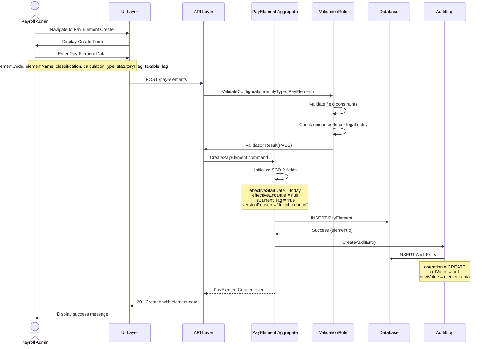
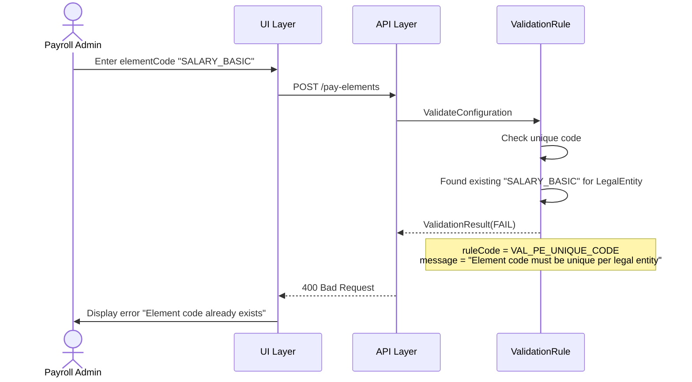
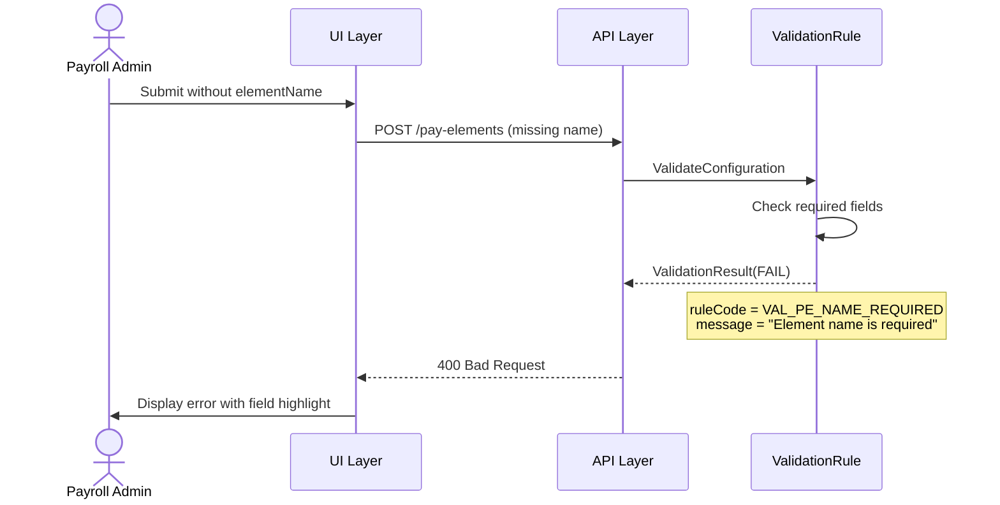
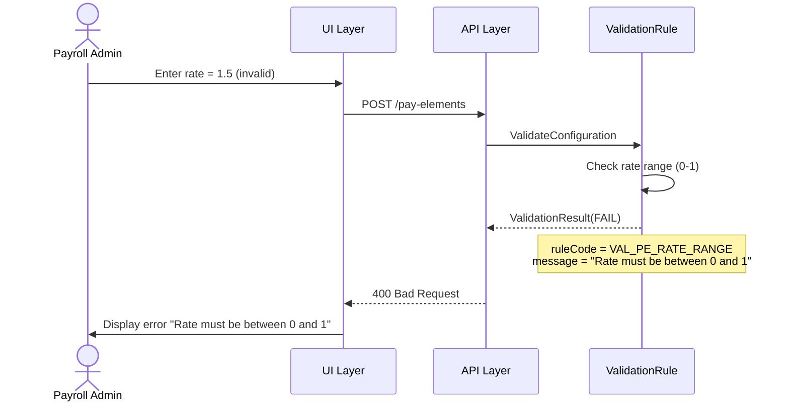

# Use Case Flow - Create Pay Element

> **Use Case**: UC-PE-001 Create Pay Element
> **Bounded Context**: Payroll Configuration (BC-001)
> **Module**: Payroll (PR)
> **Priority**: P0
> **Story Points**: 5

---

## Overview

This flow documents the process of creating a new pay element with version tracking (SCD-2).

---

## Actors

| Actor | Role |
|-------|------|
| Payroll Admin | Primary actor - initiates creation |
| ValidationRule | Secondary - validates input |
| AuditLog | Secondary - logs creation |

---

## Preconditions

1. Payroll Admin is logged in with create permission
2. LegalEntity exists in Core HR (CO) module
3. No PayElement with same elementCode exists for the LegalEntity

---

## Postconditions

1. PayElement created with version 1
2. SCD-2 fields set correctly (effectiveStartDate, isCurrentFlag = true)
3. Audit entry created
4. PayElement available for assignment to PayProfile

---

## Happy Path



---

## Error Paths

### EP-001: Duplicate Element Code



### EP-002: Missing Required Fields



### EP-003: Invalid Rate Value



---

## Business Rules Applied

| Rule ID | Rule Name | Enforcement Point |
|---------|-----------|-------------------|
| BR-PE-001 | Unique Element Code | Validation before save |
| BR-PE-002 | Classification Impact | Automatic on selection |
| BR-PE-003 | Soft Delete Only | System enforced |
| BR-VM-001 | SCD-2 Pattern | Aggregate initialization |
| BR-VM-002 | Single Current | Aggregate initialization |
| BR-VM-004 | Audit Trail | Event handler |

---

## API Contract

### Request

```http
POST /api/v1/pay-elements
Content-Type: application/json

{
  "elementCode": "SALARY_BASIC",
  "elementName": "Basic Salary",
  "legalEntityId": "VN_HQ",
  "classification": "EARNING",
  "calculationType": "FIXED",
  "statutoryFlag": false,
  "taxableFlag": true,
  "amount": null,
  "effectiveStartDate": "2026-04-01"
}
```

### Response (Success)

```http
HTTP/1.1 201 Created
Content-Type: application/json

{
  "elementCode": "SALARY_BASIC",
  "elementName": "Basic Salary",
  "legalEntityId": "VN_HQ",
  "classification": "EARNING",
  "calculationType": "FIXED",
  "statutoryFlag": false,
  "taxableFlag": true,
  "isActive": true,
  "effectiveStartDate": "2026-04-01",
  "effectiveEndDate": null,
  "isCurrentFlag": true,
  "versionReason": "Initial creation",
  "createdBy": "admin@company.com",
  "createdAt": "2026-03-31T10:30:00Z"
}
```

### Response (Error)

```http
HTTP/1.1 400 Bad Request
Content-Type: application/json

{
  "error": "VALIDATION_FAILED",
  "message": "Element code must be unique per legal entity",
  "validationResults": [
    {
      "ruleCode": "VAL_PE_UNIQUE_CODE",
      "severity": "ERROR",
      "passed": false,
      "fieldPath": "elementCode"
    }
  ]
}
```

---

## State Changes

| Entity | Before | After |
|--------|--------|-------|
| PayElement | Does not exist | Created with version 1 |
| AuditEntry | Does not exist | CREATE entry logged |

---

## Flow Variations

### FV-001: Create with Formula

When calculationType = FORMULA:
1. Additional field: formulaId required
2. Additional validation: formulaId must reference existing PayFormula
3. Formula validation rule: VAL_PE_FORMULA_REF

### FV-002: Create Statutory Element

When statutoryFlag = true:
1. Element represents BHXH, BHYT, BHTN, or PIT
2. Classification automatically set based on statutoryType
3. Additional statutory rule reference may be created

---

**Document Version**: 1.0
**Created**: 2026-03-31
**Author**: Domain Architect Agent