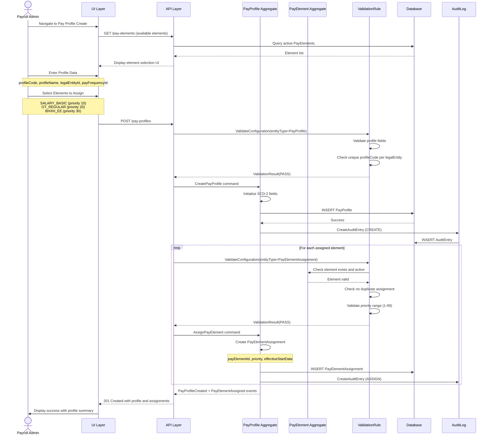
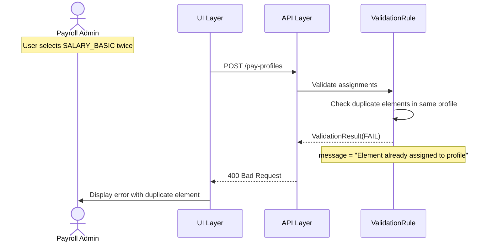
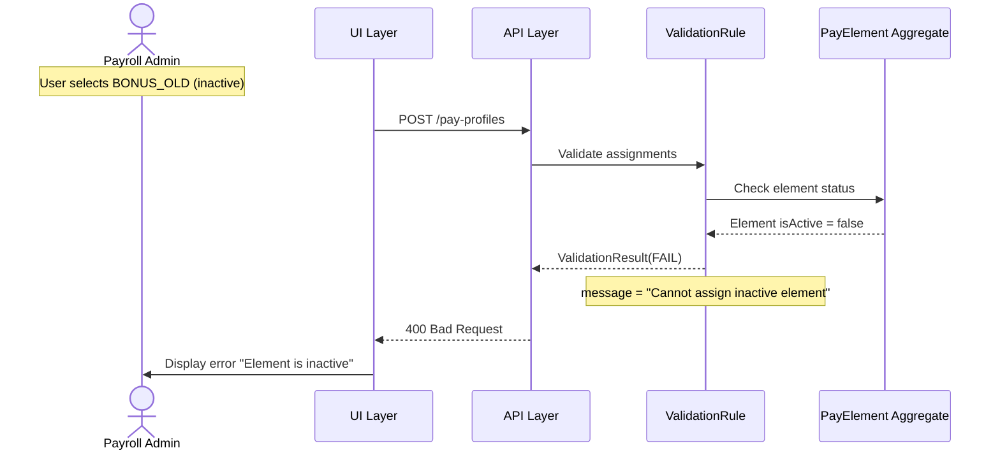
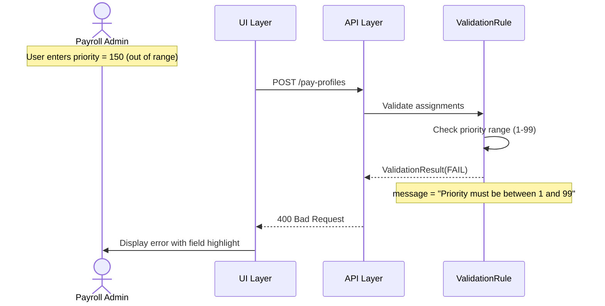
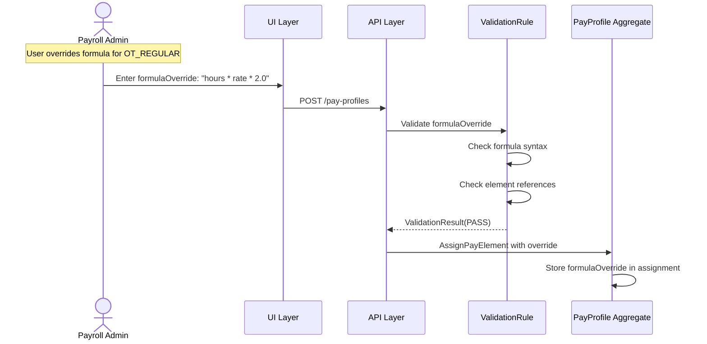

# Use Case Flow - Create Pay Profile with Element Assignment

> **Use Case**: UC-PP-001 Create Pay Profile with Element Assignment
> **Bounded Context**: Payroll Configuration (BC-001)
> **Module**: Payroll (PR)
> **Priority**: P0
> **Story Points**: 5

---

## Overview

This flow documents the process of creating a pay profile and assigning pay elements to it.

---

## Actors

| Actor | Role |
|-------|------|
| Payroll Admin | Primary actor - initiates creation |
| ValidationRule | Secondary - validates profile and assignments |
| PayElement Aggregate | Referenced for assignment validation |
| AuditLog | Secondary - logs creation and assignments |

---

## Preconditions

1. Payroll Admin is logged in with create permission
2. LegalEntity exists in Core HR (CO) module
3. PayFrequency exists in reference data
4. PayElements to be assigned exist and are active

---

## Postconditions

1. PayProfile created with version 1
2. PayElementAssignments created for assigned elements
3. Each assignment has priority and effective date
4. Audit entries created for profile and assignments
5. Profile available for PayGroup assignment

---

## Happy Path



---

## Error Paths

### EP-001: Duplicate Element Assignment



### EP-002: Assign Inactive Element



### EP-003: Invalid Priority



---

## Business Rules Applied

| Rule ID | Rule Name | Enforcement Point |
|---------|-----------|-------------------|
| BR-PP-001 | Unique Profile Code | Validation before save |
| BR-PP-002 | Element Priority | Validation |
| BR-PP-003 | No Duplicate Elements | Validation |
| BR-PP-004 | Active Element Only | Validation |
| BR-PP-005 | Effective Date Required | Mandatory field |

---

## API Contract

### Request

```http
POST /api/v1/pay-profiles
Content-Type: application/json

{
  "profileCode": "PROFILE_STAFF",
  "profileName": "Staff Profile",
  "legalEntityId": "VN_HQ",
  "payFrequencyId": "MONTHLY",
  "elementAssignments": [
    {
      "payElementId": "SALARY_BASIC",
      "priority": 10,
      "effectiveStartDate": "2026-04-01"
    },
    {
      "payElementId": "OT_REGULAR",
      "priority": 20,
      "effectiveStartDate": "2026-04-01"
    },
    {
      "payElementId": "BHXH_EE",
      "priority": 30,
      "effectiveStartDate": "2026-04-01"
    }
  ]
}
```

### Response (Success)

```http
HTTP/1.1 201 Created
Content-Type: application/json

{
  "profileCode": "PROFILE_STAFF",
  "profileName": "Staff Profile",
  "legalEntityId": "VN_HQ",
  "payFrequencyId": "MONTHLY",
  "isActive": true,
  "effectiveStartDate": "2026-04-01",
  "effectiveEndDate": null,
  "isCurrentFlag": true,
  "elementAssignments": [
    {
      "payElementId": "SALARY_BASIC",
      "payElementName": "Basic Salary",
      "priority": 10,
      "effectiveStartDate": "2026-04-01"
    },
    {
      "payElementId": "OT_REGULAR",
      "payElementName": "Regular Overtime",
      "priority": 20,
      "effectiveStartDate": "2026-04-01"
    },
    {
      "payElementId": "BHXH_EE",
      "payElementName": "Social Insurance Employee",
      "priority": 30,
      "effectiveStartDate": "2026-04-01"
    }
  ],
  "createdBy": "admin@company.com",
  "createdAt": "2026-03-31T12:00:00Z"
}
```

---

## Flow Variation: Formula Override



---

**Document Version**: 1.0
**Created**: 2026-03-31
**Author**: Domain Architect Agent