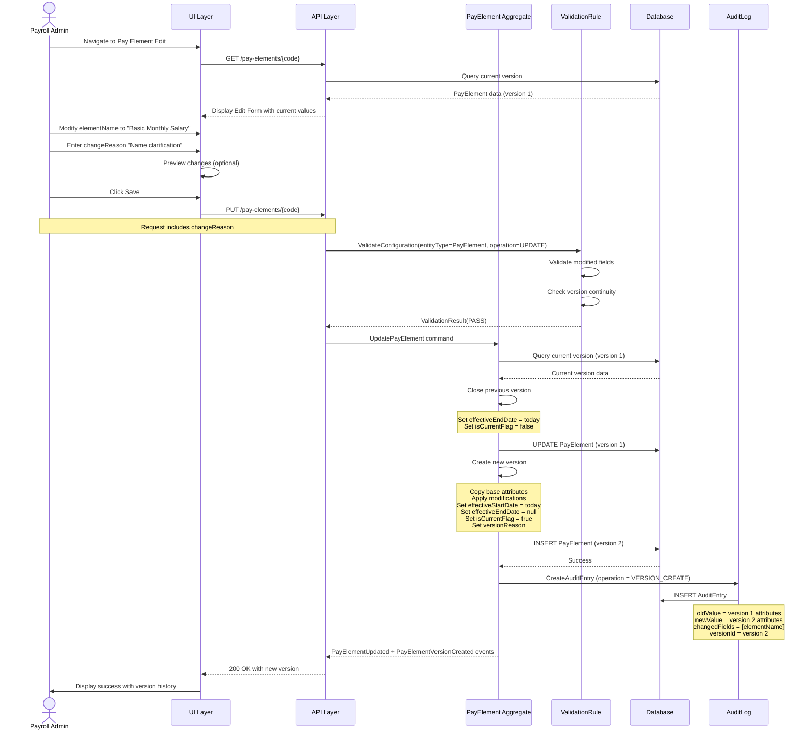
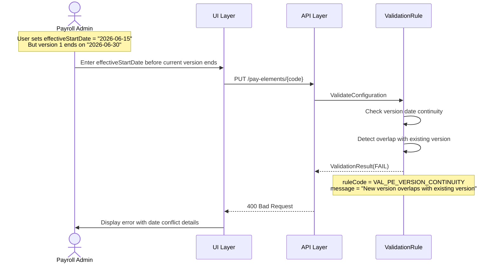
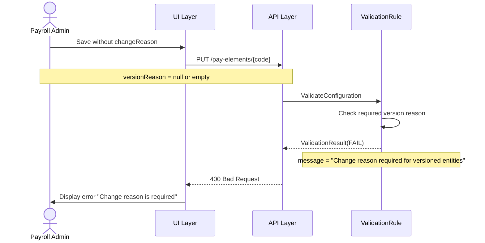
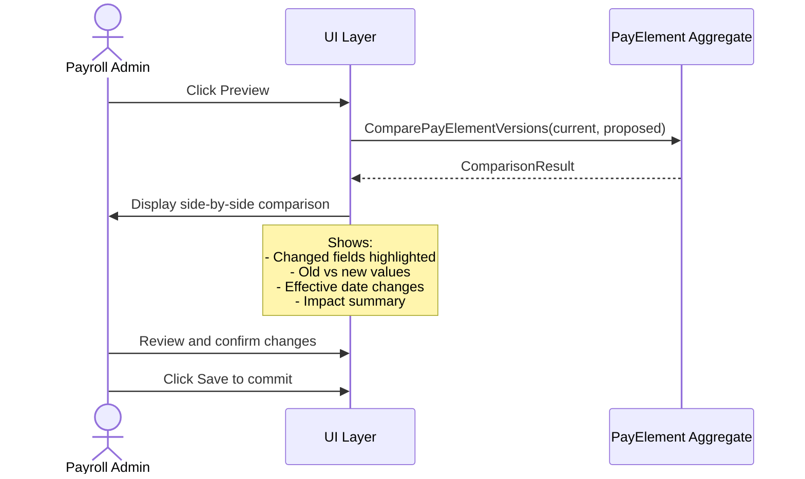
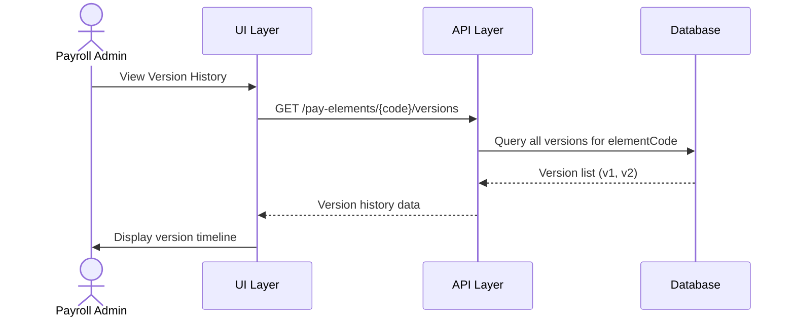

# Use Case Flow - Update Pay Element with Versioning

> **Use Case**: UC-PE-002 Update Pay Element with Versioning
> **Bounded Context**: Payroll Configuration (BC-001)
> **Module**: Payroll (PR)
> **Priority**: P0
> **Story Points**: 8

---

## Overview

This flow documents the process of updating a pay element with SCD-2 version tracking. Updating creates a new version while preserving the previous version.

---

## Actors

| Actor | Role |
|-------|------|
| Payroll Admin | Primary actor - initiates update |
| ValidationRule | Secondary - validates changes |
| PayElement Aggregate | Manages versioning |
| AuditLog | Secondary - logs update |

---

## Preconditions

1. Payroll Admin is logged in with update permission
2. PayElement exists with at least one version
3. Current version is identified (isCurrentFlag = true)

---

## Postconditions

1. New version created with updated values
2. Previous version has effectiveEndDate set
3. Previous version has isCurrentFlag = false
4. Only one version has isCurrentFlag = true
5. Audit entries created for version creation

---

## Happy Path



---

## Error Paths

### EP-001: Version Date Overlap



### EP-002: Missing Change Reason



---

## Preview Flow (Optional)



---

## Business Rules Applied

| Rule ID | Rule Name | Enforcement Point |
|---------|-----------|-------------------|
| BR-PE-005 | Version Continuity | Validation before save |
| BR-VM-001 | SCD-2 Pattern | Aggregate versioning logic |
| BR-VM-002 | Single Current | Aggregate state management |
| BR-VM-003 | Change Reason Required | Validation |
| BR-VM-004 | Audit Trail | Event handler |

---

## API Contract

### Request

```http
PUT /api/v1/pay-elements/SALARY_BASIC
Content-Type: application/json

{
  "elementName": "Basic Monthly Salary",
  "effectiveStartDate": "2026-04-01",
  "versionReason": "Name clarification for better understanding"
}
```

### Response (Success)

```http
HTTP/1.1 200 OK
Content-Type: application/json

{
  "elementCode": "SALARY_BASIC",
  "elementName": "Basic Monthly Salary",
  "legalEntityId": "VN_HQ",
  "classification": "EARNING",
  "calculationType": "FIXED",
  "statutoryFlag": false,
  "taxableFlag": true,
  "isActive": true,
  "effectiveStartDate": "2026-04-01",
  "effectiveEndDate": null,
  "isCurrentFlag": true,
  "versionReason": "Name clarification for better understanding",
  "createdBy": "admin@company.com",
  "createdAt": "2026-03-31T11:00:00Z",
  "version": 2
}
```

---

## State Changes

| Entity | Before | After |
|--------|--------|-------|
| PayElement (v1) | isCurrentFlag=true, endDate=null | isCurrentFlag=false, endDate=today |
| PayElement (v2) | Does not exist | Created with current=true |
| AuditEntry | - | VERSION_CREATE entry logged |

---

## Version History Query



---

**Document Version**: 1.0
**Created**: 2026-03-31
**Author**: Domain Architect Agent