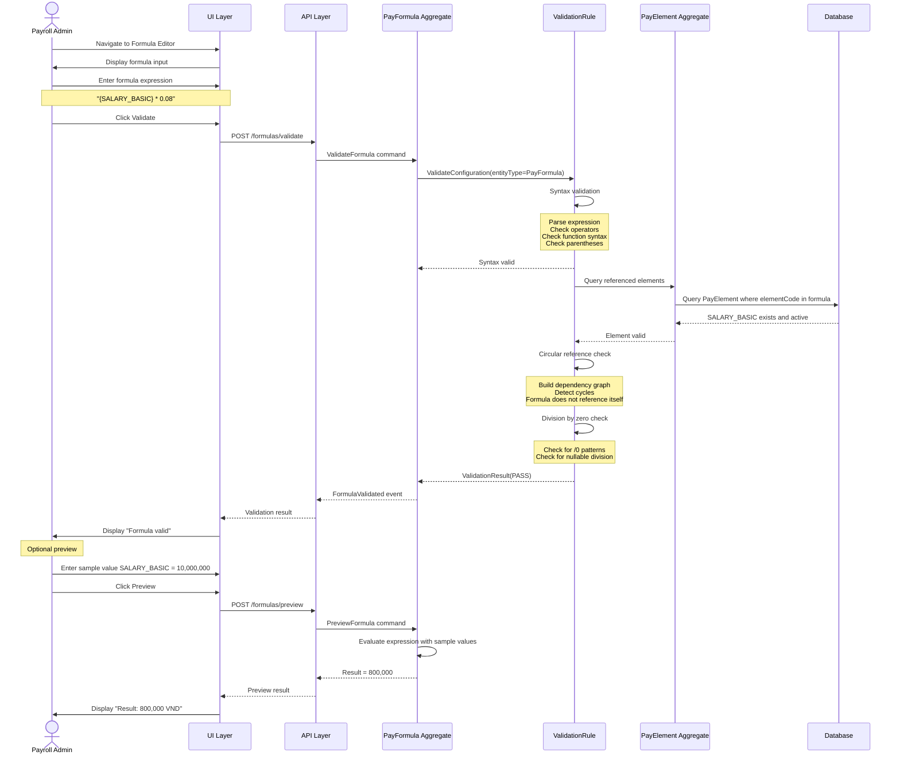
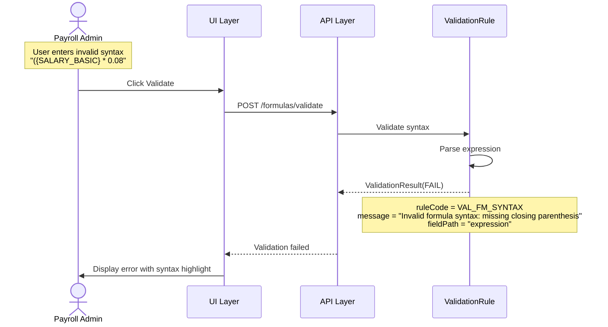
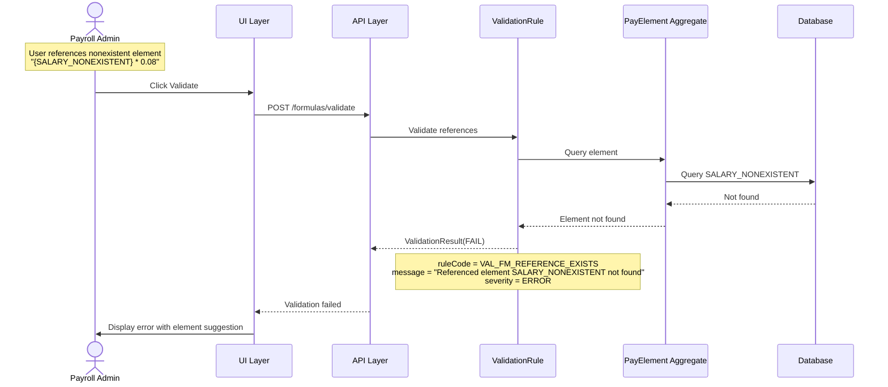
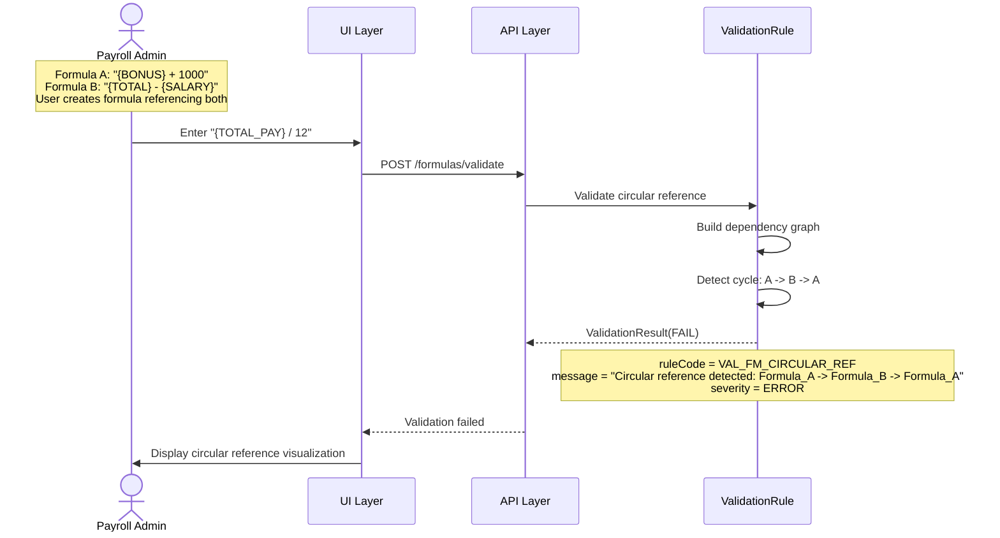
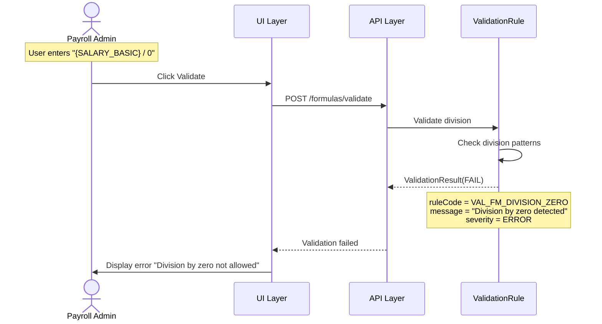

# Use Case Flow - Validate Formula

> **Use Case**: UC-FM-001 Validate Formula
> **Bounded Context**: Payroll Configuration (BC-001)
> **Module**: Payroll (PR)
> **Priority**: P1
> **Story Points**: 8

---

## Overview

This flow documents the process of validating a calculation formula for syntax, references, and circular dependencies.

---

## Actors

| Actor | Role |
|-------|------|
| Payroll Admin | Primary actor - creates/validates formula |
| ValidationRule | Primary - validates syntax and references |
| PayFormula Aggregate | Manages formula |
| PayElement Aggregate | Referenced for element validation |

---

## Preconditions

1. Payroll Admin is logged in with formula permission
2. PayElements referenced in formula exist (or user is aware they don't)

---

## Postconditions

1. Formula syntax validated (pass or fail with errors)
2. Element references validated (exist or warnings)
3. Circular reference check performed
4. Division by zero check performed
5. Preview result available for valid formulas

---

## Happy Path



---

## Error Paths

### EP-001: Syntax Error



### EP-002: Missing Element Reference



### EP-003: Circular Reference



### EP-004: Division by Zero



---

## Business Rules Applied

| Rule ID | Rule Name | Enforcement Point |
|---------|-----------|-------------------|
| BR-FM-001 | Valid Syntax | Validation |
| BR-FM-002 | Reference Exists | Validation |
| BR-FM-003 | No Circular Reference | Validation |
| BR-FM-004 | Division Safety | Validation |

---

## API Contract

### Validation Request

```http
POST /api/v1/formulas/validate
Content-Type: application/json

{
  "expression": "{SALARY_BASIC} * 0.08"
}
```

### Validation Response (Success)

```http
HTTP/1.1 200 OK
Content-Type: application/json

{
  "status": "PASS",
  "syntaxValid": true,
  "references": [
    { "elementCode": "SALARY_BASIC", "exists": true, "active": true }
  ],
  "circularReference": false,
  "divisionByZero": false,
  "message": "Formula validation passed"
}
```

### Validation Response (Error)

```http
HTTP/1.1 400 Bad Request
Content-Type: application/json

{
  "status": "FAIL",
  "syntaxValid": false,
  "syntaxError": "Missing closing parenthesis at position 20",
  "message": "Formula syntax validation failed"
}
```

### Preview Request

```http
POST /api/v1/formulas/preview
Content-Type: application/json

{
  "expression": "{SALARY_BASIC} * 0.08",
  "sampleValues": {
    "SALARY_BASIC": 10000000
  }
}
```

### Preview Response

```http
HTTP/1.1 200 OK
Content-Type: application/json

{
  "result": 800000,
  "expression": "{SALARY_BASIC} * 0.08",
  "sampleValues": {
    "SALARY_BASIC": 10000000
  }
}
```

---

## Circular Reference Detection Algorithm

```
Algorithm: DetectCircularReference(formulaId)

1. Build dependency graph:
   - For each formula F, find all element references E
   - For each element E with formula, add F -> E.formula edge
   
2. Run cycle detection:
   - DFS traversal from formulaId
   - Track visited nodes
   - If node revisited during same traversal -> cycle found
   
3. Return cycle path if found, else null
```

---

**Document Version**: 1.0
**Created**: 2026-03-31
**Author**: Domain Architect Agent