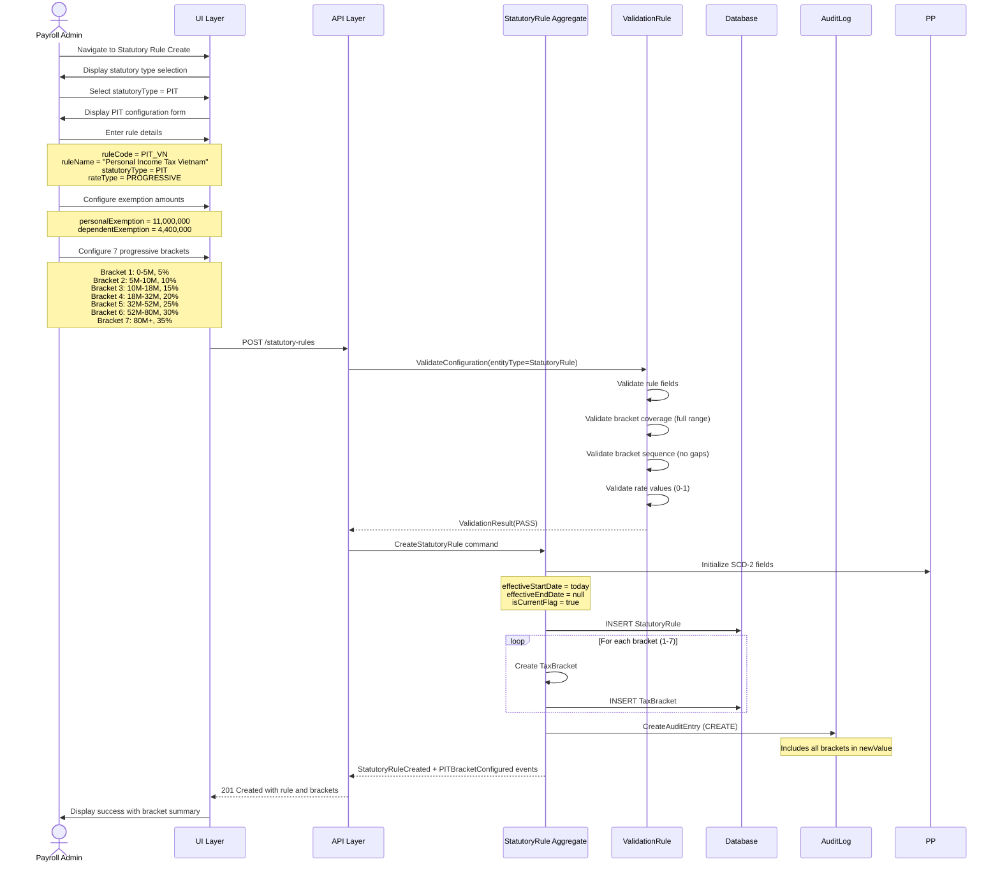
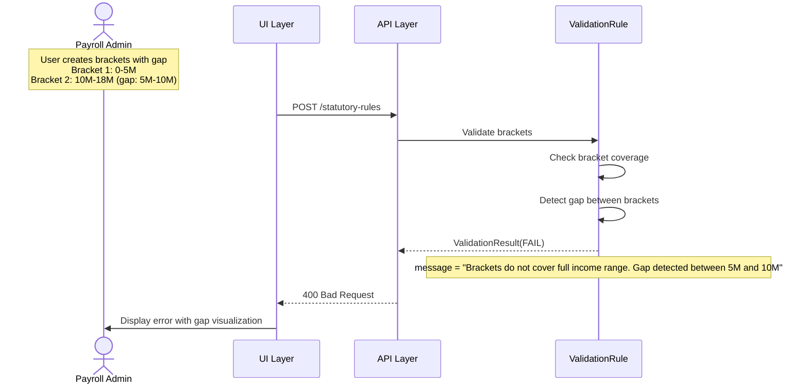
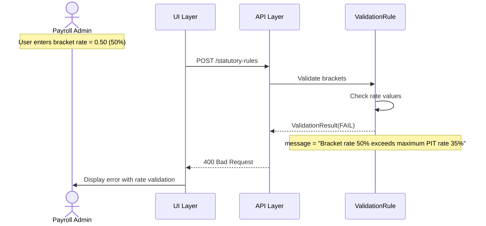
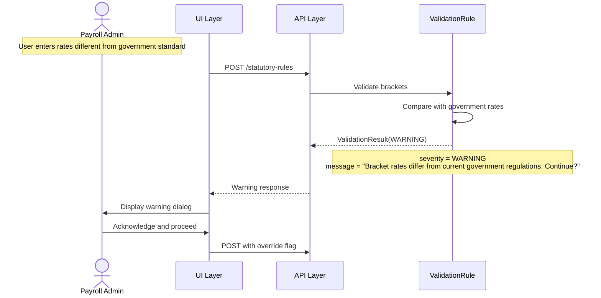

# Use Case Flow - Configure PIT Progressive Brackets

> **Use Case**: UC-SR-001 Configure PIT Progressive Brackets
> **Bounded Context**: Statutory Compliance (BC-002)
> **Module**: Payroll (PR)
> **Priority**: P0
> **Story Points**: 8

---

## Overview

This flow documents the process of creating a Personal Income Tax (PIT) statutory rule with progressive tax brackets for Vietnam.

---

## Actors

| Actor | Role |
|-------|------|
| Payroll Admin | Primary actor - initiates configuration |
| Compliance Officer | Secondary - validates statutory accuracy |
| ValidationRule | Secondary - validates brackets |
| AuditLog | Secondary - logs configuration |

---

## Preconditions

1. Payroll Admin is logged in with statutory rule permission
2. No existing PIT rule with overlapping effective dates
3. Vietnam government regulations reference available

---

## Postconditions

1. StatutoryRule created for PIT with version 1
2. 7 TaxBracket records created with progressive rates
3. Personal exemption (11M VND) and dependent exemption (4.4M VND) configured
4. Audit entries created for rule and brackets
5. PIT rule available for assignment to PayProfile

---

## Happy Path



---

## Error Paths

### EP-001: Bracket Coverage Gap



### EP-002: Invalid Rate Value



### EP-003: Government Rate Warning



---

## Business Rules Applied

| Rule ID | Rule Name | Enforcement Point |
|---------|-----------|-------------------|
| BR-SR-003 | Progressive Brackets Coverage | Validation |
| BR-SR-001 | Rate Validation | Validation |
| BR-SR-004 | Version Non-Overlap | Validation |
| BR-SR-005 | Government Rates Warning | Validation (warning) |

---

## API Contract

### Request

```http
POST /api/v1/statutory-rules
Content-Type: application/json

{
  "ruleCode": "PIT_VN",
  "ruleName": "Personal Income Tax Vietnam",
  "statutoryType": "PIT",
  "partyType": "EMPLOYEE",
  "rateType": "PROGRESSIVE",
  "personalExemption": 11000000,
  "dependentExemption": 4400000,
  "effectiveStartDate": "2026-01-01",
  "taxBrackets": [
    { "bracketNumber": 1, "minAmount": 0, "maxAmount": 5000000, "rate": 0.05 },
    { "bracketNumber": 2, "minAmount": 5000001, "maxAmount": 10000000, "rate": 0.10 },
    { "bracketNumber": 3, "minAmount": 10000001, "maxAmount": 18000000, "rate": 0.15 },
    { "bracketNumber": 4, "minAmount": 18000001, "maxAmount": 32000000, "rate": 0.20 },
    { "bracketNumber": 5, "minAmount": 32000001, "maxAmount": 52000000, "rate": 0.25 },
    { "bracketNumber": 6, "minAmount": 52000001, "maxAmount": 80000000, "rate": 0.30 },
    { "bracketNumber": 7, "minAmount": 80000001, "maxAmount": null, "rate": 0.35 }
  ]
}
```

### Response (Success)

```http
HTTP/1.1 201 Created
Content-Type: application/json

{
  "ruleCode": "PIT_VN",
  "ruleName": "Personal Income Tax Vietnam",
  "statutoryType": "PIT",
  "partyType": "EMPLOYEE",
  "rateType": "PROGRESSIVE",
  "personalExemption": 11000000,
  "dependentExemption": 4400000,
  "isActive": true,
  "effectiveStartDate": "2026-01-01",
  "effectiveEndDate": null,
  "isCurrentFlag": true,
  "taxBrackets": [
    { "bracketNumber": 1, "minAmount": 0, "maxAmount": 5000000, "rate": 0.05 },
    { "bracketNumber": 2, "minAmount": 5000001, "maxAmount": 10000000, "rate": 0.10 },
    { "bracketNumber": 3, "minAmount": 10000001, "maxAmount": 18000000, "rate": 0.15 },
    { "bracketNumber": 4, "minAmount": 18000001, "maxAmount": 32000000, "rate": 0.20 },
    { "bracketNumber": 5, "minAmount": 32000001, "maxAmount": 52000000, "rate": 0.25 },
    { "bracketNumber": 6, "minAmount": 52000001, "maxAmount": 80000000, "rate": 0.30 },
    { "bracketNumber": 7, "minAmount": 80000001, "maxAmount": null, "rate": 0.35 }
  ],
  "createdBy": "admin@company.com",
  "createdAt": "2026-01-01T10:00:00Z"
}
```

---

## PIT Calculation Example

For taxable income of 25,000,000 VND:

| Bracket | Income Range | Taxable in Bracket | Rate | Tax |
|---------|--------------|-------------------|------|-----|
| 1 | 0-5M | 5,000,000 | 5% | 250,000 |
| 2 | 5M-10M | 5,000,000 | 10% | 500,000 |
| 3 | 10M-18M | 8,000,000 | 15% | 1,200,000 |
| 4 | 18M-32M | 7,000,000 | 20% | 1,400,000 |
| **Total** | | **25,000,000** | | **3,350,000** |

---

**Document Version**: 1.0
**Created**: 2026-03-31
**Author**: Domain Architect Agent