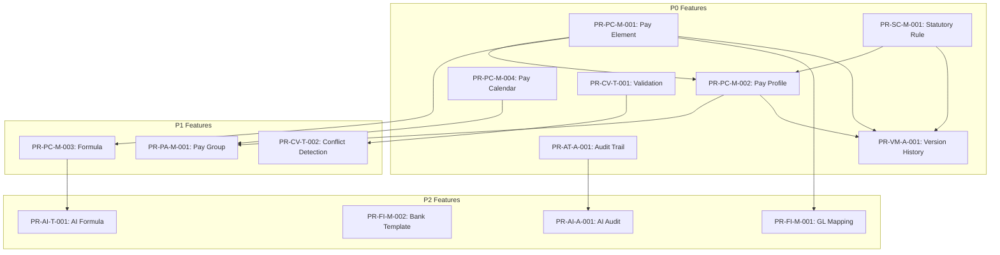

# Feature Catalog - Payroll Module (PR)

> **Module**: Payroll (PR)
> **Phase**: Experience (Step 5)
> **Date**: 2026-03-31
> **Version**: 1.0

---

## Overview

This catalog documents all features derived from the Payroll module's architecture, domain model, and user stories. Features are classified by type to determine specification depth, and prioritized based on business impact and dependencies.

---

## Classification System

| Type | Code | Description | Spec Depth |
|------|------|-------------|------------|
| **Masterdata** | M | Configuration entities with CRUD operations and SCD-2 versioning | Light |
| **Transaction** | T | Workflow-driven features with state transitions and errors | Deep |
| **Analytics** | A | Query, reporting, and data visualization features | Medium |

---

## Priority System

| Priority | Code | Description | Delivery Phase |
|----------|------|-------------|----------------|
| **P0** | MVP | Core features for minimum viable product | Phase 1 |
| **P1** | Phase 2 | Essential enhancements after MVP | Phase 2 |
| **P2** | Future | Nice-to-have features for later consideration | Phase 3+ |

---

## Feature Catalog

### F1: Payroll Configuration Bounded Context

#### PR-PC-M-001: Pay Element Management

| Attribute | Value |
|-----------|-------|
| **Feature ID** | PR-PC-M-001 |
| **Feature Name** | Pay Element Management |
| **Classification** | Masterdata (M) |
| **Priority** | P0 (MVP) |
| **Bounded Context** | Payroll Configuration |
| **Aggregate** | PayElement |
| **Primary Actor** | Payroll Admin |
| **User Stories** | US-001, US-002, US-003, US-004 |
| **API Endpoints** | POST/GET/PUT/DELETE /pay-elements, POST /pay-elements/{code}/versions |

**Description**: Create, read, update, delete pay elements with classification and calculation types. Includes SCD-2 version tracking for historical changes.

**Key Capabilities**:
- Create pay element with unique code per legal entity
- Update creates new version (SCD-2 pattern)
- Soft delete with in-use protection
- View version history and compare versions
- Query by effective date for retroactive calculations

**Interaction Points**:
- Pay Element List Screen (table view, filters)
- Pay Element Create/Edit Screen (form)
- Version Timeline Screen (visual history)
- Version Comparison Modal (side-by-side diff)

---

#### PR-PC-M-002: Pay Profile Management

| Attribute | Value |
|-----------|-------|
| **Feature ID** | PR-PC-M-002 |
| **Feature Name** | Pay Profile Management |
| **Classification** | Masterdata (M) |
| **Priority** | P0 (MVP) |
| **Bounded Context** | Payroll Configuration |
| **Aggregate** | PayProfile |
| **Primary Actor** | Payroll Admin |
| **User Stories** | US-005, US-006 |
| **API Endpoints** | POST/GET/PUT/DELETE /pay-profiles, POST /pay-profiles/{code}/assign-element |

**Description**: Create and manage pay profiles that bundle pay elements, statutory rules, and policies. Profiles are assigned to pay groups for employee payroll configuration.

**Key Capabilities**:
- Create profile with legal entity and pay frequency
- Assign/unassign pay elements with priority (1-99)
- Override formula, rate, or amount per assignment
- SCD-2 version tracking
- Query by effective date

**Interaction Points**:
- Pay Profile List Screen
- Pay Profile Create/Edit Screen
- Element Assignment Panel (within profile)
- Element Assignment Modal (assign element with overrides)

---

#### PR-PC-M-003: Pay Formula Management

| Attribute | Value |
|-----------|-------|
| **Feature ID** | PR-PC-M-003 |
| **Feature Name** | Pay Formula Management |
| **Classification** | Masterdata (M) |
| **Priority** | P1 (Phase 2) |
| **Bounded Context** | Payroll Configuration |
| **Aggregate** | PayFormula |
| **Primary Actor** | Payroll Admin |
| **User Stories** | US-012, US-013 |
| **API Endpoints** | POST/GET/PUT/DELETE /formulas, POST /formulas/{id}/validate |

**Description**: Define and validate calculation formulas for pay elements. Supports arithmetic, conditional, lookup, and progressive expressions.

**Key Capabilities**:
- Create formula with expression syntax
- Real-time syntax validation
- Reference validation (elements must exist)
- Circular reference detection
- Preview with sample values

**Interaction Points**:
- Formula List Screen
- Formula Builder Screen (expression editor)
- Formula Validation Panel (inline feedback)
- Formula Preview Modal (sample value calculation)

---

### F2: Statutory Compliance Bounded Context

#### PR-SC-M-001: Statutory Rule Management

| Attribute | Value |
|-----------|-------|
| **Feature ID** | PR-SC-M-001 |
| **Feature Name** | Statutory Rule Management |
| **Classification** | Masterdata (M) |
| **Priority** | P0 (MVP) |
| **Bounded Context** | Statutory Compliance |
| **Aggregate** | StatutoryRule |
| **Primary Actor** | Payroll Admin, Compliance Officer |
| **User Stories** | US-009, US-010, US-011 |
| **API Endpoints** | POST/GET/PUT/DELETE /statutory-rules, PUT /statutory-rules/{code}/configure-pit-brackets |

**Description**: Manage Vietnam statutory rules for BHXH, BHYT, BHTN, and PIT. Includes progressive tax bracket configuration and SCD-2 versioning for rate changes.

**Key Capabilities**:
- Create statutory rules with rate type (fixed, progressive, lookup)
- Configure PIT progressive brackets (7 brackets)
- Set personal and dependent exemptions for PIT
- SCD-2 version tracking for rate changes
- Government rate comparison warning

**Interaction Points**:
- Statutory Rule List Screen
- Statutory Rule Create/Edit Screen
- PIT Bracket Configuration Screen (table editor)
- Bracket Visualization Chart (progressive rates)
- Version Timeline Screen

---

### F3: Payroll Calendar Bounded Context

#### PR-PC-M-004: Pay Calendar Management

| Attribute | Value |
|-----------|-------|
| **Feature ID** | PR-PC-M-004 |
| **Feature Name** | Pay Calendar Management |
| **Classification** | Masterdata (M) |
| **Priority** | P0 (MVP) |
| **Bounded Context** | Payroll Calendar |
| **Aggregate** | PayCalendar |
| **Primary Actor** | Payroll Admin |
| **User Stories** | US-007 |
| **API Endpoints** | POST/GET/PUT/DELETE /pay-calendars, POST /pay-calendars/{code}/generate-periods |

**Description**: Define pay calendars with auto-generated pay periods. Calendars are linked to legal entities and pay frequencies.

**Key Capabilities**:
- Create calendar with frequency and fiscal year
- Auto-generate periods (12/24/26/52 based on frequency)
- Adjust individual period dates (cut-off, pay date)
- Period status management (OPEN, CLOSED, PAID)
- Sequential date validation

**Interaction Points**:
- Pay Calendar List Screen
- Pay Calendar Create Screen
- Period Generation Preview Modal
- Pay Period List Screen (within calendar)
- Period Adjustment Modal

---

### F4: Payroll Assignment Bounded Context

#### PR-PA-M-001: Pay Group Management

| Attribute | Value |
|-----------|-------|
| **Feature ID** | PR-PA-M-001 |
| **Feature Name** | Pay Group Management |
| **Classification** | Masterdata (M) |
| **Priority** | P1 (Phase 2) |
| **Bounded Context** | Payroll Assignment |
| **Aggregate** | PayGroup |
| **Primary Actor** | Payroll Admin |
| **User Stories** | US-008 |
| **API Endpoints** | POST/GET/PUT/DELETE /pay-groups, POST /pay-groups/{code}/assign-employee |

**Description**: Create pay groups linking profiles and calendars. Assign employees to groups for payroll configuration.

**Key Capabilities**:
- Create pay group with profile and calendar references
- Assign employees (from CO module)
- Single assignment constraint (one group per employee)
- Assignment history tracking
- Assignment reason capture

**Interaction Points**:
- Pay Group List Screen
- Pay Group Create/Edit Screen
- Employee Assignment Screen (within group)
- Employee Picker Modal (calls CO API)
- Assignment History Panel

---

### F5: Finance Integration Bounded Context

#### PR-FI-M-001: GL Mapping Configuration

| Attribute | Value |
|-----------|-------|
| **Feature ID** | PR-FI-M-001 |
| **Feature Name** | GL Mapping Configuration |
| **Classification** | Masterdata (M) |
| **Priority** | P2 (Future) |
| **Bounded Context** | Finance Integration |
| **Aggregate** | GLMappingPolicy |
| **Primary Actor** | Finance Controller |
| **User Stories** | US-021 |
| **API Endpoints** | POST/GET/PUT/DELETE /gl-mapping-policies |

**Description**: Configure GL account mappings for pay elements. Supports multiple splits and cost center allocation.

**Key Capabilities**:
- Map pay elements to GL accounts
- Configure percentage splits (must total 100%)
- Cost center allocation
- Export mappings for finance system

**Interaction Points**:
- GL Mapping List Screen
- GL Mapping Create/Edit Screen
- GL Split Configuration Panel
- Export Button (CSV, JSON)

---

#### PR-FI-M-002: Bank Template Configuration

| Attribute | Value |
|-----------|-------|
| **Feature ID** | PR-FI-M-002 |
| **Feature Name** | Bank Template Configuration |
| **Classification** | Masterdata (M) |
| **Priority** | P2 (Future) |
| **Bounded Context** | Finance Integration |
| **Aggregate** | BankTemplate |
| **Primary Actor** | Payroll Admin |
| **User Stories** | US-022 |
| **API Endpoints** | POST/GET/PUT/DELETE /bank-templates |

**Description**: Configure bank file templates for payment file generation. Supports multiple formats (CSV, Fixed, XML).

**Key Capabilities**:
- Create templates for different banks
- Configure field mappings (source to target)
- Preview template output
- Multiple file format support

**Interaction Points**:
- Bank Template List Screen
- Bank Template Create/Edit Screen
- Field Mapping Configuration Panel
- Template Preview Modal

---

### F6: Configuration Validation Bounded Context

#### PR-CV-T-001: Configuration Validation

| Attribute | Value |
|-----------|-------|
| **Feature ID** | PR-CV-T-001 |
| **Feature Name** | Configuration Validation |
| **Classification** | Transaction (T) |
| **Priority** | P0 (MVP) |
| **Bounded Context** | Configuration Validation |
| **Aggregate** | ValidationRule (Service) |
| **Primary Actor** | Payroll Admin, System |
| **User Stories** | US-014 |
| **API Endpoints** | POST /validations/validate |

**Description**: Validate configuration before save. Includes field, cross-field, entity, and cross-entity validation rules.

**Key Capabilities**:
- Real-time field validation on input
- Cross-field validation on save
- Entity completeness validation
- Cross-entity reference validation
- Business rule validation
- Block save on critical errors

**Interaction Points**:
- Inline Validation Feedback (field level)
- Validation Error Modal (on save block)
- Validation Warning Banner (acknowledge and save)

---

#### PR-CV-T-002: Conflict Detection

| Attribute | Value |
|-----------|-------|
| **Feature ID** | PR-CV-T-002 |
| **Feature Name** | Conflict Detection |
| **Classification** | Transaction (T) |
| **Priority** | P1 (Phase 2) |
| **Bounded Context** | Configuration Validation |
| **Aggregate** | Conflict |
| **Primary Actor** | Payroll Admin, System |
| **User Stories** | US-015 |
| **API Endpoints** | GET /conflicts, PUT /conflicts/{id}/resolve |

**Description**: Detect and resolve configuration conflicts. Includes version overlap, duplicates, circular references.

**Key Capabilities**:
- Detect version date overlaps
- Detect duplicate statutory rules
- Detect circular formula references
- Conflict queue for batch review
- Manual resolution with override option

**Interaction Points**:
- Conflict Detection Notification Badge
- Conflict Queue Screen
- Conflict Detail Modal
- Resolution Action Panel

---

### F7: Audit Trail Bounded Context

#### PR-AT-A-001: Audit Trail Query

| Attribute | Value |
|-----------|-------|
| **Feature ID** | PR-AT-A-001 |
| **Feature Name** | Audit Trail Query |
| **Classification** | Analytics (A) |
| **Priority** | P0 (MVP) |
| **Bounded Context** | Audit Trail |
| **Aggregate** | AuditLog |
| **Primary Actor** | HR Manager, Compliance Officer |
| **User Stories** | US-023, US-024 |
| **API Endpoints** | GET /audit-logs, GET /audit-logs/{id}/entries |

**Description**: Query and view audit trail for configuration changes. Filter by entity type, date range, user, operation.

**Key Capabilities**:
- Search audit entries by date range
- Filter by entity type (PayElement, PayProfile, etc.)
- Filter by user who made change
- Filter by operation (CREATE, UPDATE, DELETE)
- View change details (old/new values, reason)
- Export audit trail (CSV, PDF)

**Interaction Points**:
- Audit Trail Query Screen
- Audit Entry Detail Screen
- Audit Export Button

---

### F8: Version Management (Cross-BC)

#### PR-VM-A-001: Version History Viewer

| Attribute | Value |
|-----------|-------|
| **Feature ID** | PR-VM-A-001 |
| **Feature Name** | Version History Viewer |
| **Classification** | Analytics (A) |
| **Priority** | P0 (MVP) |
| **Bounded Context** | Cross-BC (Payroll Configuration, Statutory Compliance) |
| **Aggregate** | PayElement, PayProfile, StatutoryRule |
| **Primary Actor** | Payroll Admin, Compliance Officer |
| **User Stories** | US-016, US-017 |
| **API Endpoints** | GET /pay-elements/{code}/versions, GET /pay-profiles/{code}/versions, GET /statutory-rules/{code}/versions |

**Description**: View version history for SCD-2 entities. Compare versions, query by effective date.

**Key Capabilities**:
- List all versions for an entity
- View version details
- Compare two versions side-by-side
- Query version by effective date
- Export version history

**Interaction Points**:
- Version Timeline Screen (visual timeline)
- Version Detail Screen
- Version Comparison Modal
- Version Query by Date Modal

---

### F9: AI-Native Features

#### PR-AI-T-001: AI Formula Assistant

| Attribute | Value |
|-----------|-------|
| **Feature ID** | PR-AI-T-001 |
| **Feature Name** | AI Formula Assistant |
| **Classification** | Transaction (T) |
| **Priority** | P2 (Future) |
| **Bounded Context** | Payroll Configuration |
| **Aggregate** | PayFormula |
| **Primary Actor** | Payroll Admin |
| **User Stories** | N/A (Enhancement) |
| **API Endpoints** | POST /ai/formula-suggest |

**Description**: AI assistant for formula creation and debugging. Provides suggestions, auto-completion, and error explanation.

**Key Capabilities**:
- Formula syntax suggestions
- Auto-complete element references
- Explain formula errors
- Recommend formula templates
- Natural language to formula conversion

**Interaction Points**:
- AI Formula Chat Panel (within Formula Builder)
- AI Suggestion Dropdown
- AI Error Explanation Toast

---

#### PR-AI-A-001: AI Audit Query Assistant

| Attribute | Value |
|-----------|-------|
| **Feature ID** | PR-AI-A-001 |
| **Feature Name** | AI Audit Query Assistant |
| **Classification** | Analytics (A) |
| **Priority** | P2 (Future) |
| **Bounded Context** | Audit Trail |
| **Aggregate** | AuditLog |
| **Primary Actor** | HR Manager, Compliance Officer |
| **User Stories** | N/A (Enhancement) |
| **API Endpoints** | POST /ai/audit-query |

**Description**: Natural language query for audit trail investigation. Ask questions about configuration changes.

**Key Capabilities**:
- Natural language query ("Who changed BHXH rate last month?")
- Summarize change patterns
- Identify suspicious change patterns
- Generate audit report narratives

**Interaction Points**:
- AI Audit Chat Panel
- AI Query Result Display
- AI Summary Report

---

## Feature Count Summary

| Classification | P0 | P1 | P2 | Total |
|----------------|----|----|-----|-------|
| Masterdata (M) | 4 | 2 | 2 | 8 |
| Transaction (T) | 1 | 1 | 1 | 3 |
| Analytics (A) | 2 | 0 | 1 | 3 |
| **Total** | **7** | **3** | **4** | **14** |

---

## Feature Traceability Matrix

| Feature ID | User Stories | API Endpoints | Entities | Bounded Context |
|------------|--------------|---------------|----------|-----------------|
| PR-PC-M-001 | US-001, US-002, US-003, US-004 | /pay-elements | PayElement | Payroll Configuration |
| PR-PC-M-002 | US-005, US-006 | /pay-profiles | PayProfile, PayElementAssignment | Payroll Configuration |
| PR-PC-M-003 | US-012, US-013 | /formulas | PayFormula | Payroll Configuration |
| PR-SC-M-001 | US-009, US-010, US-011 | /statutory-rules | StatutoryRule, TaxBracket | Statutory Compliance |
| PR-PC-M-004 | US-007 | /pay-calendars | PayCalendar, PayPeriod | Payroll Calendar |
| PR-PA-M-001 | US-008 | /pay-groups | PayGroup, PayGroupAssignment | Payroll Assignment |
| PR-FI-M-001 | US-021 | /gl-mapping-policies | GLMappingPolicy, GLMapping | Finance Integration |
| PR-FI-M-002 | US-022 | /bank-templates | BankTemplate, FieldMapping | Finance Integration |
| PR-CV-T-001 | US-014 | /validations | ValidationResult | Configuration Validation |
| PR-CV-T-002 | US-015 | /conflicts | Conflict | Configuration Validation |
| PR-AT-A-001 | US-023, US-024 | /audit-logs | AuditLog, AuditEntry | Audit Trail |
| PR-VM-A-001 | US-016, US-017 | /{entity}/versions | SCD-2 Entities | Cross-BC |
| PR-AI-T-001 | N/A | /ai/formula-suggest | PayFormula | Payroll Configuration |
| PR-AI-A-001 | N/A | /ai/audit-query | AuditLog | Audit Trail |

---

## Dependency Graph

---

## Specification Depth by Classification

| Classification | Spec Sections | Depth |
|----------------|---------------|-------|
| **Masterdata (M)** | Overview, CRUD Operations, Validation, Search/Filter, SCD-2 Versioning (if applicable) | Light (1-2 pages) |
| **Transaction (T)** | Overview, Workflow States, Step-by-Step Flow, Errors & Recovery, Notifications, Integration Events | Deep (3-5 pages) |
| **Analytics (A)** | Overview, Data Sources, Metrics & Dimensions, Filters, Visualization, Export Options | Medium (2-3 pages) |

---

**Document Version**: 1.0
**Created**: 2026-03-31
**Author**: Experience Architect Agent