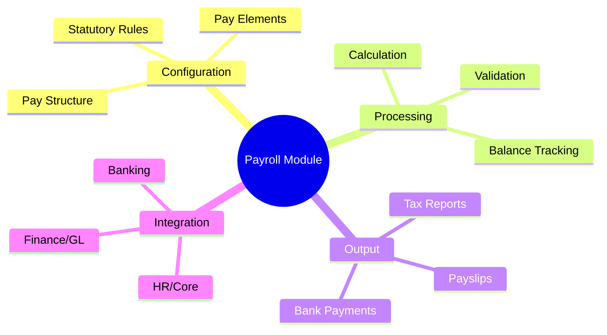
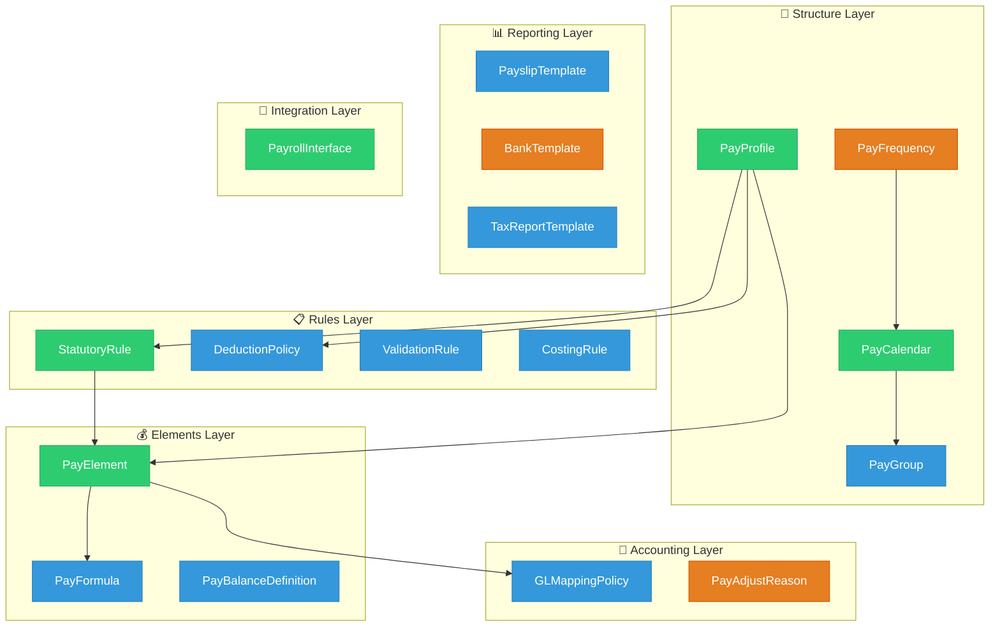
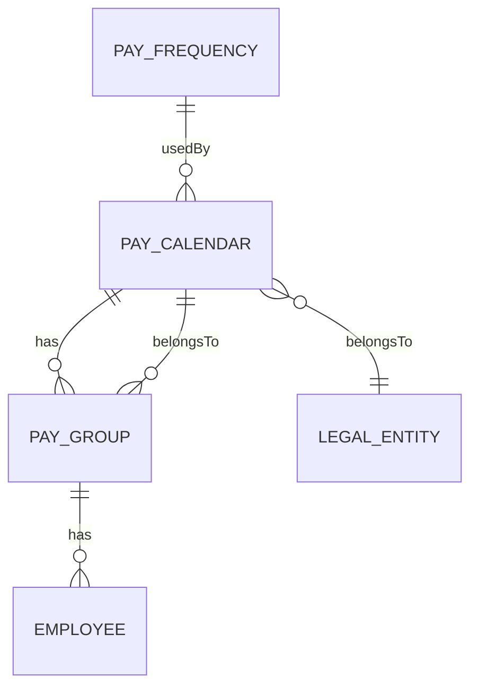
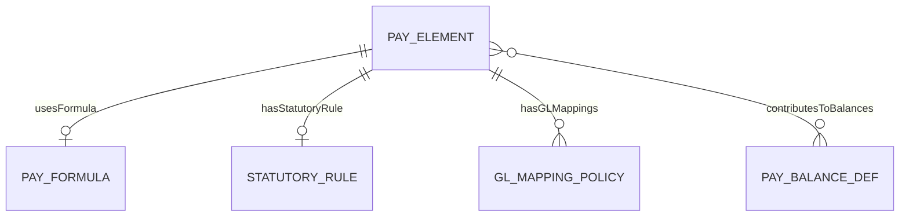
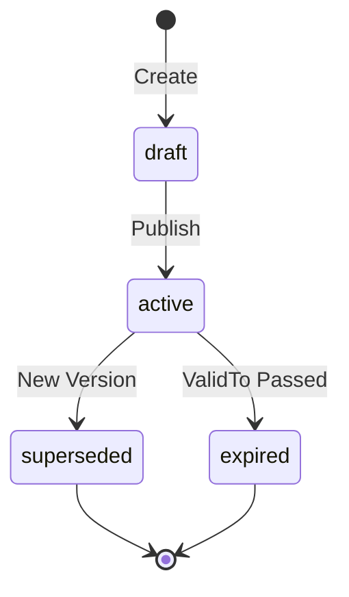
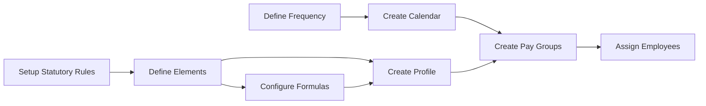
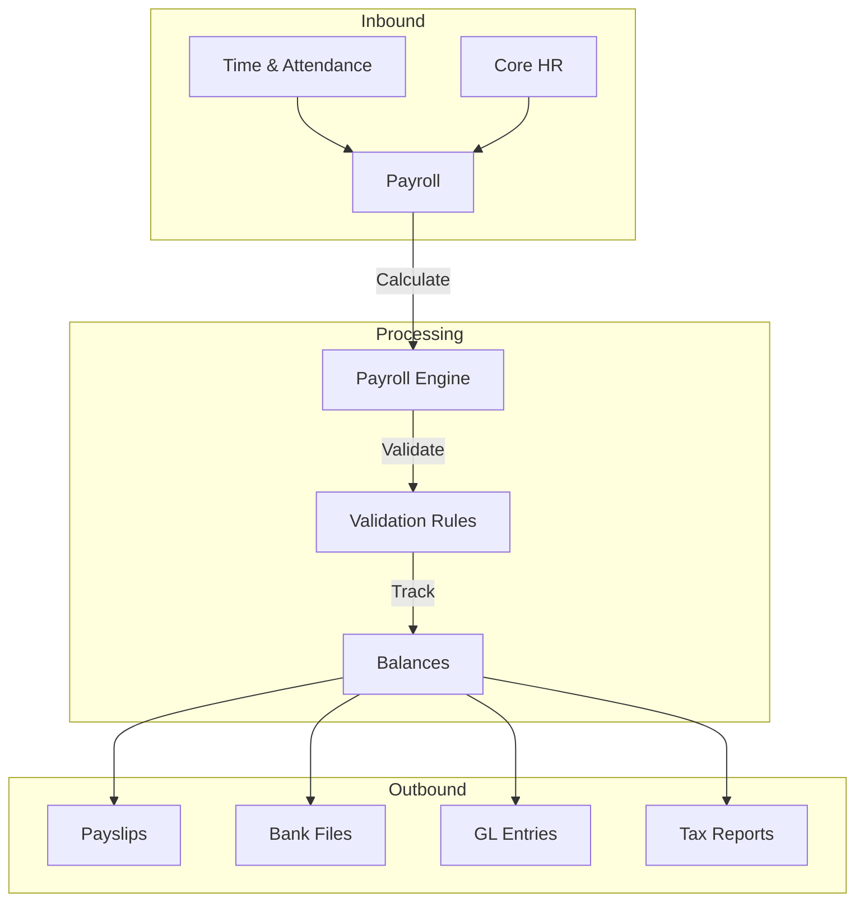

# Payroll Module - Concept Overview

> **Module**: Payroll (PR)  
> **Version**: 1.0  
> **Last Updated**: 2026-01-05

---

## 1. Giới thiệu

Payroll Module cung cấp khả năng quản lý toàn diện quy trình trả lương, từ việc cấu hình các thành phần lương, quy tắc tính toán, đến việc tích hợp với hệ thống kế toán và ngân hàng.

### 1.1 Mục tiêu Module

### 1.2 Phạm vi

**Trong phạm vi (In Scope):**
- Cấu hình cấu trúc payroll (Calendar, Group, Profile)
- Định nghĩa Pay Elements (earnings, deductions, taxes)
- Quản lý Statutory Rules theo từng quốc gia
- Tích hợp với hệ thống kế toán (GL Mapping)
- Tạo payslip và payment files

**Ngoài phạm vi (Out of Scope):**
- Payroll calculation engine (runtime)
- Payment execution
- Transaction data (pay runs, adjustments)

---

## 2. Kiến trúc Tổng quan

### 2.1 Domain Model

**Chú thích màu sắc:**
- 🟢 **AGGREGATE_ROOT**: PayCalendar, PayProfile, PayElement, StatutoryRule, PayrollInterface
- 🔵 **ENTITY**: PayGroup, PayFormula, PayBalanceDefinition, DeductionPolicy, ValidationRule, CostingRule, GLMappingPolicy, PayslipTemplate, TaxReportTemplate
- 🟠 **REFERENCE_DATA**: PayFrequency, PayAdjustReason, BankTemplate

### 2.2 Entity Classification

| Classification | Entities | Mô tả |
|---------------|----------|-------|
| **AGGREGATE_ROOT** | PayCalendar, PayProfile, PayElement, StatutoryRule, PayrollInterface | Entities chính, có lifecycle riêng |
| **ENTITY** | PayGroup, PayFormula, PayBalanceDefinition, DeductionPolicy, ValidationRule, CostingRule, GLMappingPolicy, PayslipTemplate, TaxReportTemplate | Entities phụ thuộc |
| **REFERENCE_DATA** | PayFrequency, PayAdjustReason, BankTemplate | Dữ liệu tham chiếu |

---

## 3. Các Khái niệm Chính

### 3.1 Pay Structure

| Concept | Định nghĩa | Ví dụ |
|---------|-----------|-------|
| **Pay Frequency** | Tần suất trả lương chuẩn | MONTHLY, BIWEEKLY |
| **Pay Calendar** | Lịch trả lương với cut-off dates | VN-MONTHLY-2025 |
| **Pay Group** | Nhóm employees có cùng đặc điểm payroll | VN-HQ-STAFF |
| **Pay Profile** | Bundle của elements, rules, policies | VN-STANDARD |

### 3.2 Pay Elements

**Element Classifications:**

| Type | Mô tả | Ví dụ |
|------|-------|-------|
| **EARNING** | Thu nhập (cộng vào gross) | Basic Salary, OT Allowance |
| **DEDUCTION** | Khấu trừ (trừ khỏi net) | BHXH Employee, Loan Repayment |
| **TAX** | Thuế thu nhập | PIT |
| **EMPLOYER_CONTRIBUTION** | Đóng góp công ty | BHXH Employer |
| **INFORMATIONAL** | Chỉ hiển thị | Working Days |

### 3.3 Statutory Rules

**Rule Categories:**

| Category | Mô tả | Ví dụ Vietnam |
|----------|-------|---------------|
| TAX | Thuế thu nhập cá nhân | VN_PIT_2025 |
| SOCIAL_INSURANCE | Bảo hiểm xã hội | VN_BHXH_2025 |
| HEALTHCARE | Bảo hiểm y tế | VN_BHYT_2025 |
| UNEMPLOYMENT | Bảo hiểm thất nghiệp | VN_BHTN_2025 |

---

## 4. Data Flow

### 4.1 Configuration Flow

### 4.2 Integration Flow

---

## 5. Vietnam-Specific Rules

### 5.1 Statutory Deductions

| Loại | Employee | Employer | Ceiling |
|------|----------|----------|---------|
| BHXH | 8% | 17.5% | 36,000,000 VND |
| BHYT | 1.5% | 3% | 36,000,000 VND |
| BHTN | 1% | 1% | 36,000,000 VND |
| **Tổng** | **10.5%** | **21.5%** | - |

### 5.2 Personal Income Tax (PIT)

| Bậc | Thu nhập chịu thuế | Thuế suất |
|-----|-------------------|-----------|
| 1 | 0 - 5 triệu | 5% |
| 2 | 5 - 10 triệu | 10% |
| 3 | 10 - 18 triệu | 15% |
| 4 | 18 - 32 triệu | 20% |
| 5 | 32 - 52 triệu | 25% |
| 6 | 52 - 80 triệu | 30% |
| 7 | Trên 80 triệu | 35% |

**Exemptions:**
- Personal: 11,000,000 VND/tháng
- Dependent: 4,400,000 VND/người/tháng

---

## 6. Entities Reference

Xem chi tiết tại:
- [Ontology Index](../00-ontology/_index.onto.md)
- [Glossary](../00-ontology/_glossary.onto.md)
- [Conceptual Guide](./PR-conceptual-guide.md)
