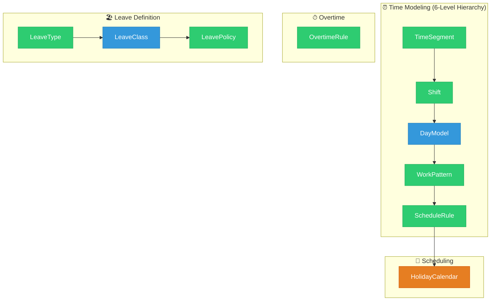

# Time & Attendance Ontology

> **Module**: Time & Attendance (TA)  
> **Version**: 1.0  
> **Last Updated**: 2026-01-06

---

## Overview



**Chú thích:**
- 🟢 **AGGREGATE_ROOT**: TimeSegment, Shift, WorkPattern, ScheduleRule, OvertimeRule, LeaveType, LeavePolicy
- 🔵 **ENTITY**: DayModel, LeaveClass
- 🟠 **REFERENCE_DATA**: HolidayCalendar

---

## Entity Map

### By Sub-module

| Sub-module | Entities | Description |
|------------|----------|-------------|
| **time-modeling** | TimeSegment, Shift, DayModel | 6-level hierarchy L1-L3 |
| **scheduling** | WorkPattern, ScheduleRule, HolidayCalendar | Pattern assignment L4-L5 |
| **overtime** | OvertimeRule | OT calculation rules |
| **leave-definition** | LeaveType, LeaveClass, LeavePolicy | Absence configuration |

---

## Entity List

| Entity | File | Classification |
|--------|------|----------------|
| [[TimeSegment]] | [time-segment.onto.md](domain/time-modeling/time-segment.onto.md) | AGGREGATE_ROOT |
| [[Shift]] | [shift.onto.md](domain/time-modeling/shift.onto.md) | AGGREGATE_ROOT |
| [[DayModel]] | [day-model.onto.md](domain/time-modeling/day-model.onto.md) | ENTITY |
| [[WorkPattern]] | [work-pattern.onto.md](domain/scheduling/work-pattern.onto.md) | AGGREGATE_ROOT |
| [[ScheduleRule]] | [schedule-rule.onto.md](domain/scheduling/schedule-rule.onto.md) | AGGREGATE_ROOT |
| [[HolidayCalendar]] | [holiday-calendar.onto.md](domain/scheduling/holiday-calendar.onto.md) | REFERENCE_DATA |
| [[OvertimeRule]] | [overtime-rule.onto.md](domain/overtime/overtime-rule.onto.md) | AGGREGATE_ROOT |
| [[LeaveType]] | [leave-type.onto.md](domain/leave-definition/leave-type.onto.md) | AGGREGATE_ROOT |
| [[LeaveClass]] | [leave-class.onto.md](domain/leave-definition/leave-class.onto.md) | ENTITY |
| [[LeavePolicy]] | [leave-policy.onto.md](domain/leave-definition/leave-policy.onto.md) | AGGREGATE_ROOT |

---

## Folder Structure

```
TA/00-ontology/
├── _index.onto.md              ← This file
├── _research/
│   └── ta-analysis.md
├── domain/
│   ├── time-modeling/
│   │   ├── time-segment.onto.md
│   │   ├── shift.onto.md
│   │   └── day-model.onto.md
│   ├── scheduling/
│   │   ├── work-pattern.onto.md
│   │   ├── schedule-rule.onto.md
│   │   └── holiday-calendar.onto.md
│   ├── overtime/
│   │   └── overtime-rule.onto.md
│   └── leave-definition/
│       ├── leave-type.onto.md
│       ├── leave-class.onto.md
│       └── leave-policy.onto.md
└── (existing files kept)
```

---

## See Also

- [Domain Research](_research/ta-analysis.md)
- [Payroll Module](../../PR/00-ontology/_index.onto.md)
- [Total Rewards Module](../../TR/00-ontology/_index.onto.md)
