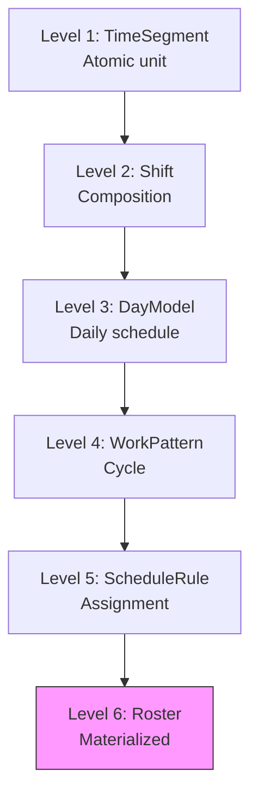
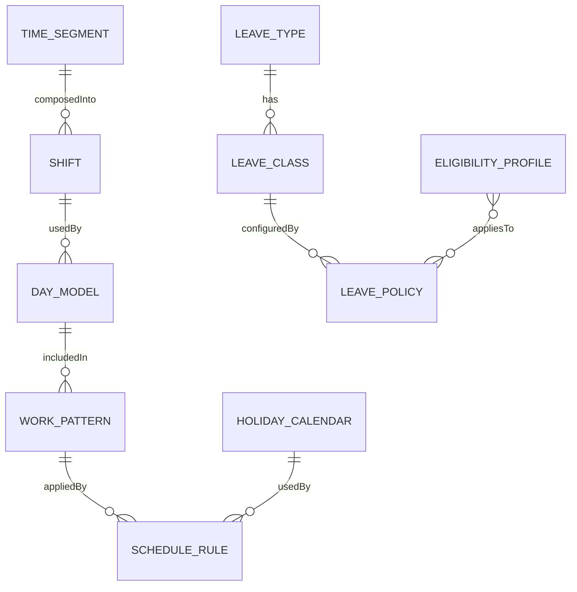

# Domain Research: Time & Attendance

> **Domain**: Time & Attendance (TA)  
> **Skill**: domain-research  
> **Date**: 2026-01-06

---

## 1. Scope

**Problem**: Manage employee time tracking, scheduling, and leave/absence management for accurate payroll and workforce planning.

**Actors**:
- **Primary**: HR/TA Admin - Configure schedules, leave policies
- **Secondary**: Managers - Approve timesheets, overtime, leave
- **Tertiary**: Employees - Clock in/out, request leave

**In Scope**:
- Time modeling (segments, shifts, patterns)
- Scheduling and roster generation
- Holiday calendars
- Overtime rules
- Leave types, classes, policies

**Out of Scope**:
- Generated rosters (materialized data)
- Attendance records (fact data)
- Leave requests (workflow transactions)
- Clock events (raw data)

---

## 2. Glossary

| Term | Definition | Vietnamese |
|------|------------|------------|
| **Time Segment** | Atomic unit of time (work, break, meal) | Khung thời gian |
| **Shift** | Composition of time segments for a workday | Ca làm việc |
| **Day Model** | Daily work schedule type (work, off, holiday) | Mô hình ngày |
| **Work Pattern** | Cycle of day models (e.g., 5-2 weekly) | Mẫu làm việc |
| **Schedule Rule** | Assignment of pattern to employees/groups | Quy tắc lịch |
| **Holiday Calendar** | Collection of holidays by region | Lịch nghỉ lễ |
| **Overtime Rule** | Rule for calculating OT (threshold, multiplier) | Quy tắc làm thêm |
| **Leave Type** | Category of leave (annual, sick, maternity) | Loại nghỉ phép |
| **Leave Class** | Specific leave configuration | Lớp nghỉ phép |
| **Leave Policy** | Rules for accrual, carry, limits | Chính sách nghỉ phép |

---

## 3. Entity Map

### 6-Level Time Hierarchy

### Entity Relationships

---

## 4. Business Rules

### Time Modeling
- **TM-001**: TimeSegment can be relative (offset) or absolute (time)
- **TM-002**: Shift types: ELAPSED (fixed), PUNCH (flexible), FLEX (hybrid)
- **TM-003**: DayModel types: WORK, OFF, HOLIDAY, HALF_DAY
- **TM-004**: Patterns support FIXED or ROTATING schedules

### Scheduling
- **SCH-001**: ScheduleRule can apply to Employee, Group, or Position
- **SCH-002**: Effective dates control version validity
- **SCH-003**: Holiday calendar integrates with schedule rules

### Overtime
- **OT-001**: Rule types: DAILY, WEEKLY, HOLIDAY, NIGHT_SHIFT
- **OT-002**: Threshold hours trigger overtime calculation
- **OT-003**: Multipliers: 1.5x, 2.0x, 3.0x for different contexts

### Leave/Absence
- **LV-001**: Leave types: paid/unpaid, quota-based/unlimited
- **LV-002**: Leave class inherits from type, adds specific rules
- **LV-003**: Policy defines accrual, carry-over, overdraft
- **LV-004**: Eligibility profiles determine who can use

---

## 5. Industry Context

### Standards
| Standard | Application |
|----------|-------------|
| **ISO 8601** | Date/time formats |
| **ISO 3166** | Country codes for calendars |

### Vietnam Regulations
| Regulation | Impact |
|------------|--------|
| **Labor Code 2019** | Working hours (8h/day, 48h/week) |
| **Article 107** | OT limits (40h/month, 200h/year) |
| **Article 112** | Public holidays (11 days/year) |

### Market Analysis
| Vendor | Approach |
|--------|----------|
| **Workday** | Time Tracking, Absence Management |
| **SAP SuccessFactors** | Time Management, Leave Management |
| **Oracle HCM** | Time and Labor, Absence Management |

---

## 6. Recommendations

### Entities to Model (10 total)
1. TimeSegment, Shift, DayModel (time-modeling)
2. WorkPattern, ScheduleRule, HolidayCalendar (scheduling)
3. OvertimeRule (overtime)
4. LeaveType, LeaveClass, LeavePolicy (leave-definition)

### Key Decisions
1. **6-Level Hierarchy**: Keep as design pattern for time modeling
2. **NOT ontology**: Rosters, attendance, requests (transactional)
3. **EligibilityProfile**: Reference from Core module
