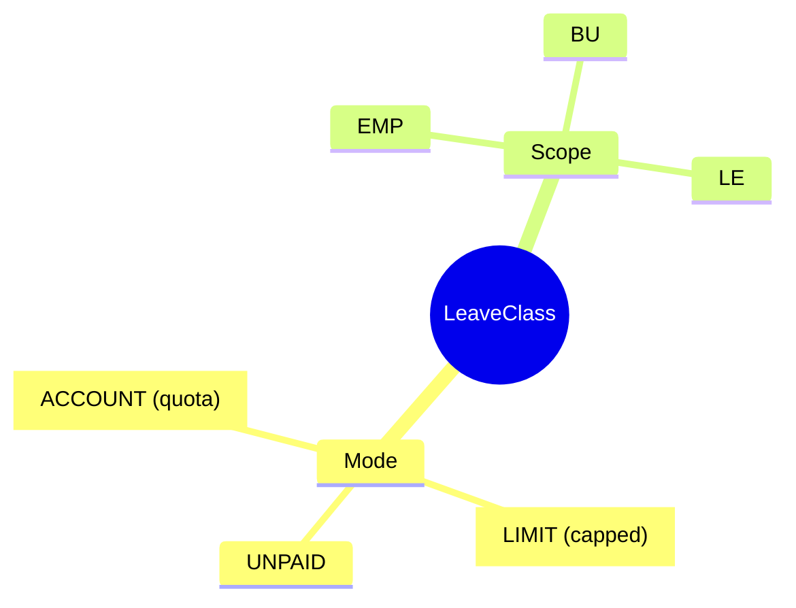
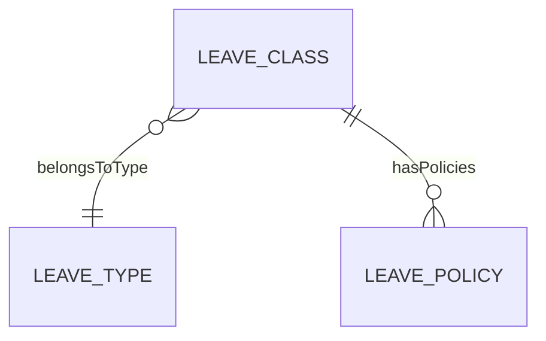

# LeaveClass

## Overview

**LeaveClass** là cấu hình cụ thể của LeaveType - định nghĩa mode, scope, và rules.

## Business Context

### Mode Types

| Mode | Mô tả | Ví dụ |
|------|-------|-------|
| **ACCOUNT** | Có quota, track balance | Annual leave |
| **LIMIT** | Có giới hạn nhưng không track | Sick leave |
| **UNPAID** | Không trả lương | LWOP |

### Scope Types

| Scope | Mô tả |
|-------|-------|
| EMP | Employee-level balance |
| BU | Business unit shared |
| LE | Legal entity shared |

## Relationships

## Examples

### Example 1: VN Annual Leave Class
- **typeCode**: ANNUAL
- **code**: VN_ANNUAL_12D
- **modeCode**: ACCOUNT
- **scopeOwner**: EMP
- **unitCode**: DAY

### Example 2: Sick Leave Class
- **typeCode**: SICK
- **code**: VN_SICK_BHXH
- **modeCode**: LIMIT
- **scopeOwner**: EMP

## Related Entities

| Entity | Relationship | Description |
|--------|--------------|-------------|
| [[LeaveType]] | belongsToType | Parent type |
| [[LeavePolicy]] | hasPolicies | Accrual/carry rules |
