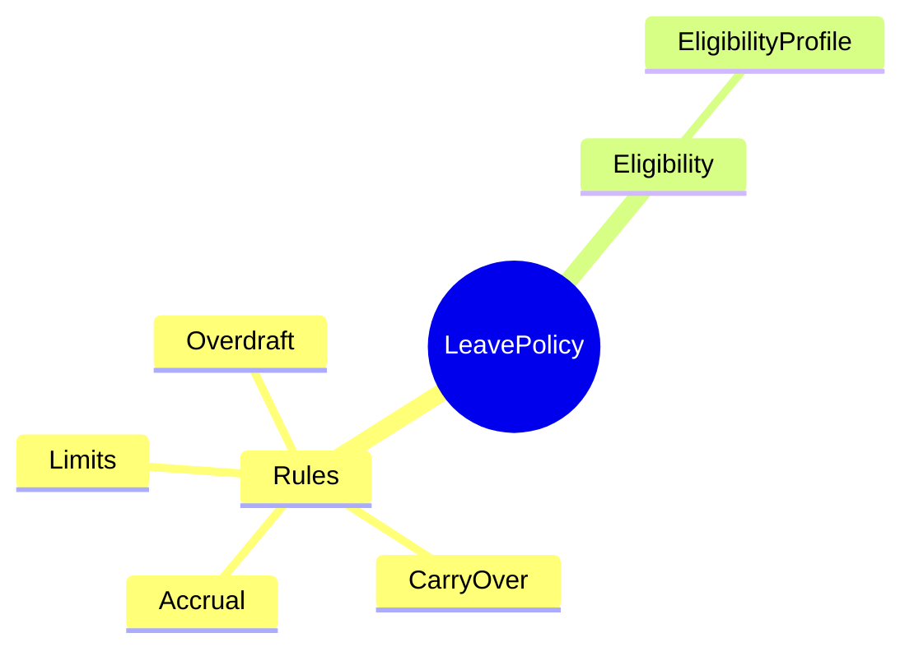
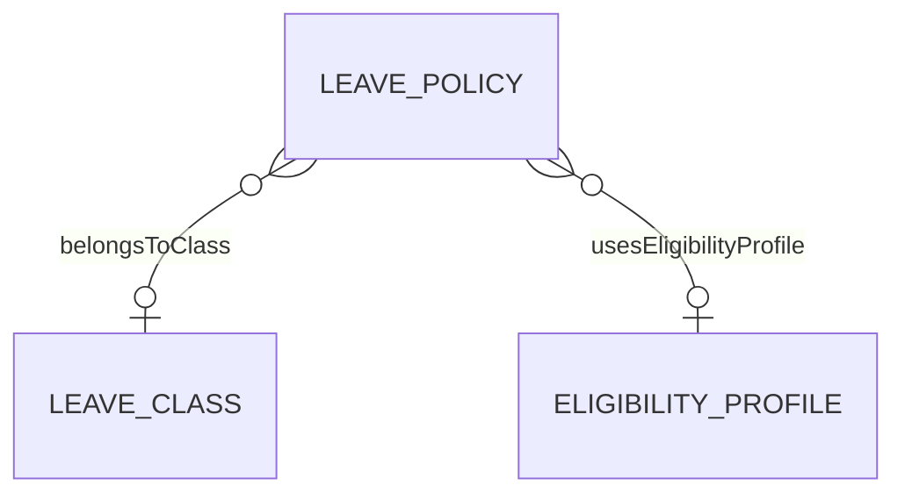

# LeavePolicy

## Overview



**LeavePolicy** định nghĩa rules cho nghỉ phép - accrual, carry-over, overdraft.

## Business Context

### Policy Components

| Component | Mô tả |
|-----------|-------|
| **Accrual** | Cách tích lũy (monthly, yearly, front-load) |
| **Carry-over** | Chuyển số dư sang năm sau |
| **Limits** | Giới hạn tối đa (yearly, monthly, per request) |
| **Overdraft** | Cho phép số dư âm |

### Accrual Types

| Type | Mô tả |
|------|-------|
| MONTHLY | Tích lũy hàng tháng (1 day/month) |
| YEARLY | Cấp đầu năm (12 days/year) |
| FRONT_LOAD | Cấp ngay khi đủ điều kiện |
| HIRE_ANNIVERSARY | Cấp theo ngày vào làm |

## Relationships



## Examples

### Example 1: VN Annual Leave Policy
```json
{
  "accrualRuleJson": {
    "type": "YEARLY",
    "amount": 12,
    "unit": "DAY",
    "seniorityBonus": {
      "perYears": 5,
      "bonusDays": 1
    }
  },
  "carryRuleJson": {
    "allowed": true,
    "maxDays": 5,
    "expiryMonths": 3
  },
  "overdraftAllowed": false
}
```

### Example 2: Sick Leave Policy
```json
{
  "limitRuleJson": {
    "yearlyMaxDays": 30,
    "perCaseMaxDays": 7,
    "requiresMedicalCert": true
  }
}
```

## Related Entities

| Entity | Relationship | Description |
|--------|--------------|-------------|
| [[LeaveClass]] | belongsToClass | Parent class |
| [[EligibilityProfile]] | usesEligibilityProfile | Eligibility rules |
