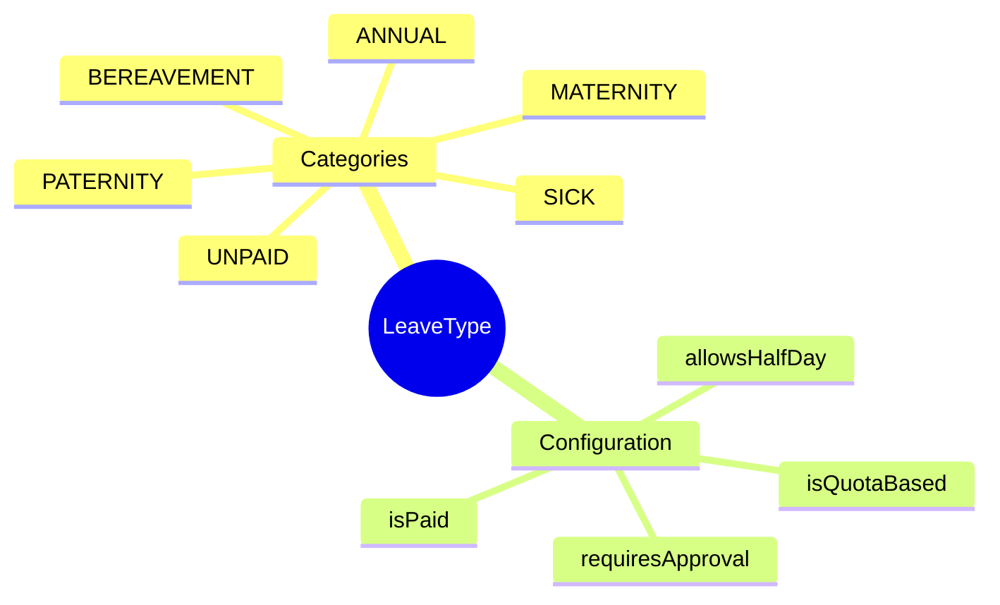
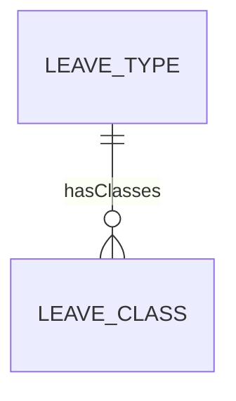

# LeaveType

## Overview

**LeaveType** định nghĩa loại nghỉ phép - annual, sick, maternity. Là parent của LeaveClass.

## Business Context

### Vietnam Leave Entitlements

| Type | Days/Year | Paid | Note |
|------|-----------|------|------|
| Annual Leave | 12 | Yes | +1 per 5 years |
| Sick Leave | 30 | 75% | BHXH pays |
| Maternity | 180 | Yes | BHXH pays |
| Paternity | 5-7 | Yes | Normal/C-section |
| Bereavement | 3 | Yes | Family death |
| Marriage | 3 | Yes | Own marriage |

## Relationships

## Examples

### Example 1: Annual Leave
- **code**: ANNUAL
- **isPaid**: true
- **isQuotaBased**: true
- **unitCode**: DAY
- **allowsHalfDay**: true
- **holidayHandling**: EXCLUDE_HOLIDAYS

### Example 2: Sick Leave
- **code**: SICK
- **isPaid**: true
- **isQuotaBased**: false
- **unitCode**: DAY
- **requiresApproval**: true

### Example 3: Maternity Leave
- **code**: MATERNITY
- **isPaid**: true
- **isQuotaBased**: true
- **unitCode**: DAY
- **coreMinUnit**: 1.00

## Related Entities

| Entity | Relationship | Description |
|--------|--------------|-------------|
| [[LeaveClass]] | hasClasses | Specific configurations |
