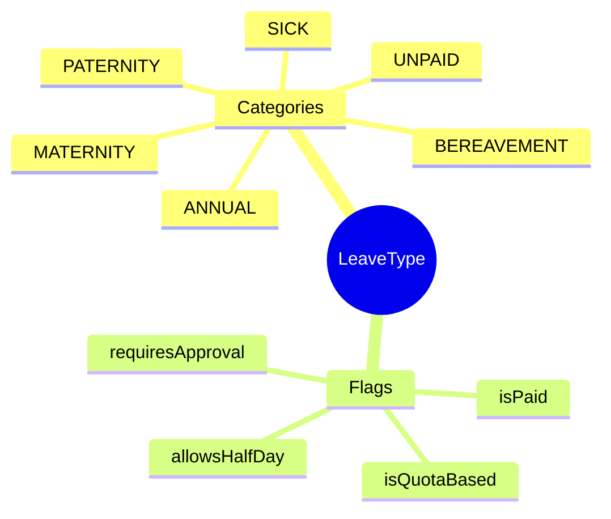
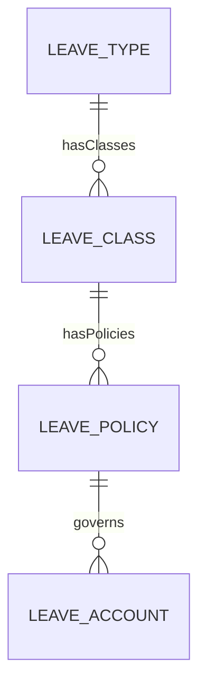
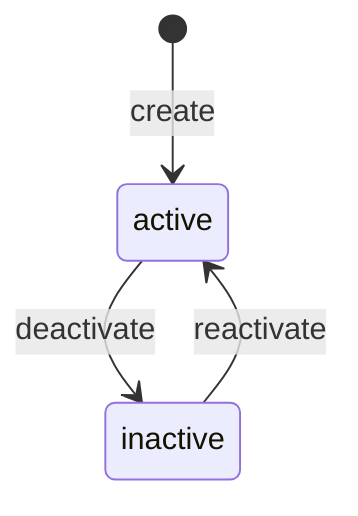

# LeaveType

## Overview

**LeaveType** định nghĩa loại nghỉ phép ở mức cao nhất - annual, sick, maternity. Là AGGREGATE_ROOT của leave domain, parent của [[LeaveClass]] và [[LeavePolicy]].



## Business Context

### Key Stakeholders
- **HR Policy**: Định nghĩa leave types theo luật và chính sách
- **Manager**: Approve leave requests
- **Employee**: Request leave theo type phù hợp
- **Payroll**: Xử lý paid/unpaid leave

### Vietnam Leave Entitlements (Labor Code 2019)

| Type | Days/Year | Paid | Source |
|------|-----------|------|--------|
| **Annual Leave** | 12 | Yes | Điều 113 |
| **Sick Leave** | 30 | 75% | BHXH |
| **Maternity** | 180 | Yes | BHXH |
| **Paternity** | 5-7 | Yes | Nghỉ chế độ |
| **Bereavement** | 3 | Yes | Tang gia |
| **Marriage** | 3 | Yes | Kết hôn |
| **Wedding (child)** | 1 | Yes | Con kết hôn |

### Business Value
LeaveType là foundation của absence management - định nghĩa behavior chung cho từng loại nghỉ trước khi LeaveClass và LeavePolicy chi tiết hóa.

## Attributes Guide

### Core Identity
- **code**: Mã duy nhất. Format: ANNUAL, SICK, MATERNITY
- **name**: Tên hiển thị. VD: "Nghỉ phép năm"

### Behavior Flags
- **isPaid**: Có trả lương không?
- **isQuotaBased**: Có theo dõi quota không? (true = cần LeaveAccount)
- **requiresApproval**: Cần manager approve?
- **allowsHalfDay**: Cho phép nghỉ nửa ngày?

### Configuration
- **unitCode**: Đơn vị tính (DAY hoặc HOUR)
- **coreMinUnit**: Đơn vị tối thiểu (0.5 cho nửa ngày, 1.0 cho nguyên ngày)
- **holidayHandling**: Cách xử lý ngày lễ trong khoảng nghỉ

### Eligibility
- **defaultEligibilityProfileId**: Profile mặc định xác định ai được dùng type này

## Relationships Explained



### LeaveClass
- **hasClasses** → [[LeaveClass]]: Các cấu hình cụ thể. VD: ANNUAL có thể có VN_ANNUAL_12D, SG_ANNUAL_14D

## Lifecycle & Workflows



| State | Meaning |
|-------|---------|
| **active** | Có thể tạo request |
| **inactive** | Không sử dụng, giữ cho history |

## Actions & Operations

### create
**Who**: HR Policy  
**Required**: code, name, unitCode, effectiveStartDate

### deactivate
**Who**: HR Policy  
**When**: Type không còn sử dụng (thay đổi chính sách)

## Business Rules

#### Unique Code (uniqueCode)
**Rule**: Leave type code phải duy nhất.

#### Paid Implies Quota (paidImpliesQuota)
**Rule**: Paid leave thường có quota tracking.
**Reason**: Cần theo dõi số ngày phép còn lại.

## Examples

### Example 1: Annual Leave
```yaml
code: ANNUAL
name: "Nghỉ phép năm"
isPaid: true
isQuotaBased: true
unitCode: DAY
allowsHalfDay: true
holidayHandling: EXCLUDE_HOLIDAYS
coreMinUnit: 0.5
```

### Example 2: Sick Leave
```yaml
code: SICK
name: "Nghỉ ốm"
isPaid: true
isQuotaBased: false  # có limit nhưng không track balance
unitCode: DAY
requiresApproval: true
```

### Example 3: Maternity Leave
```yaml
code: MATERNITY
name: "Nghỉ thai sản"
isPaid: true
isQuotaBased: true
unitCode: DAY
coreMinUnit: 1.00  # không cho nghỉ nửa ngày
```

## Related Entities

| Entity | Relationship | Description |
|--------|--------------|-------------|
| [[LeaveClass]] | hasClasses | Specific configurations |
| [[LeavePolicy]] | indirect | Via LeaveClass |
