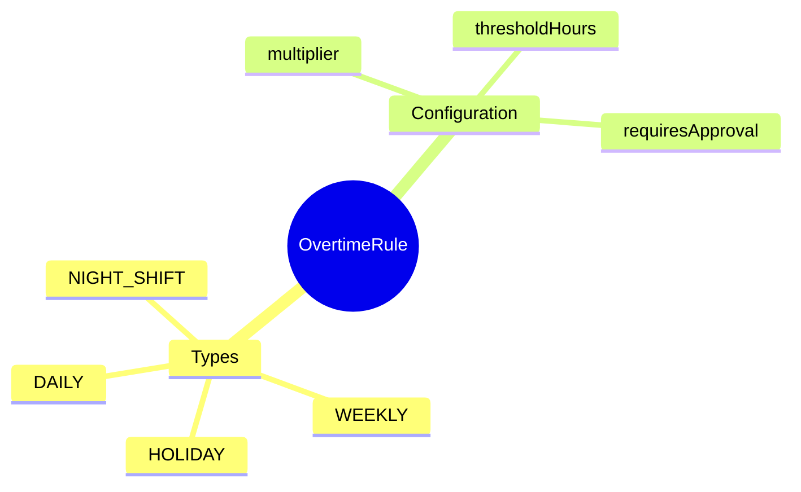

# OvertimeRule

## Overview

**OvertimeRule** định nghĩa quy tắc tính làm thêm giờ - threshold và multiplier.

## Business Context

### Vietnam OT Regulations (Labor Code 2019)

| Rule Type | Threshold | Multiplier | Note |
|-----------|-----------|------------|------|
| DAILY | 8 hours | 1.5x | Normal day OT |
| WEEKLY | 40 hours | 1.5x | Weekly OT |
| HOLIDAY | 0 hours | 3.0x | Holiday work |
| NIGHT_SHIFT | 22:00-06:00 | +30% | Night premium |

### OT Limits (Article 107)
- Daily: max 4 hours
- Monthly: max 40 hours
- Yearly: max 200 hours (300 for specific industries)

## Examples

### Example 1: Daily OT 150%
- **code**: VN_OT_DAILY_150
- **ruleType**: DAILY
- **thresholdHours**: 8
- **multiplier**: 1.5

### Example 2: Weekend OT 200%
- **code**: VN_OT_WEEKEND_200
- **ruleType**: DAILY
- **thresholdHours**: 0
- **multiplier**: 2.0

### Example 3: Holiday OT 300%
- **code**: VN_OT_HOLIDAY_300
- **ruleType**: HOLIDAY
- **thresholdHours**: 0
- **multiplier**: 3.0

## Related Entities

| Entity | Relationship | Description |
|--------|--------------|-------------|
| [[Shift]] | appliesTo | Shifts with OT |
