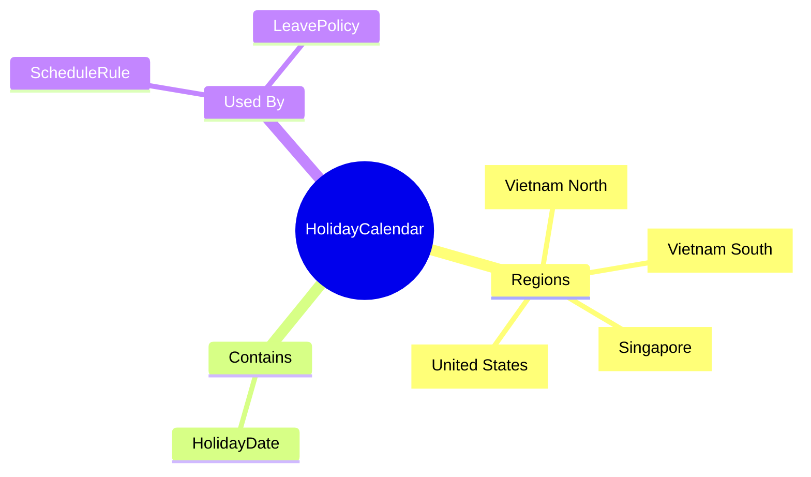
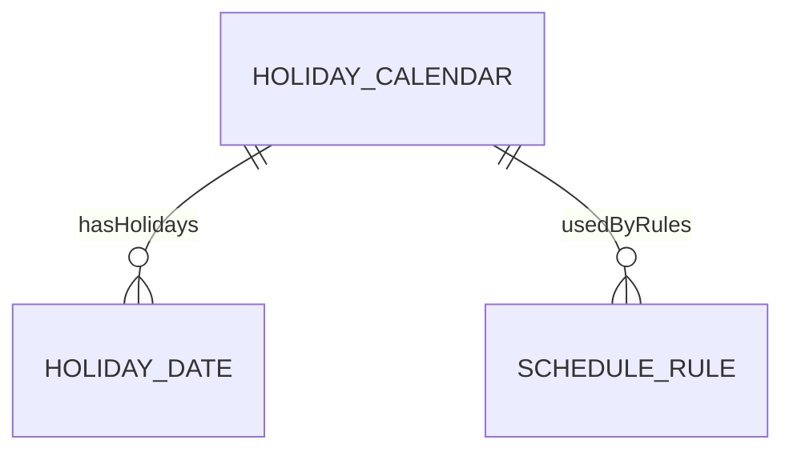

# HolidayCalendar

## Overview

**HolidayCalendar** định nghĩa lịch nghỉ lễ theo vùng/quốc gia. Shared giữa Time & Attendance và Absence.

## Business Context

### Vietnam Public Holidays (11 days/year)

| Holiday | Date | Days |
|---------|------|------|
| Tết Dương lịch | 01/01 | 1 |
| Tết Nguyên đán | Lunar NY | 5 |
| Giỗ Tổ Hùng Vương | 10/3 Lunar | 1 |
| Giải phóng miền Nam | 30/04 | 1 |
| Quốc tế Lao động | 01/05 | 1 |
| Quốc khánh | 02/09 | 2 |

## Relationships

## Examples

### Example 1: Vietnam National Calendar
- **code**: VN_HOLIDAYS
- **name**: Vietnam Public Holidays
- **regionCode**: VN
- **deductFlag**: false

### Example 2: Singapore Calendar
- **code**: SG_HOLIDAYS
- **name**: Singapore Public Holidays
- **regionCode**: SG
- **deductFlag**: false

## Related Entities

| Entity | Relationship | Description |
|--------|--------------|-------------|
| [[ScheduleRule]] | usedByRules | Rules using calendar |
