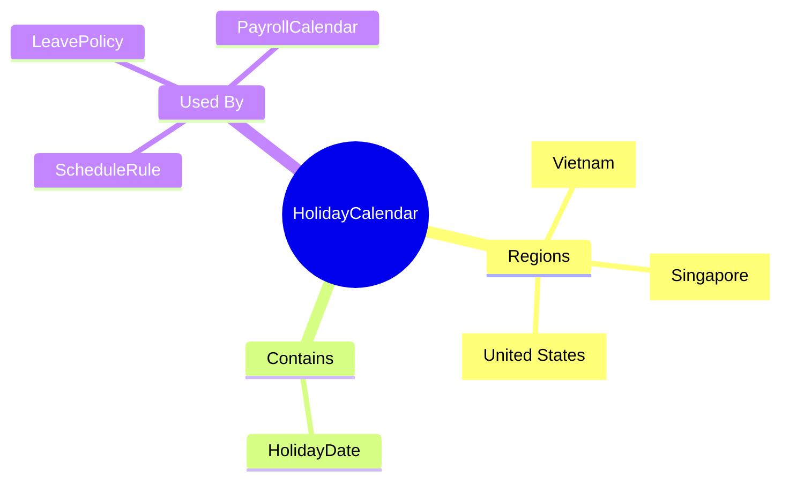
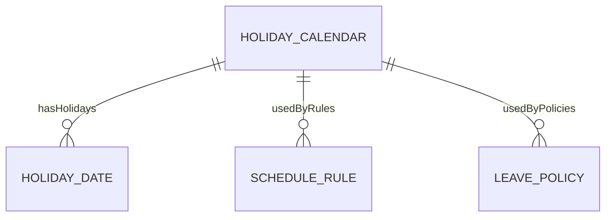
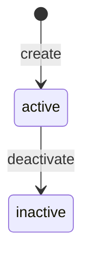
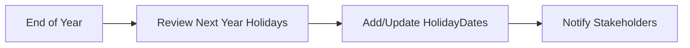

# HolidayCalendar

## Overview

**HolidayCalendar** định nghĩa lịch nghỉ lễ theo vùng/quốc gia. Là REFERENCE_DATA shared giữa Time & Attendance, Absence, và Payroll modules.



## Business Context

### Key Stakeholders
- **HR Admin**: Maintain calendars
- **TA System**: Exclude holidays from work days
- **Absence System**: Holiday handling in leave requests
- **Payroll**: Calculate holiday pay

### Vietnam Public Holidays (11 days/year)

| Holiday | Date | Days | Note |
|---------|------|------|------|
| **Tết Dương lịch** | 01/01 | 1 | New Year |
| **Tết Nguyên đán** | Lunar NY | 5 | Lunar New Year |
| **Giỗ Tổ Hùng Vương** | 10/3 Lunar | 1 | Hung Kings |
| **Giải phóng miền Nam** | 30/04 | 1 | Reunification |
| **Quốc tế Lao động** | 01/05 | 1 | Labor Day |
| **Quốc khánh** | 02/09 | 2 | National Day |

### Regional Differences

| Region | Holidays |
|--------|----------|
| **VN-N** | Standard VN holidays |
| **VN-S** | Standard VN holidays |
| **SG** | Singapore holidays (11 days) |
| **US** | Federal holidays (10 days) |

### Business Value
Centralized holiday management ensures consistency across TA, Absence, and Payroll calculations.

## Attributes Guide

### Core Identity
- **code**: Mã duy nhất. Format: VN_HOLIDAYS, SG_HOLIDAYS
- **name**: Tên hiển thị. VD: "Vietnam Public Holidays"
- **regionCode**: Mã vùng (VN, VN-N, SG, US)

### Configuration
- **deductFlag**: Có trừ holiday vào leave balance không?
  - *false*: Holiday không ảnh hưởng leave (default)
  - *true*: Holiday được trừ vào số ngày phép tính

## Relationships Explained



### HolidayDate
- **hasHolidays** → HolidayDate: Các ngày lễ trong calendar

### ScheduleRule
- **usedByRules** → [[ScheduleRule]]: Rules sử dụng calendar này

## Lifecycle & Workflows



### Annual Maintenance Flow



## Actions & Operations

### create
**Who**: HR Admin  
**Required**: code, name

### addHoliday
**Who**: HR Admin  
**Purpose**: Thêm ngày lễ vào calendar  
**Required**: date, holidayName, holidayType

### removeHoliday
**Who**: HR Admin  
**Purpose**: Xóa ngày lễ (ví dụ: adjustment)

## Business Rules

#### Unique Code (uniqueCode)
**Rule**: Calendar code phải duy nhất.

## Examples

### Example 1: Vietnam National Calendar
```yaml
code: VN_HOLIDAYS
name: "Vietnam Public Holidays"
regionCode: VN
deductFlag: false
isActive: true
```

### Example 2: Singapore Calendar
```yaml
code: SG_HOLIDAYS
name: "Singapore Public Holidays"
regionCode: SG
deductFlag: false
isActive: true
```

### Example 3: US Federal Calendar
```yaml
code: US_HOLIDAYS
name: "US Federal Holidays"
regionCode: US
deductFlag: false
isActive: true
```

### HolidayDate Example
```yaml
calendarId: VN_HOLIDAYS
dates:
  - date: "2026-01-01"
    name: "Tết Dương lịch"
    type: PUBLIC
  - date: "2026-01-29"
    name: "Tết Nguyên đán (ngày 1)"
    type: PUBLIC
  - date: "2026-04-30"
    name: "Giải phóng miền Nam"
    type: PUBLIC
  - date: "2026-05-01"
    name: "Quốc tế Lao động"
    type: PUBLIC
  - date: "2026-09-02"
    name: "Quốc khánh"
    type: PUBLIC
```

## Related Entities

| Entity | Relationship | Description |
|--------|--------------|-------------|
| HolidayDate | hasHolidays | Dates in calendar |
| [[ScheduleRule]] | usedByRules | Rules using calendar |
| [[LeavePolicy]] | usedByPolicies | Leave policies |
