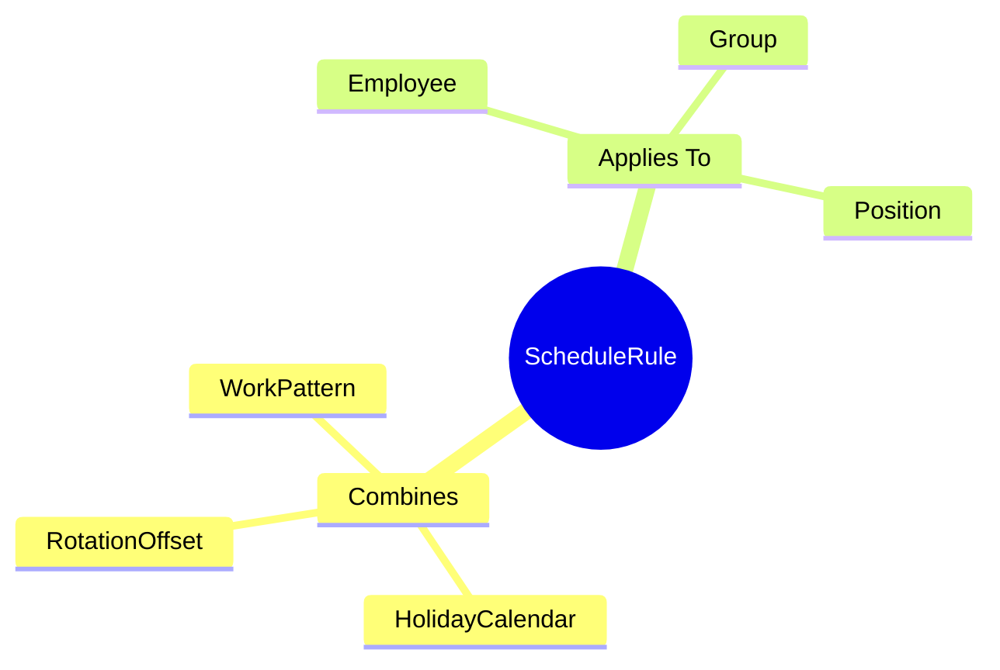
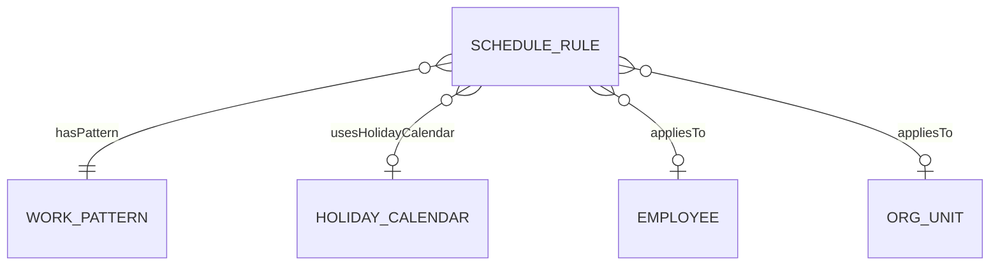

# ScheduleRule

## Overview



**ScheduleRule** kết hợp pattern + calendar và gán cho nhân viên/group. Là Level 5 trong 6-level hierarchy.

## Business Context

### Assignment Types

| Type | Mô tả |
|------|-------|
| Employee | Gán cho 1 nhân viên cụ thể |
| Group | Gán cho đơn vị/phòng ban |
| Position | Gán theo vị trí công việc |

### 6-Level Hierarchy Position
```
TimeSegment (L1) → Shift (L2) → DayModel (L3) → WorkPattern (L4) → ScheduleRule (L5) → Roster (L6)
```

## Relationships



## Examples

### Example 1: Engineering Team Schedule
- **code**: ENG_SCHEDULE
- **patternId**: PATTERN_5X8
- **holidayCalendarId**: VN_HOLIDAYS
- **employeeGroupId**: ENGINEERING_DEPT
- **startReferenceDate**: 2026-01-06 (Monday)

### Example 2: Factory Rotating Schedule
- **code**: FACTORY_ROTATION
- **patternId**: PATTERN_4ON4OFF
- **holidayCalendarId**: VN_HOLIDAYS
- **employeeGroupId**: FACTORY_TEAM_A
- **offsetDays**: 0 (Team B has offsetDays: 4)

## Related Entities

| Entity | Relationship | Description |
|--------|--------------|-------------|
| [[WorkPattern]] | hasPattern | Pattern for rule |
| [[HolidayCalendar]] | usesHolidayCalendar | Holidays |
