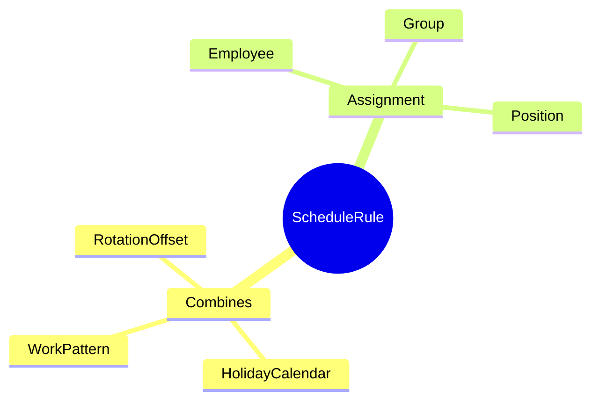
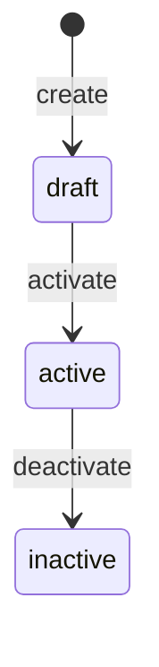
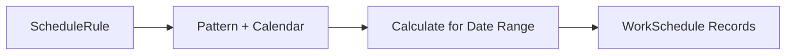

# ScheduleRule

## Overview

**ScheduleRule** kết hợp [[WorkPattern]] + [[HolidayCalendar]] và gán cho nhân viên/group. Là Level 5 trong 6-level Time Hierarchy.



## Business Context

### 6-Level Time Hierarchy

ScheduleRule là Level 5 trong hierarchy:

```
┌─────────────────────────────────────────────────────────────────┐
│ L1: TimeSegment   │ Work period within a day (07:00-12:00)      │
├───────────────────┼─────────────────────────────────────────────┤
│ L2: Shift         │ Full shift = collection of TimeSegments     │
├───────────────────┼─────────────────────────────────────────────┤
│ L3: DayModel      │ Model for a day (WORK/OFF/HOLIDAY)          │
├───────────────────┼─────────────────────────────────────────────┤
│ L4: WorkPattern   │ Weekly pattern = 7 DayModels                │
├───────────────────┼─────────────────────────────────────────────┤
│ L5: ScheduleRule  │ Assignment rules (rotation, eligibility) ◄──│
├───────────────────┼─────────────────────────────────────────────┤
│ L6: WorkSchedule  │ Actual schedule assigned to employee        │
└───────────────────┴─────────────────────────────────────────────┘
```

### Key Stakeholders
- **TA Admin**: Create rules
- **Manager**: Assign schedules to team
- **System**: Generate WorkSchedule from rules

### Assignment Types

| Type | Mô tả | Use Case |
|------|-------|----------|
| **Employee** | Gán cho 1 nhân viên | Special schedule |
| **Group** | Gán cho đơn vị/phòng ban | Department schedule |
| **Position** | Gán theo vị trí | Role-based schedule |

### Rotation Offset

Offset cho phép nhiều teams dùng cùng pattern nhưng lệch pha:
- **Team A**: offsetDays = 0
- **Team B**: offsetDays = 4

→ Khi Team A đang làm 4 ngày, Team B đang nghỉ 4 ngày

### Business Value
ScheduleRule tách configuration khỏi actual schedule, cho phép manage centrally và apply flexibly.

## Attributes Guide

### Core Identity
- **code**: Mã duy nhất. Format: ENG_SCHEDULE, FACTORY_TEAM_A
- **name**: Tên hiển thị. VD: "Lịch phòng Engineering"

### Pattern & Calendar
- **patternId**: FK to [[WorkPattern]]. Required.
- **holidayCalendarId**: FK to [[HolidayCalendar]]. Optional.

### Rotation Configuration
- **startReferenceDate**: Ngày anchor cho rotation. VD: first Monday
- **offsetDays**: Offset từ pattern start (cho rotating teams)

### Assignment Target (chọn ≥1)
- **employeeId**: Gán cho nhân viên cụ thể
- **employeeGroupId**: Gán cho group/department
- **positionId**: Gán theo position

## Relationships Explained


### WorkPattern
- **hasPattern** → [[WorkPattern]]: Pattern cho rule này. Required.

### HolidayCalendar
- **usesHolidayCalendar** → [[HolidayCalendar]]: Holidays áp dụng. Optional.

## Lifecycle & Workflows



### Schedule Generation Flow



## Actions & Operations

### create
**Who**: TA Admin  
**Required**: code, name, patternId, startReferenceDate, effectiveStartDate

### assignToEmployee
**Who**: Manager / TA Admin  
**Affects**: employeeId

### assignToGroup
**Who**: Manager / TA Admin  
**Affects**: employeeGroupId

## Business Rules

#### Unique Code (uniqueCode)
**Rule**: Rule code phải duy nhất.

#### Valid Assignment (validAssignment)
**Rule**: Phải có ít nhất một trong: employeeId, employeeGroupId, positionId.  
**Reason**: Rule phải apply cho ai đó.

## Examples

### Example 1: Engineering Team Schedule
```yaml
code: ENG_SCHEDULE
name: "Lịch phòng Engineering"
patternId: PATTERN_5X8
holidayCalendarId: VN_HOLIDAYS
employeeGroupId: ENGINEERING_DEPT
startReferenceDate: "2026-01-06"  # Monday
offsetDays: 0
```

### Example 2: Factory Rotating - Team A
```yaml
code: FACTORY_TEAM_A
name: "Ca xoay - Team A"
patternId: PATTERN_4ON4OFF
holidayCalendarId: VN_HOLIDAYS
employeeGroupId: FACTORY_TEAM_A
startReferenceDate: "2026-01-01"
offsetDays: 0
```

### Example 3: Factory Rotating - Team B
```yaml
code: FACTORY_TEAM_B
name: "Ca xoay - Team B"
patternId: PATTERN_4ON4OFF
holidayCalendarId: VN_HOLIDAYS
employeeGroupId: FACTORY_TEAM_B
startReferenceDate: "2026-01-01"
offsetDays: 4  # Lệch pha với Team A
```

## Related Entities

| Entity | Relationship | Description |
|--------|--------------|-------------|
| [[WorkPattern]] | hasPattern | Pattern for rule |
| [[HolidayCalendar]] | usesHolidayCalendar | Holidays |
| [[WorkSchedule]] | generates | Actual schedules |
