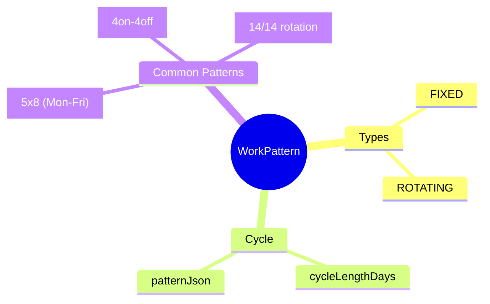
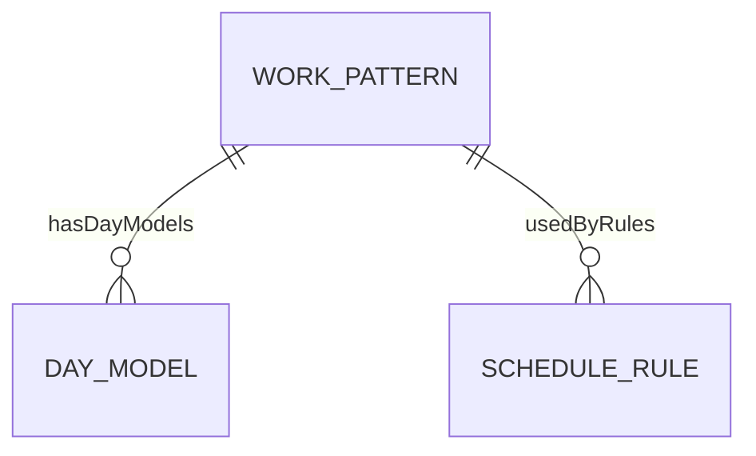

# WorkPattern

## Overview



**WorkPattern** định nghĩa chu kỳ làm việc - tuần 5 ngày, 4on-4off, rotating. Là Level 4 trong 6-level hierarchy.

## Business Context

### Pattern Types

| Type | Mô tả | Ví dụ |
|------|-------|-------|
| **FIXED** | Cố định hàng tuần | Mon-Fri office |
| **ROTATING** | Xoay vòng | 4on-4off factory |

### 6-Level Hierarchy Position
```
TimeSegment (L1) → Shift (L2) → DayModel (L3) → WorkPattern (L4) → ScheduleRule (L5)
```

## Relationships



## Examples

### Example 1: Standard 5x8 Week
- **code**: PATTERN_5X8
- **cycleLengthDays**: 7
- **rotationType**: FIXED
- **patternJson**: [WORK, WORK, WORK, WORK, WORK, OFF, OFF]

### Example 2: 4on-4off Factory
- **code**: PATTERN_4ON4OFF
- **cycleLengthDays**: 8
- **rotationType**: ROTATING
- **patternJson**: [WORK, WORK, WORK, WORK, OFF, OFF, OFF, OFF]

### Example 3: 14/14 Rotation (Offshore)
- **code**: PATTERN_14_14
- **cycleLengthDays**: 28
- **rotationType**: ROTATING
- **patternJson**: [14 WORK days, 14 OFF days]

## Related Entities

| Entity | Relationship | Description |
|--------|--------------|-------------|
| [[DayModel]] | hasDayModels | Days in pattern |
| [[ScheduleRule]] | usedByRules | Rules using pattern |
