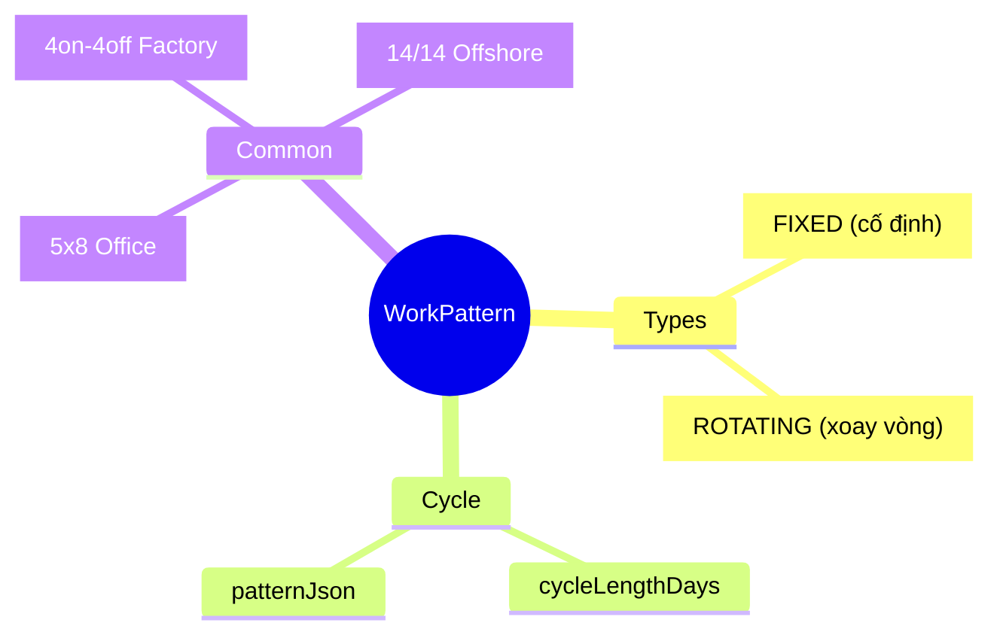
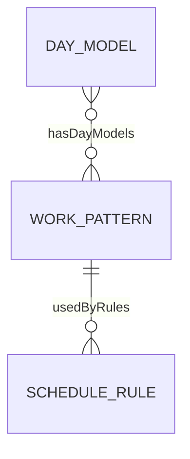
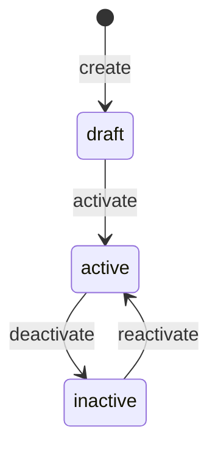

# WorkPattern

## Overview

**WorkPattern** định nghĩa chu kỳ làm việc - tuần 5 ngày, 4on-4off, rotating. Là Level 4 trong 6-level Time Hierarchy, compose từ nhiều [[DayModel]].



## Business Context

### 6-Level Time Hierarchy

WorkPattern là Level 4 trong hierarchy:

```
┌─────────────────────────────────────────────────────────────────┐
│ L1: TimeSegment   │ Work period within a day (07:00-12:00)      │
├───────────────────┼─────────────────────────────────────────────┤
│ L2: Shift         │ Full shift = collection of TimeSegments     │
├───────────────────┼─────────────────────────────────────────────┤
│ L3: DayModel      │ Model for a day (WORK/OFF/HOLIDAY)          │
├───────────────────┼─────────────────────────────────────────────┤
│ L4: WorkPattern   │ Weekly pattern = 7 DayModels       ◄────────│
├───────────────────┼─────────────────────────────────────────────┤
│ L5: ScheduleRule  │ Assignment rules (rotation, eligibility)    │
├───────────────────┼─────────────────────────────────────────────┤
│ L6: WorkSchedule  │ Actual schedule assigned to employee        │
└───────────────────┴─────────────────────────────────────────────┘
```

### Key Stakeholders
- **TA Admin**: Define patterns
- **Manager**: Assign patterns to team
- **Employee**: View work schedule

### Pattern Types

| Type | Mô tả | Cycle | Example |
|------|-------|-------|---------|
| **FIXED** | Lặp lại cố định | Usually 7 days | Mon-Fri office |
| **ROTATING** | Xoay vòng theo chu kỳ | Variable | 4on-4off factory |

### Business Value
WorkPattern cho phép định nghĩa lịch làm việc một lần và reuse, hỗ trợ cả fixed và rotating schedules.

## Attributes Guide

### Core Identity
- **code**: Mã duy nhất. Format: PATTERN_5X8, PATTERN_4ON4OFF
- **name**: Tên hiển thị. VD: "Lịch văn phòng 5x8"
- **description**: Mô tả chi tiết

### Cycle Configuration
- **cycleLengthDays**: Độ dài chu kỳ (ngày). VD: 7 cho tuần, 8 cho 4on-4off
- **rotationType**: Loại pattern (FIXED/ROTATING)
- **patternJson**: Sequence của DayModel IDs theo thứ tự

  ```json
  {
    "days": [
      { "position": 1, "dayModelId": "WORK_DAY_8H" },
      { "position": 2, "dayModelId": "WORK_DAY_8H" },
      { "position": 3, "dayModelId": "WORK_DAY_8H" },
      { "position": 4, "dayModelId": "WORK_DAY_8H" },
      { "position": 5, "dayModelId": "WORK_DAY_8H" },
      { "position": 6, "dayModelId": "OFF_DAY" },
      { "position": 7, "dayModelId": "OFF_DAY" }
    ]
  }
  ```

## Relationships Explained



### DayModel
- **hasDayModels** → [[DayModel]]: Các day models trong pattern. Required.

### ScheduleRule
- **usedByRules** → [[ScheduleRule]]: Rules sử dụng pattern này

## Lifecycle & Workflows



| State | Meaning |
|-------|---------|
| **draft** | Đang setup |
| **active** | Có thể sử dụng |
| **inactive** | Không dùng nữa |

## Actions & Operations

### create
**Who**: TA Admin  
**Required**: code, name, cycleLengthDays, rotationType, effectiveStartDate

### defineDays
**Who**: TA Admin  
**Purpose**: Định nghĩa sequence các DayModels

## Business Rules

#### Unique Code (uniqueCode)
**Rule**: Pattern code phải duy nhất.

#### Valid Cycle (validCycle)
**Rule**: cycleLengthDays phải khớp với số lượng day models.  
**Reason**: Đảm bảo pattern complete.

## Examples

### Example 1: Standard 5x8 Week (Office)
```yaml
code: PATTERN_5X8
name: "Lịch văn phòng 5 ngày"
cycleLengthDays: 7
rotationType: FIXED
patternJson:
  days:
    - { position: 1, dayModelId: "WORK_DAY_8H" }  # Mon
    - { position: 2, dayModelId: "WORK_DAY_8H" }  # Tue
    - { position: 3, dayModelId: "WORK_DAY_8H" }  # Wed
    - { position: 4, dayModelId: "WORK_DAY_8H" }  # Thu
    - { position: 5, dayModelId: "WORK_DAY_8H" }  # Fri
    - { position: 6, dayModelId: "OFF_DAY" }      # Sat
    - { position: 7, dayModelId: "OFF_DAY" }      # Sun
```

### Example 2: 4on-4off Factory
```yaml
code: PATTERN_4ON4OFF
name: "Ca 4 ngày làm 4 ngày nghỉ"
cycleLengthDays: 8
rotationType: ROTATING
patternJson:
  days:
    - { position: 1, dayModelId: "WORK_DAY_12H" }
    - { position: 2, dayModelId: "WORK_DAY_12H" }
    - { position: 3, dayModelId: "WORK_DAY_12H" }
    - { position: 4, dayModelId: "WORK_DAY_12H" }
    - { position: 5, dayModelId: "OFF_DAY" }
    - { position: 6, dayModelId: "OFF_DAY" }
    - { position: 7, dayModelId: "OFF_DAY" }
    - { position: 8, dayModelId: "OFF_DAY" }
```

### Example 3: 14/14 Offshore Rotation
```yaml
code: PATTERN_14_14
name: "Ca offshore 14 ngày"
cycleLengthDays: 28
rotationType: ROTATING
# 14 work days + 14 off days
```

## Related Entities

| Entity | Relationship | Description |
|--------|--------------|-------------|
| [[DayModel]] | hasDayModels | Days in pattern |
| [[ScheduleRule]] | usedByRules | Rules using pattern |
